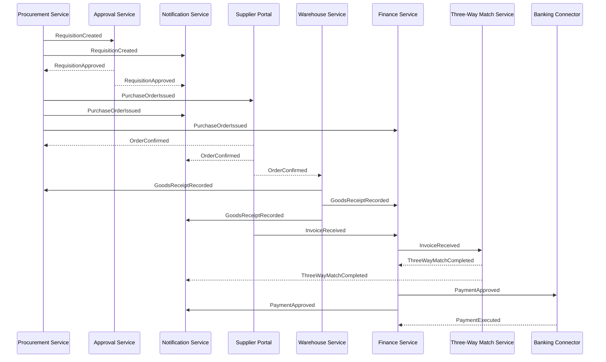

# Event Catalog — Supply Chain Management Platform

This catalog defines all domain events produced and consumed within the Supply Chain Management Platform's event-driven architecture. Events are the primary mechanism for asynchronous inter-service communication and represent immutable facts about state changes that have already occurred within procurement workflows.

All events are published to the platform's central event bus (Apache Kafka). Service teams must treat this catalog as the authoritative contract for event schema, topic naming, versioning, and consumption obligations. No service may produce or consume an unlisted event type without a formal catalog addition approved by the Platform Architecture team.

---

## Contract Conventions

### Event Naming

All domain events use **PascalCase** and must be expressed in the **past tense** to reflect that they represent facts which have already occurred, not commands or instructions. The event name must unambiguously identify the aggregate type and the state change, for example `RequisitionCreated`, `InvoiceApproved`, `SupplierSuspended`. Abbreviations, acronyms in lowercase, and imperative verbs are not permitted in event names. The naming pattern is `<Aggregate><PastTenseVerb>`.

### Envelope Schema

Every event is wrapped in a standard platform envelope regardless of the producing service or event type. Consumers must not rely on fields outside this envelope without first parsing the typed `payload` object.

```json
{
  "eventId": "<UUID v4>",
  "eventType": "<PascalCase event name>",
  "version": "<MAJOR.MINOR>",
  "timestamp": "<ISO 8601 UTC>",
  "correlationId": "<UUID of the originating user request>",
  "causationId": "<UUID of the event or command that caused this event>",
  "sourceService": "<logical service identifier string>",
  "payload": {}
}
```

| Field | Type | Description |
|---|---|---|
| `eventId` | `UUID v4` | Globally unique identifier for this specific event instance; used as the idempotency key by consumers |
| `eventType` | `String` | PascalCase event name matching an entry in this catalog |
| `version` | `String` | Semantic version of the event schema, e.g. `1.0`, `1.1`, `2.0` |
| `timestamp` | `ISO 8601 UTC` | Timestamp of event production at the source service; not the time of persistence or delivery |
| `correlationId` | `UUID` | Identifier propagated from the originating HTTP request; used for end-to-end distributed trace correlation |
| `causationId` | `UUID` | The `eventId` of the event or the command identifier that directly caused this event; enables causal chain reconstruction in audit tooling |
| `sourceService` | `String` | Logical identifier of the producing service, e.g. `procurement-service`, `finance-service` |
| `payload` | `Object` | Event-specific structured data conforming to the schema documented in this catalog |

### Versioning Strategy

Event schemas follow **semantic versioning** using a `MAJOR.MINOR` scheme. A **minor version increment** (`1.0` → `1.1`) represents a backward-compatible addition, such as a new optional field. Existing consumers do not need to update their deserialisers for minor version changes. A **major version increment** (`1.x` → `2.0`) introduces a breaking change — field removal, type change, or the addition of a required field — and requires publication on a new Kafka topic (`<event-name>.v2`). Both the old and new topic versions must be supported concurrently for a minimum transition period of **90 days**. Consumers must declare the schema version they consume in the platform event registry; the registry enforces compatibility checks on deployment.

### Dead Letter Queue Handling

Events that cannot be successfully delivered to or processed by a consumer after **three consecutive retry attempts** (with exponential backoff: 30s, 2m, 8m) are routed to the consumer's designated Dead Letter Queue (DLQ). Each DLQ entry contains the original event envelope verbatim, the consumer exception stack trace, retry attempt count, and the timestamp of first failure. The platform observability stack monitors DLQ depth and raises a PagerDuty alert to the Platform Reliability Engineering on-call rotation when any consumer's DLQ accumulates more than 100 messages. DLQ entries must be triaged and resolved within **4 hours** for events classified `CRITICAL` delivery guarantee and within **24 hours** for `STANDARD` events.

### Idempotency Requirements

All event consumers must implement idempotent processing using the envelope `eventId` as the idempotency key. Before processing an event, each consumer must check whether the `eventId` has been previously successfully processed within its idempotency store. If a match is found, the event must be acknowledged to the broker without reprocessing the business logic. Idempotency state is stored either in the platform-provided idempotency registry service or in a consumer-local Redis-backed store, with a minimum retention window of **7 days**. Consumers must emit a structured log entry at `WARN` level when a duplicate `eventId` is detected and suppressed.

---

## Domain Events

### RequisitionCreated

Emitted when a user submits a purchase requisition, transitioning it from `DRAFT` to `SUBMITTED` status. This event initiates the approval workflow and triggers notification dispatches to approvers. The `priority` field in the payload determines the approval pathway invoked by the Approval Service.

| Attribute | Value |
|---|---|
| **Event Type** | `RequisitionCreated` |
| **Schema Version** | `1.0` |
| **Producer** | Procurement Service |
| **Consumers** | Approval Service, Notification Service, Analytics Service |
| **Trigger** | User submits a purchase requisition |
| **Kafka Topic** | `scm.procurement.requisition-created.v1` |
| **Partition Key** | `requisitionId` |
| **Ordering Guarantee** | Per `requisitionId` (keyed partition) |
| **Delivery Guarantee** | At-least-once |

**Payload Schema:**

| Field | Type | Description |
|---|---|---|
| `requisitionId` | `UUID` | Unique identifier of the created requisition |
| `requisitionNumber` | `String` | Human-readable document reference, e.g. `REQ-2024-000123` |
| `requesterId` | `UUID` | User who submitted the requisition |
| `departmentId` | `UUID` | Department associated with the spend |
| `totalAmount` | `Decimal` | Aggregate estimated value of all line items |
| `currency` | `String` | ISO 4217 currency code |
| `priority` | `String` | Urgency classification: `ROUTINE`, `URGENT`, or `EMERGENCY` |
| `neededByDate` | `Date` | Requested delivery or availability date |
| `lineItems` | `Array<LineItem>` | Line item objects with `itemCode`, `description`, `quantity`, `unitPrice`, `unitOfMeasure` |

---

### PurchaseOrderIssued

Emitted when an approved Purchase Order is finalised and transmitted to the supplier. This event simultaneously triggers supplier notification via the Supplier Portal, financial commitment recording in the Finance Service, and ERP budget encumbrance via the ERP Adapter. The `paymentTerms` field drives due date calculation on subsequent invoices.

| Attribute | Value |
|---|---|
| **Event Type** | `PurchaseOrderIssued` |
| **Schema Version** | `1.0` |
| **Producer** | Procurement Service |
| **Consumers** | Supplier Portal Service, Notification Service, Finance Service, Analytics Service, ERP Adapter |
| **Trigger** | PO approved and dispatched to the supplier |
| **Kafka Topic** | `scm.procurement.purchase-order-issued.v1` |
| **Partition Key** | `poId` |
| **Ordering Guarantee** | Per `poId` (keyed partition) |
| **Delivery Guarantee** | At-least-once |

**Payload Schema:**

| Field | Type | Description |
|---|---|---|
| `poId` | `UUID` | Unique identifier of the issued Purchase Order |
| `poNumber` | `String` | Human-readable document reference, e.g. `PO-2024-000456` |
| `supplierId` | `UUID` | Supplier receiving the order |
| `totalAmount` | `Decimal` | Aggregate PO value inclusive of all line items |
| `currency` | `String` | ISO 4217 transaction currency code |
| `deliveryDate` | `Date` | Agreed delivery date communicated to the supplier |
| `lineItems` | `Array<POLineItem>` | Line items with `lineNumber`, `itemCode`, `description`, `quantity`, `unitPrice`, `totalPrice` |
| `paymentTerms` | `String` | Payment terms code in effect for this PO, e.g. `NET30`, `2/10 NET30` |

---

### SupplierBidReceived

Emitted when a supplier submits a formal bid response to an active Request for Quotation via the Supplier Portal. This event is consumed by the Procurement Service to accumulate bids against the RFQ sourcing event for comparative evaluation. The `validityDate` field determines when a non-awarded bid transitions to `EXPIRED`.

| Attribute | Value |
|---|---|
| **Event Type** | `SupplierBidReceived` |
| **Schema Version** | `1.0` |
| **Producer** | Supplier Portal Service |
| **Consumers** | Procurement Service, Notification Service, Analytics Service |
| **Trigger** | Supplier submits a bid response to an open RFQ |
| **Kafka Topic** | `scm.sourcing.supplier-bid-received.v1` |
| **Partition Key** | `rfqId` |
| **Ordering Guarantee** | Per `rfqId` (keyed partition) |
| **Delivery Guarantee** | At-least-once |

**Payload Schema:**

| Field | Type | Description |
|---|---|---|
| `bidId` | `UUID` | Unique identifier of the submitted bid |
| `rfqId` | `UUID` | Reference to the parent Request for Quotation |
| `supplierId` | `UUID` | Supplier submitting the bid |
| `totalAmount` | `Decimal` | Total bid value inclusive of all items and charges |
| `currency` | `String` | ISO 4217 currency code of the bid |
| `validityDate` | `Date` | Date through which quoted prices remain binding |
| `lineItems` | `Array<BidLineItem>` | Line items with `itemCode`, `unitPrice`, `leadTimeDays`, `minimumOrderQty` |
| `submittedAt` | `Timestamp` | UTC timestamp of formal bid submission |

---

### OrderConfirmed

Emitted when a supplier acknowledges and accepts a transmitted Purchase Order through the Supplier Portal. This event signals that the supplier has committed to the order and provides their confirmed expected delivery date, which may differ from the requested delivery date on the PO. Warehouse Service consumes this event to initiate inbound delivery scheduling.

| Attribute | Value |
|---|---|
| **Event Type** | `OrderConfirmed` |
| **Schema Version** | `1.0` |
| **Producer** | Supplier Portal Service |
| **Consumers** | Procurement Service, Notification Service, Warehouse Service |
| **Trigger** | Supplier confirms acceptance of a Purchase Order |
| **Kafka Topic** | `scm.procurement.order-confirmed.v1` |
| **Partition Key** | `poId` |
| **Ordering Guarantee** | Per `poId` (keyed partition) |
| **Delivery Guarantee** | At-least-once |

**Payload Schema:**

| Field | Type | Description |
|---|---|---|
| `poId` | `UUID` | Purchase Order being confirmed |
| `supplierId` | `UUID` | Supplier issuing the confirmation |
| `confirmedAt` | `Timestamp` | UTC timestamp when the supplier submitted confirmation |
| `expectedDeliveryDate` | `Date` | Supplier's committed expected delivery date |
| `supplierReference` | `String` | Supplier's internal sales order reference number |

---

### GoodsReceiptRecorded

Emitted when warehouse personnel record the physical receipt of goods or confirmed delivery of services against an open Purchase Order. This event is the primary trigger for three-way match initiation in the Finance Service and for inventory position updates in the connected WMS. The `discrepancies` array must be populated for all lines where received quantity or condition deviates from the PO.

| Attribute | Value |
|---|---|
| **Event Type** | `GoodsReceiptRecorded` |
| **Schema Version** | `1.0` |
| **Producer** | Warehouse Service |
| **Consumers** | Procurement Service, Finance Service, Notification Service, Analytics Service |
| **Trigger** | Warehouse records receipt of goods or services against a PO |
| **Kafka Topic** | `scm.warehouse.goods-receipt-recorded.v1` |
| **Partition Key** | `poId` |
| **Ordering Guarantee** | Per `poId` (keyed partition) |
| **Delivery Guarantee** | At-least-once |

**Payload Schema:**

| Field | Type | Description |
|---|---|---|
| `receiptId` | `UUID` | Unique goods receipt identifier |
| `receiptNumber` | `String` | Human-readable GR document reference, e.g. `GR-2024-000789` |
| `poId` | `UUID` | Associated Purchase Order |
| `supplierId` | `UUID` | Delivering supplier |
| `receivedBy` | `UUID` | User who recorded and attested to the receipt |
| `receiptDate` | `Date` | Calendar date of physical receipt |
| `lineItems` | `Array<GRLineItem>` | Received lines with `poLineRef`, `receivedQuantity`, `acceptedQuantity`, `rejectedQuantity`, `conditionCode` |
| `discrepancies` | `Array<Discrepancy>` | Documented discrepancies with `type`, `severity`, `affectedLineRef`, `description` |

---

### InvoiceReceived

Emitted when a supplier invoice is captured into the platform via any ingestion channel: EDI transmission, Supplier Portal upload, email parsing pipeline, or manual entry by an AP team member. Consumed immediately by the Three-Way Match Service to initiate automated validation. The `poId` field may be null for invoices received without a PO reference, which enter a manual matching workflow.

| Attribute | Value |
|---|---|
| **Event Type** | `InvoiceReceived` |
| **Schema Version** | `1.0` |
| **Producer** | Finance Service |
| **Consumers** | Three-Way Match Service, Notification Service, Analytics Service |
| **Trigger** | Invoice ingested from any supplier submission channel |
| **Kafka Topic** | `scm.finance.invoice-received.v1` |
| **Partition Key** | `supplierId` |
| **Ordering Guarantee** | Per `supplierId` (keyed partition) |
| **Delivery Guarantee** | At-least-once |

**Payload Schema:**

| Field | Type | Description |
|---|---|---|
| `invoiceId` | `UUID` | Internal platform invoice identifier |
| `invoiceNumber` | `String` | Internal document reference |
| `supplierId` | `UUID` | Supplier who issued the invoice |
| `poId` | `UUID` | Matched Purchase Order identifier; null for invoices without a PO reference |
| `totalAmount` | `Decimal` | Gross invoice total inclusive of all taxes and charges |
| `taxAmount` | `Decimal` | Total tax component of the invoice |
| `currency` | `String` | ISO 4217 invoice currency code |
| `invoiceDate` | `Date` | Date of the supplier's source invoice document |
| `dueDate` | `Date` | Calculated payment due date |
| `lineItems` | `Array<InvoiceLineItem>` | Line items with `lineRef`, `description`, `quantity`, `unitPrice`, `lineTotal`, `taxRate` |

---

### ThreeWayMatchCompleted

Emitted upon completion of the automated three-way match process, whether the outcome is a match pass or a match failure. All downstream services act on the `matchStatus` field to determine their response. A `PASSED` status triggers the approval workflow; a `FAILED` status routes the invoice to the AP dispute resolution queue. The `exceptions` array provides structured detail for every match discrepancy detected.

| Attribute | Value |
|---|---|
| **Event Type** | `ThreeWayMatchCompleted` |
| **Schema Version** | `1.0` |
| **Producer** | Finance Service |
| **Consumers** | Approval Service, Notification Service, Analytics Service, Audit Service |
| **Trigger** | Three-way match algorithm completes execution for an invoice |
| **Kafka Topic** | `scm.finance.three-way-match-completed.v1` |
| **Partition Key** | `invoiceId` |
| **Ordering Guarantee** | Per `invoiceId` (keyed partition) |
| **Delivery Guarantee** | At-least-once |

**Payload Schema:**

| Field | Type | Description |
|---|---|---|
| `matchId` | `UUID` | Unique identifier for this match run instance |
| `invoiceId` | `UUID` | Invoice under evaluation |
| `poId` | `UUID` | Associated Purchase Order |
| `receiptId` | `UUID` | Associated Goods Receipt used in the match |
| `matchStatus` | `String` | Overall result: `PASSED` or `FAILED` |
| `varianceAmount` | `Decimal` | Absolute monetary variance between invoice and PO totals |
| `variancePercent` | `Decimal` | Percentage variance relative to the PO total amount |
| `matchedLineItems` | `Array<MatchedLine>` | Per-line match results with `lineRef`, `lineMatchStatus`, `invoiceQty`, `grQty`, `poQty` |
| `exceptions` | `Array<MatchException>` | Structured exceptions with `exceptionCode`, `description`, `severity`, `affectedField` |

---

### PaymentApproved

Emitted when an invoice is cleared for payment either through a successful automated three-way match pass or an authorised manual override of a failed match. This event triggers the Banking Connector to initiate the outbound payment instruction and notifies all relevant parties of the scheduled settlement. Due to its financial nature, `PaymentApproved` uses an exactly-once delivery guarantee via Kafka transactional producers.

| Attribute | Value |
|---|---|
| **Event Type** | `PaymentApproved` |
| **Schema Version** | `1.0` |
| **Producer** | Finance Service |
| **Consumers** | Banking Connector, Notification Service, Analytics Service, Audit Service, ERP Adapter |
| **Trigger** | Invoice approved for payment after successful three-way match or authorised manual override |
| **Kafka Topic** | `scm.finance.payment-approved.v1` |
| **Partition Key** | `supplierId` |
| **Ordering Guarantee** | Per `supplierId` (keyed partition) |
| **Delivery Guarantee** | Exactly-once (Kafka transactional producer) |

**Payload Schema:**

| Field | Type | Description |
|---|---|---|
| `paymentId` | `UUID` | Unique payment instruction identifier |
| `invoiceId` | `UUID` | Invoice being settled |
| `supplierId` | `UUID` | Beneficiary supplier |
| `amount` | `Decimal` | Net payment amount after any applicable early payment discounts |
| `currency` | `String` | ISO 4217 settlement currency code |
| `paymentDate` | `Date` | Scheduled payment execution date |
| `paymentMethod` | `String` | Settlement method: `WIRE`, `ACH`, `CHECK`, or `VIRTUAL_CARD` |
| `bankReference` | `String` | Bank or payment processor transaction reference number |

---

## Publish and Consumption Sequence

The following sequence diagram illustrates the canonical happy-path event flow through the complete procure-to-pay cycle, from requisition submission through payment execution. Internal service processing steps are omitted for clarity; only inter-service event publications are shown.



---

## Operational SLOs

The following table defines the Service Level Objectives governing event infrastructure reliability, processing latency, and data lifecycle for all events in this catalog. SLOs are measured by the platform's observability stack using Prometheus metrics and Grafana dashboards. Weekly SLO compliance reports are published to the Platform Engineering team and reviewed monthly by the Architecture Review Board.

| Event | Max Processing Latency | Retention Period | Replay Window | Ordering Guarantee | Delivery Guarantee |
|---|---|---|---|---|---|
| `RequisitionCreated` | 2s (p99) | 90 days | 30 days | Per `requisitionId` | At-least-once |
| `PurchaseOrderIssued` | 3s (p99) | 365 days | 90 days | Per `poId` | At-least-once |
| `SupplierBidReceived` | 2s (p99) | 90 days | 30 days | Per `rfqId` | At-least-once |
| `OrderConfirmed` | 2s (p99) | 365 days | 90 days | Per `poId` | At-least-once |
| `GoodsReceiptRecorded` | 5s (p99) | 365 days | 90 days | Per `poId` | At-least-once |
| `InvoiceReceived` | 5s (p99) | 730 days | 180 days | Per `supplierId` | At-least-once |
| `ThreeWayMatchCompleted` | 10s (p99) | 730 days | 180 days | Per `invoiceId` | At-least-once |
| `PaymentApproved` | 3s (p99) | 2,555 days (7 years) | 365 days | Per `supplierId` | Exactly-once |

**SLO Annotations:**

- Processing latency is measured from the `timestamp` field in the event envelope to the consumer's acknowledgement of successful processing, captured as a histogram metric per consumer group.
- Retention periods reflect both operational replay needs and regulatory compliance requirements. `InvoiceReceived`, `ThreeWayMatchCompleted`, and `PaymentApproved` are retained for a minimum of two years to support accounts payable audit obligations; `PaymentApproved` is retained for seven years in alignment with financial record-keeping statutory requirements.
- The replay window defines the maximum historical period over which a consumer may seek a topic replay to recover from a processing failure or reprocess events following a consumer-side bug fix.
- `PaymentApproved` uses exactly-once semantics enforced via Kafka transactional producers and idempotent consumers at the Banking Connector. This is the only event in the catalog requiring exactly-once delivery due to the financial consequence of duplicate payment instructions.
- SLO breaches on any event trigger automated PagerDuty alerts to the Platform Reliability Engineering on-call rotation with a P2 severity. A breach on `PaymentApproved` is escalated immediately to P1.
- All consumer groups for `PaymentApproved` and `ThreeWayMatchCompleted` must pass idempotency integration tests in the CI pipeline before deployment to production environments.
