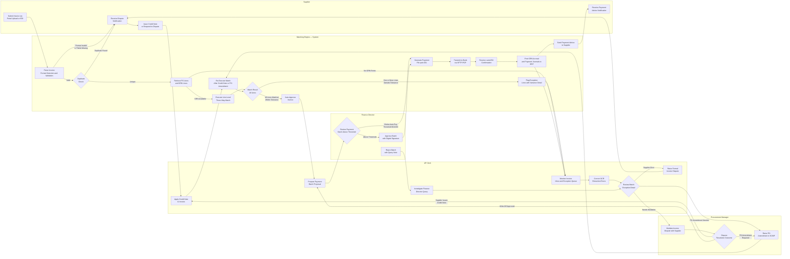

# Swimlane Diagrams — Supply Chain Management Platform

Swimlane diagrams extend activity diagrams by assigning every process step to a responsible actor or system. This cross-functional view makes handoff points, waiting times, and accountability boundaries immediately visible to process analysts, product teams, and auditors. Each diagram in this document uses a `flowchart LR` layout with `subgraph` blocks representing horizontal lanes. Nodes within a lane represent that actor's owned steps; edges crossing subgraph boundaries show handoffs. Process-step tables and SLA / escalation notes follow each diagram.

---

## Purchase Order Lifecycle Swimlane

This swimlane covers the complete purchase order lifecycle from purchase requisition creation through to payment settlement, spanning seven roles and the platform system itself. It is the primary reference for training procurement staff and for SLA target-setting across the P2P process.

```mermaid
flowchart LR
    subgraph Requester
        direction TB
        R1[Identify Need\nand Budget Code]
        R2[Create Purchase\nRequisition in SCMP]
        R3[Attach Specs\nand Justification]
        R13[Receive Rejection\nNotification]
        R14[Revise and\nResubmit PR]
    end

    subgraph System
        direction TB
        S1{Real-Time\nBudget Check}
        S2[Assign PR Number\nRoute to Approver]
        S3[Send Approval\nRequest Notification]
        S4[Convert PR\nto PO — Assign PO Number]
        S5[Transmit PO via\nEDI or Portal]
        S6{ORDRSP\nReceived?}
        S7[Parse ASN\nSchedule Dock]
        S8[Trigger QC\nInspection Lot]
        S9[Execute Three-Way\nMatch Engine]
        S10{Match\nResult}
        S11[Auto-Approve\nInvoice]
        S12[Generate Payment\nFile pain.001]
        S13[Transmit to\nBanking Gateway]
        S14[Receive camt.054\nDebit Confirmation]
        S15[Post GRN\nAccrual Journal to ERP]
        S16[Post Payment\nJournal to ERP]
        S17[Send Payment\nAdvice Notification]
    end

    subgraph ProcurementManager["Procurement Manager"]
        direction TB
        PM1{Review and\nApprove PR}
        PM2[Review Supplier\nCounterproposal]
        PM3{Accept ORDRSP\nChanges?}
        PM4[Monitor\nOpen Order]
        PM5[Resolve Invoice\nDiscrepancy]
    end

    subgraph ApproverCFO["Approver — L1 / L2 / CFO"]
        direction TB
        A1{Review PR\nApprove or Reject}
        A2[Approve High-Value\nPayment Batch]
    end

    subgraph Supplier
        direction TB
        SU1[Receive PO\nvia Portal or EDI]
        SU2[Send ORDRSP\nAcknowledgement]
        SU3[Prepare and\nDispatch Goods]
        SU4[Send DESADV\nAdvance Shipment Notice]
        SU5[Upload Invoice\nor Send EDI INVOIC]
        SU6[Receive Payment\nAdvice Notification]
    end

    subgraph WarehouseManager["Warehouse Manager"]
        direction TB
        WM1[Receive ASN\nBook Dock Appointment]
        WM2[Physically Receive\nGoods at Dock]
        WM3[Verify Quantity\nand Condition]
        WM4[Create GRN\nwith Lot Data]
        WM5[Release to Stock\nor Quarantine]
    end

    subgraph APClerk["AP Clerk"]
        direction TB
        AP1[Monitor Invoice\nQueue]
        AP2[Review Match\nExceptions]
        AP3[Raise Invoice\nDispute to Supplier]
        AP4[Prepare Payment\nRun Proposal]
    end

    subgraph FinanceDirector["Finance Director"]
        direction TB
        FD1{Review and Approve\nPayment Batch}
        FD2[Approve Period-End\nAP Reconciliation]
    end

    R1 --> R2
    R2 --> R3
    R3 --> S1
    S1 -- Insufficient --> R13
    R13 --> R14
    R14 --> S1
    S1 -- Sufficient --> S2
    S2 --> S3
    S3 --> A1
    A1 -- Rejected --> R13
    A1 -- Returned --> R14
    A1 -- Approved --> PM1
    PM1 -- Approved --> S4
    PM1 -- Returned --> R14
    PM1 -- Rejected → Final --> R13
    S4 --> S5
    S5 --> SU1
    SU1 --> SU2
    SU2 --> S6
    S6 -- No: 48h --> PM4
    PM4 --> S6
    S6 -- Yes --> PM3
    PM3 -- No Changes --> SU3
    PM3 -- Changes Exist --> PM2
    PM2 --> PM3
    SU3 --> SU4
    SU4 --> WM1
    WM1 --> S7
    S7 --> WM2
    WM2 --> WM3
    WM3 --> WM4
    WM4 --> S15
    S15 --> S8
    S8 --> WM5
    WM5 --> AP1
    SU5 --> AP1
    AP1 --> S9
    S9 --> S10
    S10 -- Matched --> S11
    S10 -- Exception --> AP2
    AP2 --> AP3
    AP3 --> SU5
    AP2 --> PM5
    PM5 --> S9
    S11 --> AP4
    AP4 --> FD1
    FD1 -- Rejected --> AP2
    FD1 -- Approved --> S12
    S12 --> S13
    S13 --> SU1
    S13 --> S14
    S14 --> S16
    S16 --> S17
    S17 --> SU6
    S16 --> FD2
```

### Process Step Table — Purchase Order Lifecycle

| Step | Responsible Lane | Input | Output | SLA Target |
|---|---|---|---|---|
| Identify need and budget code | Requester | Business requirement, project code, GL account | Defined line-item requirements with cost coding | No SLA — business discretion |
| Create purchase requisition | Requester | Line items, quantities, estimated prices, delivery dates | Draft PR in SCMP with assigned PR number | PR submitted same business day as need identified |
| Real-time budget check | System | PR total value, GL account, cost centre | Approval-routing instruction or budget-insufficient flag | < 3 seconds response time from ERP |
| PR approval (L1 / L2 / CFO) | Approver — L1 / L2 / CFO | Notification email with PR summary and action link | Approved, rejected, or returned-for-revision PR | L1: 4 business hours; L2: 8 business hours; CFO: 1 business day |
| Procurement Manager review | Procurement Manager | Approved PR from L1/L2/CFO | Approved PR or returned PR with revision notes | 4 business hours after receiving approved PR |
| PR to PO conversion | System | Approved PR with supplier and pricing data | Numbered PO with all line items and terms | Automatic — < 30 seconds |
| PO transmission to supplier | System | PO data | PO delivered via EDI AS2 (MDN within 60 s) or portal notification | EDI: 60-second MDN; portal: immediate |
| Supplier PO acknowledgement (ORDRSP) | Supplier | PO received via portal or EDI | ORDRSP with confirmed or changed lines | 24 business hours from PO receipt |
| Supplier prepares and ships goods | Supplier | Confirmed PO lines | Goods dispatched; ASN (DESADV) sent to SCMP | Per agreed delivery date on PO |
| ASN receipt and dock scheduling | Warehouse Manager | Inbound DESADV / ASN message | Dock appointment booked; inbound delivery record created | Dock scheduled within 2 business hours of ASN receipt |
| Physical goods receipt | Warehouse Manager | Goods at dock; delivery note; ASN | Counted and signed delivery note; condition noted | Same day as physical arrival |
| GRN creation with lot data | Warehouse Manager | Verified quantities; lot/batch/serial data | Posted GRN; ERP accrual journal triggered | GRN created within 2 business hours of receipt completion |
| GRN accrual journal posting | System | GRN data | Debit stock / credit accruals journal in ERP | Automatic — < 60 seconds after GRN save |
| Quality inspection (where applicable) | Warehouse Manager | Inspection lot triggered from GRN | Inspection result (pass / fail) recorded | Same business day for 100% plans; 2 business days for AQL sampling |
| Invoice submission | Supplier | Approved GRN; PO details | Invoice uploaded to portal or sent via EDI INVOIC | Within 3 business days of GRN confirmation receipt |
| Three-way match execution | System | Invoice lines, PO lines, GRN lines | Match result (within tolerance / discrepancy per line) | Automatic — < 10 seconds per invoice |
| Invoice discrepancy resolution | AP Clerk | Match exception flags | Dispute raised or PO amendment triggered | AP Clerk acknowledgement within 4 business hours; resolution within 5 business days |
| Payment batch approval | Finance Director | Payment batch proposal from AP Clerk | Approved or rejected payment batch | 4 business hours for batches below $500,000; 1 business day above |
| Payment file generation and transmission | System | Approved payment batch | ISO 20022 pain.001 file transmitted to bank | Automatic — executed at next payment run window (08:00 or 14:00) |
| Payment debit confirmation | System | camt.054 from bank | Invoice marked paid; payment journal posted to ERP | Bank debit confirmation typically within 2 hours for SEPA; same-day for faster payments |
| Payment advice to supplier | System | Payment confirmation with remittance details | Email / portal notification to supplier | Automatic — triggered within 5 minutes of debit confirmation receipt |

### SLA and Escalation Triggers

| Scenario | SLA Threshold | Escalation Action | Escalation Target |
|---|---|---|---|
| PR approval overdue | L1: 4 h; L2: 8 h; CFO: 1 day | System sends escalation email with deputy-approver copy | Approver's line manager or nominated deputy |
| Supplier PO acknowledgement overdue | 24 business hours from PO dispatch | System sends automated reminder; flags PO on Procurement Manager dashboard | Procurement Manager monitors and follows up directly |
| Goods not received by expected delivery date | 3 business days after EDD | System flags on overdue-delivery dashboard; email alert to Procurement Manager | Procurement Manager contacts supplier account manager |
| GRN not created within 2 business hours of physical receipt | 2 business hours after dock close | System generates GRN-overdue alert | Warehouse Manager supervisor |
| Invoice not submitted by supplier within 3 business days of GRN | 3 business days after GRN confirmation sent | System sends invoice-request email to Supplier Representative | AP Clerk monitors; escalates to Procurement Manager after 10 days |
| Invoice match exception unresolved | 5 business days from dispute creation | System escalates to Procurement Manager and copies Category Manager | Procurement Manager mediates with supplier |
| Payment batch approval overdue | 4 business hours (standard) / 1 business day (large batch) | System escalates to CFO with payment-at-risk amount highlighted | CFO / Deputy Finance Director |

---

## Supplier Onboarding Swimlane

This swimlane maps all handoffs across the supplier onboarding process, from the initial invitation through to the supplier being active on the Approved Supplier List with portal credentials provisioned. It involves the procurement team, the supplier, the compliance team, the system, and the IT/Identity team.

```mermaid
flowchart LR
    subgraph ProcurementMgr["Procurement Manager"]
        direction TB
        PM1[Identify New\nSupplier Need]
        PM2[Send Supplier\nInvitation via SCMP]
        PM10[Review Qualification\nFindings]
        PM11{Approve or\nReject Supplier?}
        PM12[Assign Category\nand Spend Tier]
    end

    subgraph Supplier
        direction TB
        SU1[Receive Invitation\nEmail with Portal Link]
        SU2[Complete Self-\nRegistration Form]
        SU3[Upload Required\nCompliance Documents]
        SU4[Respond to\nAdditional Info Request]
        SU5[Receive Rejection\nNotice]
        SU6[Receive Welcome\nEmail and Portal Credentials]
    end

    subgraph ComplianceTeam["Compliance Team"]
        direction TB
        CT1[Review Risk\nScore and Sanctions Flag]
        CT2[Review Legal\nand Insurance Documents]
        CT3{Compliance\nDecision}
        CT4[Request Additional\nInformation from Supplier]
    end

    subgraph SYS["System"]
        direction TB
        SYS1[Generate Unique\nRegistration Link — 7-Day TTL]
        SYS2{Invitation\nAccepted?}
        SYS3[Send Document\nChecklist Validation Result]
        SYS4[Call Credit and\nRisk Scoring Service API]
        SYS5{Risk Score\nResult}
        SYS6[Route to\nQualification Workflow]
        SYS7[Sync Vendor Record\nto ERP via API]
        SYS8{ERP Sync\nSuccessful?}
        SYS9[Record Supplier\non Approved Supplier List]
    end

    subgraph ITIdentity["IT / Identity Team"]
        direction TB
        IT1[Provision Supplier\nPortal Account in IdP]
        IT2[Set Initial\nPassword and MFA Enrolment Link]
        IT3[Assign Supplier\nOrganisation Scope in RBAC]
    end

    PM1 --> PM2
    PM2 --> SYS1
    SYS1 --> SU1
    SU1 --> SYS2
    SYS2 -- "Not Accepted\nAfter 7 Days" --> PM2
    SYS2 -- Accepted --> SU2
    SU2 --> SU3
    SU3 --> SYS3
    SYS3 -- "Missing or\nExpired Documents" --> SU3
    SYS3 -- "All Documents\nValid" --> SYS4
    SYS4 --> SYS5
    SYS5 -- "Sanctions Match\nor Prohibited" --> SU5
    SYS5 -- "High Risk —\nManual Review" --> CT1
    SYS5 -- "Low/Medium Risk" --> SYS6
    CT1 --> CT2
    CT2 --> CT3
    CT3 -- "Block Supplier" --> SU5
    CT3 -- "Accept Conditionally" --> SYS6
    CT3 -- "Request More Info" --> CT4
    CT4 --> SU4
    SU4 --> CT3
    SYS6 --> PM10
    PM10 --> CT2
    CT2 --> PM11
    PM11 -- Rejected --> SU5
    PM11 -- "Conditionally Approved" --> CT4
    PM11 -- Approved --> PM12
    PM12 --> SYS7
    SYS7 --> SYS8
    SYS8 -- "Sync Failed" --> PM2
    SYS8 -- "Sync Success" --> SYS9
    SYS9 --> IT1
    IT1 --> IT2
    IT2 --> IT3
    IT3 --> SU6
```

### Process Step Table — Supplier Onboarding

| Step | Responsible Lane | Input | Output | SLA Target |
|---|---|---|---|---|
| Identify new supplier need | Procurement Manager | PR with unapproved supplier or category strategy gap | Decision to initiate onboarding | Immediate on PR creation or category review |
| Send supplier invitation | Procurement Manager / System | Supplier company name and primary contact email | Invitation email with portal registration link (7-day TTL) | Invitation dispatched within 1 business day of trigger |
| Supplier self-registration | Supplier | Portal registration link | Completed company profile form with all mandatory fields | Supplier should complete within 3 business days of invitation |
| Document upload | Supplier | Registration form complete | Compliance documents (tax cert, insurance cert, quality cert, bank details, beneficial ownership) uploaded | Within 5 business days of registration completion |
| Document format and expiry validation | System | Uploaded documents | Validation result per document; missing/expired list returned to supplier | Automatic — < 60 seconds per document |
| Credit and risk scoring check | System | Validated supplier registration data | Risk score, insolvency probability, sanctions match flag, ESG tier | API response typically < 5 seconds; retry with 30-second timeout |
| Compliance manual review (high-risk) | Compliance Team | Risk score above threshold; flagged sanctions partial matches | Compliance team recommendation: approve / approve with conditions / block | 2 business days for high-risk reviews |
| Qualification review | Procurement Manager + Compliance Team | Document review outcome; risk score; capability evidence | Qualification approval decision | 5 business days from complete document set |
| Additional information request | Compliance Team | Gaps identified in review | Request sent to supplier with specific items needed | Supplier response expected within 5 business days of request |
| ERP vendor record sync | System | Approved supplier data including IBAN, payment terms, currency | Vendor master record created in ERP | Automatic — sync initiated within 5 minutes of ASL approval; must complete within 1 business day |
| Portal account provisioning | IT / Identity Team | Approved supplier record on ASL | IdP account created; RBAC scope assigned; MFA enrolment link generated | Within 4 business hours of ERP sync confirmation |
| Welcome email and credential delivery | System / IT | Provisioned IdP account | Welcome email with portal URL, username, and temporary password / MFA setup link | Automatic on account creation |

### SLA and Escalation Triggers — Supplier Onboarding

| Scenario | SLA Threshold | Escalation Action |
|---|---|---|
| Invitation not accepted | 7 days | One automated reminder at day 4; Procurement Manager notified at day 7 to decide whether to pursue or close |
| Supplier document upload incomplete | 10 days from invitation acceptance | System sends reminder at days 5 and 8; Procurement Manager intervention required at day 10 |
| Compliance manual review overdue | 2 business days | Compliance Team manager notified; default to proceeding with enhanced monitoring if no response by day 3 |
| Qualification review overdue | 5 business days | Category Director notified; escalates to CPO if business-critical supplier |
| ERP vendor sync failure | 1 business day | System Admin alerted immediately; manual ERP vendor creation fallback initiated by Finance if not resolved in 4 hours |
| Portal provisioning overdue | 4 business hours after ERP sync | IT manager alerted; manual account creation fallback |

---

## Three-Way Match and Invoice Approval Swimlane

This swimlane details the invoice processing workflow from the moment a supplier submits an invoice through to payment execution and ERP journal posting. It shows the critical gate where the automated matching engine interacts with human review for exception cases, and the Finance Director approval step for high-value batches.

### Process Step Table — Three-Way Match and Invoice Approval

| Step | Responsible Lane | Input | Output | SLA / Notes |
|---|---|---|---|---|
| Invoice submission | Supplier | Approved GRN confirmation from SCMP; original PO | Invoice in PDF, UBL XML, PEPPOL BIS 3.0, or EDIFACT INVOIC | Within 3 business days of GRN confirmation |
| Invoice parsing and format validation | Matching Engine (System) | Raw invoice file from any ingestion channel | Validated invoice record with extracted fields; or rejection message | Automatic — < 10 seconds from receipt |
| Duplicate detection | Matching Engine (System) | Invoice header fields (supplier ID, invoice number, gross amount, date) | Unique flag or duplicate rejection with original invoice reference | Automatic — fuzzy match in < 5 seconds |
| PO and GRN line retrieval | Matching Engine (System) | PO reference number extracted from invoice | PO lines and linked GRN lines loaded for matching | Automatic — < 3 seconds database lookup |
| Three-way match execution | Matching Engine (System) | Invoice lines, PO lines, GRN lines | Line-level match result with variance amounts and percentages | Automatic — < 10 seconds per invoice regardless of line count |
| Auto-approve matched invoice | Matching Engine (System) | All lines within configured tolerance (±2% price, ±1% quantity) | Invoice status set to Approved; added to payment queue | Automatic — no human intervention for clean matches |
| Exception flagging | Matching Engine (System) | Lines with variances outside tolerance | Exception record per discrepant line with variance detail and suggested resolution | Automatic — exception appears in AP Clerk queue within 30 seconds |
| Exception review and resolution path selection | AP Clerk | Exception detail with PO, GRN, and invoice line comparison | Resolution path chosen: supplier dispute / PO amendment / mediation | AP Clerk acknowledgement within 4 business hours |
| Invoice dispute creation | AP Clerk | Exception detail | Formal dispute record; supplier notification sent | Dispute raised within 4 business hours of exception acknowledgement |
| Supplier credit note response | Supplier | Dispute notification with variance detail | Credit note issued and uploaded to portal | Within 5 business days of dispute notification |
| Credit note application and re-match | AP Clerk + System | Received credit note | Credit applied to invoice; three-way match re-executed | Re-match completes automatically within 60 seconds of credit-note save |
| PO amendment (internal error path) | Procurement Manager | Match exception indicating PO price or quantity error | Amended PO line; re-match triggered | PO amendment completed within 1 business day; re-match automatic |
| Payment batch proposal | AP Clerk | Approved invoices in payment queue | Consolidated payment batch proposal by supplier | Prepared at payment-run cutoff times (07:30 and 13:30) |
| Payment batch approval | Finance Director | Batch proposal with total amount, supplier list, and oldest invoice age | Approved batch or rejection with query | 4 business hours for batches up to $500,000; 1 business day above |
| Payment file generation and transmission | Matching Engine (System) | Approved payment batch | ISO 20022 pain.001 XML file encrypted and SFTP'd to bank | Automatic — file sent within 5 minutes of Finance Director approval |
| Bank confirmation receipt | System | camt.054 from bank | Payment records updated; ERP journal posted | Confirmation typically within 2 hours for SEPA, same-day for faster payments |
| Payment advice delivery | System | Payment confirmation data | Email notification to Supplier Representative with remittance details | Automatic — triggered within 5 minutes of camt.054 receipt |

### SLA and Escalation Triggers — Three-Way Match and Invoice Approval

| Scenario | SLA Threshold | Escalation Action | Target |
|---|---|---|---|
| Invoice not submitted by supplier after GRN | 3 business days post GRN confirmation | System sends invoice request email; AP Clerk notified after 7 days | AP Clerk → Procurement Manager at day 10 |
| AP Clerk does not acknowledge match exception | 4 business hours | System re-notifies AP Clerk; AP Clerk manager copied | AP Clerk manager |
| Supplier does not respond to dispute | 5 business days from dispute creation | System sends escalation email; Procurement Manager looped in | Category Manager at day 7 → CPO at day 10 |
| Payment batch approval overdue | 4 business hours (< $500k) / 1 business day (> $500k) | System escalates to Deputy Finance Director | CFO |
| Invoices sitting in approved queue beyond payment terms | 2 days before payment-due date | System generates early-payment alert for AP Clerk review | AP Clerk; Finance Director if batch not yet approved |
| Bank transmission failure | 3 failed retries over 30 minutes | System Admin notified; AP Clerk notified of delay; manual backup payment initiation procedure activated | System Admin + Finance Director |

---

## RFQ and Award Swimlane

This swimlane covers the source-to-contract process from the Category Manager creating a sourcing event through to the executed contract becoming active in the system and price lists being available for requisitioners. It shows how the Evaluation Committee, Legal, and suppliers interact with the Category Manager and the system across a typical 3–6 week sourcing cycle.

```mermaid
flowchart LR
    subgraph CatMgr["Category Manager"]
        direction TB
        CM1[Define Sourcing\nRequirement and Scope]
        CM2[Build Evaluation\nCriteria and Weightings]
        CM3[Build Supplier\nInvite List from ASL]
        CM4[Launch RFQ/RFP\nEvent in SCMP]
        CM5[Answer Supplier\nQ&A Queries]
        CM6[Distribute Bids to\nEvaluation Committee]
        CM7[Consolidate Evaluation\nScores]
        CM8[Present Award\nRecommendation]
        CM9[Conduct Commercial\nNegotiations]
        CM10[Brief Legal on\nContract Requirements]
        CM11[Activate Price List\nin SCMP Catalogue]
        CM12[Notify Unsuccessful\nSuppliers with Feedback]
    end

    subgraph SUP2["Supplier"]
        direction TB
        SU1[Receive Invitation\nNotification and NDA]
        SU2[Sign and Return NDA\nvia Portal]
        SU3[Download RFQ\nDocuments and Specs]
        SU4[Submit Bid\nBefore Deadline]
        SU5[Receive Q&A\nClarification Updates]
        SU6[Provide Clarification\nif Requested]
        SU7[Receive Award\nor Non-Award Notice]
        SU8[Negotiate Terms\nand Sign Contract]
    end

    subgraph EvalCommittee["Evaluation Committee"]
        direction TB
        EC1[Score Technical\nResponses per Criteria]
        EC2[Score Commercial\nProposals]
        EC3{Agree on\nAward Recommendation}
        EC4[Respond to\nClarification Requests]
    end

    subgraph Legal
        direction TB
        LG1[Review Contract\nDraft from Clause Library]
        LG2[Redline Contract\nand Return for Negotiation]
        LG3{Legal Approval\nGranted?}
        LG4[Approve Final\nContract for Execution]
    end

    subgraph SYS3["System"]
        direction TB
        SS1[Create Sourcing\nEvent Record]
        SS2[Send NDA to\nInvited Suppliers]
        SS3{NDA Signed\nby Supplier?}
        SS4[Publish RFQ Docs\nto Portal]
        SS5[Open Bid\nSubmission Window]
        SS6{Bid Window\nClosed?}
        SS7[Lock Bids\nPublish to Evaluators]
        SS8[Calculate Weighted\nScores per Supplier]
        SS9[Generate Award\nRecommendation Report]
        SS10[Archive Executed\nContract to DMS]
        SS11[Activate Blanket\nPO if Applicable]
        SS12[Set Contract\nExpiry Reminder]
    end

    CM1 --> CM2
    CM2 --> CM3
    CM3 --> CM4
    CM4 --> SS1
    SS1 --> SS2
    SS2 --> SU1
    SU1 --> SU2
    SU2 --> SS3
    SS3 -- "Not Signed\nAfter 3 Days" --> CM3
    SS3 -- "Signed" --> SS4
    SS4 --> SU3
    SS4 --> SS5
    SS5 --> SU4
    SU5 --> SU4
    CM5 --> SU5
    SU4 --> SS6
    SS6 -- "Window Open\nQueries Pending" --> CM5
    SS6 -- "Window Closed" --> SS7
    SS7 --> CM6
    CM6 --> EC1
    EC1 --> EC2
    EC2 --> EC4
    EC4 --> SU6
    SU6 --> EC3
    EC1 --> SS8
    EC2 --> SS8
    SS8 --> SS9
    SS9 --> CM7
    CM7 --> CM8
    CM8 --> EC3
    EC3 -- "Consensus Reached" --> CM9
    EC3 -- "No Consensus" --> CM8
    CM9 --> SU7
    CM9 --> CM12
    SU7 --> SU8
    CM9 --> CM10
    CM10 --> LG1
    LG1 --> LG2
    LG2 --> CM9
    LG2 --> LG3
    LG3 -- "Redline Required" --> LG2
    LG3 -- "Approved" --> LG4
    LG4 --> SU8
    SU8 --> SS10
    SS10 --> CM11
    CM11 --> SS11
    SS11 --> SS12
    SS12 --> CM12
```

### Process Step Table — RFQ and Award

| Step | Responsible Lane | Input | Output | SLA / Notes |
|---|---|---|---|---|
| Define sourcing requirement | Category Manager | Category spend review, expiring contract, or new business need | Sourcing scope document: commodity description, volume estimate, quality requirements, delivery requirements, target price range | Completed within 3 business days of triggering event |
| Build evaluation criteria | Category Manager | Sourcing scope; procurement policy for minimum criteria weights | Evaluation template with technical and commercial criteria, weights (must sum to 100%), and scoring scales | Completed before event creation — typically 1–2 business days |
| Build supplier invite list | Category Manager | Approved Supplier List; market knowledge; diversity requirements | Invite list with minimum 3 suppliers; documented rationale if fewer | List finalised before event launch |
| Launch sourcing event | Category Manager / System | Invite list; evaluation template; RFQ documents | Active sourcing event in SCMP; invitations dispatched to suppliers | Event launched within 1 business day of category director approval |
| NDA acceptance | Supplier / System | Invitation email with NDA attachment | Signed NDA stored in portal; supplier granted access to full RFQ documents | Supplier expected to sign within 3 business days of invitation |
| RFQ document download and review | Supplier | Access to RFQ package | Supplier internal review and bid preparation | Supplier's internal process — 1–2 weeks typical for complex RFPs |
| Supplier Q&A queries | Supplier → Category Manager | Supplier questions posted to portal Q&A board | Category Manager answers; published to all suppliers simultaneously to ensure fairness | Category Manager must respond within 2 business days of question submission |
| Bid submission | Supplier | Completed response to RFQ requirements | Bid submitted to SCMP portal before window closes | Bids due per stated submission deadline; late bids automatically rejected by system |
| Bid window close and lock | System | All received bids | Bids locked and distributed to evaluation committee; late-bid rejection notifications sent | Automatic at deadline timestamp |
| Technical and commercial scoring | Evaluation Committee | Bid documents and evaluation template | Individual evaluator scores per criterion | Each evaluator completes scoring within 5 business days of bid distribution |
| Weighted score calculation | System | Individual evaluator scores | Weighted aggregate score per supplier with ranking | Automatic — < 30 seconds after last evaluator submits scores |
| Clarification requests (if needed) | Evaluation Committee → Supplier | Ambiguities or missing information in submitted bids | Clarification responses from suppliers | Clarifications issued within 3 days of bid review; supplier responds within 2 business days |
| Award recommendation | Category Manager + Evaluation Committee | Consolidated scores; business factors | Award recommendation report with justification | Report produced within 2 business days of scoring completion |
| Board / executive approval (large contracts) | Executive Committee | Award recommendation | Approval granted or rejected | Board meeting cadence — typically 1–2 weeks; urgent requests may use written resolution |
| Commercial negotiations | Category Manager + Supplier | Intended-award notification; current bid terms | Agreed commercial terms, pricing, and contract conditions | Typically 1–3 rounds; target completion within 10 business days |
| Legal contract drafting | Legal | Agreed commercial terms from negotiation | Redlined draft contract | Legal turnaround within 5 business days of brief |
| Contract execution | Category Manager + Legal + Supplier | Final agreed contract | Fully countersigned contract (PDF/A-3) | Internal signature within 2 business days; supplier countersignature expected within 3 business days |
| Contract archival | System | Executed contract PDF | Contract stored in DMS under classified retention policy; metadata indexed in SCMP | Automatic on e-signature completion or manual upload |
| Price list activation | Category Manager | Executed contract with agreed pricing | Active price list in SCMP catalogue; requisitioners can raise POs against the agreement | Activated within 1 business day of contract execution |
| Unsuccessful supplier notification | Category Manager | Award decision; individual scores (aggregated, not revealing competitor prices) | Non-award letters sent with constructive feedback | Within 5 business days of award confirmation |

### SLA and Escalation Triggers — RFQ and Award

| Scenario | SLA Threshold | Escalation Action | Escalation Target |
|---|---|---|---|
| Insufficient bids received (fewer than minimum) | At bid window close | Extend window by up to 5 business days (maximum one extension); Category Director approves if waiver needed | Category Director → CPO |
| Supplier NDA not signed after 3 days | 3 business days from invitation | Send one reminder; replace non-responsive supplier with reserve candidate if minimum count at risk | Category Manager decision |
| Evaluator scoring overdue | 5 business days from bid distribution | Category Manager reminds evaluator; Committee Chair may nominate substitute evaluator | Committee Chair |
| Commercial negotiations stalled | 15 business days from intended-award notification | Engage second-placed supplier; notify first-placed supplier of intent to move | Category Director + Legal |
| Legal contract review overdue | 5 business days from brief | Legal manager escalation; Category Director may invoke external counsel | Legal Director |
| Contract countersignature overdue | 3 business days from supplier dispatch | Category Manager contacts supplier account executive; if unresolved, Legal issues notice of withdrawal | Legal + Category Director |
| Price list not activated within 1 business day of execution | 1 business day from contract execution | System generates alert to Category Manager; System Admin investigates if catalogue sync issue | Category Manager + System Admin |
