# Use-Case Diagram — Supply Chain Management Platform

## Actors

| Actor | Type | Description |
|---|---|---|
| Procurement Manager | Primary | Creates and manages POs, onboards suppliers, monitors performance |
| Supplier | Primary (External) | Registers via portal, acknowledges POs, submits invoices and ASNs, responds to RFQs |
| Finance Manager | Primary | Approves payment runs, monitors budgets, manages disputes |
| Warehouse Manager | Primary | Records goods receipts, conducts quality inspections, processes RTVs |
| Approver (L1 / L2) | Primary | Reviews and approves or rejects purchase requisitions |
| Category Manager | Primary | Manages sourcing events (RFQ/RFP/auction), oversees contracts, benchmarks suppliers |
| System Admin | Primary | Configures platform, manages users, roles, integrations |
| System (Automated) | Secondary | Executes matching, scoring, alerts, and scheduled workflows automatically |

---

## Use Case Diagram

```mermaid
graph TD
    %% Actors
    PM(["👤 Procurement Manager"])
    SUP(["👤 Supplier"])
    FM(["👤 Finance Manager"])
    WM(["👤 Warehouse Manager"])
    APR(["👤 Approver L1/L2"])
    CM(["👤 Category Manager"])
    SA(["👤 System Admin"])
    SYS(["⚙️ System"])

    %% ─────────────────────────────────────────────
    %% Supplier Management use cases
    %% ─────────────────────────────────────────────
    subgraph SM ["🏷 Supplier Management"]
        UC_INV[Invite Supplier]
        UC_REG[Self-Register on Portal]
        UC_QUAL[Qualify Supplier]
        UC_SUSP[Suspend / Off-board Supplier]
        UC_DOC[Upload Compliance Documents]
        UC_DOCEXP[Alert on Document Expiry]
        UC_BANK[Update Bank Details]
        UC_RISKCHK[External Risk Score Check]
    end

    %% ─────────────────────────────────────────────
    %% Procurement use cases
    %% ─────────────────────────────────────────────
    subgraph PROC ["📋 Procurement"]
        UC_PR[Create Purchase Requisition]
        UC_BUDG[Budget Check]
        UC_APPR[Approve Requisition]
        UC_CONS[Consolidate PRs to PO]
        UC_ISPO[Issue Purchase Order]
        UC_ACK[Acknowledge PO]
        UC_CHG[Manage Change Order]
        UC_BLK[Create Blanket Order]
        UC_CAN[Cancel PO]
    end

    %% ─────────────────────────────────────────────
    %% Goods Receipt use cases
    %% ─────────────────────────────────────────────
    subgraph GR ["📦 Goods Receipt"]
        UC_ASN[Submit ASN]
        UC_GRN[Record Goods Receipt]
        UC_QI[Quality Inspection]
        UC_RTV[Initiate Return-to-Vendor]
        UC_DISC[Resolve Discrepancy]
    end

    %% ─────────────────────────────────────────────
    %% Invoice & Payment use cases
    %% ─────────────────────────────────────────────
    subgraph INV ["💳 Invoice & Payment"]
        UC_SINV[Submit Invoice]
        UC_3WM[Three-Way Matching]
        UC_DISP[Manage Dispute]
        UC_PAY[Schedule and Execute Payment]
        UC_EPD[Capture Early Payment Discount]
    end

    %% ─────────────────────────────────────────────
    %% Sourcing use cases
    %% ─────────────────────────────────────────────
    subgraph SRC ["🔍 Sourcing"]
        UC_RFQ[Publish RFQ/RFP]
        UC_QUOT[Submit Quotation]
        UC_EVAL[Evaluate and Award RFQ]
        UC_RAUC[Conduct Reverse Auction]
        UC_CONV[Convert Award to PO]
    end

    %% ─────────────────────────────────────────────
    %% Contract Management use cases
    %% ─────────────────────────────────────────────
    subgraph CTR ["📄 Contract Management"]
        UC_CRTC[Create Contract]
        UC_ESIG[eSignature Execution]
        UC_CSPEND[Monitor Contract Spend]
        UC_RENEW[Renew or Terminate Contract]
    end

    %% ─────────────────────────────────────────────
    %% Performance & Analytics use cases
    %% ─────────────────────────────────────────────
    subgraph PERF ["📊 Performance & Analytics"]
        UC_OTD[Calculate OTD Score]
        UC_SCORE[Generate Scorecard]
        UC_BENCH[View Benchmarking]
        UC_SPND[Spend Analytics Dashboard]
        UC_RPT[Export Ad-hoc Report]
    end

    %% ─────────────────────────────────────────────
    %% Administration use cases
    %% ─────────────────────────────────────────────
    subgraph ADMIN ["⚙️ Administration"]
        UC_USR[Manage Users and Roles]
        UC_WFLOW[Configure Approval Workflows]
        UC_INT[Manage Integrations]
        UC_AUDIT[View Audit Logs]
    end

    %% Actor → Use Case associations
    PM --> UC_INV
    PM --> UC_QUAL
    PM --> UC_SUSP
    PM --> UC_CONS
    PM --> UC_ISPO
    PM --> UC_CHG
    PM --> UC_BLK
    PM --> UC_CAN
    PM --> UC_DISC
    PM --> UC_SCORE
    PM --> UC_CRTC
    PM --> UC_RENEW
    PM --> UC_CONV

    SUP --> UC_REG
    SUP --> UC_DOC
    SUP --> UC_BANK
    SUP --> UC_ACK
    SUP --> UC_ASN
    SUP --> UC_SINV
    SUP --> UC_DISP
    SUP --> UC_QUOT

    FM --> UC_PAY
    FM --> UC_EPD
    FM --> UC_DISP
    FM --> UC_SPND

    WM --> UC_GRN
    WM --> UC_QI
    WM --> UC_RTV
    WM --> UC_DISC

    APR --> UC_APPR

    CM --> UC_RFQ
    CM --> UC_EVAL
    CM --> UC_RAUC
    CM --> UC_BENCH
    CM --> UC_CSPEND

    SA --> UC_USR
    SA --> UC_WFLOW
    SA --> UC_INT
    SA --> UC_AUDIT

    %% System automated actions
    SYS --> UC_BUDG
    SYS --> UC_3WM
    SYS --> UC_OTD
    SYS --> UC_DOCEXP
    SYS --> UC_RISKCHK
    SYS --> UC_ESIG

    %% Include/Extend relationships (dashed)
    UC_PR -.->|includes| UC_BUDG
    UC_ISPO -.->|includes| UC_PR
    UC_3WM -.->|extends| UC_SINV
    UC_QUAL -.->|includes| UC_RISKCHK
    UC_SCORE -.->|includes| UC_OTD
    UC_CONV -.->|includes| UC_ISPO
```

---

## Use Case Groups Summary

| Group | Use Cases | Primary Actors |
|---|---|---|
| Supplier Management | Invite, Register, Qualify, Suspend, Document alerts, Bank update | Procurement Manager, Supplier, System |
| Procurement | PR creation, Budget check, Approval, PO issuance, Blanket orders | Employee, Approver, Procurement Manager |
| Goods Receipt | ASN submission, GRN recording, Quality inspection, RTV, Discrepancy | Supplier, Warehouse Manager |
| Invoice & Payment | Invoice submission, Three-way matching, Dispute, Payment run, EPD | Supplier, AP Clerk, Finance Manager, System |
| Sourcing | RFQ/RFP, Reverse auction, Quote submission, Award, Convert to PO | Category Manager, Supplier |
| Contract Management | Contract creation, eSignature, Spend monitoring, Renewal | Procurement Manager, Category Manager |
| Performance & Analytics | OTD, Scorecard, Benchmarking, Spend dashboard, Ad-hoc reports | All internal actors, System |
| Administration | Users, Roles, Approvals, Integrations, Audit logs | System Admin |

---

## Actor–Use Case Matrix

| Use Case | Proc. Mgr | Supplier | Finance Mgr | Warehouse Mgr | Approver | Category Mgr | Sys Admin | System |
|---|:---:|:---:|:---:|:---:|:---:|:---:|:---:|:---:|
| Invite Supplier | ✅ | | | | | | | |
| Self-Register | | ✅ | | | | | | |
| Qualify Supplier | ✅ | | | | | | | |
| Suspend / Off-board | ✅ | | | | | ✅ | | |
| Upload Documents | | ✅ | | | | | | |
| Document Expiry Alert | | | | | | | | ✅ |
| Create PR | ✅ | | | | | | | |
| Budget Check | | | | | | | | ✅ |
| Approve Requisition | | | | | ✅ | | | |
| Issue PO | ✅ | | | | | | | |
| Acknowledge PO | | ✅ | | | | | | |
| Manage Change Order | ✅ | | | | | | | |
| Submit ASN | | ✅ | | | | | | |
| Record GRN | | | | ✅ | | | | |
| Quality Inspection | | | | ✅ | | | | |
| Return to Vendor | | | | ✅ | | | | |
| Submit Invoice | | ✅ | | | | | | |
| Three-Way Matching | | | | | | | | ✅ |
| Manage Dispute | ✅ | ✅ | ✅ | | | | | |
| Execute Payment | | | ✅ | | | | | |
| Publish RFQ/RFP | | | | | | ✅ | | |
| Submit Quotation | | ✅ | | | | | | |
| Award RFQ | | | | | | ✅ | | |
| Create Contract | ✅ | | | | | ✅ | | |
| Monitor Contract Spend | | | ✅ | | | ✅ | | |
| Calculate OTD | | | | | | | | ✅ |
| View Spend Dashboard | ✅ | | ✅ | | | ✅ | | |
| Manage Users/Roles | | | | | | | ✅ | |
