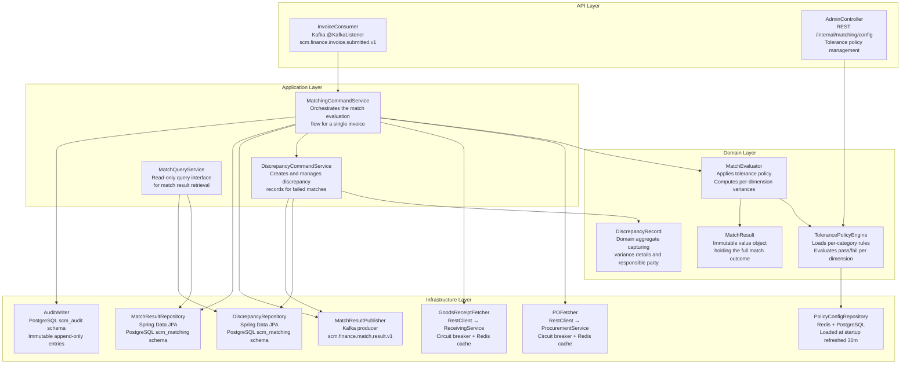
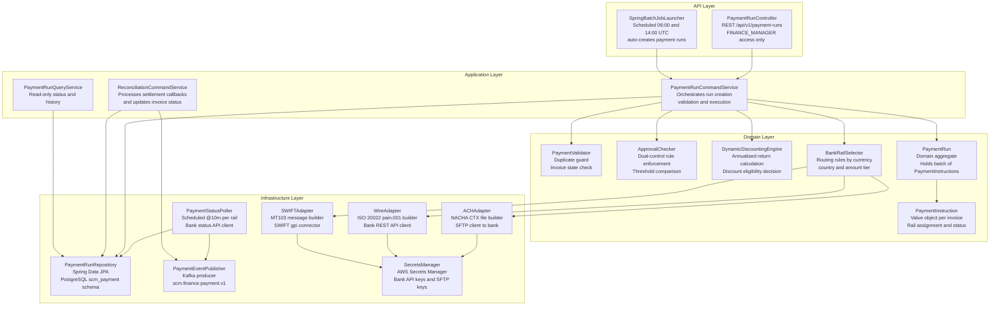
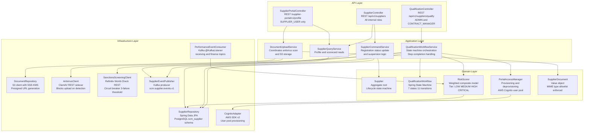

# C4 Component Diagram — Supply Chain Management Platform

This document provides C4 Level 3 Component diagrams for the three most critical backend services in the Supply Chain Management Platform: MatchingEngine, PaymentService, and SupplierService. The C4 model at Level 3 describes the internal components of a single deployable unit (container), their responsibilities, the interfaces they expose or consume, and the relationships between them.

Each component in this model corresponds to a Spring-managed bean, a Spring Batch job, a Kafka listener, or a distinct infrastructure adapter class. Components are grouped by their layer (API, Application, Domain, Infrastructure) following the strict dependency rule: inner layers have no compile-time knowledge of outer layers. This separation is enforced at build time using ArchUnit assertions in each service's test suite.

---

## C4 Component Diagram — MatchingEngine

MatchingEngine is the most data-intensive service on the platform. It has no inbound HTTP API; its only entry point is the Kafka topic `scm.finance.invoice.submitted.v1`. From there, it retrieves reference data from two peer services via synchronous REST calls, applies variance tolerance policies, and publishes a structured result. The service runs as a horizontally scalable Deployment on EKS with Kafka consumer group parallelism matching the number of topic partitions (12 by default). Each pod is stateless; all shared state is held in PostgreSQL and Redis.



**InvoiceConsumer** uses a `ConcurrentKafkaListenerContainerFactory` with `ackMode=MANUAL_IMMEDIATE`. On successful processing, the offset is committed immediately after the `MatchResultPublisher` confirms the Kafka transaction has committed, ensuring the consumed event and the published result are atomically paired. On processing failure, the exception is caught by a `DefaultErrorHandler` with 3 retry attempts; after exhausting retries, the message is forwarded to the DLQ topic `scm.finance.invoice.submitted.v1.dlq`.

**TolerancePolicyEngine** loads its rule set from PostgreSQL at startup and keeps a local in-memory copy refreshed from Redis every 30 minutes. The refresh cycle uses a `@Scheduled` Spring task. Rules support three variance dimensions per spend category: `quantityTolerancePct` (default 3.0%), `priceTolerance Pct` (default 2.0%), and `taxVarianceAbsolute` (default 50.00 USD). A `WILDCARD` category entry serves as the fallback when no category-specific rule is configured.

**AuditWriter** writes to an append-only `match_audit_log` table in the `scm_audit` PostgreSQL schema. Rows are never updated or deleted. The table is used by the compliance team for evidence during auditor queries and for retrospective investigation of match decision logic.

---

## C4 Component Diagram — PaymentService

PaymentService is the only service that issues instructions to external banking systems. It has the highest security posture on the platform: all outbound banking adapters require HSM-backed private keys, and all payment run executions above the dual-control threshold require two distinct `FINANCE_MANAGER` principals to have approved the run before execution proceeds. Spring Security's method-level `@PreAuthorize` annotations enforce this at the application layer.



**DynamicDiscountingEngine** evaluates discount offers stored in the `payment_discount_offers` table. The annualised return formula is `(discount% / (1 - discount%)) × (365 / daysEarly)`. If the annualised return exceeds the buyer's configured `costOfCapitalPct` setting (stored per legal entity), the engine marks the instruction as `DISCOUNT_APPLIED` and adjusts the payment amount and date. Discount decisions are logged immutably for finance audit.

**BankRailSelector** applies a decision matrix in order: SWIFT is selected for cross-border payments above $10,000; ACH is selected for domestic USD payments up to $100,000; Wire is selected for domestic USD payments above $100,000 or when same-day settlement is required. Rail selection can be overridden by the `FINANCE_MANAGER` role at run creation time.

**SecretsManager** is a Spring `@Component` that fetches credentials from AWS Secrets Manager at startup and caches them in memory. A background `@Scheduled` task refreshes all secrets every 6 hours, triggering re-initialisation of the affected banking adapter client. No credentials are stored in application properties files or environment variables.

---

## C4 Component Diagram — SupplierService

SupplierService is the authoritative source of record for all supplier data on the platform. It exposes a REST API consumed by ProcurementService (to validate supplier status before PO issuance), by the supplier portal, and by the ADMIN interface. Internally, the Qualification Workflow is the most complex component: it is a Spring State Machine with 7 states and 11 transitions, driven by both human decisions (qualification officer approval) and automated system decisions (sanctions screening result, document completeness check).



**QualificationWorkflow** uses Spring Statemachine 3.x with a persistent `JpaPersistingStateMachineInterceptor` backed by PostgreSQL, ensuring the workflow state survives pod restarts. Each state transition action is a Spring-managed bean injected into the state machine configuration, keeping action logic fully testable in isolation. Guard conditions (e.g. "all required documents uploaded") are evaluated as `Guard<State, Event>` beans by the state machine engine before allowing a transition to proceed.

**RiskScorer** recomputes the supplier's risk tier whenever a `PerformanceMetricUpdated` event is received from the Kafka consumer. The scoring model uses four weighted dimensions: `sanctionsRisk` (weight 0.35), `geographicRisk` (weight 0.20), `financialStability` (weight 0.25), and `performanceHistory` (weight 0.20). Each dimension is normalised to a 0–100 scale before weighting. Tier boundaries are: LOW (0–30), MEDIUM (31–60), HIGH (61–80), CRITICAL (81–100). A tier change triggers a `SupplierRiskTierChanged` event and notifies active procurement officers who have open POs with the affected supplier.

---

## Component Interaction Table

| Calling Component | Called Component | Interaction | Sync/Async | Notes |
|---|---|---|---|---|
| InvoiceConsumer | MatchingCommandService | Method call | Sync | In-process; no network hop |
| MatchingCommandService | POFetcher | Method call | Sync | REST via RestClient; cached in Redis 2m TTL |
| MatchingCommandService | GoodsReceiptFetcher | Method call | Sync | REST via RestClient; cached in Redis 2m TTL |
| MatchingCommandService | MatchResultPublisher | Method call | Sync | Kafka transactional producer |
| PaymentRunCommandService | ACHAdapter | Method call | Sync | SFTP file transfer; blocking per batch |
| PaymentRunCommandService | WireAdapter | Method call | Sync | Bank REST API; async response via status poller |
| PaymentStatusPoller | PaymentEventPublisher | Method call | Sync | Emits Kafka event on terminal status |
| QualificationWorkflowService | SanctionsScreeningClient | Method call | Sync | Resilience4j CB; timeout 10s; fallback: hold in SCREENING |
| QualificationWorkflowService | SupplierEventPublisher | Method call | Sync | Kafka transactional producer |
| PerformanceEventConsumer | RiskScorer | Method call | Sync | In-process domain call |
| RiskScorer | SupplierRepository | Method call | Sync | JPA query for historical performance data |
| DocumentUploadService | AntivirusClient | Method call | Sync | REST to ClamAV sidecar; blocks upload until result |

---

## Dependency Injection and Layering Rules

The following rules are enforced by ArchUnit tests that run in every service's `verify` phase and block the build on violation.

**Domain layer isolation** — Classes in the `domain` package must not import any class from `org.springframework`, `javax.persistence`, `software.amazon`, `org.apache.kafka`, or any other infrastructure framework. Domain components accept only domain objects as method parameters and return only domain objects or primitives.

**Application layer** — Classes in the `application` package may import domain types and may declare Spring `@Service` or `@Component` annotations. They may not import infrastructure adapter classes directly; they depend only on port interfaces defined in the domain or application package.

**Infrastructure layer** — Infrastructure adapter classes implement port interfaces from the domain or application package. They may use any Spring, JPA, AWS SDK, or Kafka library as required. They must not contain any business logic; business logic found in an infrastructure class is a build-failing ArchUnit violation.

**Constructor injection** — All Spring-managed beans use constructor injection exclusively. Field injection (`@Autowired` on a field) and setter injection are prohibited. This rule enables straightforward unit testing without requiring a Spring context to be loaded.

**No circular dependencies** — ArchUnit's `slices().matching("com.scm.(*)..").should().beFreeOfCycles()` check prevents circular package dependencies. The `domain` package must never depend on `application` or `infrastructure`. The `application` package must never depend on `infrastructure`.

---

## Testing Strategy Per Layer

Each layer is validated by a distinct category of test with appropriate scope and isolation level.

| Layer | Test Category | Framework | Scope and Isolation |
|---|---|---|---|
| Domain | Unit tests | JUnit 5, AssertJ | Pure Java; no Spring; no mocks for domain collaborators; full state machine transition coverage |
| Application | Unit tests with mocks | JUnit 5, Mockito | Spring context not loaded; port interfaces mocked; focus on orchestration logic and error handling paths |
| Infrastructure — JPA | Integration tests | Spring Boot Test, Testcontainers PostgreSQL | Real PostgreSQL; schema migration via Flyway; tests cover query correctness and transaction boundaries |
| Infrastructure — Kafka | Integration tests | Spring Kafka Test, Testcontainers Kafka | Real Kafka broker; covers consumer offset management, DLQ routing, and transactional producer correctness |
| Infrastructure — REST clients | WireMock tests | WireMock, Spring Boot Test | Mocked HTTP server; covers circuit breaker trip, timeout, retry, and cache-hit scenarios |
| API layer | MockMvc tests | Spring MockMvc, Spring Security Test | Full Spring context; covers authentication, authorisation (role-based), request validation, and HTTP status codes |
| Cross-service | Contract tests | Spring Cloud Contract | Producer-side: generated stubs from contracts; Consumer-side: verifies client code against stubs |
| End-to-end | E2E tests | REST-assured, Testcontainers Compose | Full service stack via Docker Compose; covers happy path and key failure scenarios per bounded context |

Contract tests are the critical guard against breaking API changes between services. Each service's build publishes its current contract stubs to the platform's Artifactory contract registry. Consumer services pull the latest stubs and run their contract verification suite against them during CI, failing the build if a breaking change is detected before the change reaches a shared environment.

---

## Data Schemas and Storage Boundaries

Each service owns a dedicated PostgreSQL schema within the shared RDS Aurora cluster. No service may query another service's schema directly; cross-service data access is exclusively through published REST APIs or Kafka events. Schema ownership is enforced at the database level through distinct PostgreSQL roles: the `procurement_app` role has `SELECT, INSERT, UPDATE, DELETE` on the `scm_procurement` schema only, and similar role-per-schema isolation applies to all services.

| Service | PostgreSQL Schema | Key Tables |
|---|---|---|
| ProcurementService | `scm_procurement` | `purchase_requisition`, `requisition_line`, `purchase_order`, `po_line`, `approval_task`, `budget_reservation` |
| MatchingEngine | `scm_matching` | `match_result`, `discrepancy_record`, `tolerance_policy`, `match_audit_log` |
| SupplierService | `scm_supplier` | `supplier`, `supplier_contact`, `qualification_workflow`, `supplier_document`, `risk_score_history` |
| PaymentService | `scm_payment` | `payment_run`, `payment_instruction`, `payment_status_history`, `discount_offer`, `reconciliation_record` |
| InvoiceService | `scm_finance` | `invoice`, `invoice_line`, `invoice_dispute`, `credit_note` |
| ReceivingService | `scm_receiving` | `goods_receipt`, `receipt_line`, `asn`, `asn_line` |
| ContractService | `scm_contract` | `contract`, `contract_clause`, `contract_line`, `renewal_alert` |
| PerformanceService | `scm_performance` | `performance_scorecard`, `kpi_metric`, `improvement_plan`, `feedback_note` |

Database schema migrations are managed by Flyway in each service. Migrations are versioned monotonically and applied automatically on service startup before the Spring context initialises. Rollback is handled at the application layer (rolling deployment) rather than by Flyway downgrade scripts; schema changes must therefore be backward-compatible within a two-version window to support blue-green deployments where old and new pods run concurrently during the rollout.

Redis namespaces are prefixed per service to prevent key collisions on the shared ElastiCache cluster: `procurement:`, `matching:`, `supplier:`, `payment:`. Redis is used exclusively for caching, rate limiting, and idempotency key storage; it is not used as a primary data store. All Redis data has explicit TTLs to prevent unbounded memory growth; the ElastiCache instance uses the `allkeys-lru` eviction policy to handle memory pressure gracefully.

---

## Spring Boot Module Structure

Each microservice is structured as a multi-module Gradle project to enforce the layering rules at the build tool level rather than relying solely on ArchUnit runtime enforcement.

```
procurement-service/
├── procurement-domain/          # Pure Java, no framework dependencies
│   ├── src/main/java/.../domain/
│   │   ├── model/               # Aggregates, entities, value objects
│   │   ├── port/inbound/        # Use case interfaces (commands and queries)
│   │   ├── port/outbound/       # Repository and event publisher interfaces
│   │   └── service/             # Domain services implementing inbound ports
│   └── build.gradle             # No Spring, no JPA, no Kafka dependencies
├── procurement-application/     # Orchestration and transaction boundaries
│   ├── src/main/java/.../application/
│   │   └── service/             # Application services; @Transactional here
│   └── build.gradle             # Depends on procurement-domain only
├── procurement-infrastructure/  # Framework adapters
│   ├── src/main/java/.../infrastructure/
│   │   ├── persistence/         # Spring Data JPA repositories
│   │   ├── messaging/           # Kafka producers and consumers
│   │   └── integration/         # External REST client adapters
│   └── build.gradle             # Depends on procurement-application and -domain
└── procurement-api/             # Spring MVC controllers and DTOs
    ├── src/main/java/.../api/
    │   ├── controller/
    │   └── dto/
    └── build.gradle             # Depends on procurement-application
```

This module structure means a developer working on domain logic can run domain unit tests in under 5 seconds without starting a Spring context. Infrastructure integration tests run in a separate Gradle task and start Testcontainers only for the infrastructure module under test. The full test suite (all modules) runs in the CI pipeline; developers are expected to run only the domain and application module tests locally during development to keep the inner feedback loop fast.

The `procurement-api` module's `build.gradle` declares a `bootJar` task that produces the final deployable JAR, bundling all four modules. The `procurement-domain` and `procurement-application` modules produce plain JARs with no embedded server. This arrangement means the domain and application logic can be tested and reasoned about in complete isolation from HTTP, JPA, and Kafka runtime concerns, and that a future migration to a different delivery mechanism (e.g. gRPC, GraphQL) would require changes only to the `procurement-api` and `procurement-infrastructure` modules without touching domain or application logic.
