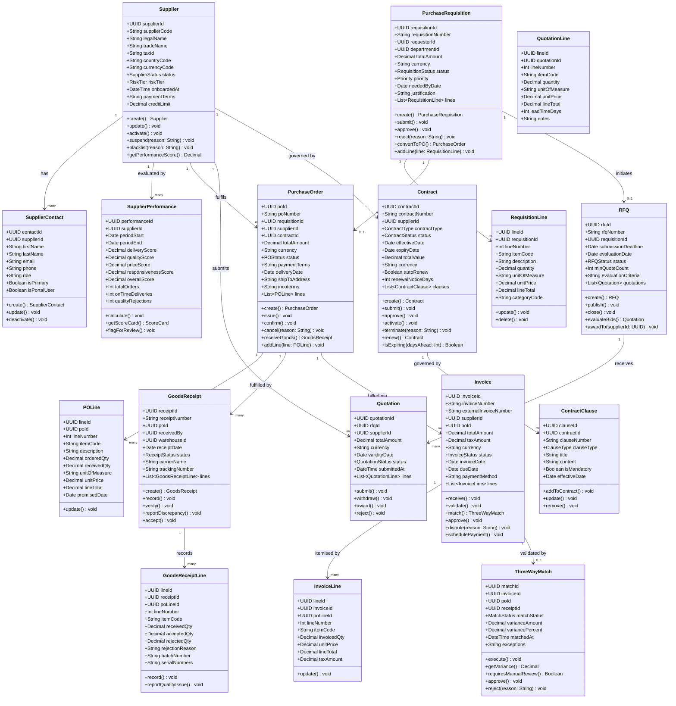

# Class Diagrams — Supply Chain Management Platform

## Overview

This document presents the formal UML class diagrams for the Supply Chain Management (SCM) Platform, rendered using Mermaid notation. The diagrams define domain entity structures, public operation contracts, and inter-aggregate relationships across the procurement and supply chain lifecycle.

The model is organized according to Domain-Driven Design (DDD) principles. Each bounded context encapsulates a cohesive cluster of domain objects with clearly defined aggregate roots, supporting entities, and value objects. Cross-domain references are maintained via UUID foreign keys to ensure loose coupling between aggregates while preserving referential integrity at the application layer.

---

## Bounded Domain Contexts

The SCM Platform is partitioned into six primary bounded contexts, each with designated aggregate roots and supporting entities.

| Bounded Context      | Aggregate Root(s)                      | Supporting Entities                     |
|----------------------|----------------------------------------|-----------------------------------------|
| Supplier Management  | Supplier                               | SupplierContact, SupplierPerformance    |
| Procurement          | PurchaseRequisition, PurchaseOrder     | RequisitionLine, POLine                 |
| Sourcing             | RFQ, Quotation                         | QuotationLine                           |
| Receiving            | GoodsReceipt                           | GoodsReceiptLine                        |
| Finance              | Invoice, ThreeWayMatch                 | InvoiceLine                             |
| Contract Management  | Contract                               | ContractClause                          |

---

## Supplier Domain

The `Supplier` aggregate root governs the full lifecycle of an external trading partner, from prospective onboarding through active engagement to potential suspension or blacklisting. The `status` field tracks the current lifecycle state, while `riskTier` classifies supplier risk exposure and is used in downstream procurement approval routing.

`SupplierContact` maintains the directory of authorised personnel associated with a supplier. The `isPrimary` flag designates the principal point of contact, and `isPortalUser` controls supplier portal access provisioning. `SupplierPerformance` captures rolling scorecard metrics per evaluation period, feeding into risk tier re-evaluation and contract renewal decision workflows.

---

## Procurement Domain

The `PurchaseRequisition` aggregate initiates the procurement cycle. It progresses through a configurable multi-tier approval workflow based on total amount and spend category before conversion to a `PurchaseOrder`. `RequisitionLine` items carry item-level detail including category classification codes used for spend analytics and approval threshold routing.

The `RFQ` aggregate supports competitive sourcing when no pre-negotiated contract exists. `PurchaseOrder` represents the legally binding procurement instrument issued to a supplier, optionally referencing a `Contract` for pre-negotiated pricing and terms. `POLine` items track ordered versus received quantities to support partial fulfilment and backorder management.

---

## Sourcing Domain

The `RFQ` aggregate manages the competitive bidding process. Upon publication, invited suppliers submit `Quotation` aggregates through the supplier portal. Each `QuotationLine` captures unit pricing, lead times, and supplier-specific notes. The `evaluateBids()` operation applies weighted scoring against the `evaluationCriteria` to identify the optimal quotation for award. Unawarded quotations transition to a `Rejected` status upon RFQ closure.

---

## Goods Receipt and Invoice Domain

The `GoodsReceipt` aggregate is created by warehouse personnel upon physical receipt of goods. It records quantities received, accepted, and rejected per line to support partial acceptance workflows. Quality rejections are flagged against the relevant `SupplierPerformance` record for scorecard deduction.

The `Invoice` aggregate enters the system via supplier portal submission or automated OCR extraction from PDF attachments. The `match()` operation initiates three-way matching against the corresponding `PurchaseOrder` and `GoodsReceipt`. The `ThreeWayMatch` aggregate records variance calculations and determines whether manual review is required based on configurable tolerance thresholds.

---

## Contract Domain

The `Contract` aggregate governs the terms and conditions applicable to procurement activities with a specific supplier. It supports multiple contract types including Framework Agreements, Blanket Purchase Orders, and Service Level Agreements. `ContractClause` entities capture individual contractual provisions, including mandatory compliance clauses and optional commercial terms. The `isExpiring()` method drives proactive renewal notification workflows configured in days prior to expiry.

---

## Complete Class Hierarchy

The following diagram presents the unified class model across all bounded contexts, with cross-domain associations annotated with explicit cardinality multiplicity.

---

## Enumeration Reference

The following enumeration types are referenced across the domain model. All enumerations are defined as sealed types within their respective bounded context packages and are versioned alongside their owning aggregate.

### SupplierStatus

`Prospective | UnderReview | Approved | Active | Suspended | Blacklisted`

### RiskTier

`Low | Medium | High | Critical`

### RequisitionStatus

`Draft | Submitted | UnderReview | Approved | Rejected | POCreated | Cancelled | Closed`

### POStatus

`Draft | Issued | Confirmed | PartiallyReceived | FullyReceived | Invoiced | Paid | Closed | Cancelled`

### RFQStatus

`Draft | Published | Closed | Evaluated | Awarded | Cancelled`

### QuotationStatus

`Draft | Submitted | UnderEvaluation | Awarded | Rejected | Withdrawn`

### ReceiptStatus

`Pending | PartiallyReceived | FullyReceived | Discrepancy | Verified`

### InvoiceStatus

`Received | UnderReview | Matched | Disputed | Approved | Paid | Cancelled`

### MatchStatus

`Pending | Matched | VarianceDetected | ManualReviewRequired | Approved | Rejected`

### ContractStatus

`Draft | UnderReview | Approved | Active | Expiring | Expired | Terminated`

### ContractType

`Framework | SpotPurchase | BlanketOrder | ServiceLevelAgreement | ConsignmentAgreement`

### ClauseType

`PaymentTerms | DeliveryTerms | WarrantyTerms | PenaltyClause | Confidentiality | Termination | ForceMajeure | IntellectualProperty`

### Priority

`Low | Medium | High | Critical`
