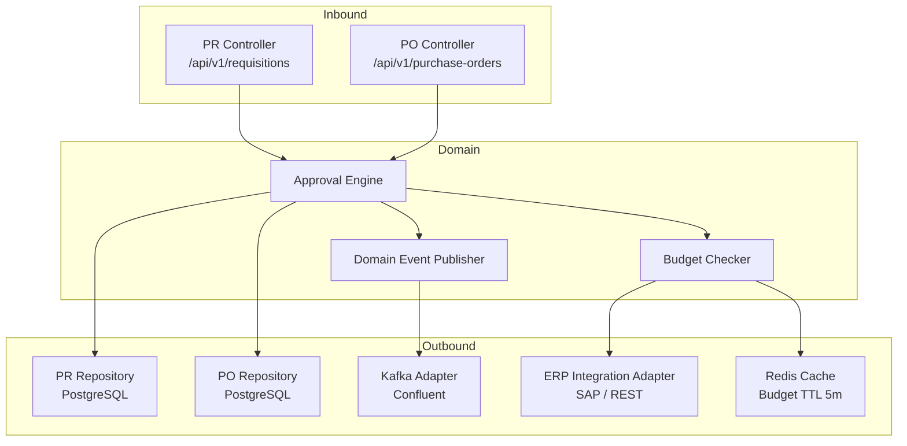
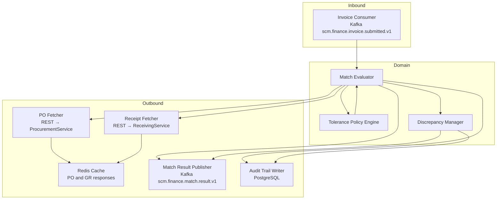
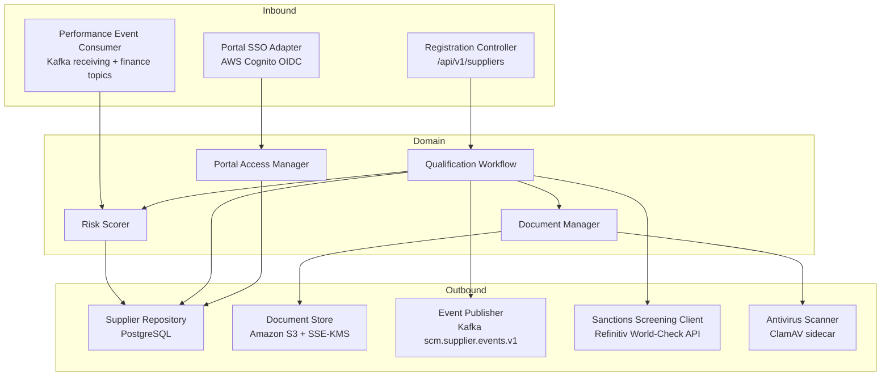
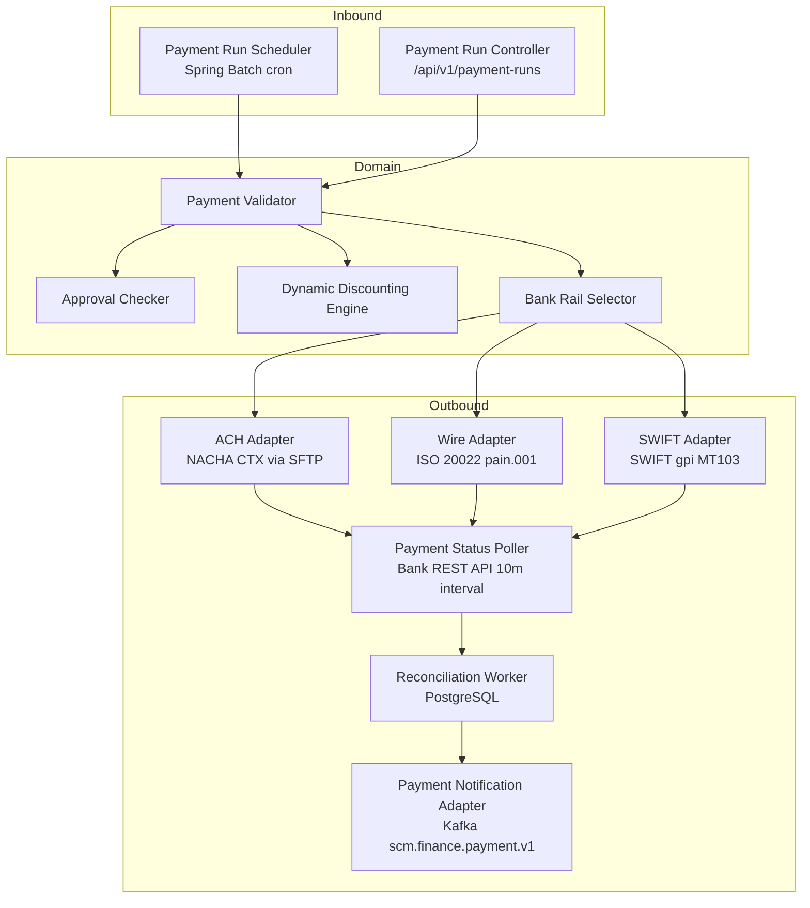
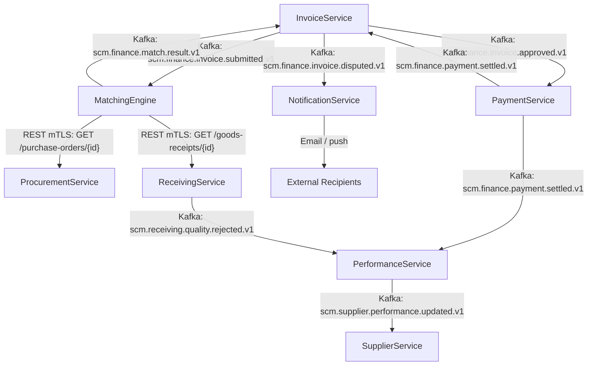

# Component Diagrams — Supply Chain Management Platform

This document presents the internal component architecture of the Supply Chain Management Platform's key microservices. Each service is designed using the hexagonal (ports-and-adapters) architectural style: inbound adapters translate external signals (HTTP requests, Kafka events) into domain commands, domain components implement all business logic without referencing infrastructure concerns, and outbound adapters abstract persistence, messaging, and third-party API calls behind interface boundaries.

Diagrams use Mermaid `graph TB` notation. Solid arrows denote compile-time dependencies (one component directly calls another). Dashed arrows denote asynchronous or event-mediated communication where the caller does not block on a response. Each microservice runs as an independent Kubernetes Deployment on Amazon EKS, backed by its own PostgreSQL schema on Amazon RDS Aurora and its own Kafka consumer group on Confluent Cloud. No service shares a database schema with another.

---

## Architectural Conventions

All microservices on the platform follow a consistent four-layer module structure enforced by ArchUnit tests in each service's CI pipeline.

| Layer | Package | Permitted Dependencies |
|---|---|---|
| Domain | `domain.*` | None (pure Java, no Spring annotations) |
| Application | `application.*` | Domain layer only |
| Infrastructure | `infrastructure.*` | Application and Domain layers |
| API | `api.*` | Application layer only |

This layering rule ensures that domain logic is independently testable with plain JUnit 5 without requiring Spring context, embedded databases, or Kafka brokers. The infrastructure layer registers Spring `@Bean` implementations of the domain's outbound port interfaces (repositories, event publishers) through constructor injection. No `@Autowired` field injection is used on any service.

**Kafka topic naming convention** — All platform topics follow the pattern `scm.<domain>.<event-name>.<version>`, for example `scm.finance.invoice.submitted.v1`. Topics are provisioned with 12 partitions (matching the maximum number of consumer pod replicas per consumer group), replication factor 3, and `min.insync.replicas=2`. Topic retention is configured per criticality: financial events are retained for 30 days, operational events for 7 days. All topics are created via Confluent Cloud Terraform provider resources managed in the platform infrastructure repository; services must not create topics at runtime.

---

## ProcurementService Internal Components

ProcurementService owns the purchase requisition and purchase order lifecycle, from initial draft creation through multi-tier approval to order issuance and confirmation. Two REST controllers accept commands from the internal web application via the API Gateway and translate request bodies into domain command objects. The Approval Engine is the central domain component: it loads the applicable approval chain configuration from a rules table keyed by spend amount bracket and spend category code, creates approval tasks, and advances the workflow as decisions arrive. Budget Checker is invoked synchronously before any requisition can be submitted for approval; it queries the ERP Integration Adapter for the current committed spend and available balance on the relevant cost centre. The Domain Event Publisher wraps the Kafka transactional producer and is called by the Approval Engine on every state-changing transition, ensuring the event log is consistent with the database record.

The ERP Integration Adapter wraps a resilience4j `CircuitBreaker` with a 50% failure threshold over a 10-call sliding window and a 30-second half-open pause. When the circuit opens, Budget Checker falls back to the most recently cached Redis figure and appends a structured `BUDGET_CACHE_FALLBACK` audit entry to the procurement database. This prevents approval workflows from blocking during ERP maintenance windows while keeping an auditable record for finance reconciliation. The Kafka Adapter uses Confluent's transactional producer with `acks=all` and `enable.idempotence=true`, publishing to the `scm.procurement.events.v1` topic with the document ID as the partition key to guarantee ordering per requisition or purchase order.

---

## MatchingEngine Internal Components

MatchingEngine is a stateless computation service that implements the three-way match algorithm: given an invoice, it retrieves the corresponding purchase order and goods receipt, evaluates all three documents against configurable tolerance policies, and publishes a structured match result. The service is entirely event-driven with no inbound REST API of its own. Invoice Consumer is a Kafka `@KafkaListener` subscribed to `scm.finance.invoice.submitted.v1`; it extracts the PO reference and GR reference from the event payload and hands them to Match Evaluator. PO Fetcher and Receipt Fetcher are Spring `RestClient` instances backed by mTLS certificates managed by cert-manager on Kubernetes, calling ProcurementService and ReceivingService respectively. Their responses are cached in Redis with a 2-minute TTL to protect upstream services from duplicate reads during invoice resubmission. Tolerance Policy Engine loads per-category variance rules from a Redis configuration store populated by an admin API; rules include quantity tolerance percentage, unit price tolerance percentage, and absolute tax variance cap.

When all three match dimensions (quantity, price, tax) pass within tolerance, Match Evaluator emits a `MatchApproved` event with a zero-discrepancy summary. When any dimension breaches tolerance, Discrepancy Manager creates a structured `DiscrepancyRecord` containing the expected value, actual value, percentage variance, absolute variance, the specific policy rule violated, and the responsible party (supplier or receiving team). This record is persisted in PostgreSQL and published as a `MatchDiscrepancy` event on the result topic. InvoiceService consumes the result and either auto-approves the invoice for payment scheduling or routes it to the finance dispute queue for manual review.

---

## SupplierService Internal Components

SupplierService manages the full supplier lifecycle: prospective registration, document collection, sanctions screening, qualification approval, active engagement, performance monitoring, and suspension or blacklisting. Registration Controller handles both procurement officer-initiated invitations (where the officer provides supplier details) and supplier self-registration flows originating from the portal. Qualification Workflow is a Spring State Machine managing the states `REGISTERED → DOCUMENTS_REQUESTED → DOCUMENTS_SUBMITTED → SCREENING → QUALIFIED → ACTIVE` with explicit rejection transitions at each stage. Risk Scorer computes a composite risk tier (LOW, MEDIUM, HIGH, CRITICAL) from a weighted model incorporating geographic risk index (OFAC/EU sanctions zone), financial stability score (D&B rating), payment behaviour history, and quality rejection rate from the last 12 months. Portal SSO Adapter integrates with AWS Cognito to provision and deprovision supplier portal user accounts on qualification approval and suspension events respectively. Performance Event Consumer subscribes to quality and payment Kafka topics and feeds normalised KPI data into the Risk Scorer for continuous tier recalculation.

Document Manager enforces a strict MIME-type allowlist (PDF, JPEG, PNG, XLSX) and streams each upload through the ClamAV sidecar container before writing to S3. Documents are stored under a path pattern `/{tenantId}/suppliers/{supplierId}/{documentType}/{uuid}.{ext}` with server-side encryption using a customer-managed KMS key. All document download requests return presigned S3 URLs with a 15-minute expiry; the URL generation event is logged to CloudTrail to maintain a complete access audit trail. The Sanctions Screening Client calls Refinitiv World-Check in synchronous mode during qualification but retries asynchronously with exponential backoff when the API is unavailable, holding the workflow in `SCREENING` state rather than failing the qualification immediately.

---

## PaymentService Internal Components

PaymentService orchestrates the final step of the procure-to-pay cycle, disbursing funds across multiple banking rails. Payment Run Scheduler is a Spring Batch `JobLauncher` configured to fire on a twice-daily schedule (06:00 and 14:00 UTC) and aggregates all invoices in `APPROVED` status into currency-grouped batches. Dynamic Discounting Engine evaluates pending early-payment discount offers before batch creation: it computes the annualised return of accepting a discount against the buyer's configured cost of capital and marks invoices as `DISCOUNT_ELIGIBLE` when the return exceeds the threshold. Payment Validator enforces a duplicate payment guard (matching on supplier ID + invoice number + amount) and verifies that the referenced invoice has not entered a dispute. Approval Checker enforces the dual-control rule: payment runs with a gross value above the configured threshold require a secondary finance officer approval before any banking instruction is dispatched. Bank Rail Selector applies routing logic based on payment currency, beneficiary country, amount tier, and urgency flag to select among ACH, Wire, and SWIFT rails.

ACH Adapter generates NACHA CTX-format flat files deposited via SFTP to the bank's secure file exchange server; the SFTP private key is stored in AWS Secrets Manager and rotated quarterly. Wire Adapter constructs ISO 20022 pain.001 CustomerCreditTransfer XML documents and posts them to the bank's Payments REST API using OAuth 2.0 client credentials. SWIFT Adapter integrates with SWIFT gpi for cross-border payments, capturing the UETR (Unique End-to-End Transaction Reference) for real-time tracker queries. Payment Status Poller runs every 10 minutes per rail, updating payment record status through `SUBMITTED → PROCESSING → SETTLED` or `REJECTED` transitions. A `SETTLED` status triggers a `PaymentSettled` Kafka event consumed by InvoiceService to mark the invoice as `PAID` and by PerformanceService to update the supplier's on-time payment metric.

---

## Cross-Service Communication Patterns

MatchingEngine acts as the orchestration hub for three-way match data, pulling reference documents from ProcurementService and ReceivingService synchronously while publishing results asynchronously. The following diagram shows all communication flows involved in the invoice-to-payment path and the quality feedback loop from receiving.

All synchronous REST calls between services use a shared Spring `RestClient` configuration with mTLS certificates issued by cert-manager and rotated automatically every 90 days. A `X-Correlation-ID` header injected by APIGateway at the ingress boundary is propagated through all downstream REST calls and embedded in Kafka message headers, enabling end-to-end distributed tracing in AWS X-Ray. Each Kafka consumer group maintains independent offset management, allowing any service to replay from a committed offset without impacting other consumers.

---

## Component Dependency Matrix

| Consumer Component | Provider Component | Dependency Type | Protocol |
|---|---|---|---|
| MatchingEngine | ProcurementService | Synchronous | REST (mTLS, internal VPC) |
| MatchingEngine | ReceivingService | Synchronous | REST (mTLS, internal VPC) |
| MatchingEngine | InvoiceService | Asynchronous | Kafka (inbound consumer) |
| InvoiceService | MatchingEngine | Asynchronous | Kafka (result consumer) |
| PaymentService | InvoiceService | Asynchronous | Kafka |
| InvoiceService | PaymentService | Asynchronous | Kafka (settlement consumer) |
| SupplierService | PerformanceService | Asynchronous | Kafka |
| NotificationService | InvoiceService | Asynchronous | Kafka |
| NotificationService | ProcurementService | Asynchronous | Kafka |
| ProcurementService | SupplierService | Synchronous | REST (mTLS) |
| PerformanceService | ReceivingService | Asynchronous | Kafka |
| PerformanceService | InvoiceService | Asynchronous | Kafka |
| ContractService | ProcurementService | Synchronous | REST (mTLS) |
| APIGateway | All services | Synchronous | REST (JWT-validated, public) |
| SupplierService | Refinitiv API | Synchronous | HTTPS (external) |
| PaymentService | Bank APIs | Synchronous | HTTPS / SFTP (external) |

---

## Resilience Patterns Applied

Each outbound adapter applies a resilience4j pattern or combination of patterns to prevent cascading failures across service boundaries.

| Pattern | Applied In | Configuration |
|---|---|---|
| Circuit Breaker | ERP Integration Adapter | 50% failure rate in 10-call window; 30s half-open pause; Redis fallback |
| Circuit Breaker | Sanctions Screening Client | 3 consecutive failures; 60s pause; workflow held in SCREENING state |
| Circuit Breaker | Bank Rail Adapters | 5 consecutive failures; 120s pause; payment run halted with alert |
| Retry | PO Fetcher, Receipt Fetcher | 3 retries; exponential backoff 200ms base with ±50ms jitter |
| Retry | Payment Status Poller | 5 retries over 50 minutes; last failure marks payment UNKNOWN for manual review |
| Bulkhead | Bank Rail Adapters | Thread pool of 10 per rail; overflow queued to max 50, then rejected |
| Rate Limiter | ERP Integration Adapter | 50 calls/second; excess calls queued with 2s timeout |
| Cache Aside | Budget Checker | Redis 5-minute TTL; background refresh 30 seconds before expiry |
| Idempotency Guard | Payment Validator | Deduplication on supplier ID + invoice number + amount over 7-day window |

---

## Observability Standards

All components emit structured JSON log entries to stdout, collected by Fluent Bit and shipped to Amazon OpenSearch. Every domain operation records a `traceId`, `spanId`, `correlationId`, `serviceId`, `componentName`, `operationName`, `durationMs`, and `outcome` field. Kafka consumer components additionally record `consumerGroup`, `topic`, `partition`, and `offset`. Prometheus metrics are exposed on `/actuator/prometheus` for scraping by the Prometheus Operator on EKS; each service defines service-level indicators covering p99 latency, error rate, and Kafka consumer lag. CloudWatch alarms on consumer lag exceeding 500 messages trigger PagerDuty alerts to the on-call Platform Reliability Engineering rotation. Distributed traces are captured end-to-end in AWS X-Ray using the Spring Cloud AWS X-Ray auto-instrumentation library.

---

## Service-to-Service Authentication

All synchronous REST calls between internal services use mutual TLS (mTLS) with X.509 certificates managed by cert-manager on Kubernetes. Each microservice has a dedicated `Certificate` resource in its namespace, signed by the platform's internal intermediate CA stored in AWS Private Certificate Authority. Certificates have a 90-day validity period with automatic renewal triggered at 75% of the validity window. The cert-manager `CertificateRequest` controller handles renewal without service restart by writing the updated certificate and key to a Kubernetes `Secret` that is mounted as a volume into the pod; the Spring `RestClient` bean is configured with a `SSLContext` that reads from this mounted path and reloads on a 60-second schedule.

Kafka producers and consumers authenticate to the Confluent Cloud broker using SASL/OAUTHBEARER with AWS IAM-backed identity. Each service's IAM role is bound to its Kubernetes service account via IRSA (IAM Roles for Service Accounts). The MSK IAM library generates short-lived tokens for each broker connection using the pod's IAM credentials, eliminating long-lived Kafka API keys from the service configuration.

The API Gateway validates inbound JWTs from the AWS Cognito user pool using the JWKS endpoint. The `kid` (key ID) claim in the JWT header is used to select the correct public key from the JWKS response for signature verification. The JWKS response is cached by the gateway for 10 minutes to avoid latency on every request; key rotation is supported through the standard Cognito automatic rotation mechanism without requiring gateway configuration changes.

---

## Configuration Management

All service configuration is externalised from the Docker image and managed through two mechanisms depending on sensitivity. Non-sensitive configuration (feature flags, tolerance thresholds, pagination limits, Kafka topic names, partner API base URLs) is stored in AWS AppConfig and fetched at startup by a Spring `ApplicationContextInitializer`. AppConfig allows configuration updates to be deployed and rolled back without restarting pods; services poll for configuration changes every 60 seconds using the AppConfig StartConfigurationSession API and apply changes to the in-memory Spring `Environment` via `@RefreshScope` beans.

Sensitive configuration (database passwords, Kafka credentials, bank API keys, SFTP private keys, encryption keys) is stored in AWS Secrets Manager. A custom `SecretManagerPropertySourceLocator` bean fetches secrets at application startup and makes them available as Spring properties. A `@Scheduled` background task refreshes all secrets every 6 hours and invokes `@RefreshScope` on the affected beans, enabling secret rotation without pod restarts. The `SecretManagerPropertySourceLocator` caches the last known secret value in memory and uses it as a fallback if Secrets Manager is momentarily unavailable, logging a `WARN`-level entry to indicate degraded secret freshness.

Environment promotion (dev → staging → production) uses the same application image with different AppConfig environment IDs and Secrets Manager path prefixes (`/scm/dev/`, `/scm/staging/`, `/scm/prod/`). Kubernetes `ConfigMap` objects hold only the AppConfig application ID and environment name; all actual configuration values live outside the cluster. This architecture prevents configuration drift between environments and supports GitOps deployment pipelines where environment-specific values are managed outside the application repository.

---

## Health and Readiness Checks

Every service exposes Spring Boot Actuator health endpoints consumed by the Kubernetes liveness and readiness probes. The readiness probe at `/actuator/health/readiness` returns `UP` only when all critical dependencies (PostgreSQL, Kafka broker reachability, Redis) are healthy. The liveness probe at `/actuator/health/liveness` returns `UP` as long as the JVM is functional, even if downstream dependencies are degraded; this prevents unnecessary pod restarts when a dependency is transiently unavailable. Custom `HealthIndicator` beans are registered for each outbound adapter: the Kafka adapter indicator checks that the producer can fetch cluster metadata, the JPA indicator verifies the connection pool has at least one available connection, and the Redis indicator checks the `PING` response from the cache cluster.

A dedicated `/actuator/health/readiness` check for the ERP Integration Adapter (ProcurementService) is intentionally excluded from the readiness gate: ERP connectivity is non-critical at startup because the Redis cache fallback covers the startup window. Including it in the readiness gate would prevent the service from becoming ready during planned ERP maintenance windows. The ERP health indicator is exposed under a separate `/actuator/health/erp` path for observability dashboards without gating readiness on it.

PaymentService has an additional pre-execution health gate enforced at the application layer rather than by Kubernetes: before dispatching any banking instructions, `PaymentRunCommandService` checks that all three banking adapter health indicators (ACH, Wire, SWIFT) are `UP`. If any rail is degraded, payment instructions destined for that rail are held in `PENDING_RAIL_AVAILABILITY` status rather than failing the run. A background `@Scheduled` task retries pending instructions every 15 minutes, allowing partial payment runs to self-heal when a banking adapter recovers without requiring a finance officer to manually re-execute the run.
