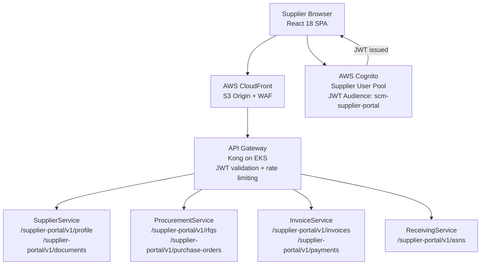
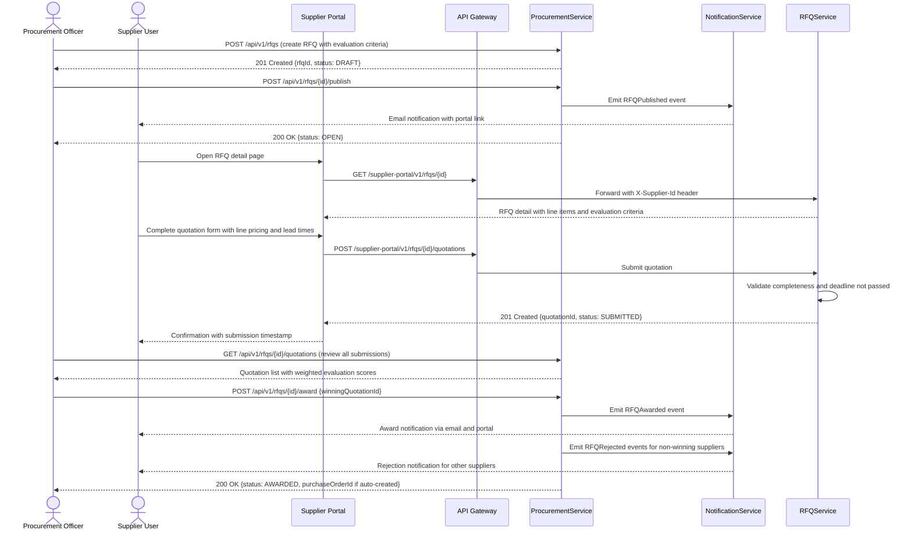
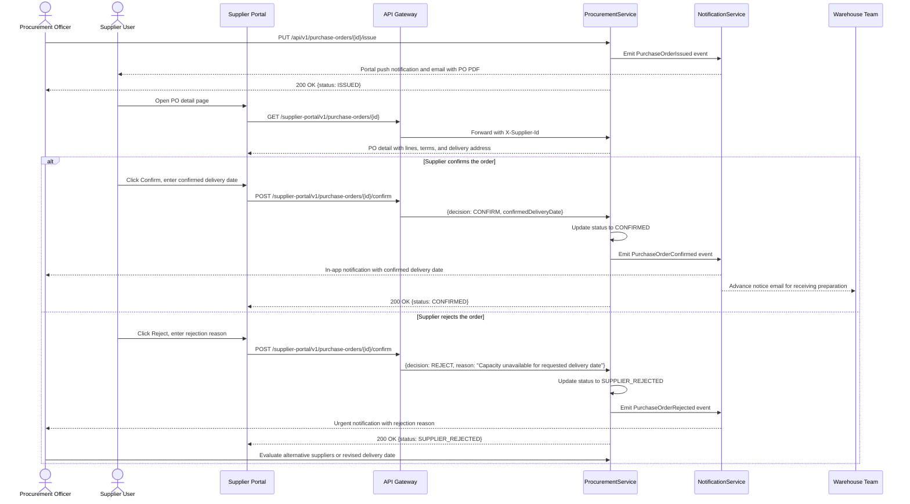
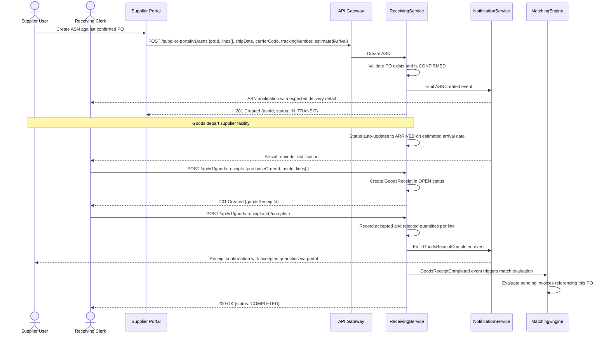
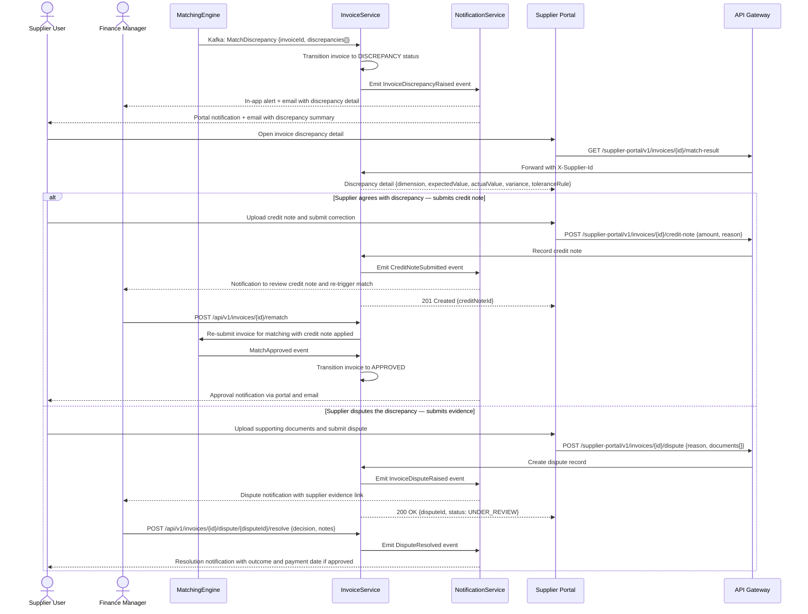

# Procurement and Supplier Collaboration — Supply Chain Management Platform

This document details the design of the Supplier Portal collaboration layer and the end-to-end procurement collaboration workflows that span both buyer-side services and the supplier-facing portal. Supplier collaboration is a first-class capability of the platform: suppliers interact directly with procurement workflows through a dedicated portal rather than through email or manual EDI file exchange, reducing cycle times and improving data accuracy across the procure-to-pay lifecycle.

---

## Supplier Portal Architecture

The Supplier Portal is a React 18 single-page application served via AWS CloudFront with an S3 origin. It communicates exclusively with a dedicated API namespace `/supplier-portal/v1` on the API Gateway, separate from the internal procurement API namespace `/api/v1`. This separation allows the portal API to apply supplier-specific rate limiting, IP allowlisting for EDI-integrated suppliers, and a distinct JWT audience claim (`scm-supplier-portal`), preventing supplier tokens from being used against internal endpoints.

The portal back-end is not a separate microservice: the `/supplier-portal/v1` namespace is implemented as additional Spring MVC controllers within the relevant domain services (SupplierService, ProcurementService, ReceivingService, InvoiceService) but registered behind the gateway under a distinct path prefix. These controllers apply the `SUPPLIER_USER` role check at method level and enforce row-level filtering so that a supplier can only see records linked to their own `supplierId` JWT claim.

The API Gateway validates the JWT signature and expiry, rejects any token with audience `scm-platform` (internal), and forwards validated claims as `X-Supplier-Id`, `X-User-Id`, and `X-Roles` headers to downstream services. All portal API responses include CORS headers permitting only the registered portal origin domain. The CloudFront distribution is protected by AWS WAF with rate-based rules (200 requests per 5-minute window per IP) and managed rule groups for OWASP Top 10 coverage.

---

## Supplier Self-Service Capabilities

The portal provides the following self-service capabilities. Each capability maps to one or more supplier-portal API endpoints and is conditionally available based on the supplier's lifecycle status and the buyer's portal feature configuration.

| Capability | Portal Section | Required Supplier Status | Description |
|---|---|---|---|
| Profile management | My Profile | Any | Update trading address, contact details, bank account, and tax certificate |
| Document upload | Documents | REGISTERED and above | Upload qualification documents (financials, insurance, certifications) |
| Bid submission | RFQ Inbox | QUALIFIED, ACTIVE | Submit quotation responses to open RFQs with line pricing and lead times |
| PO acknowledgement | Orders | ACTIVE | Confirm or reject issued purchase orders with reasons and confirmed delivery dates |
| ASN creation | Shipments | ACTIVE | Create Advance Shipment Notices against confirmed POs with item and logistics details |
| Invoice submission | Invoices | ACTIVE | Submit invoices referencing a PO; portal pre-validates line totals before submission |
| Dispute management | Invoices | ACTIVE | View match discrepancy details and submit supporting evidence for disputed invoices |
| Payment status | Payments | ACTIVE | View approved invoices, scheduled payment dates, early-payment discount offers, and settled payment confirmations |
| Forecast visibility | Forecast | ACTIVE (if enabled by buyer) | View buyer's 12-week rolling demand signal and submit supply confirmations |
| Performance scorecard | My Performance | ACTIVE | View current scorecard, period-over-period trend, and buyer feedback notes |

Suppliers in `SUSPENDED` status retain read-only access to view existing orders and invoices but cannot submit new documents, invoices, or quotation responses. Suppliers in `BLACKLISTED` status have their Cognito accounts immediately deactivated and cannot log in.

---

## RFQ Response Workflow

When a buyer publishes an RFQ, all invited suppliers receive a portal notification and can submit a competitive quotation before the submission deadline. The buyer evaluates all quotations using a weighted scoring model and awards the RFQ to the best-value supplier.

The quotation submission endpoint enforces that the submission deadline has not passed using the server-side `submissionDeadline` timestamp from the RFQ record; it does not trust any client-provided timestamp. Suppliers can update a submitted quotation any number of times before the deadline; each update creates a new quotation version while preserving the full version history. The buyer sees only the latest version per supplier in the evaluation view.

---

## Order Confirmation Workflow

After a buyer issues a purchase order, the supplier must formally acknowledge or reject it before production or fulfilment begins. This acknowledgement loop is critical for establishing a confirmed delivery commitment and triggering warehouse receiving preparation.

A `SUPPLIER_REJECTED` status on a purchase order raises an alert in the buyer's dashboard and creates an action item for the procurement officer to resolve. Automated escalation rules can be configured to notify the procurement manager if no action is taken within 24 hours of a rejection. The order confirmation SLA (time from `ISSUED` to `CONFIRMED`) is tracked as a supplier performance KPI visible on the scorecard.

---

## ASN Creation and Delivery Workflow

An Advance Shipment Notice (ASN) is created by the supplier before goods leave their facility, giving the receiving team advance visibility into what is being shipped, when it will arrive, and in what packaging configuration. This enables the warehouse to plan receiving resources and pre-stage storage locations.

The ASN creation endpoint validates that the shipped quantities do not exceed the unshipped balance on each PO line, preventing accidental over-shipment notifications. Partial shipments are supported: a single PO may have multiple ASNs over time, each covering a subset of ordered quantities. The receiving team's expected delivery dashboard aggregates all `IN_TRANSIT` ASNs and sorts them by estimated arrival date, with overdue ASNs highlighted.

---

## Supplier Scorecard and Feedback Loop

Performance data from ReceivingService (quality and on-time delivery) and InvoiceService (invoice accuracy and payment terms compliance) flows automatically into PerformanceService, which maintains rolling KPI metrics per supplier per calendar quarter. The scorecard is visible to suppliers in real time on the portal and emailed as a formal PDF report at the end of each quarter.

**Scorecard KPIs and weights:**

| KPI | Data Source | Measurement | Weight |
|---|---|---|---|
| On-Time Delivery Rate | ReceivingService GR completion timestamps | % of deliveries on or before confirmed date | 30% |
| Quality Acceptance Rate | ReceivingService GR accepted vs rejected quantities | % of received items accepted | 25% |
| Invoice Accuracy Rate | MatchingEngine match results | % of invoices passing three-way match first time | 20% |
| Order Confirmation Time | ProcurementService PO confirmation timestamps | Average hours from ISSUED to CONFIRMED | 15% |
| Responsiveness | ProcurementService RFQ response rate and timing | % of RFQs responded to within deadline | 10% |

Composite score is the weighted sum of each normalised KPI. Tier mapping: EXCELLENT (85–100), GOOD (70–84), NEEDS IMPROVEMENT (50–69), CRITICAL (below 50). A tier downgrade triggers a `SupplierPerformanceTierChanged` event and creates an improvement plan action item for the contract manager. The improvement plan workflow tracks agreed corrective actions and tracks KPI trend over the following two quarters to assess recovery.

Suppliers can view their scorecard trend from the portal's My Performance section, drill down into the individual events that contributed to each KPI, and submit a written response to buyer feedback notes. Buyer feedback notes are entered by procurement officers or contract managers and are visible on the supplier's portal profile after a 5-business-day review period.

---

## Supplier Portal Security

**JWT audience separation** — Supplier tokens carry audience claim `scm-supplier-portal`. The API Gateway rejects any request to a `/supplier-portal/v1` endpoint where the token audience is `scm-platform`, and vice versa, preventing internal service tokens from being used at the portal boundary.

**Document access ACLs** — Every document in the S3 document store is tagged with `ownerId` (the supplier ID) and `documentType`. SupplierService generates presigned URLs only after verifying that the requesting JWT's `supplierId` claim matches the document's `ownerId` tag. Cross-supplier document access is architecturally impossible through the portal API.

**Session security** — Cognito issues short-lived access tokens (15-minute expiry) and longer-lived refresh tokens (24-hour expiry, single-use rotation). The React SPA stores tokens only in memory (never in localStorage or cookies accessible to JavaScript) and uses the Cognito hosted UI for the authentication flow to keep credentials entirely off the portal's own origin.

**IP allowlisting for EDI integrations** — Suppliers using machine-to-machine EDI integration (rather than the browser portal) must register their outbound IP ranges via the platform ADMIN interface. API Gateway enforces an IP allowlist at the route level for EDI-specific endpoints (`/supplier-portal/v1/edi/*`). EDI service accounts use OAuth 2.0 client credentials flow with a dedicated Cognito app client; no user-interactive login is involved.

**Rate limiting** — API Gateway applies per-supplier-ID rate limits of 100 requests per minute and 5,000 requests per day to prevent both accidental runaway integration loops and deliberate abuse. Limits are configurable per supplier via the ADMIN interface for high-volume EDI integrators with legitimate high request rates.

---

## EDI Integration Design

Suppliers who cannot use the browser portal can integrate via structured EDI file exchange. The platform supports X12 EDI transaction sets over HTTPS (REST-based file submission) and SFTP. EDI files are parsed and validated by a dedicated `EDIAdapterService` sidecar that translates X12 interchange envelopes to internal JSON domain events before forwarding to the relevant microservice.

**X12 Transaction Set Mapping:**

| X12 Transaction Set | Direction | Internal Mapping | Trigger |
|---|---|---|---|
| 850 Purchase Order | Outbound (buyer → supplier) | `PurchaseOrderIssued` event | PO issued via portal or API |
| 855 PO Acknowledgement | Inbound (supplier → buyer) | `POST /supplier-portal/v1/purchase-orders/{id}/confirm` | Supplier EDI system sends 855 |
| 856 Ship Notice / ASN | Inbound (supplier → buyer) | `POST /supplier-portal/v1/asns` | Supplier EDI system sends 856 |
| 810 Invoice | Inbound (supplier → buyer) | `POST /supplier-portal/v1/invoices` | Supplier EDI system sends 810 |
| 820 Payment Order | Outbound (buyer → supplier) | `PaymentSettled` event | Payment confirmed settled |
| 860 PO Change Request | Outbound (buyer → supplier) | `ChangeOrderIssued` event | Change order issued via API |

**850 to PO field mapping (key fields):**

| X12 Element | X12 Segment | Internal Field | Notes |
|---|---|---|---|
| Purchase Order Number | BEG03 | `purchaseOrderNumber` | Platform-generated PO number |
| PO Date | BEG05 | `issueDate` | Format YYYYMMDD |
| Vendor ID | N104 (N1*SE) | `supplierId` | Platform supplier UUID |
| Line Item Number | PO101 | `lines[].lineNumber` | Sequential 1-based |
| Quantity Ordered | PO102 | `lines[].quantity` | |
| Unit of Measure | PO103 | `lines[].unitOfMeasure` | X12 UOM code mapped to ISO |
| Unit Price | PO104 | `lines[].agreedUnitPrice` | |
| Item Description | PID05 | `lines[].description` | |

EDI files submitted via SFTP are polled every 5 minutes by the `EDIAdapterService`. Parse errors and validation failures are returned to the supplier as a 997 Functional Acknowledgement with error codes identifying the specific segment and element at fault. Successfully parsed transactions receive a 997 acceptance acknowledgement.

---

## Forecast Collaboration Design

For strategic suppliers with long lead times, the platform supports a 12-week rolling demand signal that buyers share with suppliers to enable supply planning. This feature is enabled per supplier contract and managed through the `/supplier-portal/v1/forecasts` namespace.

Each Sunday at 02:00 UTC, a scheduled job in ProcurementService generates a `DemandSignal` record per active forecast-collaboration supplier, aggregating open PO commitments, approved requisitions not yet converted, and historical consumption trends from the ERP integration. The signal is published as a `DemandSignalPublished` event consumed by NotificationService, which emails the supplier's designated forecast contact and marks the signal as visible on the portal.

Suppliers review the signal in the portal and submit a `ForecastConfirmation` indicating their confirmed supply capacity per week. Where capacity is below the demand signal, suppliers enter a `constrainedQuantity` with a reason code (MATERIAL_SHORTAGE, CAPACITY_CONSTRAINED, LEAD_TIME_EXTENDED). A variance record is created for each week where confirmed supply is below the demand signal. Procurement officers see a consolidated variance dashboard highlighting supply gaps requiring alternative sourcing or demand deferral decisions.

---

## Three-Way Match Discrepancy Notification Workflow

When MatchingEngine identifies a variance that exceeds tolerance, both the buyer's finance team and the supplier are notified through separate notification flows. The supplier receives a structured discrepancy notice via the portal and email, with enough detail to understand the variance and respond with supporting evidence.

All discrepancy and dispute records are retained for 7 years in the `scm_audit` schema to satisfy statutory invoice audit requirements. Supplier responses to discrepancies (credit notes, dispute evidence) are stored in S3 under the supplier's document namespace and linked to the invoice record. The finance team's dispute resolution decision is recorded with the resolver's identity, timestamp, and decision rationale, forming a complete chain of custody for every disputed invoice.
