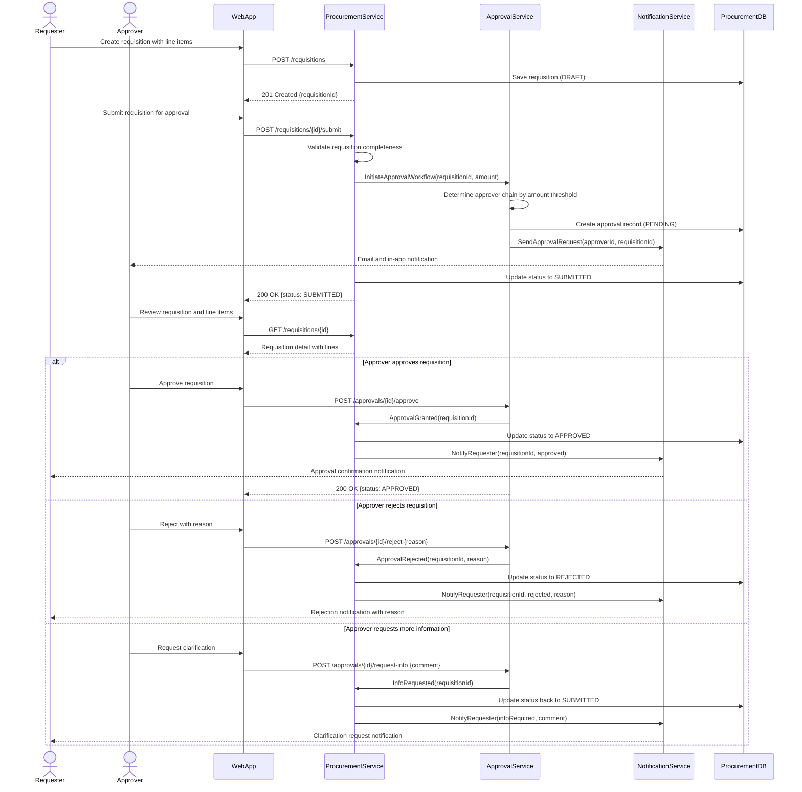
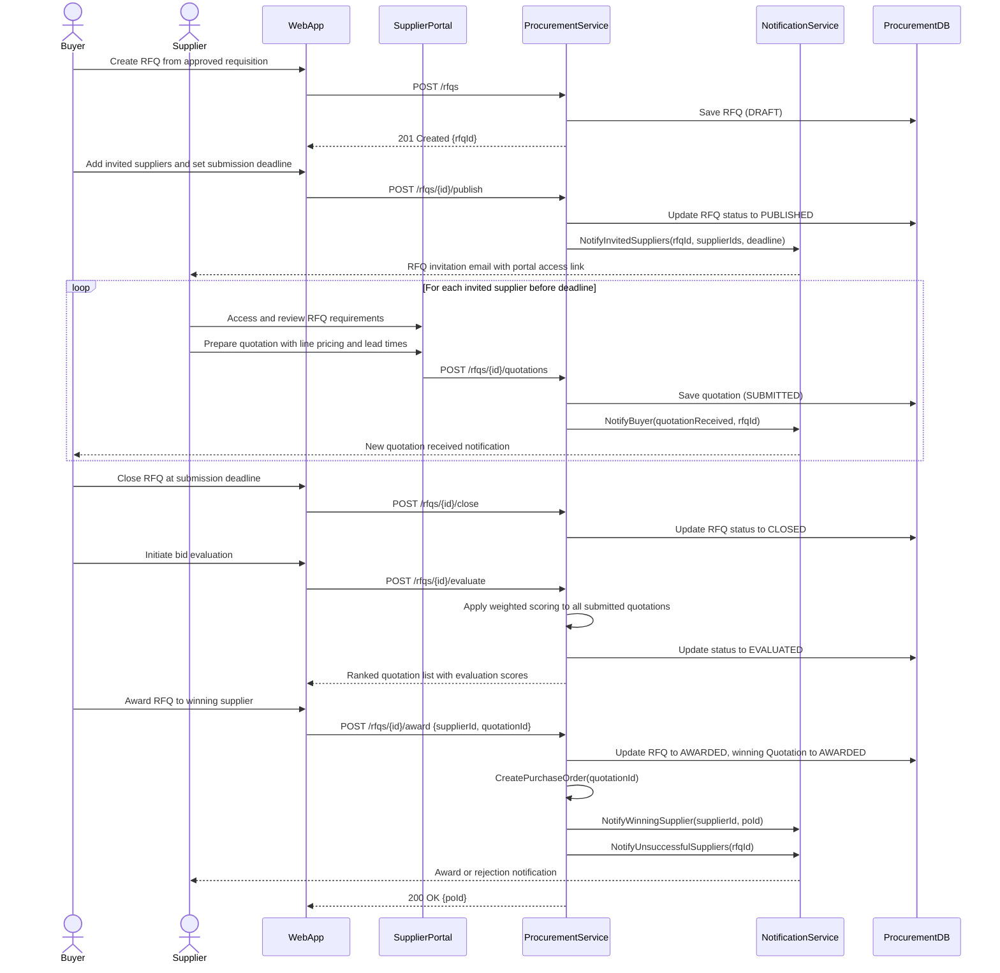
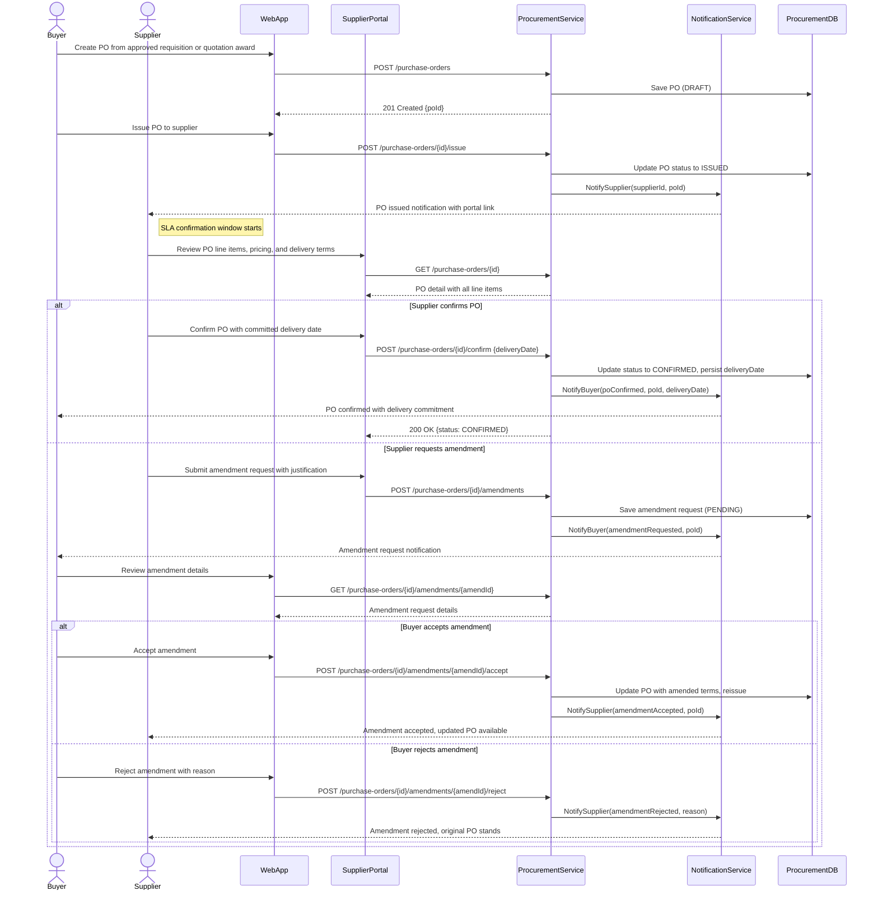
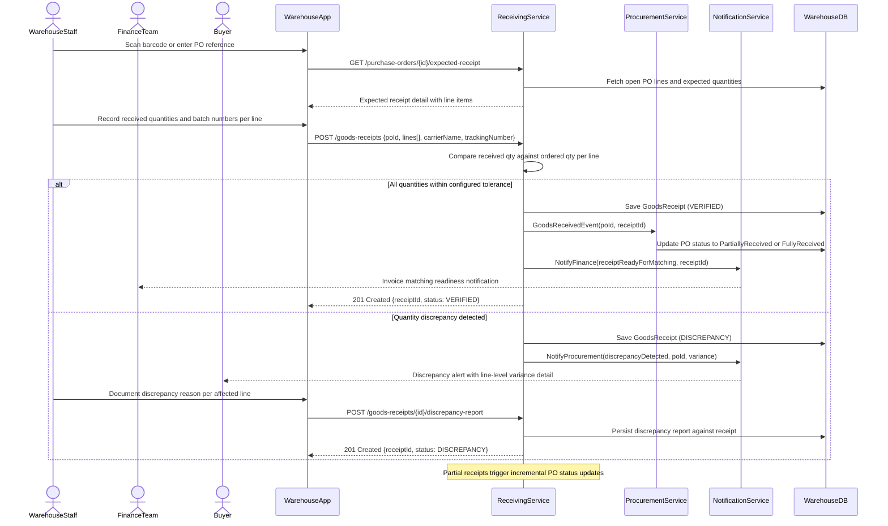
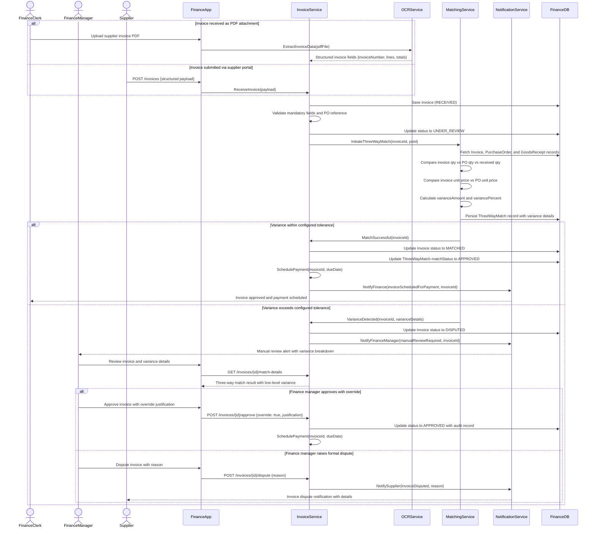
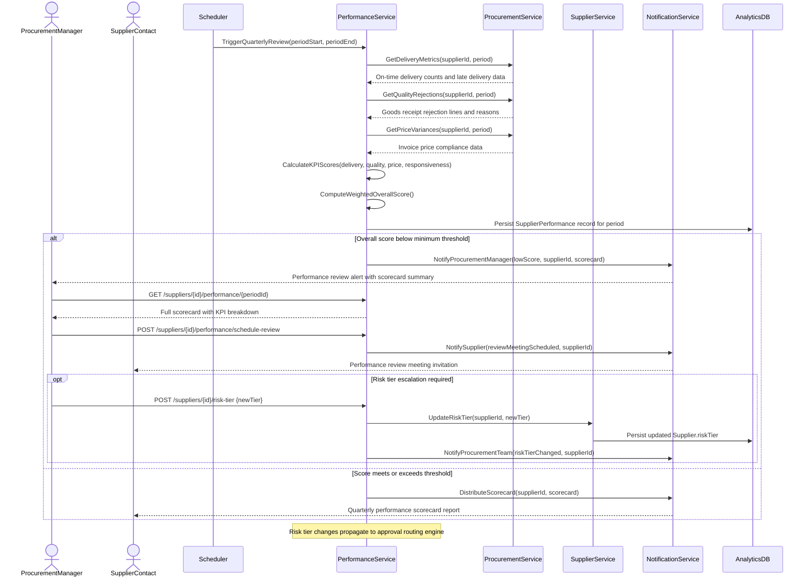

# Sequence Diagrams — Supply Chain Management Platform

## Overview

This document presents the interaction sequence diagrams for the Supply Chain Management (SCM) Platform's key operational workflows. Each diagram captures the message exchange between actors, application services, and infrastructure components across the procurement and supply chain lifecycle.

The diagrams follow UML sequenceDiagram notation rendered via Mermaid, incorporating synchronous requests (`->>`), asynchronous responses (`-->>`), conditional branches (`alt/else`), iteration (`loop`), optional blocks (`opt`), and contextual notes. Service boundaries reflect the platform's microservices decomposition, with each service owning its domain data store.

---

## Purchase Requisition Creation and Approval

The purchase requisition workflow initiates the procurement cycle. A requester drafts a requisition with line items and submits it for multi-tier approval. The `ApprovalService` determines the approval chain based on configured amount thresholds—manager approval below $10,000, director approval up to $50,000, and CFO approval above that level. Each tier receives real-time notifications and must act within configured SLA windows before automatic escalation.

---

## RFQ Process and Supplier Bidding

The RFQ (Request for Quotation) process supports competitive sourcing when no pre-negotiated contract is in place. The buyer publishes an RFQ with itemised requirements and a submission deadline. Invited suppliers receive portal notifications and submit structured quotations. Upon deadline closure, the procurement team evaluates bids using weighted scoring criteria and awards the contract to the winning supplier, triggering automatic PO creation.

---

## Purchase Order Creation and Confirmation

Following requisition approval or RFQ award, a Purchase Order is created and formally issued to the supplier. The supplier reviews the PO via the supplier portal and either confirms with a committed delivery date or requests an amendment. Confirmation creates a binding fulfilment commitment that triggers downstream receiving and scheduling workflows. Amendment requests are routed back to the buyer for review before the PO is re-issued.

---

## Goods Receipt Recording

Upon physical arrival of goods at the warehouse, receiving staff record actual quantities delivered against the open PO. The `ReceivingService` validates receipt quantities against ordered quantities and applies configurable tolerance thresholds. Discrepancies trigger notification workflows to procurement and quality teams, while accepted receipts emit domain events to signal invoice matching readiness to the finance domain.

---

## Three-Way Match and Invoice Processing

Invoice processing begins upon receipt of a supplier invoice, either via structured portal submission or PDF upload with OCR extraction. The `MatchingService` executes a three-way match across the invoice, purchase order, and goods receipt. Variances within configured tolerance thresholds result in automatic approval and payment scheduling. Variances exceeding tolerance route the invoice to the finance manager for manual review and resolution.

---

## Supplier Performance Review

Supplier performance reviews are triggered quarterly by a scheduled job. The `PerformanceService` collects KPI data from the procurement and receiving domains, computes weighted scores per dimension, and generates a scorecard. Suppliers scoring below the configured threshold are flagged for a formal review meeting with the procurement manager. Persistent underperformance may result in a risk tier escalation, which affects downstream approval routing thresholds.

