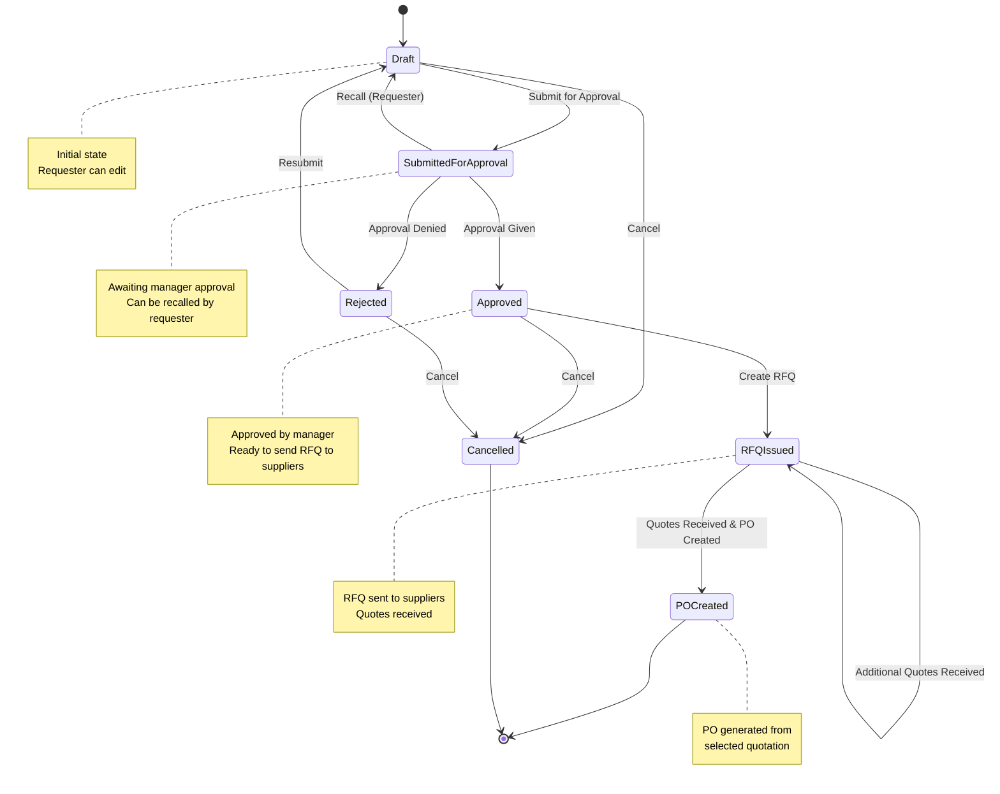
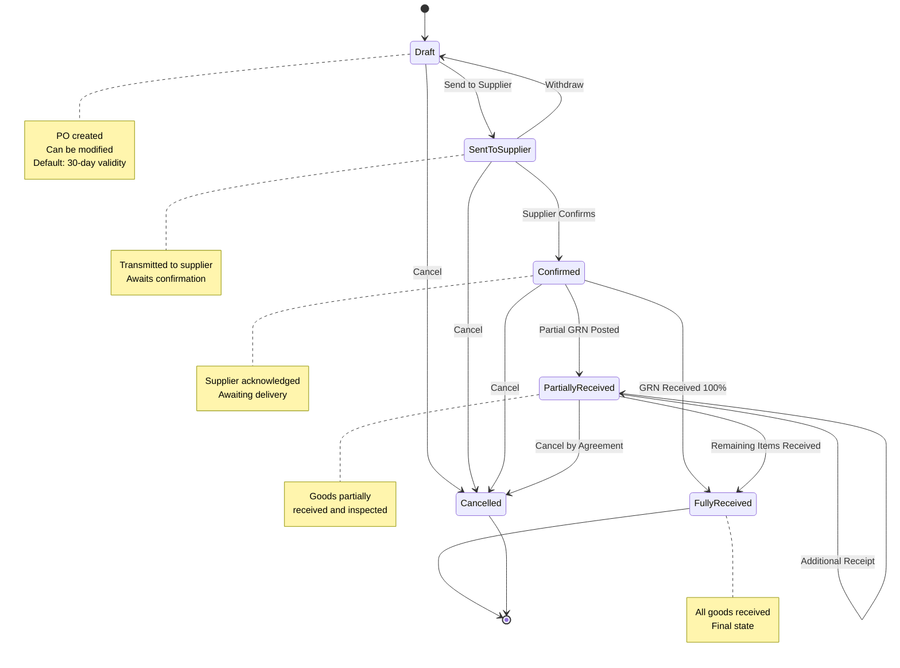
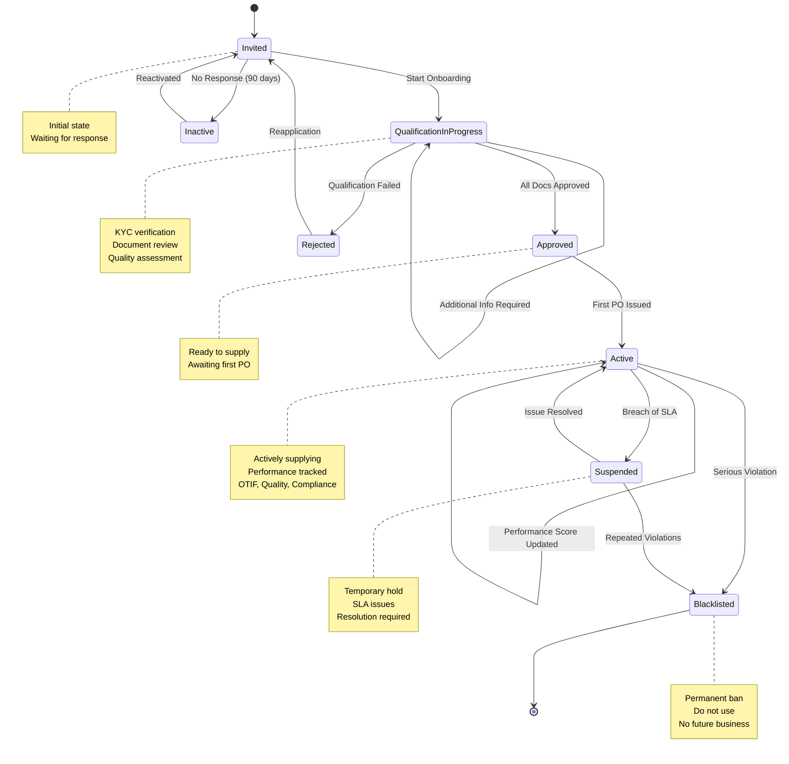
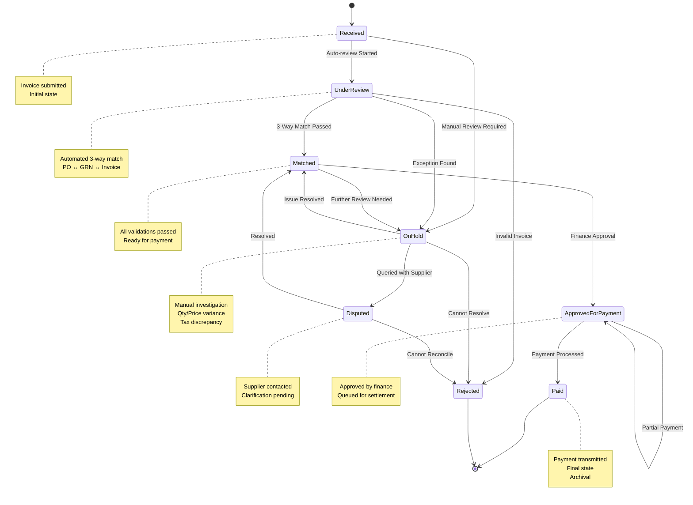

# Supply Chain Management Platform - State Machine Diagrams

## Purchase Requisition State Machine

## Purchase Order State Machine

## Supplier State Machine

## Invoice State Machine

## Integration Notes

- All state transitions are logged with timestamp, user, reason
- State change events published to Kafka for downstream processing
- Timeouts implemented:
  - SubmittedForApproval: 5 business days (escalate if no approval)
  - RFQIssued: 10 days (auto-close if no quotes)
  - SentToSupplier: 30 days (auto-cancel if no confirmation)
  - OnHold (Invoice): 7 days (escalate to senior finance officer)
  - ApprovedForPayment: 3 days (process payment if still pending)

