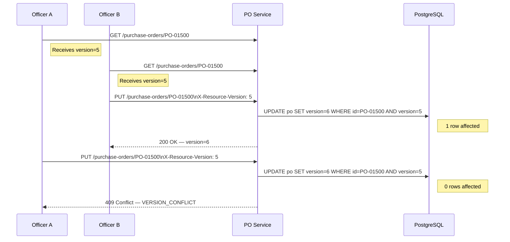

# API and UI Edge Cases — Supply Chain Management Platform

The API layer and procurement portal UI are the primary integration surfaces for buyers, suppliers, and ERP systems. Because the platform orchestrates multi-step financial workflows — purchase order approval, invoice matching, contract management, and supplier bid events — the combination of distributed state, concurrent users, long-running sessions, and external system callbacks produces a distinct class of edge cases beyond simple CRUD failures. This document catalogues twelve high-impact edge cases at the API and UI boundary, with concrete system behaviours, error handling strategies, and resolution paths.

---

## Edge Cases

### EC-API-001: Duplicate Idempotency Key — Same Key, Different Payload

**Severity:** P1 — High  
**Domain:** API Layer — Idempotency  
**Trigger:** A client reuses a previously consumed `Idempotency-Key` UUID with a materially different request payload

#### Description

A procurement officer submits PO A with `Idempotency-Key: 7f3e1b2a-...`. The request succeeds and the PO is created. The officer then attempts to create a different PO B, but inadvertently reuses the same idempotency key (a common mistake when copying request templates from Postman or Insomnia). The payload differs — different supplier, amount, and line items — but the key is identical.

#### System Behaviour

The `IdempotencyService` stores a SHA-256 hash of the original request body alongside the cached response in Redis (`idempotency:{key}`, 24-hour TTL). On the second request:
1. The service retrieves the stored hash for the key.
2. It computes the hash of the incoming request body.
3. If hashes differ, the request is rejected — the stored response is **not** returned, because this is not a safe retry; it is a distinct operation using a colliding key.
4. The key entry is marked `PAYLOAD_MISMATCH` and retained in audit storage.

#### Error Handling

```json
{
  "error": "IDEMPOTENCY_KEY_CONFLICT",
  "message": "This Idempotency-Key was previously used for a different payload. Generate a new UUID for each distinct request.",
  "existingResourceId": "po-0019234",
  "hint": "Retrieve the existing resource via GET /purchase-orders/po-0019234 or generate a fresh UUID."
}
```

The key is never reusable for a different payload even after TTL expiry — original key records are archived (not deleted) to the `idempotency_audit_log` table for forensic purposes.

#### Resolution Path

1. The client SDK auto-generates a UUID per distinct form submission, stored in `sessionStorage` keyed by form type and session ID, and never allows cross-form key sharing.
2. If the mismatch was unintentional, the UI surfaces a link to the existing resource so the user can decide whether to open it or submit a genuinely new PO with a new key.
3. Alert the security team if a single IP submits more than 5 key-conflict errors within 60 minutes — this pattern resembles idempotency-probing attacks.

---

### EC-API-002: JWT Expiry Mid-Long-Running Approval Form

**Severity:** P1 — High  
**Domain:** API Layer — Authentication  
**Trigger:** A user's JWT access token expires while they are partway through a multi-step procurement request (PR) approval form

#### Description

A senior buyer opens a procurement request requiring five sequential approval steps. The review takes 45 minutes — exceeding the 30-minute access token lifetime. When the user submits step 4, the API returns `HTTP 401 Unauthorized`. Without graceful handling, all entered data on the active step is lost and the user must log in and navigate back to the form.

#### System Behaviour

The API Gateway validates `Authorization: Bearer` before forwarding requests. On token expiry:
1. The gateway returns `HTTP 401` with `WWW-Authenticate: Bearer error="invalid_token"`.
2. The frontend intercepts all 401 responses via an Axios response interceptor registered at app startup.
3. The interceptor calls `POST /auth/token/refresh` using the `refresh_token` httpOnly Secure SameSite=Strict cookie.
4. If the refresh succeeds, the interceptor retries the original request transparently with the new access token.
5. If the refresh token is also expired (session > 8 hours), the interceptor serialises the full form state to `sessionStorage` keyed by `pr_draft_{pr_id}`, then redirects to `/login?reason=session_expired&return_to={encoded_path}`.
6. Post-login, the UI detects the `pr_draft_*` key and restores form state before the user resumes.

#### Error Handling

Concurrent 401 responses from multiple in-flight requests are de-duplicated: only one refresh call is issued; all other interceptors queue behind a shared promise and retry once the single refresh resolves. This prevents refresh token exhaustion from parallel tab refreshes.

#### Resolution Path

1. Form state is never lost due to token expiry. A banner is displayed after session restoration: "Your session expired — your progress has been saved and restored."
2. Access token lifetime: 30 minutes for standard roles; 15 minutes for users holding financial approval roles (reduced window for stale-claim risk).
3. Refresh token lifetime: 8 hours with sliding-window renewal on each successful access token issuance.

---

### EC-API-003: Concurrent PO Edit — Optimistic Locking Conflict

**Severity:** P1 — High  
**Domain:** API Layer — Concurrency  
**Trigger:** Two procurement officers open the same draft PO simultaneously and both attempt to save changes

#### Description

Officer A and Officer B both open draft PO-2024-01500. Officer A modifies the delivery date; Officer B modifies a line item quantity. Officer B saves first (version 5 → 6). Officer A saves at version 5 — without locking, their save silently overwrites Officer B's committed changes.

#### System Behaviour



#### Error Handling

```json
{
  "error": "VERSION_CONFLICT",
  "message": "This PO was modified by another user while you were editing.",
  "currentVersion": 6,
  "yourVersion": 5,
  "lastModifiedBy": "officer.b@acme.com",
  "lastModifiedAt": "2024-11-15T14:03:42Z",
  "conflictingChanges": ["lines[1].quantity", "lines[2].quantity"]
}
```

The UI renders a diff panel: Officer A's proposed changes on the left, Officer B's committed changes on the right. Officer A chooses: merge manually, discard their changes, or force-overwrite (requires explicit confirmation; generates an audit log entry with both versions).

#### Resolution Path

1. All `PUT` and `PATCH` endpoints require `X-Resource-Version`; requests missing this header are rejected with `HTTP 428 Precondition Required`.
2. The `purchase_orders` table has a `version BIGINT NOT NULL` column; all updates use `WHERE id = :id AND version = :expectedVersion` at the application layer.
3. WebSocket presence indicators show co-editors ("Officer B is also editing this PO") to reduce the collision rate proactively.
4. Presence state is stored in Redis (`po_presence:{po_id}`, TTL 90 seconds, refreshed on cursor activity).

---

### EC-API-004: Rate Limit Breach — Supplier Portal Bid Submission

**Severity:** P2 — Medium  
**Domain:** API Layer — Rate Limiting  
**Trigger:** A supplier's misconfigured ERP integration hammers `POST /rfqs/{id}/bids` at 120 req/min against a limit of 20 req/min

#### Description

A supplier's ERP retry loop submits bid updates far beyond the allowed rate during an active RFQ bidding event. The excess load degrades latency for all other suppliers submitting legitimate bids.

#### System Behaviour

Rate limiting is enforced at two layers:
- **API Gateway:** Token bucket, 20 req/min per `supplier_id`. Requests above the limit receive `HTTP 429` with a `Retry-After` header.
- **Application layer:** Redis counter (`rate:bids:{supplier_id}`, 60-second sliding window). A burst of 200+ requests within any 5-minute window triggers a temporary 15-minute suspension and alerts the operations team.

#### Error Handling

```
HTTP/1.1 429 Too Many Requests
Retry-After: 43
X-RateLimit-Limit: 20
X-RateLimit-Remaining: 0
X-RateLimit-Reset: 1731680400

{"error":"RATE_LIMIT_EXCEEDED","retryAfterSeconds":43}
```

A `SupplierRateLimitBreachEvent` is emitted with supplier ID, source IP, request count, and window. Three consecutive breached minutes trigger a supplier technical contact notification email.

#### Resolution Path

1. The supplier portal documentation and API spec prominently document rate limits per endpoint category.
2. Legitimate burst scenarios (ERP upload near bid deadline) are served by `POST /rfqs/{id}/bids/bulk` (up to 500 line items per request, rate: 5 req/min).
3. The final 2 minutes of a bid window allow a short-burst allowance of 50 req/min to handle legitimate last-minute updates.

---

### EC-API-005: Oversized File Upload — Supplier Document > 50 MB

**Severity:** P2 — Medium  
**Domain:** API Layer / UI — Document Management  
**Trigger:** Supplier uploads a compliance document or invoice attachment exceeding the 50 MB size limit

#### Description

A supplier uploads an ISO quality audit report that is 87 MB. Without early detection, the full file streams to the server before being rejected, wasting bandwidth and server memory.

#### System Behaviour

- **Client-side pre-check:** The portal reads `file.size` before the upload begins. If `file.size > 52_428_800` (50 MiB), the upload is blocked immediately with an inline error — no network request is made.
- **Server-side enforcement:** Nginx `client_max_body_size 52m` terminates oversized streams mid-upload with `HTTP 413`. Spring Boot enforces `spring.servlet.multipart.max-file-size=50MB` as a secondary guard.
- Multi-step validation order: size (client) → MIME type via magic bytes → async virus scan (post-upload).

#### Error Handling

Client-side: "File 'ISO-audit-report.pdf' (87.3 MB) exceeds the 50 MB limit."  
Server-side: `{"error": "FILE_TOO_LARGE", "maxSizeMb": 50, "uploadedSizeMb": 87.3}`

#### Resolution Path

1. The portal surfaces a link to the document compression guide alongside the error.
2. For legitimately large documents (full QMS documentation packs), compliance officers can request a pre-signed S3 URL path supporting up to 500 MB.
3. ZIP archives of multiple PDFs are accepted provided the combined archive does not exceed 50 MB.

---

### EC-API-006: Malformed JSON — Partial Valid Fields

**Severity:** P2 — Medium  
**Domain:** API Layer — Input Validation  
**Trigger:** An ERP integration sends `POST /purchase-orders` with a syntactically malformed JSON body where the header fields are well-formed but the `lines` array has an unclosed bracket

#### Description

The ERP serialiser produces invalid JSON for large PO payloads when line item count exceeds 50 due to a buffer truncation bug. The header section is parseable, but the lines array is corrupt. A generic "bad request" response makes debugging difficult.

#### System Behaviour

Spring Boot's `HttpMessageNotReadableException` is caught before the controller method is invoked. The `GlobalExceptionHandler` attempts to identify the error location using the Jackson `JsonLocation` (line, column) and returns structured diagnostics.

#### Error Handling

```json
{
  "error": "MALFORMED_JSON",
  "parseError": {"location": "line 14, column 8", "detail": "Unexpected end-of-input: expected close marker for Array"},
  "validFieldsDetected": ["header.poNumber", "header.supplierId", "header.currency"],
  "invalidSection": "lines"
}
```

The entire request is atomically rejected — no partial state is persisted regardless of which fields were valid.

#### Resolution Path

1. Provide the ERP integration team with the `validFieldsDetected` and `invalidSection` fields to pinpoint the serialiser bug.
2. A dry-run validation endpoint `POST /purchase-orders/validate` accepts a payload and returns schema errors without persisting data.
3. The OpenAPI 3.1 spec includes JSON Schema for all request bodies; integration teams are directed to validate locally before submission.

---

### EC-API-007: Currency Code Mismatch Between PO Lines and Header

**Severity:** P1 — High  
**Domain:** API Layer — Business Validation  
**Trigger:** `POST /purchase-orders` carries `header.currency = "USD"` but individual line items carry `unitPrice.currency = "EUR"`

#### Description

A buyer submits a PO where the header specifies USD but three line items are priced in EUR. The JSON is structurally valid but semantically inconsistent — the total PO value cannot be computed in a single currency without FX conversion, and the approval workflow cannot assess the correct budget impact.

#### System Behaviour

`PurchaseOrderValidator` runs currency consistency checks after schema validation but before persistence. All line-item currency codes are extracted and compared to `header.currency`. If any mismatch exists, the request is rejected with `HTTP 422`.

#### Error Handling

```json
{
  "error": "CURRENCY_MISMATCH",
  "headerCurrency": "USD",
  "mismatchingLines": [
    {"lineNumber": 2, "description": "Industrial Sensor", "lineCurrency": "EUR"},
    {"lineNumber": 3, "description": "Connector Kit", "lineCurrency": "EUR"}
  ],
  "resolution": "Update line currencies to USD, or set header currency to EUR and enable FX conversion."
}
```

#### Resolution Path

1. The UI's PO creation form locks line-item currency fields to match the header value by default.
2. Multi-currency POs are supported via an explicit `multiCurrencyEnabled: true` flag, which activates the FX conversion pipeline and routes the PO for Finance Controller approval.
3. The API spec documents currency consistency as a semantic validation rule distinct from schema validation.

---

### EC-API-008: RBAC Role Change Mid-Session

**Severity:** P1 — High  
**Domain:** API Layer — Authorization  
**Trigger:** An admin revokes a user's `PR_APPROVER` role while the user is actively reviewing a procurement request in the portal

#### Description

Finance Manager Alice holds `PR_APPROVER` and is mid-review of PR-2024-08821. The IT admin removes her role during a periodic access review. Alice clicks "Approve" 30 seconds later. Her JWT still claims `PR_APPROVER` (token not yet expired), but the live role has been revoked.

#### System Behaviour

The `POST /procurement-requests/{id}/approve` endpoint performs **both** JWT claim validation and a synchronous role lookup against the authorisation service. If the live role check fails, the request is rejected even when the JWT still carries the role.

A `SessionRoleChangedEvent` is broadcast via WebSocket to all active sessions for Alice, triggering a UI refresh that removes the Approve button and displays an advisory notice.

#### Error Handling

```json
{
  "error": "PERMISSION_REVOKED",
  "message": "Your PR_APPROVER role has been removed. This action is no longer permitted.",
  "requiredRole": "PR_APPROVER"
}
```

#### Resolution Path

1. All sensitive actions (approve, reject, execute payment) use real-time role checks, not JWT-claim-only checks.
2. JWT access token TTL for approver roles is capped at 15 minutes to bound the stale-claim window.
3. The admin's revocation action is recorded in the audit log alongside the PR that was in-flight, providing a compliance trail.

---

### EC-API-009: Pagination Cursor Invalid or Expired

**Severity:** P3 — Low  
**Domain:** API Layer — Pagination  
**Trigger:** A client supplies a stale pagination cursor after the underlying data was archived or the 2-hour cursor TTL elapsed

#### Description

The portal fetches PO page 1 and caches the `nextCursor` token. An hour later a batch archival job removes 40 POs from the live dataset. When the user navigates to page 2 using the stored cursor, the referenced anchor row no longer exists.

#### System Behaviour

Cursors encode the last-seen `(created_at, po_id)` tuple as a base64-encoded HMAC-SHA-256 token. On receipt: signature is verified first (`CURSOR_TAMPERED` on failure); then TTL is checked (`CURSOR_EXPIRED` if > 2 hours); if valid but anchor row deleted, the query falls back to the `created_at` timestamp anchor alone, continuing pagination without a gap.

#### Error Handling

```json
{"error": "CURSOR_EXPIRED", "message": "Cursor has expired (2-hour TTL). Restart from page 1.", "restartUrl": "/purchase-orders?limit=25"}
```

#### Resolution Path

1. The UI auto-refreshes from page 1 on `CURSOR_EXPIRED` with a non-disruptive info banner.
2. Long-running exports must use `POST /purchase-orders/export` (async, server-side cursor management) rather than manual pagination.

---

### EC-API-010: Webhook Delivery Failure and Retry Exhaustion

**Severity:** P1 — High  
**Domain:** API Layer — ERP Integrations  
**Trigger:** The ERP webhook endpoint is unreachable across all retry attempts; 6 attempts exhausted over ~2.5 hours

#### Description

The platform dispatches a `po.approved` webhook event to the customer's ERP callback URL. The ERP endpoint returns `HTTP 500` across all six retry attempts (exponential back-off: 5 s → 30 s → 2 min → 10 min → 30 min → 2 h).

#### System Behaviour

The `WebhookDeliveryService` uses a transactional outbox: events are written to `webhook_delivery_log` in the same DB transaction as the business event, guaranteeing no event loss. A Kafka consumer drives retry scheduling. After 6 failed attempts, the delivery transitions to `DELIVERY_FAILED` and is routed to the `webhook-dlq` Kafka topic.

#### Error Handling

- Platform ops and the customer's alert email receive a `WebhookExhaustedAlert`.
- The customer-facing webhook dashboard shows full attempt history, HTTP status codes, and response bodies per attempt.
- If `DELIVERY_FAILED` events exceed 50 for a single endpoint within 24 hours, the endpoint is automatically disabled to prevent retry storms on recovery.

#### Resolution Path

1. Customer restores ERP endpoint availability.
2. Customer replays failed events via the dashboard ("Replay" button) or `POST /webhooks/deliveries/{id}/replay`.
3. Platform ops can bulk-replay all DLQ entries for a given endpoint via the admin console.
4. Events are retained in the DLQ for 14 days before expiry.

---

### EC-API-011: Form Submission With Network Timeout After Server Processed

**Severity:** P1 — High  
**Domain:** UI — Duplicate Prevention  
**Trigger:** The server creates a PO successfully but the HTTP response is dropped mid-flight by a CDN timeout; the user re-submits the form

#### Description

The user clicks "Submit PO." The server creates PO-2024-01600 and sends HTTP 201. A transient CDN timeout drops the response before the browser receives it. The browser's fetch rejects with a network error. The user, seeing no confirmation, clicks "Submit" again.

#### System Behaviour

The frontend generates the `Idempotency-Key` UUID and persists it to `localStorage` (keyed by form ID) at form-open time — not at submission time. On the retry, the same key is reused. The server returns the cached 201 response with the original `po_id`, completing the idempotent retry path.

#### Error Handling

The UI: "We detected a prior submission. Purchase order **PO-2024-01600** was already created. [View PO]"

On network error, before surfacing the error to the user the portal polls `GET /purchase-orders?idempotencyKey={key}` for up to 10 seconds to opportunistically recover the existing resource.

#### Resolution Path

1. `localStorage` key is cleared after successful recovery to prevent false duplicate warnings on genuinely new form sessions.
2. The client SDK's network error handler always attempts optimistic recovery via idempotency key lookup before surfacing an error state.

---

### EC-API-012: Deep Link to Out-of-Scope PO — 403 vs 404 Disclosure

**Severity:** P2 — Medium  
**Domain:** API Layer — Multi-Tenant Security  
**Trigger:** A user navigates to `/purchase-orders/PO-00999`, which belongs to a different organisation outside the user's scope

#### Description

On a multi-tenant platform, returning `HTTP 403 Forbidden` for cross-tenant resource access confirms that the resource exists — an information disclosure vulnerability. The attacker can enumerate valid PO IDs by looking for 403 vs 404 responses.

#### System Behaviour

All repository queries for tenant-scoped resources include `WHERE org_id = :user_org_id` as a primary predicate — existence and ownership are evaluated in a single query. If no row is returned (whether the PO does not exist, belongs to another tenant, or has been deleted), the response is uniformly `HTTP 404 Not Found`. The application never performs a two-step lookup (check existence, then check ownership).

#### Error Handling

```json
{"error": "RESOURCE_NOT_FOUND", "message": "Purchase order PO-00999 was not found."}
```

Identical response body and status for all three cases: non-existent, wrong tenant, deleted.

#### Resolution Path

1. ArchUnit tests enforce that no repository method calls `findById(id)` without a corresponding `org_id` filter — violations fail the build.
2. SAST rules flag any service layer code that performs a two-step existence-then-permission check.
3. Internal deep-link sharing uses the collaboration service, which validates scope before generating a shareable link token.

---

## Boundary Conditions

| Parameter | Minimum | Maximum | Validation Rule | Error Code |
|-----------|---------|---------|-----------------|------------|
| `Idempotency-Key` header | 1 char | 128 chars | Required on all mutating endpoints; UUID v4 format enforced | `MISSING_IDEMPOTENCY_KEY` / `IDEMPOTENCY_KEY_INVALID` |
| JSON request body size | 1 byte | 2 MB | Nginx `client_max_body_size`; Spring Boot `max-request-size` | `REQUEST_TOO_LARGE` |
| Multipart file size | 1 byte | 50 MB (standard); 500 MB (large-file path) | Client pre-check + Nginx `413` | `FILE_TOO_LARGE` |
| Pagination `limit` | 1 | 100 | Default 25; values > 100 clamped with a warning header | `INVALID_LIMIT` |
| Pagination cursor TTL | — | 2 hours | HMAC-SHA-256 signed; rejected after expiry | `CURSOR_EXPIRED` |
| JWT access token lifetime | — | 30 min (standard); 15 min (approver roles) | Silent auto-refresh via httpOnly refresh cookie | `TOKEN_EXPIRED` |
| Webhook retry attempts | — | 6 (over ~2.5 h) | Exponential back-off; event archived in DLQ on exhaustion | `DELIVERY_FAILED` |
| `X-Resource-Version` header | 1 | 2^63 − 1 | Required on PUT/PATCH for version-controlled resources | `MISSING_VERSION_HEADER` |
| Rate limit — bid submission | — | 20 req/min per supplier | Redis token bucket; burst 50 req/min in final 2 min of bid window | `RATE_LIMIT_EXCEEDED` |
| Rate limit — general authenticated API | — | 300 req/min per user | API Gateway stage throttle | `RATE_LIMIT_EXCEEDED` |
| ISO 4217 currency codes | 3 chars | 3 chars | Validated against `currencies` reference table | `INVALID_CURRENCY_CODE` |
| Line items per PO | 1 | 500 | Enforced at both schema and business validation layer | `TOO_MANY_LINE_ITEMS` |

---

## Failure Modes and Recovery

| Failure Mode | Impact | Detection | Recovery Action | RTO |
|-------------|--------|-----------|-----------------|-----|
| Redis idempotency store unavailable | New POST requests cannot validate idempotency keys; duplicate processing risk | Redis health check fails; POST error rate spikes | Circuit breaker opens; all mutating endpoints return `HTTP 503 Service Unavailable` with `Retry-After`; ops alert | < 5 min (Redis Multi-AZ failover) |
| JWT signing key rotation misconfiguration | All existing valid tokens immediately rejected; 100% of authenticated requests fail | 401 rate → 100% within seconds of rollout | Emergency rollback of signing key; restore previous key via Secrets Manager; auth team alert | < 10 min |
| API Gateway rate-limit misconfiguration (too restrictive) | Legitimate users blocked with 429 across all endpoints | 429 spike across all user agents and IPs | Revert Gateway stage variable to last known good config; hotfix deployment | < 15 min |
| Webhook DLQ full (> 10,000 events) | Incoming failed deliveries begin dropping | DLQ depth CloudWatch alarm threshold | Pause webhook fanout; drain DLQ via replay workers; fix downstream ERP endpoint; re-enable fanout | < 30 min |
| Pagination cursor HMAC key rotation without dual-key window | All in-flight cursors immediately invalid; paginating users hit `CURSOR_TAMPERED` | Spike in `CURSOR_TAMPERED` errors on paginated endpoints | Deploy dual-key verification: accept old and new HMAC key during a 2-hour transition window | < 5 min |
| WebSocket presence service failure | Co-editor indicators disappear; version conflict rate increases | WS health check probe fails; connection error metric rises | Graceful degradation: remove presence UI entirely; full edit functionality retained; restore WS cluster | < 15 min |
| File upload virus scanner outage | Uploaded documents bypass malware scanning | Scanner health check fails | Block all new uploads with `SERVICE_UNAVAILABLE`; never skip scanning silently; alert ops; restore scanner | Until scanner restored |
| Optimistic lock contention under high concurrent PO edit load | DB lock wait times elevate; P99 latency exceeds SLO | P99 DB latency > 500 ms; lock wait alert fires | Verify `(id, version)` composite index is present; ensure update path uses indexed predicate; scale read replicas | < 30 min |
