# Edge Cases — Goods Receipt

**Service**: Receipt Service  
**Domain**: B2B Procurement — Inbound Goods Receipt & Quality Inspection  
**Version**: 1.0

---

## EC-GR-001: Over-Receipt — Supplier Ships More Than PO Quantity

| Attribute | Detail |
|---|---|
| **ID** | EC-GR-001 |
| **Severity** | High |
| **Domain** | Goods Receipt → Quantity Control |
| **Trigger** | Supplier ships 110 units against a PO authorizing 100 units, without a prior approved change order |

### Scenario

PO-2024-01010 authorizes 100 units of Item Y. The supplier ships 110 units (ASN-0201 indicates 110). When the warehouse operator records the goods receipt and enters 110 received units against PO line 1 (authorized: 100), the system must decide whether to accept, accept with tolerance, or reject the excess 10 units.

### Detection

- `ReceiptService.postReceipt()` computes `open_quantity = po_line.qty_ordered - po_line.qty_received_to_date`.
- If `received_qty > open_quantity`, checks the org's `over_receipt_tolerance_pct` (configurable, default: 0%).
- At 0% tolerance: blocks the receipt posting with `HTTP 422 OVER_RECEIPT_NOT_ALLOWED`.
- At configurable tolerance (e.g., 5%): accepts up to 105 units but triggers `OverReceiptWarningEvent` for finance review.
- Excess units beyond tolerance are recorded on the receipt with `line_status = OVER_RECEIPT_PENDING_APPROVAL`.

### Flow Diagram

```mermaid
flowchart TD
    A[Warehouse posts receipt:\n110 units received] --> B{Is received qty\n<= PO authorized qty?}
    B -- Yes --> C[Accept receipt normally]
    B -- No --> D{Is excess within\norg tolerance %?}
    D -- Yes, within tolerance --> E[Accept with OVER_RECEIPT_WARNING\nNotify finance team]
    D -- No, exceeds tolerance --> F[Block receipt\nHTTP 422 OVER_RECEIPT_NOT_ALLOWED]
    E --> G[Finance reviews:\nApprove excess or raise debit note?]
    G -- Approve --> H[Receipt posted, excess qty tracked\nMatching engine notified]
    G -- Reject excess --> I[Return 10 units to supplier\nReturn Authorization raised]
    F --> J[Warehouse holds excess goods\nNotify procurement to resolve with supplier]
```

### Impact

- **Financial**: Accepting unauthorized over-shipment creates unbudgeted inventory and potential invoice over-payment.
- **Operational**: Warehouse capacity issues if large over-shipment quantities are held pending resolution.
- **Matching**: If the receipt is posted at 110 units but the PO is 100, the three-way match will flag a quantity discrepancy on the invoice.

### Resolution

1. Block over-receipt by default; only accept within tolerance if org policy explicitly permits.
2. Excess units require explicit approval from the procurement manager before the receipt is finalized.
3. If excess is accepted, notify the finance team to either (a) request a credit note for the excess units or (b) issue a supplemental PO for the authorized additional quantity.
4. Log all over-receipt events in the supplier performance record — chronic over-shipment affects the supplier's compliance score.

### Prevention

- Configure `over_receipt_tolerance_pct` per supplier tier in org settings (Gold tier: 2%, Standard: 0%).
- Require ASN (Advance Shipment Notice) pre-validation: the system rejects ASNs whose quantities exceed the open PO quantity before the truck arrives.
- Display open quantity prominently in the warehouse receiving UI to prevent keying errors.

---

## EC-GR-002: Quality Rejection of Full Shipment

| Attribute | Detail |
|---|---|
| **ID** | EC-GR-002 |
| **Severity** | Critical |
| **Domain** | Goods Receipt → Quality Inspection |
| **Trigger** | 100% of received goods fail quality inspection — entire shipment is rejected |

### Scenario

A shipment of 500 units of electronic components (PO-2024-01015) passes the quantity check and is posted as received. During quality inspection, all 500 units fail electrical testing (wrong specifications shipped). The QC inspector marks all receipt lines as `REJECTED`. The system must handle: blocking invoice matching, reversing the receipt accrual, initiating the return process, and notifying the supplier.

### Detection

- `QualityInspectionService` records `accepted_qty = 0`, `rejected_qty = 500` for all receipt lines.
- When `inspection_result = FULLY_REJECTED`, the `ReceiptService` updates `receipt.status = REJECTED` and publishes `GoodsReceiptRejectedEvent`.
- The Matching Engine, subscribed to this event, marks any in-progress invoice match for this PO as `HOLD — GOODS_REJECTED`.
- The finance accrual system is notified to reverse the goods receipt accrual.

### Impact

- **Financial**: Invoice must not be paid for rejected goods. Accrual reversal prevents balance sheet overstatement.
- **Operational**: 500 units occupy warehouse space; return logistics must be arranged within contractual timeframes.
- **Supplier performance**: Full rejection is a critical quality event — triggers a quality score penalty and may escalate to a Corrective Action Request (CAR).
- **Cash flow**: If the invoice was already in a payment run, it must be immediately removed and placed on hold.

### Resolution

1. Automatically place the supplier's invoice on `PAYMENT_HOLD` upon full rejection.
2. Generate a Return Material Authorization (RMA) or Return-to-Supplier (RTS) order referencing the original PO.
3. Raise a `Dispute` record (type: `QUALITY_REJECTION`) linked to the receipt and the supplier.
4. Send automated notification to the supplier with the inspection failure report, photos, and return instructions.
5. Update the supplier's quality score in the next performance period calculation.
6. Escalate to the procurement manager if replacement shipment is not dispatched within SLA days.

### Prevention

- Implement pre-shipment inspection clauses in contracts for high-value or safety-critical items.
- Track supplier quality rejection rate over time; trigger a supplier review meeting if rejection rate exceeds 2% in a rolling 90-day window.
- Require Certificate of Conformance (CoC) documents to accompany shipments of regulated goods.

---

## EC-GR-003: Receipt Without PO Reference — Unlinked Goods Arrival

| Attribute | Detail |
|---|---|
| **ID** | EC-GR-003 |
| **Severity** | High |
| **Domain** | Goods Receipt → Purchase Order Matching |
| **Trigger** | Warehouse receives a physical delivery with a supplier packing slip that does not match any PO in the system |

### Scenario

A delivery arrives at the warehouse dock. The driver presents packing slip PS-77821 from Supplier ACME Ltd for 50 units of office supplies. The warehouse operator searches the SCMP system but cannot find a matching PO. The goods may have been ordered informally by email, the PO may be in a different entity's scope, or the ASN was sent with incorrect PO reference.

### Detection

- The warehouse receiving screen requires a `po_id` or `po_number` to create a receipt.
- If the operator cannot find a matching PO, they can create an `Unlinked Receipt` record with `receipt_type = UNLINKED`, `status = PENDING_PO_MATCH`.
- An `UnlinkedReceiptAlert` is sent to the procurement team.
- The system cross-checks the supplier + item combination against all `APPROVED` POs for that supplier within the last 90 days and suggests potential matches.

### Impact

- **Financial**: Goods have been physically accepted with no authorization. Accrual cannot be posted without a PO.
- **Compliance**: Unauthorized procurement bypasses the approval workflow and budget controls.
- **Operational**: Goods may be distributed or consumed before a PO is raised, making reverse reconciliation harder.

### Resolution

1. Quarantine the received goods in a designated `UNLINKED RECEIPT` location in the warehouse.
2. The procurement team must within 24 hours either: (a) link the receipt to an existing PO, (b) create an emergency PO and link it, or (c) reject the delivery and arrange return.
3. If a matching PO is found across entities (multi-entity scenario), route for entity-transfer approval.
4. If no PO is raised within 48 hours, escalate to the Finance Controller and record in the compliance audit log.
5. Track unlinked receipt frequency per supplier as a compliance metric; chronic cases trigger supplier communication.

### Prevention

- Enforce an `ASN required before receipt` policy for high-value suppliers.
- Integrate with the warehouse dock management system to pre-validate inbound deliveries against open POs before the truck is unloaded.
- Train warehouse staff: do not accept deliveries without a verified PO reference unless a manager authorizes an unlinked receipt.

---

## EC-GR-004: Partial Receipt Timeout — Stale Open PO

| Attribute | Detail |
|---|---|
| **ID** | EC-GR-004 |
| **Severity** | Medium |
| **Domain** | Goods Receipt → PO Lifecycle |
| **Trigger** | A PO remains in `PARTIALLY_RECEIVED` status for 90+ days with no further receipts or supplier communication |

### Scenario

PO-2024-00750 was raised for 200 units. The first receipt (60 units) was posted on Day 1. The remaining 140 units were never shipped or acknowledged as cancelled. After 90 days, the PO still shows `PARTIALLY_RECEIVED` with an open quantity of 140 units, creating a phantom accrual on the balance sheet.

### Detection

- A nightly scheduled job (`PartialReceiptTimeoutJob`) queries all POs where:
  - `status = PARTIALLY_RECEIVED`
  - `last_receipt_date < NOW() - INTERVAL '90 days'`
  - No active change order or supplier acknowledgement in the last 30 days
- Matching POs are flagged with `stale_receipt_flag = TRUE` and a `StalePartialReceiptAlert` event is raised.

### Impact

- **Balance sheet**: Accrued goods-in-transit liability for 140 units that will never arrive overstates current liabilities.
- **Budget**: Committed budget tied up in a stale PO prevents reallocation to other purchases.
- **Supplier**: The supplier may have intended to cancel the remaining balance and invoice only for 60 units, but no formal communication was recorded.

### Resolution

1. The `StalePartialReceiptAlert` is routed to the responsible buyer and the Finance Controller.
2. The buyer must within 5 business days: (a) contact the supplier and get a commit date, (b) issue a change order reducing the PO to the received quantity, or (c) cancel the remaining open balance.
3. Finance Controller reviews the accrual and either maintains it (if remaining delivery is imminent) or reverses it with a journal entry.
4. If no action is taken within the escalation window, the system auto-generates a change order proposal reducing remaining qty to zero, pending buyer approval.

### Prevention

- Configure supplier-specific `expected_delivery_sla_days` on POs. Trigger a receipt follow-up alert when no receipt is posted within SLA days.
- Include open receipt aging (30/60/90/120+ day buckets) in the monthly procurement health dashboard.
- Require suppliers to provide delivery commitment updates via the portal for POs with open quantities older than 30 days.
