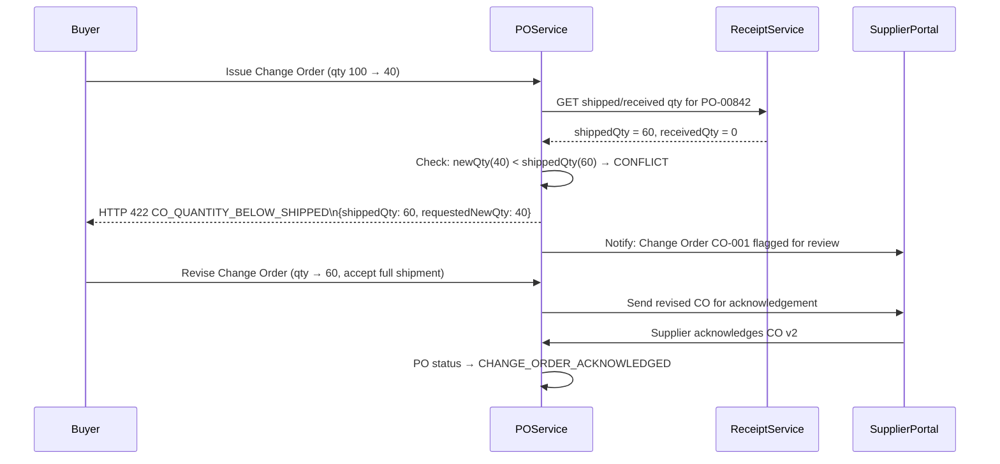

# Edge Cases — Purchase Order Management

**Service**: PO Service  
**Domain**: B2B Procurement — Purchase Order Lifecycle  
**Version**: 1.0

---

## EC-PO-001: Change Order After Partial Shipment

| Attribute | Detail |
|---|---|
| **ID** | EC-PO-001 |
| **Severity** | High |
| **Domain** | Purchase Order → Change Order Control |
| **Trigger** | Buyer issues a change order reducing line quantity after the supplier has already shipped 60% of the original order |

### Scenario

Buyer creates PO-2024-00842 for 100 units of Item X at $50/unit. The supplier ships 60 units and posts ASN-001. Before the goods are received in the system, the buyer's category manager issues a Change Order (CO-001) reducing the quantity from 100 to 40 units. The system must reconcile:
- 60 units already in transit (cannot be recalled)
- Change Order requesting only 40 units total
- Resulting discrepancy: 20 units over the new PO quantity

### Detection

1. When `IssueChangeOrderUseCase` executes, it computes `already_shipped_quantity` by querying open ASNs and posted receipts for the PO.
2. If `new_quantity < already_shipped_quantity`, a `ChangeOrderConflictException` is thrown with `code: CO_QUANTITY_BELOW_SHIPPED`.
3. The change order is placed in `PENDING_REVIEW` status and routed to the procurement manager and the supplier for negotiation.

### Flow Diagram

### Impact

- **Financial**: If the change order were applied without checks, the buyer would receive 60 units but have a PO authorizing only 40 — triggering matching exceptions and preventing invoice approval.
- **Supplier relationship**: Supplier is exposed to goods-in-transit risk if the system does not flag this for negotiation.
- **Audit**: Unresolved CO/shipment conflicts can create unauthorized spend or accrual errors.

### Resolution

1. Block the change order from committing if `new_quantity < max(shipped_quantity, received_quantity)`.
2. Present the buyer with three options: (a) cancel the change order, (b) revise the new quantity to be ≥ shipped quantity, (c) proceed and create a return authorization for excess units.
3. Record all options and the chosen path in `change_order_resolution_log`.

### Prevention

- Enforce a real-time ASN query whenever a change order affecting quantity is submitted.
- Require the buyer to acknowledge a warning if the change order reduces quantity on a PO with open ASNs.
- Display shipped-to-date quantity prominently on the Change Order creation screen.

---

## EC-PO-002: Currency Fluctuation Exceeds Tolerance

| Attribute | Detail |
|---|---|
| **ID** | EC-PO-002 |
| **Severity** | Medium |
| **Domain** | Purchase Order → Multi-Currency |
| **Trigger** | FX rate moves more than 5% between PO approval date and invoice receipt date |

### Scenario

A USD-denominated buyer organization approves PO-2024-00900 with a EUR supplier for €100,000, locked at the rate 1 EUR = 1.08 USD at approval time (PO value = $108,000). At invoice receipt 45 days later, the ECB rate is 1 EUR = 1.17 USD (8.3% movement). The system invoices at the new rate: $117,000 — a $9,000 variance vs the accrued budget amount.

### Detection

- The `InvoiceService` retrieves the PO's `locked_exchange_rate` and compares it against the `current_exchange_rate` at invoice receipt time.
- If `abs((current_rate - locked_rate) / locked_rate) > org.fx_tolerance_pct` (default: 5%), the invoice is flagged with `status = FX_REVIEW_REQUIRED`.
- A `FxVarianceEvent` is published to the Finance team's notification channel.

### Impact

- Budget overrun: committed budget was $108,000; actual liability is $117,000 — $9,000 unplanned spend.
- GL accrual mismatch if the accrual was posted at the locked rate.
- If auto-approved, the discrepancy silently absorbs into departmental budget.

### Resolution

1. Route the invoice to the Finance Controller for FX variance approval with a clear comparison of locked vs spot rates.
2. Post a separate GL journal entry for the FX gain/loss in the functional currency ledger.
3. Update the `po.fx_variance_amount` field and include it in the monthly currency exposure report.
4. Optionally trigger a contract amendment request to renegotiate the FX risk clause with the supplier.

### Prevention

- Implement a configurable `fx_tolerance_pct` per organization and per supplier tier.
- For high-value cross-currency POs (> $50,000 equivalent), prompt the buyer to consider forward-rate contracts at PO creation.
- Alert the procurement team proactively if the FX rate moves > 3% on any open foreign-currency PO.

---

## EC-PO-003: Duplicate PO Submission

| Attribute | Detail |
|---|---|
| **ID** | EC-PO-003 |
| **Severity** | High |
| **Domain** | Purchase Order → API Idempotency |
| **Trigger** | Network timeout causes the supplier portal client to retry `POST /purchase-orders`, creating two identical POs |

### Scenario

A buyer submits a PO via the portal. The `POST /purchase-orders` request reaches the server, the PO is created (PO-2024-00901), but the TCP connection drops before the HTTP 201 response is returned to the client. The client's retry logic fires after 2 seconds and sends an identical request with the same `Idempotency-Key` header. Without idempotency handling, a second PO (PO-2024-00902) would be created for the same purchase.

### Detection

- All `POST /purchase-orders` requests must include an `Idempotency-Key: <UUID>` header (enforced at API Gateway level — returns 400 if missing).
- On receipt, the API layer checks Redis key `idempotency:{key}`. If found and `status = COMPLETED`, the original response body is returned immediately (HTTP 201) without re-executing the use case.
- If found and `status = IN_FLIGHT`, returns HTTP 202 with `Retry-After: 3`.
- If not found, executes the use case, stores the response in Redis with 24-hour TTL.

### Impact

- Without idempotency: duplicate PO leads to double-ordering, double-invoicing, budget over-commitment, and supplier confusion.
- May trigger automated duplicate-detection alerts in the ERP, causing GL posting failures.

### Resolution

1. Return the cached original response to the retrying client.
2. Log the duplicate attempt in `api_idempotency_log` for audit purposes.
3. If a duplicate PO was already created before idempotency was implemented (legacy data), run a deduplication job that identifies POs with the same `(org_id, supplier_id, total_amount, created_at within 60 seconds)` and flags them for manual review.

### Prevention

- Mandate `Idempotency-Key` header as a required header validated at API gateway.
- Client SDK (TypeScript) auto-generates a UUID and stores it in `localStorage` per form submission, reusing it on retry.
- Database-level: unique constraint on `idempotency_key` column in `purchase_orders` as a last line of defense.

---

## EC-PO-004: Supplier Acknowledges Wrong PO Version

| Attribute | Detail |
|---|---|
| **ID** | EC-PO-004 |
| **Severity** | Medium |
| **Domain** | Purchase Order → Change Order → Supplier Acknowledgement |
| **Trigger** | Supplier portal client acknowledges PO version 1 after the buyer has issued Change Order v2 |

### Scenario

PO-2024-00905 (version 1) is sent to the supplier. The buyer issues CO-001 the next morning, creating version 2. Due to a caching delay in the supplier portal (stale portal session), the supplier's system calls `POST /purchase-orders/{id}/acknowledge` referencing `poVersion: 1`. The system must detect that version 1 is no longer the current version.

### Detection

- The acknowledgement endpoint validates that `request.poVersion == po.currentVersion`.
- If `request.poVersion < po.currentVersion`, returns HTTP 409 Conflict with `code: PO_VERSION_STALE` and the current version metadata.
- The supplier portal receives the 409, clears the cached PO, fetches the latest version, and prompts the supplier to review and re-acknowledge.

### Impact

- If stale acknowledgement is accepted: buyer proceeds under the assumption the supplier agreed to v2 (reduced quantity, changed delivery date) while the supplier is manufacturing against v1.
- Results in shipment discrepancy, receipt exception, and potential SLA dispute.

### Resolution

1. Reject stale-version acknowledgements with a clear error code.
2. Send an automated notification to the supplier: "PO has been updated. Please review Change Order CO-001 before acknowledging."
3. Set a 48-hour acknowledgement deadline for the change order; escalate to the buyer's procurement manager if not responded to.
4. Track version-acknowledgement mismatch incidents in the supplier performance record as a communication metric.

### Prevention

- The supplier portal must always display the `currentVersion` prominently and highlight differences from the previously viewed version.
- Disable the "Acknowledge" button in the supplier portal until the supplier confirms they have reviewed the change order diff.
- Include `poVersion` in the digitally signed acknowledgement payload to create a non-repudiation record.
