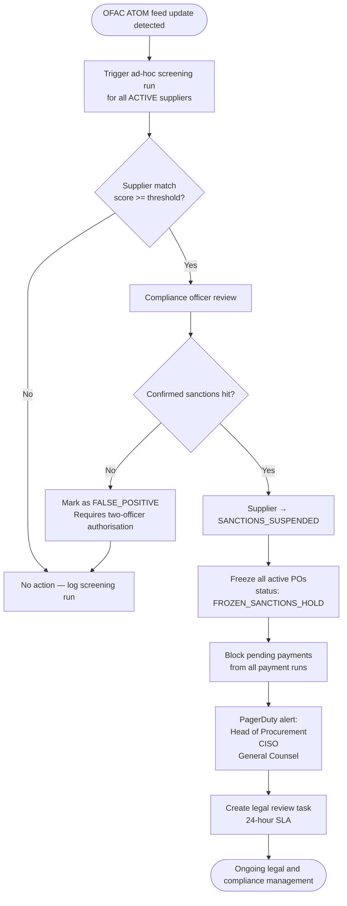

# Security and Compliance Edge Cases — Supply Chain Management Platform

Procurement systems are high-value targets for external attackers, malicious insiders, and regulatory non-compliance. The Supply Chain Management Platform handles supplier bank details, purchase order approvals, invoice payments, contract documents, and personal data — all assets that attract adversarial attention and carry heavy regulatory obligations under SOX, GDPR, PCI-DSS, and OFAC sanctions regimes. This document catalogues twelve critical security and compliance edge cases, detailing the threat scenario, system protective behaviour, error handling, and resolution path for each.

---

## Edge Cases

### EC-SEC-001: Supplier Portal Account Takeover — Stolen Credentials and MFA Bypass

**Severity:** P0 — Critical  
**Domain:** Authentication — Supplier Identity  
**Trigger:** An attacker with stolen supplier credentials attempts to authenticate, including attempts to bypass or fatigue MFA

#### Description

Supplier "Apex Components Ltd" has their primary contact credentials phished. The attacker attempts to log in from a new country using the stolen password. The platform enforces TOTP MFA, but the attacker also attempts SIM-swap social engineering against the supplier's mobile carrier and MFA fatigue (repeated push approval requests).

#### System Behaviour

The `AuthService` evaluates a risk score for each login attempt before forwarding to MFA:
- New device fingerprint + new country → risk score elevated; session requires step-up MFA.
- Login velocity: more than 5 failed attempts within 10 minutes → account temporarily locked for 15 minutes; supplier contact email notified.
- Impossible travel: successful login from UK, then login attempt from Singapore within 1 hour → automatic session termination of UK session; step-up required for Singapore.
- MFA push fatigue detection: 3 consecutive MFA requests denied within 2 minutes without a user-initiated new login → account locked and security alert raised.

#### Error Handling

Blocked login returns a generic `"Authentication failed"` message regardless of the failure reason (wrong password, locked account, MFA refused) to prevent enumeration. The supplier contact and their company's primary admin receive an email: "A login to your supplier account was blocked due to suspicious activity."

#### Resolution Path

1. Locked accounts require the supplier's account admin to unlock via identity re-verification (government ID or notarised letter for high-risk cases).
2. All active sessions are invalidated on a confirmed account takeover.
3. The incident is logged to the SIEM with source IP, device fingerprint, country, MFA attempts, and timeline.
4. High-risk suppliers (large active PO value) are enrolled in phishing-resistant FIDO2 hardware key MFA rather than TOTP.

---

### EC-SEC-002: Mass Data Export by Privileged User

**Severity:** P0 — Critical  
**Domain:** Data Loss Prevention — Insider Threat  
**Trigger:** A privileged procurement manager initiates bulk exports of supplier records, PO data, and contract documents within a short time window

#### Description

An employee with broad data access exports 50,000 supplier records, 120,000 PO documents, and 800 contract PDFs across 90 minutes, using the platform's export and reporting features. This volume is an order of magnitude above their historical baseline and may represent data theft ahead of resignation or sale to a competitor.

#### System Behaviour

The `DataExportAuditService` evaluates every export against the user's 90-day behavioural baseline:
- Volume threshold: if a single user's export volume in any rolling 60-minute window exceeds 200% of their 90-day P95 export volume, a `ANOMALOUS_EXPORT_ALERT` event is raised.
- Scope anomaly: if the exported data scope (org units, supplier categories) is broader than the user's typical access pattern, a DLP alert is triggered.
- After 3 consecutive anomalous export events within 24 hours, the export feature is automatically suspended for that user's account and the user's manager and security team are notified.

#### Error Handling

The user receives no indication that monitoring has been triggered — the export proceeds normally to avoid tipping off a potentially malicious actor. Only after the suspension threshold is breached does the user receive: "Your data export access has been temporarily suspended. Contact your administrator."

#### Resolution Path

1. The security team reviews the exported data manifest (file names, record counts, timestamps) stored in the immutable audit log.
2. If confirmed malicious, the user's account is suspended, exported data hashes are recorded for evidence, and legal/HR are engaged.
3. If confirmed legitimate (e.g., authorised migration project), the suspension is lifted by the security manager with a documented justification.

---

### EC-SEC-003: PO Amount Manipulation Between Approval and Execution

**Severity:** P0 — Critical  
**Domain:** Integrity — Purchase Order Tamper Detection  
**Trigger:** A PO's payment amount is modified in the database between the approval signature and the payment execution

#### Description

A PO for £12,000 is approved by the Finance Controller. Before the payment run processes it, a database-level manipulation (insider threat or SQL injection) changes the amount to £120,000. Without tamper detection, the elevated amount is paid out.

#### System Behaviour

At approval time, the `ApprovalService` computes an HMAC-SHA-256 signature over the canonical PO payload `(po_id, supplier_id, total_amount, currency, approved_by, approved_at)` using a KMS-managed signing key. The signature is stored in `purchase_orders.integrity_hash`.

At payment execution time, the `PaymentService` recomputes the signature over the current database state and compares it against the stored hash before dispatching any payment instruction:
- Hash match → payment proceeds.
- Hash mismatch → payment is blocked; a `PO_INTEGRITY_VIOLATION` critical alert fires; the PO is frozen.

#### Error Handling

```
CRITICAL ALERT: PO_INTEGRITY_VIOLATION
PO ID: po-0081234
Expected hash: 3a7f1b...
Computed hash: 9c2e44...
Differing fields: total_amount (approved: 12000.00, current: 120000.00)
Action: Payment blocked. PO frozen pending security review.
```

PagerDuty alert routed to the Head of Finance, CISO, and on-call security engineer simultaneously.

#### Resolution Path

1. The PO is immediately frozen — no payment, goods receipt, or further edits permitted.
2. The `pgaudit` log and application audit trail are forensically reviewed to identify which session made the database change.
3. If the manipulation is confirmed, the incident is escalated to law enforcement as appropriate.
4. The approved values are restored from the integrity hash and the PO re-routed through the approval workflow.

---

### EC-SEC-004: Invoice Injection — Malicious PDF with OCR Poisoning

**Severity:** P1 — High  
**Domain:** Document Security — Invoice Processing  
**Trigger:** A supplier uploads a PDF invoice containing hidden text or adversarial content designed to manipulate OCR extraction and alter the recognised invoice amount or bank account number

#### Description

A malicious actor uploads a PDF where the visible rendered text shows "Invoice Total: £5,000" but the PDF's text content stream (exploiting the difference between rendered and extractable text) contains "Invoice Total: £50,000" and a different IBAN. The OCR-based invoice ingestion pipeline extracts the manipulated values.

#### System Behaviour

The `InvoiceOCRService` applies a defence-in-depth approach:
1. **Dual extraction:** Both rendered text (via PDF rendering → image → OCR) and raw text stream extraction (via `pdfminer`) are run independently.
2. **Discrepancy check:** If extracted amounts differ by more than 5% between the two methods, the invoice is flagged as `OCR_ANOMALY` and routed to manual review.
3. **Bank account verification:** Any IBAN on a received invoice is cross-referenced against the supplier's `verified_bank_accounts` table. An unrecognised IBAN causes immediate invoice hold.
4. **File hash:** The PDF hash is stored on ingest; re-extraction after any downstream processing verifies the file has not been modified in transit.

#### Error Handling

Invoice status → `MANUAL_REVIEW_REQUIRED`; accounts payable team notified; the supplier is not notified (to avoid tipping off a potential insider or compromised supplier account).

#### Resolution Path

1. AP team visually inspects the original PDF and cross-references with the PO and goods receipt.
2. If manipulation is confirmed, the supplier's account is suspended pending investigation and the incident is logged as a security event.
3. The supplier's contact is notified only after internal investigation determines whether the supplier account was compromised or the supplier is complicit.

---

### EC-SEC-005: Sanctions List Match on Supplier During Active PO

**Severity:** P0 — Critical  
**Domain:** Compliance — OFAC / Sanctions Screening  
**Trigger:** An active, approved supplier appears on a newly published OFAC SDN list while they have open purchase orders

#### Description

OFAC publishes a new SDN list update that includes an active supplier with 12 open POs totalling $1.2M. The platform's next daily screening batch is not due for several hours.

#### System Behaviour



On confirmed match: all 12 POs transition to `FROZEN_SANCTIONS_HOLD`, pending payment runs are blocked at the payment gateway, and a legal review task is automatically created in the case management system.

#### Error Handling

False positive handling requires two-officer authorisation plus supporting documentation (e.g., entity disambiguation evidence) before the supplier can be unsuspended. Every step is recorded in the immutable audit log.

#### Resolution Path

1. Legal counsel reviews the sanctions match within 24 hours.
2. If sanctions apply: frozen POs remain blocked until legal guidance determines the path (cancellation, assignment to alternate supplier, or regulatory approval for completion).
3. If false positive confirmed: supplier unsuspended, POs unfrozen, false positive documented for regulator review.

---

### EC-SEC-006: Data Residency Violation — Documents Uploaded to Wrong S3 Region

**Severity:** P1 — High  
**Domain:** Compliance — Data Residency  
**Trigger:** Supplier documents that must reside in the EU (GDPR Art. 46 / contractual obligation) are inadvertently uploaded to an S3 bucket in `us-east-1` due to a misconfiguration

#### Description

The document upload service is configured with a supplier-to-region routing table. A configuration deployment error sets all new supplier document uploads to route to the default `us-east-1` bucket, overriding the EU-supplier routing that should target `eu-west-1`.

#### System Behaviour

Post-upload, the `DataResidencyValidationService` reads the S3 object's bucket region via the object's ARN and compares it against the supplier's required data residency region (stored in `supplier.data_residency_region`). If a mismatch is detected:
1. The object is immediately tagged with `compliance-hold=true`.
2. An automated S3 cross-region copy is initiated to the correct bucket.
3. The source object is deleted from the incorrect region only after the copy completes and the object hash is verified.
4. A `DataResidencyViolationEvent` is written to the compliance audit log.

#### Error Handling

The uploading user sees no error — the remediation is transparent. The compliance officer receives an alert: "Data residency remediation completed for 3 documents. Source region `us-east-1` corrected to `eu-west-1`." The violation is logged for regulatory disclosure purposes.

#### Resolution Path

1. The misconfigured routing table deployment is rolled back immediately.
2. All documents uploaded during the misconfiguration window are audited and remediations verified.
3. Post-remediation, a canary test validates region routing after each deployment touching the upload service configuration.

---

### EC-SEC-007: Audit Log Tampering Attempt

**Severity:** P0 — Critical  
**Domain:** Compliance — Audit Integrity  
**Trigger:** A privileged database administrator attempts to modify or delete entries from the `audit_events` table to cover tracks after a fraudulent transaction

#### Description

A compromised DBA account attempts `DELETE FROM audit_events WHERE event_type = 'PAYMENT_EXECUTED' AND actor = 'user-001'` via a direct database connection.

#### System Behaviour

Append-only enforcement is implemented at multiple layers:
1. **Database role:** The application's DB role `scmp_app` has `INSERT` rights on `audit_events` but no `UPDATE`, `DELETE`, or `TRUNCATE`. DDL changes require a separate migration role not available at runtime.
2. **Row-level trigger:** A `BEFORE UPDATE OR DELETE` trigger on `audit_events` raises an exception unconditionally: `RAISE EXCEPTION 'Audit log is immutable — modifications are prohibited.'`
3. **External replication:** Audit events are streamed via Kafka (`audit.events` topic) and written to an immutable secondary audit store (separate RDS instance with a dedicated INSERT-only role and no connection from the primary app).
4. **CloudTrail:** All RDS database API calls (including direct SQL via AWS Data API) are logged to CloudTrail. Any `DELETE` from `audit_events` generates a CloudWatch alarm and PagerDuty alert within 60 seconds.

#### Error Handling

The DBA's DELETE statement returns: `ERROR: Audit log is immutable — modifications are prohibited.` The attempt and the DBA's session identity are logged to the secondary audit store automatically (via the Kafka stream of all audit table access attempts).

#### Resolution Path

1. The attempted deletion is an incident trigger regardless of success — the security team is alerted and an investigation is opened.
2. The secondary immutable audit store provides the ground truth even if the primary were somehow modified.
3. The DBA account is suspended pending investigation.

---

### EC-SEC-008: SOX Control — Payment Executed Without Three-Way Match (Emergency Bypass)

**Severity:** P0 — Critical  
**Domain:** Compliance — SOX Internal Controls  
**Trigger:** A payment is authorised for execution using an emergency bypass of the mandatory three-way match (PO + goods receipt + invoice) due to a critical operational need

#### Description

A production line will shut down in 4 hours without an emergency part delivery. The supplier has shipped but goods have not been formally received in the system. The CFO authorises an emergency payment bypass. SOX requires this exception to be fully documented with segregation of duties.

#### System Behaviour

The `EmergencyBypassService` enforces the following before allowing any bypass:
1. The bypass request requires two authorisations: CFO-level and Head of Internal Audit — single-officer bypass is system-blocked.
2. The bypass record captures: approver identities, timestamps, business justification text (minimum 200 characters), the specific control being bypassed, and the financial value.
3. The payment is released with `payment.bypass_reference = bypass-{id}` attached.
4. A `SOXBypassEvent` is immediately published to the external audit system and flagged in the next SOX compliance report.
5. A retrospective goods receipt must be completed within 5 business days, or the payment is flagged as an open SOX exception for the external auditor.

#### Error Handling

Single-officer bypass attempts are blocked: `"Emergency payment bypass requires dual authorisation (CFO + Head of Internal Audit). A second approver must independently log in and confirm."` The blocked attempt itself is logged to the audit trail.

#### Resolution Path

1. Both authorisers access the bypass request independently via separate authenticated sessions.
2. The goods receipt is completed retrospectively within 5 business days to close the exception.
3. Internal Audit reviews all bypass events quarterly; chronic bypass usage triggers a control remediation recommendation.

---

### EC-SEC-009: GDPR Data Subject Erasure — Supplier Contact Linked to Active Contracts

**Severity:** P1 — High  
**Domain:** Compliance — GDPR  
**Trigger:** A supplier contact submits a GDPR Article 17 right-to-erasure request but is the named contact on active contracts and open POs

#### Description

A supplier contact who left the company requests erasure of their personal data: name, email, phone number, and activity history. The platform holds this data on active contracts with a 7-year financial record retention obligation and on open POs that are not yet closed.

#### System Behaviour

The `GDPRErasureService` performs a legal-basis assessment before any deletion:
1. Active contract records: retention is **mandatory** under financial record-keeping law — full erasure blocked. The contact's data is **pseudonymised** instead (name replaced with `[Former Contact]`, email with a non-routable placeholder, phone with a masked value).
2. Closed POs and invoices older than 7 years: eligible for full erasure.
3. Marketing data, portal login history, non-financial activity logs: eligible for immediate erasure.
4. The request, assessment outcome, and all actions taken are recorded in the `gdpr_erasure_log` table.

#### Error Handling

The data subject is notified within 30 days: "Your erasure request has been partially fulfilled. Records linked to active contracts are subject to mandatory financial record retention under [applicable law] and have been pseudonymised. Records not subject to retention have been deleted. You may appeal this decision to [DPA contact]."

#### Resolution Path

1. Pseudonymisation is applied within 30 days of the verified erasure request.
2. Remaining data is scheduled for erasure once the legal retention period expires (automated via `RetentionExpiryJob`).
3. The response to the data subject is generated by the `GDPRErasureResponseService` with jurisdiction-specific language based on the supplier's country.

---

### EC-SEC-010: Expired TLS Certificate on Supplier EDI Endpoint

**Severity:** P1 — High  
**Domain:** Integration Security — Supplier EDI  
**Trigger:** The TLS certificate on a supplier's EDI endpoint expires, causing outbound EDI transmission failures (ASNs, invoices, PO acknowledgements)

#### Description

A supplier's EDI server certificate expires. The `EDITransmissionService` attempts outbound HTTPS connections and receives `PKIX path building failed` / certificate expired errors. All EDI documents for this supplier queue up and fail silently if not monitored.

#### System Behaviour

- **Proactive monitoring:** A scheduled job (`CertificateExpiryMonitorJob`) runs daily, checking the TLS certificate expiry for all registered EDI endpoints via a TLS handshake (`openssl s_client`-equivalent). Certificates expiring within 30 days generate a warning; within 7 days generate a critical alert.
- **At transmission time:** Certificate validation errors cause the EDI message to be placed in `transmission_status = CERT_ERROR` with the specific TLS error recorded.
- **Retry policy:** EDI messages in `CERT_ERROR` are retried every 4 hours for up to 7 days (not exponential — the supplier needs to fix the cert, not a transient error).

#### Error Handling

Alert to the supplier's technical contact and the platform's EDI team: "EDI transmissions to your endpoint have failed due to an expired TLS certificate (expired: {date}). Please renew the certificate to restore connectivity."

#### Resolution Path

1. The platform's EDI team contacts the supplier's technical team with the specific certificate error and expiry date.
2. The supplier renews the certificate on their server.
3. Once renewed, the EDI team triggers a manual retry of all queued `CERT_ERROR` messages for the supplier.
4. EDI backlog is processed in chronological order; a reconciliation check confirms no messages were permanently lost.

---

### EC-SEC-011: Insider Threat — Finance Manager Creates and Self-Approves a Payment Run

**Severity:** P0 — Critical  
**Domain:** Compliance — Segregation of Duties  
**Trigger:** A finance manager attempts to both create a payment run and approve it using their own credentials (violating the four-eyes payment approval control)

#### Description

A finance manager has both `PAYMENT_RUN_CREATOR` and `PAYMENT_RUN_APPROVER` roles (a misconfiguration from a temporary coverage arrangement). They create a payment run including a fictitious supplier invoice and immediately approve it themselves.

#### System Behaviour

The `PaymentApprovalService` enforces segregation of duties at the business logic layer:
1. The `approved_by` field is compared against the `created_by` field in the payment run record.
2. If they match, the approval is blocked: `SELF_APPROVAL_BLOCKED`.
3. This check is implemented at both the API level (synchronous validation) and as a database-level constraint (`CHECK (created_by != approved_by)`), preventing any code path — including direct DB access — from creating a self-approved payment run.
4. The self-approval attempt is written to the audit log as a high-priority `SOD_VIOLATION_ATTEMPT` event, triggering a PagerDuty alert to the Head of Finance and CISO.

#### Error Handling

```json
{"error": "SELF_APPROVAL_BLOCKED", "message": "The payment run creator cannot approve their own payment run. A second authorised finance officer must approve."}
```

#### Resolution Path

1. A different finance officer with `PAYMENT_RUN_APPROVER` reviews and approves (or rejects) the payment run.
2. The SOD violation attempt is reviewed by the CISO — if the pattern repeats, the finance manager's combined role is revoked.
3. A periodic automated report (`sod_violation_report`) is generated weekly listing all blocked self-approval attempts for compliance review.

---

### EC-SEC-012: PCI-DSS — Bank Account Details Inadvertently Logged in Application Logs

**Severity:** P0 — Critical  
**Domain:** Compliance — PCI-DSS  
**Trigger:** An exception stack trace logged during a payment processing error includes the supplier's full IBAN and sort code in the log output

#### Description

A payment processing exception triggers Spring Boot's default exception logging, which serialises the full request object — including `supplier.bankAccount.iban` and `supplier.bankAccount.sortCode` — into the application log. These logs are shipped to CloudWatch and potentially to a third-party SIEM.

#### System Behaviour

**Preventive controls:**
1. **Log scrubbing:** A custom `LogScrubFilter` (Logback `TurboFilter`) intercepts all log events and applies regex patterns to mask PCI-relevant data before writing: IBAN (`[A-Z]{2}\d{2}[A-Z0-9]{4,30}`) → `[IBAN-REDACTED]`; sort code (`\d{2}-\d{2}-\d{2}`) → `[SORT-CODE-REDACTED]`; card numbers (Luhn-valid 15–16 digit sequences) → `[PAN-REDACTED]`.
2. **DTO design:** Payment request objects implement `toString()` returning `"[REDACTED-PAYMENT-OBJECT]"` to prevent accidental serialisation via Spring's default exception logger.
3. **Reactive detection:** Amazon Macie scans CloudWatch log exports for PCI data patterns weekly. Any finding triggers an immediate alert.

#### Error Handling

If Macie detects PCI data in logs post-incident:
1. Immediately revoke the affected log group's export permissions.
2. Delete the affected log stream (after copying to a restricted forensic bucket).
3. Notify the compliance team and initiate a PCI-DSS breach assessment.
4. Assess whether the SIEM received the raw logs; if so, engage the SIEM vendor for log purge.

#### Resolution Path

1. Verify `LogScrubFilter` coverage for all new payment-related fields via a unit test (`LogScrubFilterTest`) that asserts no IBAN, sort code, or card number pattern survives logging.
2. Add a pre-commit hook that scans for `toString()` methods on payment DTO classes that do not explicitly override the default serialisation.
3. Document the incident in the PCI-DSS compliance log and assess whether a QSA notification is required.

---

## Boundary Conditions

| Parameter | Minimum | Maximum | Validation Rule | Error Code |
|-----------|---------|---------|-----------------|------------|
| Login failure attempts before lockout | — | 5 per 10-minute window | Redis counter; lockout for 15 minutes | `ACCOUNT_LOCKED` |
| MFA push fatigue threshold | — | 3 consecutive denials within 2 min | Lock account; alert security team | `MFA_FATIGUE_DETECTED` |
| OFAC screening frequency | Every 24 hours (batch) | Real-time on feed update | Feed update triggers immediate ad-hoc run | — |
| PO integrity hash algorithm | HMAC-SHA-256 | HMAC-SHA-256 | KMS-managed key; recomputed at payment execution | `PO_INTEGRITY_VIOLATION` |
| Emergency bypass minimum justification length | 200 chars | — | Enforced at API validation layer | `INSUFFICIENT_JUSTIFICATION` |
| Payment run approval: minimum approvers | 2 (SOD enforced) | — | Creator cannot be approver; DB constraint enforced | `SELF_APPROVAL_BLOCKED` |
| GDPR erasure response window | — | 30 calendar days | Tracked in `gdpr_erasure_log`; automated reminder at day 25 | — |
| Data export anomaly threshold | — | 200% of 90-day P95 in 60-min window | `DataExportAuditService` behavioural baseline | `ANOMALOUS_EXPORT_ALERT` |
| TLS certificate expiry warning window | — | 30 days before expiry (warning); 7 days (critical) | Daily `CertificateExpiryMonitorJob` | `CERT_EXPIRY_WARNING` / `CERT_EXPIRY_CRITICAL` |
| Log PCI scrub pattern — IBAN | — | — | `[A-Z]{2}\d{2}[A-Z0-9]{4,30}` → `[IBAN-REDACTED]` | Macie finding if unscanned |
| Sanctions match score threshold | Configurable | Configurable | Default 0.85; tunable per compliance policy | `SANCTIONS_MATCH_SUSPECTED` |
| Audit log retention | — | 7 years | Append-only; `pgaudit` + secondary immutable store | — |

---

## Failure Modes and Recovery

| Failure Mode | Impact | Detection | Recovery Action | RTO |
|-------------|--------|-----------|-----------------|-----|
| OFAC screening service API unavailable | Suppliers cannot be screened for new sanctions; real-time screening stalled | Health check on OFAC feed poller fails; alert fires | Maintain last known clean screening result; block new supplier activations and high-value PO approvals until service restored | < 4 hours |
| KMS key unavailable (PO integrity signing) | Approved POs cannot have integrity hashes computed; payment service cannot verify hashes | KMS API call returns key error; PO approval step fails | Circuit breaker blocks PO approvals; emergency escalation to AWS Support for KMS key restoration; no payments released without verified hash | < 1 hour |
| Log scrubbing filter crash | PCI data may appear in application logs unmasked | Log volume spike; Macie scan triggers on next run | Roll back the logback configuration; trigger immediate Macie scan on affected log groups; purge affected streams | < 30 min |
| SOD role misconfiguration (user has creator + approver) | Self-approval becomes structurally possible | Automated SOD role audit (`sod_audit_job`) runs daily; flags combined-role users | Remove combined roles immediately; review all payment runs approved in the window; escalate any self-approved runs | < 1 hour |
| GDPR erasure pipeline failure | Subject erasure SLA (30 days) breached | `gdpr_erasure_log` records not advancing to `COMPLETED`; alert at day 25 | Investigate pipeline error; manually remediate backlogged requests; notify DPO of potential SLA breach | < 1 business day |
| Audit secondary store replication lag | Window of unprotected audit events (tampering could succeed without secondary capture) | Replication lag metric > 60 seconds; CloudWatch alarm | Alert on-call DBA; pause non-critical operations; ensure replication catches up before resuming; never disable replication silently | < 15 min |
| EDI certificate monitoring job failure | Certificate expiries missed; EDI failures are not proactively detected | Health check on scheduled job execution; last-run timestamp monitoring | Re-run job manually; send alert for all certificates not checked in > 25 hours | < 4 hours |
| PO integrity hash database column missing (post-migration error) | All newly approved POs cannot be hash-signed; payment service rejects all payments | Payment service error rate spikes; `NO_INTEGRITY_HASH` error logged | Emergency DB migration to add column; replay approval signing for all POs approved during the outage window | < 30 min |
