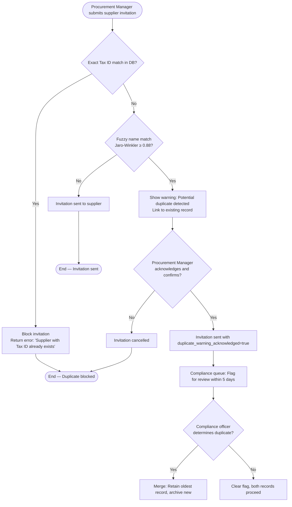

# Supplier Onboarding — Edge Cases

This document covers edge cases in the supplier onboarding lifecycle, from initial invitation through qualification approval. Onboarding is one of the highest-risk phases of supplier management because errors introduced here propagate into every downstream process: PO creation, payments, performance scoring, and compliance reporting.

---

## EC-SUP-001: Duplicate Supplier — Same Legal Entity, Different Trade Names

**Severity:** P1 — High  
**Domain:** Supplier Onboarding  
**Trigger:** Two procurement managers independently initiate onboarding for the same legal entity

### Scenario

Procurement manager A invites "Acme Industrial Supplies Ltd." (Tax ID: DE123456789) on Monday. On Thursday, procurement manager B invites "Acme IS GmbH" (Tax ID: DE123456789, same parent company, different trading name) without awareness of the first invitation. Both invitations are accepted by different contacts at the same legal entity, resulting in two supplier records that create duplicate payment targets, split performance history, and conflicting contract references.

### Detection

The system performs two layers of duplicate detection:

1. **Hard duplicate check (blocking):** At the moment an invitation is submitted, the system queries `supplier.tax_id` for an exact match. If a match exists (in any status: `PENDING`, `ACTIVE`, `SUSPENDED`, or `DISQUALIFIED`), the invitation is blocked immediately with a descriptive error.

2. **Soft duplicate check (warning):** A fuzzy name-matching algorithm (Jaro-Winkler similarity ≥ 0.88 against all existing supplier legal names and trade names) is run. If a potential match is found, a warning banner is displayed to the inviting user with a link to the potentially matching supplier record. The user must explicitly acknowledge the warning before proceeding.

### Detection and Resolution Flow



### Resolution

If a compliance officer confirms that two supplier records represent the same legal entity:
1. The older (or more complete) record is designated the **primary** record.
2. All POs, receipts, and performance data from the secondary record are re-associated with the primary using a data migration script (`scripts/supplier_merge.sql`).
3. The secondary record is archived with status `MERGED_INTO:{primary_supplier_id}`.
4. Both contacts at the supplier are notified via email of the consolidation.

### Prevention

- Enforce a unique index on `supplier.tax_id` at the database level.
- Enforce a unique partial index on `supplier.bank_account_iban` where `status != 'ARCHIVED'`.
- Display a read-only "Recently Invited" panel on the invitation form showing the last 10 suppliers invited by any user in the requester's business unit.

---

## EC-SUP-002: Incomplete Tax Documentation

**Severity:** P1 — High  
**Domain:** Supplier Onboarding  
**Trigger:** Supplier submits onboarding documents that are expired, missing required fields, or in an unacceptable format

### Scenario

A supplier uploads a tax registration certificate (VAT certificate) that expired six months ago. The document passes initial file format validation (PDF, < 5 MB) but the document validation module detects that the `valid_until` date extracted via OCR pre-dates today. Alternatively, the supplier uploads a document that is missing required fields such as the registered address or authorised signatory name.

### Detection

The document validation module (`DocumentValidationService`) performs the following checks on every uploaded compliance document:

| Check | Method | Failure Action |
|-------|--------|----------------|
| File format | MIME type + magic bytes | Reject immediately |
| Expiry date | OCR extraction + date comparison | Block progression |
| Required fields present | Rule engine per document type | Block progression |
| Document authenticity | Third-party verification API (optional) | Warning flag |
| Language support | OCR confidence score ≥ 85% | Request certified translation |

### Resolution

1. The supplier's onboarding status transitions to `PENDING_DOCUMENTS` — the supplier cannot progress to the `QUALIFICATION_REVIEW` stage.
2. An automated email is sent to the supplier's primary contact with:
   - The specific reason for rejection (e.g., "VAT certificate expired on 2024-06-30; please upload a valid certificate")
   - A secure document upload link valid for 14 days
   - Instructions for certified translations if the document language is unsupported
3. If the supplier does not respond within **14 calendar days**, the onboarding is automatically cancelled with status `CANCELLED_INCOMPLETE_DOCS`, and the procurement manager is notified.
4. A cancelled onboarding can be restarted by the procurement manager — the supplier retains their `supplier_id` and previously submitted valid documents are preserved.

### SLA

- Supplier has **14 calendar days** from the notification date to provide valid documentation.
- If an extension is needed, the procurement manager can grant a single 7-day extension via the admin console, with a mandatory justification comment.

---

## EC-SUP-003: Qualification Expiry During Active Purchase Orders

**Severity:** P1 — High  
**Domain:** Supplier Onboarding / Compliance  
**Trigger:** A supplier's qualification certificate expires while they have one or more open/in-progress POs

### Scenario

A supplier's ISO 9001 quality certification, which was a mandatory qualification requirement for their approved category, expires. At the time of expiry, the supplier has 7 active purchase orders totalling €340,000 in open value. Immediately blocking the supplier would halt critical production line deliveries.

### Detection

A nightly scheduled job (`QualificationExpiryCheckJob`) runs at 02:00 UTC and queries:

```sql
SELECT s.supplier_id, q.qualification_type, q.expiry_date
FROM suppliers s
JOIN qualifications q ON s.supplier_id = q.supplier_id
WHERE q.expiry_date <= NOW() + INTERVAL '30 days'
  AND q.status = 'ACTIVE'
  AND s.status = 'ACTIVE';
```

Suppliers with qualifications expiring within 30 days are placed in `EXPIRY_WARNING` status. Suppliers with expired qualifications are placed in `QUALIFICATION_EXPIRED` status.

### Resolution — Grace Period Protocol

| Days Since Expiry | System Action |
|-------------------|---------------|
| T-30 to T-1 | Warning email to supplier + procurement manager; no operational impact |
| T+0 (expiry day) | Status → `QUALIFICATION_EXPIRED`; new PO creation blocked for this supplier |
| T+1 to T+30 (grace period) | Existing POs: allowed to proceed to completion; new POs: blocked |
| T+31 (grace period end) | Existing open POs flagged for procurement director review; supplier suspended |

### Existing PO Handling

- Active POs whose expected delivery date falls within the grace period are **allowed to complete**. The buyer receives a warning on the PO detail page: "Supplier qualification expired. This PO is within the grace period and may proceed."
- POs whose expected delivery date extends beyond the grace period are flagged with status `SUPPLIER_COMPLIANCE_REVIEW` and assigned to the procurement director for a hold/proceed decision.

### Escalation

If the supplier does not renew within the 30-day grace period:
1. All active POs are frozen with status `SUPPLIER_SUSPENDED`.
2. An escalation ticket is created and assigned to the category manager.
3. The category manager has 5 business days to either approve a temporary waiver or initiate supplier replacement.

---

## EC-SUP-004: Blacklisted Supplier Re-Registration Attempt

**Severity:** P0 — Critical  
**Domain:** Supplier Onboarding / Compliance  
**Trigger:** A previously blacklisted supplier attempts to re-enter the platform using a related legal entity

### Scenario

Supplier "FastParts Logistics Ltd." was blacklisted following a fraud investigation (non-delivery of goods after payment). Six months later, the same principals attempt to register a new entity "QuickParts Distribution Ltd." using the same bank account (different account name), a slightly different registered address, but the same director's name and phone number.

### Detection Logic

The blacklist cross-reference check (`BlacklistScreeningService`) runs the following fingerprint checks against the `supplier_blacklist` table:

| Signal | Match Type | Action on Match |
|--------|-----------|-----------------|
| Tax ID | Exact | Hard block |
| Bank account IBAN | Exact | Hard block |
| Director name (normalised) | Fuzzy (≥ 0.90) | Hard block + compliance alert |
| Phone number (E.164 normalised) | Exact | Hard block + compliance alert |
| Registered address (normalised) | Fuzzy (≥ 0.85) | Soft block — requires compliance review |
| Email domain | Exact domain match | Warning flag |

Any hard block immediately transitions the registration to `BLOCKED_BLACKLIST_MATCH` status. A compliance audit event is generated with all matched signals attached.

### Resolution

1. The registration is permanently blocked — the supplier cannot complete registration.
2. A compliance audit event is written to the immutable audit log with: matched signals, timestamp, IP address, and the identity of any internal user who initiated or assisted the registration.
3. The compliance officer receives an immediate high-priority email and Slack notification.
4. The compliance officer documents the outcome (confirmed attempted re-registration vs. legitimate new entity) in the incident record.
5. If the compliance officer determines it is a legitimate new entity that was falsely flagged, they can manually whitelist the new registration — this action itself is audited and requires two-officer authorisation.

### Prevention

- The blacklist database is updated within 24 hours of any blacklisting decision.
- Blacklist entries include both the entity identifiers and all known contact/banking fingerprints.
- API rate limiting on the registration endpoint prevents automated probing to test which signals trigger a block.

---

## EC-SUP-005: OFAC Sanctions Hit on Existing Active Supplier

**Severity:** P0 — Critical  
**Domain:** Supplier Onboarding / Compliance / Legal  
**Trigger:** A currently active, approved supplier appears on a new OFAC sanctions list release

### Scenario

OFAC publishes a new SDN (Specially Designated Nationals) list update at 14:30 UTC on a Tuesday. The update includes "Meridian Trade Holdings LLC", which is currently an active supplier with 12 open POs totalling $1.2M in open value. The platform's daily sanctions screening batch has not yet run for the day.

### Detection

- **Daily batch screening** (`OFACScreeningBatchJob`): Runs at 06:00 UTC. Screens all `ACTIVE` suppliers against the current OFAC SDN, Consolidated Sanctions, and EU Sanctions lists.
- **On-event screening**: When OFAC publishes a list update (detected via OFAC's ATOM feed), a triggered screening run is initiated against all active suppliers within 30 minutes of the feed update.
- **Data source**: OFAC OFAC SDN XML feed, updated by OFAC typically several times per week.

### Immediate Resolution Steps

Upon a confirmed sanctions hit (match score ≥ configured threshold, reviewed by compliance officer):

1. **Immediate supplier suspension**: Supplier status transitions to `SANCTIONS_SUSPENDED` within 5 minutes of confirmed match. This is automated.
2. **All active POs frozen**: Every PO associated with the supplier transitions to `FROZEN_SANCTIONS_HOLD`. No further goods movements, invoices, or payments can be processed.
3. **Pending payments blocked**: Any payment runs that include invoices from this supplier are immediately blocked at the payment gateway layer.
4. **Emergency notification**: Compliance officer, Head of Procurement, and General Counsel receive an immediate email and PagerDuty alert.
5. **Legal review triggered**: An automated legal review task is created in the case management system with a 24-hour response SLA.
6. **Audit trail**: Every frozen PO, blocked payment, and system action is written to the immutable audit log with the OFAC match details.

### False Positive Handling

Sanctions screening matches can produce false positives (e.g., a common name matching an unrelated sanctioned entity). The compliance officer can mark a match as `FALSE_POSITIVE` with supporting documentation. This action requires two-officer authorisation and is subject to external legal review before the supplier is unsuspended.
