# Supply Chain Management Platform - Microservices Architecture

## System Overview

Enterprise supply chain platform orchestrating procurement-to-payment workflows across multiple suppliers, departments, and ERP systems.

```mermaid
graph TB
    PM["Procurement Manager<br/>(User)"]
    Supplier["Supplier<br/>(Portal)"]
    FC["Finance Controller<br/>(Approver)"]
    WO["Warehouse Operator<br/>(Receiver)"]
    
    PM -->|RFQ, PO Creation| Gateway["🔌 API Gateway<br/>Rate Limit, Auth"]
    Supplier -->|Quotation, Invoice| Gateway
    FC -->|Approvals| Gateway
    WO -->|GRN, Receipts| Gateway
    
    Gateway --> ProcSvc["🏗️ ProcurementService<br/>Requisition → PO"]
    Gateway --> SupplierSvc["🏢 SupplierService<br/>Onboarding, Scoring"]
    Gateway --> ContractSvc["📋 ContractService<br/>SLA Tracking"]
    Gateway --> QuotationSvc["📊 QuotationService<br/>RFQ/RFP, Bidding"]
    Gateway --> GRNSvc["📦 GoodsReceiptService<br/>3-way Match"]
    Gateway --> InvoiceSvc["💰 InvoiceService<br/>Matching, Payment"]
    Gateway --> InventorySvc["📊 InventoryService<br/>Stock Levels"]
    
    ProcSvc --> PgSQL1["🗄️ PostgreSQL<br/>Procurement DB"]
    SupplierSvc --> PgSQL2["🗄️ PostgreSQL<br/>Supplier DB"]
    ContractSvc --> PgSQL3["🗄️ PostgreSQL<br/>Contract DB"]
    QuotationSvc --> PgSQL4["🗄️ PostgreSQL<br/>Quotation DB"]
    GRNSvc --> PgSQL5["🗄️ PostgreSQL<br/>Goods Receipt DB"]
    InvoiceSvc --> PgSQL6["🗄️ PostgreSQL<br/>Invoice DB"]
    InventorySvc --> PgSQL7["🗄️ PostgreSQL<br/>Inventory DB"]
    
    ProcSvc --> Kafka["📨 Kafka Event Bus<br/>Pub/Sub Topics"]
    SupplierSvc --> Kafka
    ContractSvc --> Kafka
    QuotationSvc --> Kafka
    GRNSvc --> Kafka
    InvoiceSvc --> Kafka
    InventorySvc --> Kafka
    
    Kafka --> NotifSvc["🔔 NotificationService<br/>Email, SMS, Portal"]
    Kafka --> Analytics["📈 AnalyticsService<br/>Reporting Dashboard"]
    
    SupplierSvc --> ES["🔎 Elasticsearch<br/>Supplier Search<br/>Full-text Index"]
    
    ProcSvc --> Redis["⚡ Redis<br/>Caching, Sessions"]
    SupplierSvc --> Redis
    
    ProcSvc --> SAP["🖇️ SAP ERP System<br/>GL Integration<br/>Cost Center Post"]
    InvoiceSvc --> SAP
    InventorySvc --> SAP
    
    Gateway --> PaymentGW["💳 Payment Gateway<br/>ACH, Wire Transfer<br/>Supplier Settlements"]
    
    Supplier --> SupplierPortal["🌐 Supplier Portal<br/>Web App<br/>Mobile App"]
    SupplierPortal --> Gateway
    
    PM --> ProcurementUI["🖥️ Procurement UI<br/>Web Dashboard<br/>Mobile App"]
    FC --> ApprovalUI["✅ Approval Workflow<br/>Portal<br/>Mobile Notifications"]
    
    ProcurementUI --> Gateway
    ApprovalUI --> Gateway
    
    NotifSvc --> EmailSvc["📧 Email Service<br/>SendGrid API"]
    NotifSvc --> SMSSvc["📱 SMS Service<br/>Twilio API"]
    NotifSvc --> PushSvc["🔔 Push Notifications<br/>Firebase"]
    
    S3["☁️ S3 Document Store<br/>Contracts, Invoices<br/>POs, Receipts"]
    ContractSvc --> S3
    InvoiceSvc --> S3
    GRNSvc --> S3
    
    AuditLog["🔐 Audit Log<br/>CloudTrail<br/>Immutable Log"]
    ProcSvc --> AuditLog
    InvoiceSvc --> AuditLog
    SupplierSvc --> AuditLog
    
    Monitoring["📊 Monitoring<br/>Prometheus<br/>Grafana<br/>CloudWatch"]
    ProcSvc -.->|Metrics| Monitoring
    Gateway -.->|Metrics| Monitoring
    
    style PM fill:#e1f5ff
    style Supplier fill:#f3e5f5
    style FC fill:#fff3e0
    style WO fill:#f1f8e9
    style Gateway fill:#fce4ec
    style Kafka fill:#fff9c4
    style ES fill:#e0f2f1
    style Redis fill:#ffe0b2
    style SAP fill:#f8bbd0
    style S3 fill:#b2dfdb
    style AuditLog fill:#eeeeee
    style Monitoring fill:#f5f5f5
```

## Service Details

### ProcurementService
- Create purchase requisitions (internal request)
- Convert requisitions to RFQ (request for quote)
- Generate PO (purchase order) from approved quotations
- Workflow: Draft → SubmittedForApproval → Approved → RFQIssued → POCreated
- Integration: sends events to Kafka for downstream processing
- Database: PostgreSQL with 20+ tables (requisitions, line items, approval rules)
- Cache: Redis for frequently accessed requisition templates
- API: REST endpoints for CRUD + state transitions

### SupplierService
- Supplier master data management
- Onboarding workflow: Invited → QualificationInProgress → Approved → Active
- Performance metrics: quality, delivery, compliance scoring
- Supplier segmentation: Strategic, Preferred, Standard, At-Risk
- Full-text search via Elasticsearch for supplier discovery
- Integration: KYC (Know Your Customer) verification API
- Database: PostgreSQL with supplier profiles, certifications, scorecards
- SLA tracking: on-time delivery %, quality defect rates, response times

### InvoiceService
- Invoice receipt and processing (3-way match: PO ↔ GRN ↔ Invoice)
- Matching validation: quantities, prices, tax codes
- Exception handling for mismatches (qty variance >2%, price variance >5%)
- Payment instruction generation for finance team
- AP aging report: invoices 0-30 days, 30-60 days, >60 days past due
- Integration: Payment Gateway for ACH/wire transfer settlement
- Database: PostgreSQL for invoice headers, line items, matching status
- Document storage: S3 for invoice PDFs, images

### GoodsReceiptService
- GRN (Goods Receipt Note) creation from inbound shipments
- Quality inspection workflow
- 3-way matching: PO line → GRN line → Invoice line
- Inventory posting upon GRN creation
- Variance handling: over-receipt (qty >110%), under-receipt (<90%), damage
- Integration: InventoryService for stock level updates
- Database: PostgreSQL for receipts, line items, quality inspections
- Document storage: S3 for receipt photos, inspection reports

### ContractService
- Contract management: terms, renewal dates, payment terms
- SLA tracking: on-time delivery %, quality targets, service levels
- Automatic renewal alerts and renewal order generation
- Price escalation tracking: contract price vs. actual invoice price
- Compliance tracking: certifications required, audit dates
- Database: PostgreSQL for contracts, terms, performance metrics
- Document storage: S3 for contract PDFs, amendments, attachments

### QuotationService
- RFQ (Request for Quotation) creation and distribution
- RFP (Request for Proposal) for complex procurements
- Supplier bidding: multiple suppliers submit quotes
- Bid evaluation: price, delivery, quality, terms
- PO recommendation: lowest cost, best value, strategic supplier
- Database: PostgreSQL for RFQs, quotations, bid history
- Analytics: bid response rates, quote-to-order conversion

### InventoryService
- Stock level tracking: on-hand, reserved, in-transit
- Reorder point calculation: MIN = (demand * lead time) + safety stock
- Automatic PO generation when stock below reorder point
- ABC analysis: high-value, medium-value, low-value items
- Inventory aging: slow-moving items, obsolete stock
- Integration: SAP GL for inventory valuation
- Database: PostgreSQL for stock levels, movements, classifications

### NotificationService
- Event-driven notifications (Kafka consumer)
- Multi-channel: email, SMS, push notifications, in-app
- Recipient routing: approver notifications, supplier alerts, finance reports
- Batch sending: digest emails (daily PO summary for approvers)
- Retry logic: exponential backoff on delivery failures
- Unsubscribe handling: respect user preferences
- Integration: SendGrid (email), Twilio (SMS), Firebase (push)

## Data Flow

### Procurement Workflow
1. User creates Requisition (ProcurementService)
2. Requisition submitted for approval (workflow engine)
3. Approver approves / rejects
4. Approved requisition → RFQ generated (QuotationService)
5. RFQ distributed to suppliers via notification (NotificationService)
6. Suppliers submit quotations
7. Procurement manager evaluates quotes
8. Winning quotation selected
9. PO generated (ProcurementService)
10. PO sent to supplier (NotificationService)
11. Event published to Kafka: "po_created"
12. InventoryService receives event, reserves stock
13. SAP integration: post PO to cost center

### Three-Way Match Workflow
1. Goods arrive at warehouse
2. Warehouse operator creates GRN (GoodsReceiptService)
3. GRN matches PO and updates inventory
4. Supplier sends invoice (InvoiceService)
5. Invoice matching logic runs: PO qty vs. GRN qty vs. Invoice qty
6. If all match (within tolerance): approve for payment
7. If mismatch: exception workflow → procurement team investigates
8. Payment instruction generated (InvoiceService)
9. Payment processed via Payment Gateway

### Event-Driven Architecture
- Kafka topics: `requisition-events`, `supplier-events`, `invoice-events`, `grn-events`, `po-events`
- Consumers: NotificationService, AnalyticsService, AuditLog
- Retention: 7 days (compliance requirement)
- Partitioning: by supplier_id (orders from same supplier processed sequentially)

## Deployment Architecture

### High Availability
- Services: 3 replicas each (rolling deployment)
- Databases: Multi-AZ PostgreSQL with auto-failover
- Cache: Redis Sentinel (2 replicas + 1 arbiter)
- Load balancer: AWS ALB with health checks
- DNS: Route 53 with health-based routing

### Scalability
- Horizontal: add service replicas for stateless services
- Vertical: larger database instances for high-throughput
- Partitioning: invoice processing by supplier (shard key)
- Read replicas: analytics queries go to read-only replica

### Disaster Recovery
- Backup frequency: daily (RTO 1 day, RPO 1 hour)
- Cross-region replication: secondary region for failover
- Regular DR drills: quarterly failover tests
- Document storage: S3 versioning + cross-region replication

## Compliance & Security

- Data encryption: TLS in transit, AES-256 at rest
- Access control: RBAC (5 roles: requester, approver, admin, supplier, auditor)
- Audit logging: all state changes logged with user, timestamp, reason
- Vendor compliance: SOC 2 Type II certification
- Financial controls: segregation of duties (requester ≠ approver ≠ payer)
- Data retention: 7 years (accounting requirement)

## Performance Targets

- API p99 latency: <500ms
- PO creation: <2 minutes (user action to PO in system)
- Invoice matching: <1 second (automated matching within SLA)
- Search response: <300ms (supplier search with 100K suppliers)
- Report generation: <10 seconds (daily summary email)
- Uptime: 99.95% SLA (4 hours downtime/year)

