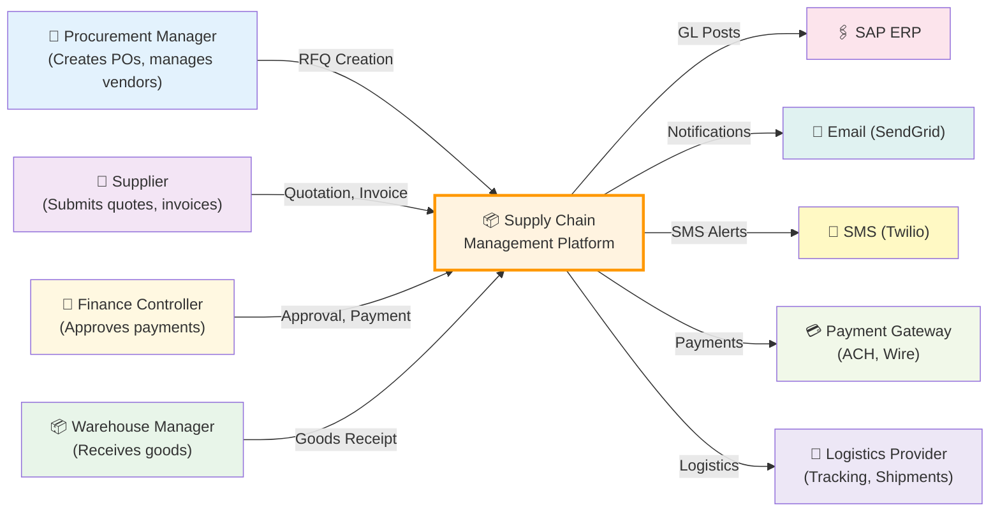

# Supply Chain Management Platform - C4 Diagrams

## C4 Context Level

External actors and systems interacting with SCMP:

## C4 Container Level

Major containers (applications/services) and their interactions:

```mermaid
graph TB
    subgraph "Client Applications"
        ProcUI["🖥️ Procurement Web UI<br/>(React, Material-UI)<br/>Port 3000"]
        SupplierPortal["🌐 Supplier Portal<br/>(React, Mobile)<br/>Port 3001"]
        ApprovalApp["✅ Approval Mobile App<br/>(React Native)<br/>iOS/Android"]
    end
    
    subgraph "API Layer"
        Gateway["🔌 API Gateway<br/>(Kong/AWS ALB)<br/>Port 443<br/>Rate limit, Auth, Routing"]
        AuthService["🔐 Auth Service<br/>(Keycloak)<br/>JWT, OAuth2, SAML"]
    end
    
    subgraph "Microservices"
        ProcService["🏗️ ProcurementService<br/>(Java/Go)<br/>RPC on port 8001"]
        SupplierService["🏢 SupplierService<br/>(Java/Go)<br/>RPC on port 8002"]
        ContractService["📋 ContractService<br/>(Java/Go)<br/>RPC on port 8003"]
        QuotationService["📊 QuotationService<br/>(Java/Go)<br/>RPC on port 8004"]
        GRNService["📦 GoodsReceiptService<br/>(Java/Go)<br/>RPC on port 8005"]
        InvoiceService["💰 InvoiceService<br/>(Java/Go)<br/>RPC on port 8006"]
        InventoryService["📊 InventoryService<br/>(Java/Go)<br/>RPC on port 8007"]
        NotificationService["🔔 NotificationService<br/>(Node.js)<br/>Kafka Consumer"]
    end
    
    subgraph "Data Storage"
        ProcDB["🗄️ PostgreSQL<br/>(Primary: us-east-1)<br/>Replica: us-west-2<br/>Backup: nightly"]
        Cache["⚡ Redis<br/>(Cluster Mode)<br/>Sessions, Cache"]
        ES["🔎 Elasticsearch<br/>(3 nodes)<br/>Supplier search index"]
        S3["☁️ S3<br/>(Documents)<br/>Contracts, Invoices, GRNs"]
    end
    
    subgraph "Message Broker"
        Kafka["📨 Kafka<br/>(3 brokers)<br/>Topics: requisition-, supplier-, invoice-, grn-, po-events<br/>7-day retention"]
    end
    
    subgraph "External Integrations"
        SAP["🖇️ SAP ERP<br/>(REST API)<br/>GL posting, Cost centers"]
        PaymentGW["💳 Payment Gateway<br/>(REST API)<br/>ACH, Wire transfer"]
        Email["📧 SendGrid<br/>(REST API)<br/>Email notifications"]
        SMS["📱 Twilio<br/>(REST API)<br/>SMS alerts"]
    end
    
    ProcUI --> Gateway
    SupplierPortal --> Gateway
    ApprovalApp --> Gateway
    
    Gateway --> AuthService
    Gateway --> ProcService
    Gateway --> SupplierService
    Gateway --> ContractService
    Gateway --> QuotationService
    Gateway --> GRNService
    Gateway --> InvoiceService
    Gateway --> InventoryService
    
    ProcService --> ProcDB
    SupplierService --> ProcDB
    ContractService --> ProcDB
    QuotationService --> ProcDB
    GRNService --> ProcDB
    InvoiceService --> ProcDB
    InventoryService --> ProcDB
    
    ProcService --> Cache
    SupplierService --> Cache
    
    SupplierService --> ES
    
    ContractService --> S3
    InvoiceService --> S3
    GRNService --> S3
    
    ProcService --> Kafka
    SupplierService --> Kafka
    ContractService --> Kafka
    QuotationService --> Kafka
    GRNService --> Kafka
    InvoiceService --> Kafka
    InventoryService --> Kafka
    
    Kafka --> NotificationService
    
    NotificationService --> Email
    NotificationService --> SMS
    
    InvoiceService --> PaymentGW
    
    ProcService --> SAP
    InventoryService --> SAP
    InvoiceService --> SAP
    
    style Gateway fill:#ffccbc,stroke:#ff5722
    style AuthService fill:#c8e6c9,stroke:#4caf50
    style ProcService fill:#fff9c4,stroke:#fbc02d
    style SupplierService fill:#ffe0b2,stroke:#ff9800
    style NotificationService fill:#f0f4c3,stroke:#827717
    style Kafka fill:#c5e1a5,stroke:#558b2f
    style ProcDB fill:#b3e5fc,stroke:#0277bd
    style SAP fill:#f8bbd0,stroke:#c2185b
    style PaymentGW fill:#e1bee7,stroke:#6a1b9a
```

## Key Integration Points

1. **Procurement Service** ↔ **SAP ERP**: PO posting to GL, cost center allocation
2. **Invoice Service** ↔ **Payment Gateway**: Payment instruction, settlement
3. **Goods Receipt Service** ↔ **Inventory Service**: Stock level updates
4. **All Services** ↔ **Kafka**: Event publication for notifications, analytics
5. **Supplier Service** ↔ **Elasticsearch**: Full-text search indexing
6. **Authentication**: Keycloak for SSO, SAML, OAuth2

