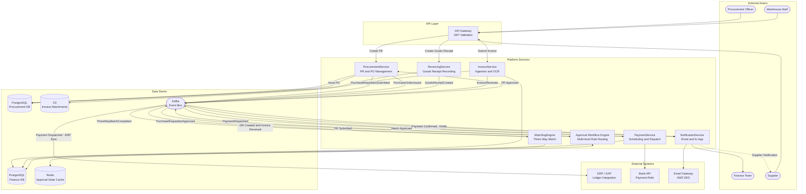
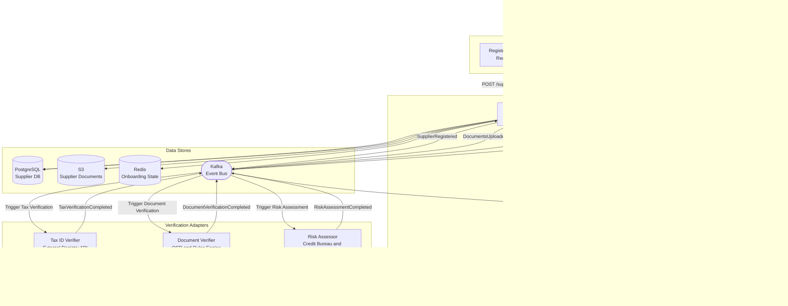
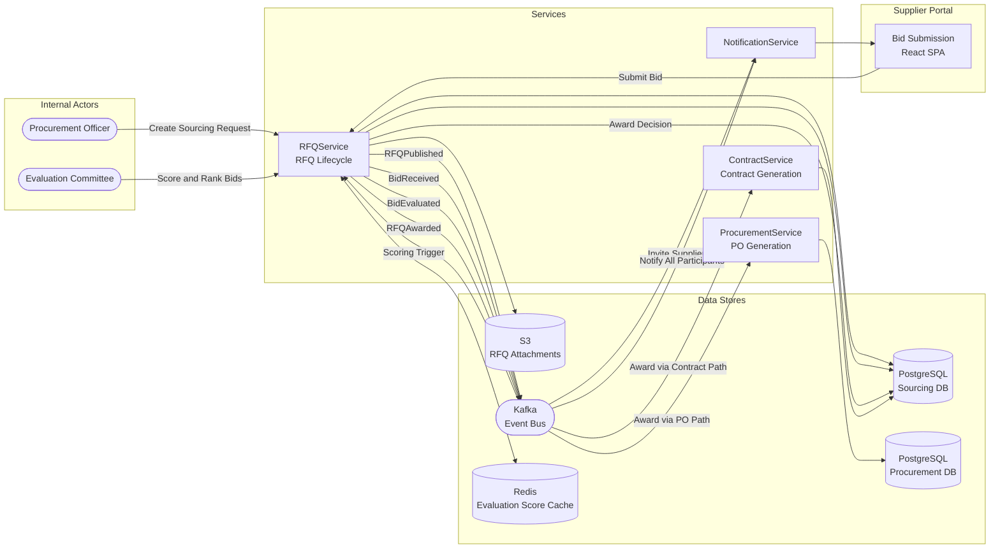
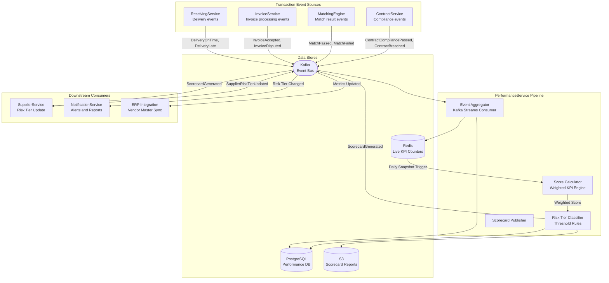

# Data Flow Diagrams — Supply Chain Management Platform

This document describes the movement of data across services, external systems, and
storage layers for the four principal workflows of the Supply Chain Management Platform.
Each diagram annotates both data in motion (Kafka events, REST payloads) and data at
rest (PostgreSQL schemas, Redis caches, Kafka topics, S3 buckets), together with the
actors who produce and consume each data element.

---

## Overview

| Flow | Initiating Actor | Terminal State | Primary Services |
|------|-----------------|----------------|-----------------|
| Procure-to-Pay | Procurement Officer | Payment Confirmed | ProcurementService, ReceivingService, InvoiceService, MatchingEngine, PaymentService |
| Supplier Onboarding | Supplier Representative | Supplier Activated | SupplierService, NotificationService |
| RFQ and Sourcing | Procurement Officer | Contract or PO Issued | RFQService, ProcurementService, ContractService |
| Performance Scoring | Platform Scheduler | Risk Tier Updated | PerformanceService, SupplierService, NotificationService |

All cross-service workflow progression is asynchronous via Kafka. Synchronous REST calls
through the API Gateway are reserved for user-facing queries and command submissions.
Services never call one another's REST APIs for workflow coordination.

---

## Procure-to-Pay Main Flow

The Procure-to-Pay (P2P) flow covers the complete lifecycle from an internal purchase
requisition raised by a procurement officer through goods receipt, invoice ingestion,
three-way matching, and final payment disbursement to the supplier.

### Key Event Payloads

| Stage | Kafka Event | Core Fields |
|-------|-------------|-------------|
| PR Creation | `PurchaseRequisitionSubmitted` | prId, requesterId, costCenter, lines[], totalAmount, currency |
| PR Approval | `PurchaseRequisitionApproved` | prId, approverId, approvedAt, approvalTier |
| PO Issuance | `PurchaseOrderIssued` | poId, prId, supplierId, lines[], deliveryDate, paymentTerms |
| Goods Receipt | `GoodsReceiptCreated` | grId, poId, receivedLines[], receivedAt, warehouseId |
| Invoice Submission | `InvoiceReceived` | invoiceId, supplierId, poId, lines[], invoiceDate, dueDate |
| Match Result | `ThreeWayMatchCompleted` | matchId, invoiceId, poId, grId, status, varianceAmount |
| Payment Dispatch | `PaymentDispatched` | paymentId, invoiceId, amount, currency, bankReference |

---

## Supplier Onboarding Data Flow

The supplier onboarding flow manages data collection, document verification, tax identity
checks, and risk assessment before a supplier is activated. Verification steps run in
parallel where data dependencies allow, with SupplierService acting as the saga
orchestrator that waits for all stage confirmations before enabling final qualification
review.

### Onboarding Stages and Data Requirements

| Stage | Data Collected | Validation Rule | Owner |
|-------|---------------|----------------|-------|
| Registration | Legal name, tax ID, country, currency, bank details | Tax ID format, no duplicate entity | SupplierService |
| Document Upload | Incorporation cert, bank confirmation letter, insurance | File type, expiry date, OCR confidence above 85% | SupplierService |
| Tax Verification | Tax ID cross-referenced against national registry | Status active, no outstanding liabilities | External Registry API |
| Document Verification | OCR-extracted entity name and registration number | Name matches registration record, similarity above 90% | Internal Rules Engine |
| Risk Assessment | Credit score, sanctions list screening, adverse media scan | Risk score below HIGH threshold | External Credit Bureau |
| Qualification Review | Aggregated verification results displayed to officer | Manual approval required for HIGH-risk classification | Procurement Officer |
| Activation | Supplier status set to ACTIVE, portal credentials provisioned | All prior stages must be PASSED | SupplierService |

---

## RFQ and Sourcing Data Flow

The RFQ flow supports competitive sourcing when no pre-negotiated contract is available.
It progresses from a procurement officer creating a sourcing event through supplier bid
submission, weighted evaluation, award decision, and onward conversion to either a
purchase order or a new contract in ContractService.

### RFQ Event Sequence

| Event | Producer | Consumers | Key Payload Fields |
|-------|----------|-----------|-------------------|
| `RFQPublished` | RFQService | NotificationService | rfqId, title, deadline, invitedSupplierIds[] |
| `BidReceived` | RFQService | RFQService (scoring) | rfqId, supplierId, quotationId, totalValue |
| `BidDeadlineReached` | RFQService (scheduled) | RFQService (lock bids) | rfqId, totalBidsReceived |
| `BidEvaluated` | RFQService | RFQService (ranking) | rfqId, quotationId, weightedScore, scoreBreakdown |
| `RFQAwarded` | RFQService | ProcurementService, ContractService, NotificationService | rfqId, awardedSupplierId, quotationId, awardType |
| `ContractGenerated` | ContractService | ProcurementService, NotificationService | contractId, supplierId, startDate, endDate, value |

---

## Performance Scoring Data Flow

The performance scoring flow runs as a continuous Kafka Streams pipeline, aggregating
transaction events emitted by ReceivingService, InvoiceService, MatchingEngine, and
ContractService into rolling KPI counters. PerformanceService publishes scorecards on
a scheduled basis (daily and quarterly), triggering risk tier reclassification in
SupplierService and downstream ERP synchronisation.

### KPI Weights and Scoring Dimensions

| KPI Dimension | Weight | Source Event | Measurement Formula |
|---------------|--------|-------------|---------------------|
| On-Time Delivery Rate | 30% | `DeliveryOnTime`, `DeliveryLate` | On-time deliveries / total deliveries |
| Quality Acceptance Rate | 25% | `GoodsReceiptCompleted` acceptance qty | Accepted qty / total received qty |
| Invoice Accuracy Rate | 20% | `ThreeWayMatchCompleted` first-pass flag | First-pass match count / total invoices |
| Responsiveness | 15% | `BidReceived` vs `RFQPublished` timing | Responses within deadline / invitations sent |
| Contract Compliance | 10% | `ContractCompliancePassed` per milestone | Compliant milestones / total milestones |

Risk tier thresholds applied by the classifier:

| Score Range | Risk Tier | Effect |
|-------------|-----------|--------|
| 85 – 100 | PREFERRED | Expedited payment terms, auto-approval for low-value POs |
| 70 – 84 | STANDARD | Normal approval workflow |
| 50 – 69 | MONITORED | Enhanced review required for POs above USD 10,000 |
| 0 – 49 | HIGH_RISK | All POs require CFO approval, sourcing team alerted |

---

## Data Classification

All data traversing the platform is assigned to one of three tiers governing encryption
requirements, API response masking, and retention periods.

### Classification Tiers

| Tier | Label | Description | Examples |
|------|-------|-------------|---------|
| Tier 1 | PII | Personally identifiable information | Supplier contact names, email addresses, bank account numbers, signatory details |
| Tier 2 | Financial | Commercially sensitive financial data | Invoice amounts, payment references, contract pricing, credit limits, negotiated rates |
| Tier 3 | Operational | Business process and transaction metadata | PO identifiers, delivery dates, GR quantities, match statuses, RFQ IDs |

### Controls by Tier

| Control | Tier 1 — PII | Tier 2 — Financial | Tier 3 — Operational |
|---------|-------------|-------------------|---------------------|
| Encryption at rest | AES-256, column-level encryption | AES-256, table-level encryption | AES-256, volume-level |
| Encryption in transit | TLS 1.3 mandatory | TLS 1.3 mandatory | TLS 1.3 mandatory |
| Kafka message protection | Field-level encryption before produce | Payload encryption | Standard TLS transport |
| API response masking | PII fields masked for non-owning roles | Financial fields restricted by role | Full access for authorised roles |
| Retention period | 7 years (regulatory obligation) | 10 years (financial audit trail) | 3 years operational |
| S3 storage class | Intelligent-Tiering + SSE-KMS | Intelligent-Tiering + SSE-KMS | S3 Standard |
| Access control | Row-level security scoped to org_id | Column-level permissions by role | Standard RBAC |

### Kafka Topic Data Classification

| Topic | Classification | PII Present | Protection |
|-------|---------------|------------|-----------|
| `scm.procurement.pr.events` | Tier 3 | No | TLS transport |
| `scm.procurement.po.events` | Tier 2 | No | Payload encryption |
| `scm.supplier.onboarding.events` | Tier 1 | Yes | Field-level encryption |
| `scm.finance.invoice.events` | Tier 2 | No | Payload encryption |
| `scm.finance.payment.events` | Tier 2 | Yes | Field-level encryption |
| `scm.performance.scorecard.events` | Tier 3 | No | TLS transport |
| `scm.notification.dispatch.events` | Tier 1 | Yes | Field-level encryption |
| `scm.sourcing.rfq.events` | Tier 2 / Tier 3 | No | Payload encryption |
| `scm.contract.lifecycle.events` | Tier 2 | No | Payload encryption |

### S3 Bucket Classification

| Bucket | Purpose | Classification | Lifecycle Policy |
|--------|---------|---------------|-----------------|
| `scm-supplier-documents` | KYC documents, certificates of incorporation | Tier 1 / Tier 2 | Transition to Glacier after 1 year |
| `scm-invoice-attachments` | PDF invoices, OCR extraction outputs | Tier 2 | Transition to Glacier after 2 years |
| `scm-rfq-attachments` | RFQ specifications, bid response documents | Tier 2 / Tier 3 | Delete after 7 years |
| `scm-performance-reports` | Supplier scorecards and trend reports | Tier 3 | Delete after 5 years |
| `scm-audit-exports` | Compliance audit packages and exports | Tier 2 | Glacier Deep Archive after 1 year |
| `scm-contract-documents` | Signed contracts and amendments | Tier 2 | Glacier after 3 years, delete after 15 years |
