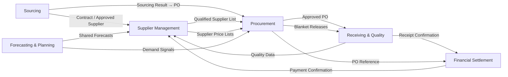

# Domain Model — Supply Chain Management Platform

This document defines the bounded contexts, core entities, their relationships, and the
domain events that flow between contexts. It is the authoritative reference for
understanding how the business domain is carved up into independently deployable units.

---

## 1. Bounded Contexts

### 1.1 Supplier Management
Responsible for the complete lifecycle of a supplier — from initial invitation through
qualification, ongoing performance monitoring, and eventual suspension or disqualification.
Owns: `Supplier`, `SupplierContact`, `SupplierQualification`, `SLAContract`,
`SupplierDocument`, `SupplierPerformance`, `KPIMetric`.

### 1.2 Procurement
Covers the source-to-order process: raising purchase requisitions, multi-level approval,
price negotiation (RFQ/RFP/reverse auction), and issuance of purchase orders including
blanket orders and change orders.
Owns: `PurchaseRequest`, `PRLine`, `PurchaseOrder`, `POLine`, `ChangeOrder`,
`ApprovalWorkflow`, `BlanketOrder`, `BlanketRelease`.

### 1.3 Receiving & Quality
Covers the physical receipt of goods, quality inspection, and discrepancy recording.
Owns: `POReceipt`, `ReceiptLine`, `QualityInspection`, `NonConformanceReport`.

### 1.4 Financial Settlement
Covers invoice processing, three-way matching, dispute management, payment scheduling,
and ledger integration.
Owns: `Invoice`, `InvoiceLine`, `InvoiceMatching`, `Dispute`, `Payment`, `PaymentRun`.

### 1.5 Sourcing
Covers structured sourcing events: RFQ, RFP, and reverse auctions. Manages supplier
responses, scoring, and award decisions that feed back into Procurement as contracts
or approved supplier lists.
Owns: `RFQ`, `RFQLine`, `RFQResponse`, `Contract`, `ContractLine`, `AwardDecision`.

### 1.6 Forecasting & Planning
Shares demand signals with suppliers, captures supplier confirmations, and performs
variance analysis to improve procurement planning accuracy.
Owns: `Forecast`, `ForecastPeriod`, `ForecastCollaboration`, `ForecastVariance`,
`DemandSignal`.

---

## 2. Core Entity Relationships

```mermaid
classDiagram
    direction LR

    class Organization {
        +String id
        +String name
        +String country
        +String currency
        +String taxId
        +Boolean isLegalEntity
    }

    class Supplier {
        +String id
        +String legalName
        +String tradeName
        +String taxId
        +String country
        +String currency
        +SupplierStatus status
        +SupplierTier tier
        +Date qualifiedAt
        +qualify()
        +suspend(reason)
        +disqualify(reason)
    }

    class SupplierContact {
        +String id
        +String supplierId
        +String name
        +String email
        +String phone
        +ContactRole role
        +Boolean isPrimary
    }

    class SupplierQualification {
        +String id
        +String supplierId
        +QualificationStatus status
        +Date reviewDate
        +String reviewedBy
        +String[] requiredDocuments
        +String[] uploadedDocuments
        +String notes
        +approve()
        +reject(reason)
    }

    class ItemMaster {
        +String id
        +String itemCode
        +String description
        +String categoryCode
        +String uomId
        +Boolean isPurchaseable
        +Boolean isActive
        +Decimal leadTimeDays
    }

    class PriceList {
        +String id
        +String supplierId
        +String currency
        +Date validFrom
        +Date validTo
        +Boolean isActive
    }

    class PriceListLine {
        +String id
        +String priceListId
        +String itemId
        +Decimal unitPrice
        +Decimal minQty
        +Decimal maxQty
        +Decimal discountPct
    }

    class PurchaseRequest {
        +String id
        +String requestorId
        +String orgId
        +PRStatus status
        +Date neededBy
        +String costCenter
        +Decimal estimatedTotal
        +String currency
        +submit()
        +approve(level)
        +reject(reason)
        +convertToPO()
    }

    class PRLine {
        +String id
        +String prId
        +String itemId
        +Decimal quantity
        +String uomId
        +Decimal estimatedUnitPrice
        +String preferredSupplierId
    }

    class PurchaseOrder {
        +String id
        +String prId
        +String supplierId
        +String orgId
        +POStatus status
        +Date orderDate
        +Date deliveryDate
        +Decimal totalAmount
        +String currency
        +send()
        +acknowledge()
        +createChangeOrder()
        +close()
        +cancel(reason)
    }

    class POLine {
        +String id
        +String poId
        +String itemId
        +Decimal orderedQty
        +Decimal receivedQty
        +Decimal unitPrice
        +String uomId
        +Date promisedDate
        +Decimal openQty()
    }

    class POReceipt {
        +String id
        +String poId
        +String warehouseId
        +Date receiptDate
        +String receivedBy
        +ReceiptStatus status
        +createQualityInspection()
    }

    class ReceiptLine {
        +String id
        +String receiptId
        +String poLineId
        +Decimal receivedQty
        +Decimal acceptedQty
        +Decimal rejectedQty
        +String lotNumber
    }

    class QualityInspection {
        +String id
        +String receiptId
        +InspectionResult result
        +String inspector
        +Date inspectionDate
        +String[] failureReasons
        +Decimal sampleSize
        +Decimal defectCount
    }

    class Invoice {
        +String id
        +String supplierId
        +String poId
        +InvoiceStatus status
        +String invoiceNumber
        +Date invoiceDate
        +Decimal totalAmount
        +String currency
        +triggerMatch()
        +approve()
        +dispute(reason)
        +markPaid(paymentRef)
    }

    class InvoiceMatching {
        +String id
        +String invoiceId
        +String poId
        +String receiptId
        +MatchStatus status
        +Decimal varianceAmount
        +String[] discrepancies
        +Decimal confidenceScore
    }

    class Payment {
        +String id
        +String invoiceId
        +Decimal amount
        +String currency
        +PaymentStatus status
        +Date scheduledDate
        +Date executedDate
        +String paymentRef
        +String paymentMethod
    }

    class Contract {
        +String id
        +String supplierId
        +String rfqId
        +ContractType type
        +ContractStatus status
        +Date startDate
        +Date endDate
        +Decimal totalValue
        +String currency
        +renew()
        +terminate(reason)
    }

    class RFQ {
        +String id
        +String orgId
        +RFQType type
        +RFQStatus status
        +Date publishDate
        +Date closeDate
        +String currency
        +publish()
        +award(supplierId)
        +close()
    }

    class BlanketOrder {
        +String id
        +String supplierId
        +String contractId
        +BlanketStatus status
        +Date startDate
        +Date endDate
        +Decimal totalCommitment
        +Decimal releasedAmount
        +createRelease()
        +availableBalance()
    }

    class Forecast {
        +String id
        +String orgId
        +String itemId
        +ForecastStatus status
        +Date periodStart
        +Date periodEnd
        +Decimal forecastQty
        +String currency
        +shareWithSupplier(supplierId)
    }

    class ForecastCollaboration {
        +String id
        +String forecastId
        +String supplierId
        +Decimal confirmedQty
        +Decimal varianceQty
        +CollabStatus status
        +Date respondedAt
    }

    class SupplierPerformance {
        +String id
        +String supplierId
        +Date scoringPeriod
        +Decimal otdScore
        +Decimal qualityScore
        +Decimal complianceScore
        +Decimal compositeScore
        +SupplierTier tier
    }

    Organization "1" --> "many" PurchaseRequest : raises
    Organization "1" --> "many" PurchaseOrder : issues
    Supplier "1" --> "many" SupplierContact : has
    Supplier "1" --> "1" SupplierQualification : undergoes
    Supplier "1" --> "many" PriceList : provides
    Supplier "1" --> "many" SupplierPerformance : scored by
    PriceList "1" --> "many" PriceListLine : contains
    PriceListLine "many" --> "1" ItemMaster : references
    PurchaseRequest "1" --> "many" PRLine : contains
    PurchaseRequest "1" --> "0..1" PurchaseOrder : converts to
    PurchaseOrder "1" --> "many" POLine : contains
    PurchaseOrder "1" --> "many" POReceipt : fulfilled by
    POReceipt "1" --> "many" ReceiptLine : contains
    POReceipt "1" --> "0..1" QualityInspection : inspected via
    Invoice "1" --> "1" InvoiceMatching : matched through
    Invoice "1" --> "0..1" Payment : settled by
    Contract "1" --> "0..many" BlanketOrder : governs
    RFQ "0..1" --> "1" Contract : results in
    Forecast "1" --> "many" ForecastCollaboration : shared via
    Supplier "1" --> "many" RFQ : responds to
```

---

## 3. Context Interaction Map

---

## 4. Domain Events Between Contexts

| Event | Source Context | Consumer Contexts | Payload Summary |
|---|---|---|---|
| `SupplierQualified` | Supplier Management | Procurement, Sourcing | supplierId, tier, qualifiedAt |
| `SupplierSuspended` | Supplier Management | Procurement | supplierId, reason, suspendedAt |
| `PRApproved` | Procurement | Procurement (PO creation) | prId, approvedBy, totalAmount |
| `POSent` | Procurement | Receiving, Supplier Mgmt | poId, supplierId, expectedDelivery |
| `POAcknowledged` | Procurement | Forecasting, Supplier Mgmt | poId, confirmedDeliveryDate |
| `GoodsReceived` | Receiving & Quality | Financial Settlement, Supplier Mgmt | receiptId, poId, receivedQty |
| `QualityFailed` | Receiving & Quality | Supplier Management | receiptId, supplierId, defectCount |
| `InvoiceMatched` | Financial Settlement | Procurement | invoiceId, poId, matchStatus |
| `PaymentExecuted` | Financial Settlement | Supplier Management | paymentId, invoiceId, amount |
| `ScoringRunCompleted` | Supplier Management | Procurement, Sourcing | runDate, supplierScores[] |
| `ContractAwarded` | Sourcing | Procurement, Supplier Mgmt | contractId, supplierId, value |
| `ForecastShared` | Forecasting & Planning | Supplier Management | forecastId, supplierId, qty |
| `ForecastConfirmed` | Supplier Management | Forecasting & Planning | forecastId, confirmedQty |
| `BlanketReleaseCreated` | Procurement | Receiving | releaseId, blanketOrderId, qty |
