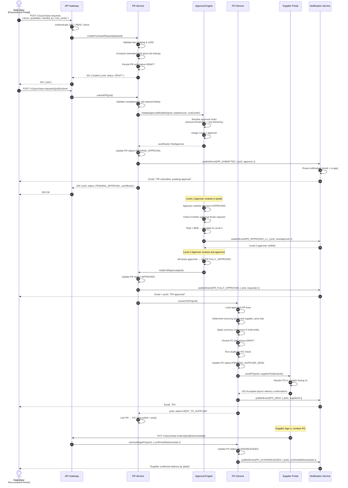
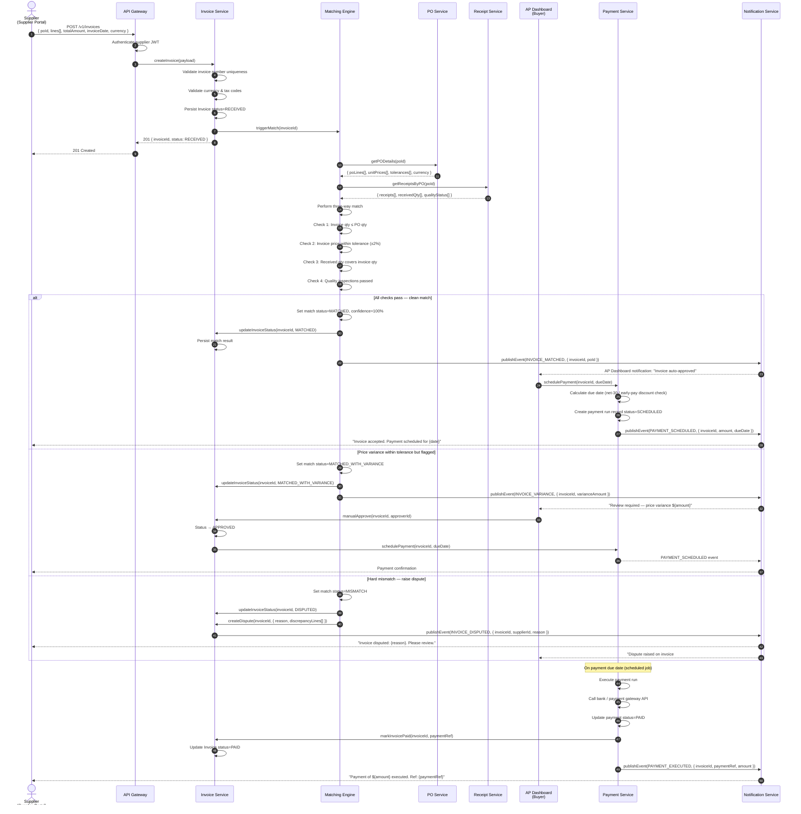
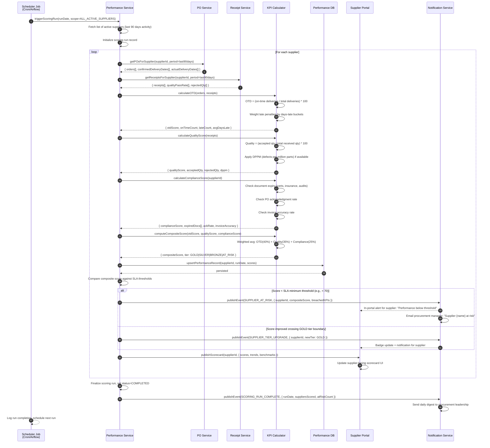

# System Sequence Diagrams — Supply Chain Management Platform

These diagrams capture the system-level interactions between external actors and major
internal services. They are intentionally kept at the boundary level; detailed internal
service interactions are documented in `detailed-design/sequence-diagrams.md`.

---

## 1. Purchase Requisition to PO Issuance

A requester raises a purchase requisition through the procurement portal. The PR passes
through multi-level approval before the PO Service converts the approved PR into a
purchase order, sends it to the supplier portal, and notifies all stakeholders.

---

## 2. Three-Way Invoice Matching

The supplier submits an invoice via the portal. The Matching Engine correlates the
invoice against the corresponding purchase order and goods receipt. On a clean match the
invoice is auto-approved and queued for payment; on a discrepancy a dispute ticket is
raised.

---

## 3. Supplier Performance Scoring

A nightly scheduled job triggers the Performance Service to recompute KPI scores for
all active suppliers. Scores are persisted, surfaced on the supplier portal, and alerts
are sent for suppliers breaching SLA thresholds.

---

## Summary

| Diagram | Key Integration Points | Async Events Published |
|---|---|---|
| PR → PO Issuance | PR Service, Approval Engine, PO Service | PR_SUBMITTED, PR_FULLY_APPROVED, PO_SENT, PO_ACKNOWLEDGED |
| Three-Way Matching | Invoice Service, Matching Engine, PO/Receipt | INVOICE_MATCHED, INVOICE_DISPUTED, PAYMENT_SCHEDULED, PAYMENT_EXECUTED |
| Performance Scoring | Performance Service, KPI Calculator, Supplier Portal | SUPPLIER_AT_RISK, SUPPLIER_TIER_UPGRADE, SCORING_RUN_COMPLETE |
