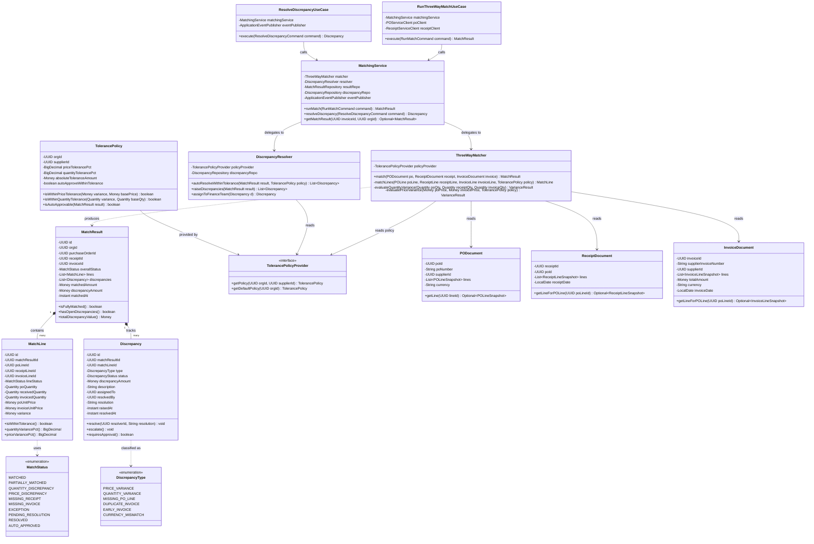

# C4 Level 4 — Code Diagrams: Supply Chain Management Platform

## Overview

This document provides C4 Model Level 4 (Code) diagrams for two critical modules of the SCMP backend:

1. **PO Service Domain Module** — the core domain for purchase order lifecycle management, including change order control.
2. **Matching Engine Module** — the three-way matching engine that reconciles Purchase Orders, Goods Receipts, and Supplier Invoices.

These diagrams illustrate class-level structure, interfaces (ports), domain events, and the relationships between use cases, domain objects, and infrastructure adapters.

---

## Module 1: PO Service — Domain Module

### Package Structure

```
com.scmp.po/
├── domain/
│   ├── model/
│   │   ├── PurchaseOrder.java
│   │   ├── POLine.java
│   │   ├── ChangeOrder.java
│   │   ├── ChangeOrderLine.java
│   │   └── POVersion.java
│   ├── valueobject/
│   │   ├── PONumber.java
│   │   ├── Money.java
│   │   ├── Quantity.java
│   │   ├── DeliveryWindow.java
│   │   └── POStatus.java (enum)
│   ├── event/
│   │   ├── PurchaseOrderCreatedEvent.java
│   │   ├── PurchaseOrderApprovedEvent.java
│   │   ├── ChangeOrderIssuedEvent.java
│   │   └── PurchaseOrderCancelledEvent.java
│   ├── repository/
│   │   └── PurchaseOrderRepository.java  (port/interface)
│   └── service/
│       └── POVersioningService.java
├── application/
│   ├── CreatePOUseCase.java
│   ├── ApprovePOUseCase.java
│   ├── IssueChangeOrderUseCase.java
│   ├── CancelPOUseCase.java
│   └── command/
│       ├── CreatePOCommand.java
│       ├── ApprovePOCommand.java
│       └── IssueChangeOrderCommand.java
└── infrastructure/
    ├── JpaPurchaseOrderRepository.java
    ├── PurchaseOrderMapper.java
    ├── PurchaseOrderEntity.java
    └── KafkaPOEventPublisher.java
```

### Class Diagram — PO Service Domain

```mermaid
classDiagram
    class PurchaseOrder {
        -UUID id
        -UUID orgId
        -PONumber poNumber
        -UUID supplierId
        -POStatus status
        -int version
        -List~POLine~ lines
        -List~ChangeOrder~ changeOrders
        -Money totalAmount
        -String currency
        -DeliveryWindow deliveryWindow
        -UUID createdBy
        -Instant createdAt
        +static create(CreatePOCommand) PurchaseOrder
        +approve(UUID approverId) void
        +issueChangeOrder(IssueChangeOrderCommand) ChangeOrder
        +cancel(String reason) void
        +calculateTotal() Money
        +isModifiable() boolean
        +getActiveLines() List~POLine~
        +registerEvent(DomainEvent) void
        +pullDomainEvents() List~DomainEvent~
    }

    class POLine {
        -UUID id
        -UUID purchaseOrderId
        -int lineNumber
        -UUID itemId
        -String itemDescription
        -Quantity orderedQuantity
        -Quantity receivedQuantity
        -Money unitPrice
        -String uom
        -UUID priceListId
        +calculateLineTotal() Money
        +isFullyReceived() boolean
        +remainingQuantity() Quantity
    }

    class ChangeOrder {
        -UUID id
        -UUID purchaseOrderId
        -int changeOrderNumber
        -ChangeOrderStatus status
        -String reason
        -List~ChangeOrderLine~ lines
        -UUID requestedBy
        -Instant requestedAt
        -UUID acknowledgedBy
        -Instant acknowledgedAt
        +acknowledge(UUID supplierId) void
        +reject(String reason) void
        +isAcknowledged() boolean
    }

    class ChangeOrderLine {
        -UUID id
        -UUID changeOrderId
        -UUID originalPOLineId
        -ChangeType changeType
        -Quantity previousQuantity
        -Quantity newQuantity
        -Money previousUnitPrice
        -Money newUnitPrice
        -String justification
    }

    class POVersion {
        -UUID id
        -UUID purchaseOrderId
        -int versionNumber
        -POStatus statusAtVersion
        -JsonNode snapshotData
        -Instant createdAt
        -UUID createdBy
        +static captureSnapshot(PurchaseOrder) POVersion
    }

    class PONumber {
        -String value
        -static Pattern FORMAT
        +static generate(String orgPrefix, long sequence) PONumber
        +static of(String raw) PONumber
        +getValue() String
    }

    class Money {
        -BigDecimal amount
        -String currency
        +add(Money other) Money
        +multiply(BigDecimal factor) Money
        +isGreaterThan(Money other) boolean
        +isZero() boolean
        +negate() Money
    }

    class Quantity {
        -BigDecimal value
        -String uom
        +add(Quantity other) Quantity
        +subtract(Quantity other) Quantity
        +isGreaterThan(Quantity other) boolean
        +convertTo(String targetUom, BigDecimal conversionFactor) Quantity
    }

    class DeliveryWindow {
        -LocalDate requestedDate
        -LocalDate promisedDate
        -String deliverToLocation
        +isLate(LocalDate actualDate) boolean
        +daysLate(LocalDate actualDate) int
    }

    class POStatus {
        <<enumeration>>
        DRAFT
        PENDING_APPROVAL
        APPROVED
        SENT_TO_SUPPLIER
        PARTIALLY_RECEIVED
        FULLY_RECEIVED
        INVOICED
        CLOSED
        CANCELLED
        CHANGE_ORDER_PENDING
    }

    class PurchaseOrderRepository {
        <<interface>>
        +save(PurchaseOrder po) PurchaseOrder
        +findById(UUID id, UUID orgId) Optional~PurchaseOrder~
        +findByPoNumber(PONumber number, UUID orgId) Optional~PurchaseOrder~
        +findBySupplierId(UUID supplierId, UUID orgId, Pageable page) Page~PurchaseOrder~
        +findByStatus(POStatus status, UUID orgId, Pageable page) Page~PurchaseOrder~
        +existsByIdempotencyKey(String key) boolean
    }

    class POVersioningService {
        +captureVersion(PurchaseOrder po) POVersion
        +getVersionHistory(UUID poId, UUID orgId) List~POVersion~
        +restoreVersion(UUID poId, int versionNumber, UUID orgId) PurchaseOrder
    }

    class CreatePOUseCase {
        -PurchaseOrderRepository repository
        -POVersioningService versioningService
        -ApplicationEventPublisher eventPublisher
        +execute(CreatePOCommand command) PurchaseOrder
    }

    class IssueChangeOrderUseCase {
        -PurchaseOrderRepository repository
        -POVersioningService versioningService
        -ApplicationEventPublisher eventPublisher
        +execute(IssueChangeOrderCommand command) ChangeOrder
    }

    class ApprovePOUseCase {
        -PurchaseOrderRepository repository
        -ApprovalWorkflowService approvalService
        -ApplicationEventPublisher eventPublisher
        +execute(ApprovePOCommand command) PurchaseOrder
    }

    class PurchaseOrderCreatedEvent {
        -UUID purchaseOrderId
        -UUID orgId
        -UUID supplierId
        -Money totalAmount
        -Instant occurredAt
    }

    class ChangeOrderIssuedEvent {
        -UUID changeOrderId
        -UUID purchaseOrderId
        -UUID orgId
        -int changeOrderNumber
        -List~UUID~ affectedLineIds
        -Instant occurredAt
    }

    PurchaseOrder "1" *-- "many" POLine : contains
    PurchaseOrder "1" *-- "many" ChangeOrder : tracks
    PurchaseOrder "1" *-- "1" DeliveryWindow : schedules
    POLine "1" *-- "1" Quantity : orderedQuantity
    POLine "1" *-- "1" Money : unitPrice
    ChangeOrder "1" *-- "many" ChangeOrderLine : modifies
    PurchaseOrder ..> POStatus : uses
    PurchaseOrder ..> PONumber : identified by
    CreatePOUseCase --> PurchaseOrderRepository : uses
    CreatePOUseCase ..> PurchaseOrderCreatedEvent : publishes
    IssueChangeOrderUseCase --> PurchaseOrderRepository : uses
    IssueChangeOrderUseCase ..> ChangeOrderIssuedEvent : publishes
    ApprovePOUseCase --> PurchaseOrderRepository : uses
    POVersioningService ..> POVersion : creates
```



---

## Module 2: Matching Engine — Three-Way Match Module

### Package Structure

```
com.scmp.matching/
├── domain/
│   ├── model/
│   │   ├── MatchResult.java
│   │   ├── MatchLine.java
│   │   └── Discrepancy.java
│   ├── valueobject/
│   │   ├── MatchStatus.java (enum)
│   │   ├── DiscrepancyType.java (enum)
│   │   └── TolerancePolicy.java
│   ├── service/
│   │   ├── ThreeWayMatcher.java
│   │   └── DiscrepancyResolver.java
│   └── repository/
│       ├── MatchResultRepository.java
│       └── DiscrepancyRepository.java
├── application/
│   ├── RunThreeWayMatchUseCase.java
│   ├── ResolveDiscrepancyUseCase.java
│   └── command/
│       ├── RunMatchCommand.java
│       └── ResolveDiscrepancyCommand.java
└── infrastructure/
    ├── JpaMatchResultRepository.java
    ├── KafkaMatchEventPublisher.java
    └── POServiceClient.java         (Feign client — reads PO data)
```

### Class Diagram — Matching Engine



---

## Key Design Decisions

1. **Immutable snapshots at match time**: `PODocument`, `ReceiptDocument`, and `InvoiceDocument` are immutable snapshot objects constructed at match initiation. The matching engine never reads live transactional data mid-match to avoid race conditions.

2. **Tolerance policy is supplier-scoped**: Different suppliers have different negotiated tolerance thresholds. The `TolerancePolicyProvider` interface allows policy lookup by `(orgId, supplierId)` with fallback to org-level defaults.

3. **Domain events over direct calls**: When a `MatchResult` is saved, the `MatchingService` publishes `MatchCompletedEvent` and `DiscrepancyRaisedEvent` via Kafka. Downstream services (Invoice Service, Notification Service) react independently.

4. **Change orders invalidate existing matches**: When a `ChangeOrderIssuedEvent` is consumed, the Matching Engine marks any `MATCHED` or `PENDING_RESOLUTION` `MatchResult` for the affected PO as `STALE`, triggering a re-match once the change order is acknowledged.
