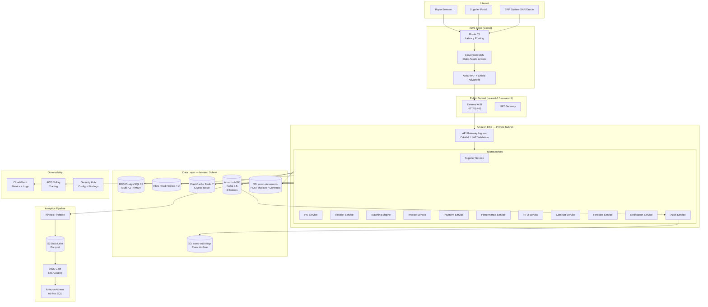

# Cloud Architecture — Supply Chain Management Platform

## Overview

The Supply Chain Management Platform (SCMP) is deployed on AWS using a cloud-native, microservices-first architecture. The platform serves B2B procurement teams and their supplier networks, requiring high availability, strong data isolation per organization, and regulatory compliance (SOC 2 Type II, ISO 27001, GDPR). All workloads run inside a dedicated AWS Organization account with SCPs enforcing tagging, region restrictions, and IAM boundaries.

---

## Core Design Principles

- **Multi-AZ by default**: Every stateful service (RDS, ElastiCache, MSK, OpenSearch) is deployed across at least three Availability Zones.
- **Zero-trust networking**: No service exposes a public IP. All inter-service traffic travels over VPC private subnets via internal ALBs or service meshes.
- **Data sovereignty**: EU-based supplier data is stored exclusively in `eu-west-1` (Ireland). The primary deployment region is `us-east-1`, with an active-active configuration for the EU data plane.
- **Immutable infrastructure**: All infrastructure is managed via Terraform modules. Manual changes to production are blocked by SCPs.
- **Defense in depth**: WAF → API Gateway → ALB → EKS Ingress → Pod-level network policies form concentric security rings.

---

## AWS Services Reference Table

| Service | AWS Resource | Purpose | SLA | Notes |
|---|---|---|---|---|
| Compute | Amazon EKS 1.29 | Microservices runtime (12 services) | 99.95% | Managed node groups; Karpenter autoscaler |
| Relational DB | RDS PostgreSQL 15 Multi-AZ | Transactional data (orders, invoices, receipts) | 99.95% | Multi-AZ Standby; automated failover < 60 s |
| Read Replicas | RDS Read Replica × 2 | Reporting and analytics queries | — | Lag < 5 s; used by Forecast and KPI services |
| Cache | ElastiCache Redis 7 (Cluster Mode) | Session state, rate limiting, idempotency keys, PO locks | 99.99% | 3-shard × 2-replica; TLS in transit |
| Messaging | Amazon MSK (Kafka 3.5) | Domain event bus, async workflows | 99.9% | 3-broker cluster; m5.2xlarge; 7-day retention |
| Object Storage | Amazon S3 (Standard + IA) | PO documents, invoices, contracts, ASNs, audit logs | 99.99% | Versioning enabled; lifecycle → Glacier 365 d |
| CDN | Amazon CloudFront | Supplier portal static assets, document download acceleration | 99.99% | WAF rules attached; signed URLs for document access |
| DNS | Amazon Route 53 | Public DNS, health-check-based failover | 100% | Latency routing for US/EU endpoints |
| DDoS Protection | AWS Shield Advanced + WAF | Layer 3/4/7 DDoS protection, OWASP Top 10 | — | WAF managed rules: Core, SQLi, XSS |
| Secrets | AWS Secrets Manager | DB credentials, OAuth client secrets, API keys | 99.99% | Auto-rotation every 30 days |
| Encryption Keys | AWS KMS (CMK) | Envelope encryption for S3, RDS, MSK, EBS | 99.999% | Key per data classification; CloudTrail logs all key usage |
| Observability | Amazon CloudWatch | Metrics, alarms, dashboards, log groups | 99.9% | Container Insights for EKS nodes/pods |
| Distributed Tracing | AWS X-Ray + OpenTelemetry | End-to-end trace correlation across services | — | Trace sampling: 5% normal, 100% on errors |
| Streaming Analytics | Kinesis Data Firehose | Real-time event streaming to S3 data lake | 99.9% | Batch interval: 60 s / 128 MB |
| Data Lake | Amazon S3 + AWS Glue + Amazon Athena | Analytics pipeline for KPIs, forecasting, supplier scoring | — | Parquet format; partitioned by org/year/month/day |
| Container Registry | Amazon ECR | Docker image storage and scanning | 99.9% | Image scanning on push; lifecycle: keep last 30 tags |
| Service Mesh | AWS App Mesh (Envoy) | mTLS inter-service communication, traffic shaping | — | Canary deployments; circuit breakers |
| Secrets Injection | AWS Secrets Manager + External Secrets Operator | Kubernetes secret synchronization | — | Rotated secrets propagate within 5 minutes |
| Email | Amazon SES | Transactional emails (PO approvals, supplier notifications) | 99.9% | Dedicated IP pool for procurement domain |
| Load Balancing | AWS ALB (internal + external) | HTTP/2, path-based routing, WAF integration | 99.99% | External: supplier portal; Internal: microservice mesh |
| Autoscaling | Karpenter + HPA + KEDA | Node and pod autoscaling | — | KEDA scales consumers based on Kafka lag |
| Backup | AWS Backup | Cross-region backup orchestration | — | Daily snapshots retained 35 days; weekly → 1 year |
| Compliance | AWS Config + Security Hub | Continuous compliance rules, CIS Benchmark | — | Auto-remediation for S3 public-access violations |

---

## Network Topology

### VPC Design

```
CIDR: 10.0.0.0/16  (us-east-1)
CIDR: 10.1.0.0/16  (eu-west-1)

Subnets (per AZ × 3):
  Public:   10.0.0.0/24   — NAT Gateways, external ALB
  Private:  10.0.10.0/22  — EKS worker nodes, RDS, ElastiCache
  Isolated: 10.0.20.0/24  — RDS Primary, MSK brokers (no internet route)
```

- Transit Gateway connects US and EU VPCs for cross-region replication traffic.
- VPC Flow Logs → CloudWatch Logs → 90-day retention.
- PrivateLink endpoints for S3, ECR, Secrets Manager, KMS, STS (no NAT required for AWS API calls).

---

## Full Cloud Architecture Diagram



---

## High Availability & Disaster Recovery

### RTO / RPO Targets

| Tier | Services | RTO | RPO | Strategy |
|---|---|---|---|---|
| Tier 0 — Critical | PO Service, Payment Service, Matching Engine | < 15 min | < 1 min | Multi-AZ, automated RDS failover, Redis AOF |
| Tier 1 — Core | Supplier Service, Receipt Service, Invoice Service | < 1 hour | < 15 min | Multi-AZ, async replication |
| Tier 2 — Business | RFQ, Contract, Forecast, Performance | < 4 hours | < 1 hour | Nightly cross-region snapshot restore |
| Tier 3 — Support | Audit Service, Notification Service | < 8 hours | < 4 hours | Daily backup restore |

### Failover Mechanisms

- **RDS**: Automatic Multi-AZ failover; DNS CNAME updates within 60 seconds. All services use the CNAME endpoint.
- **Redis**: ElastiCache automatic primary election; failover < 30 seconds. Application-level retry with exponential backoff.
- **MSK**: Kafka partition leader election is automatic. Consumers reconnect within 10 seconds via consumer group rebalance.
- **EKS Nodes**: Karpenter replaces unhealthy nodes within 2 minutes. PodDisruptionBudgets ensure ≥ 2 replicas available during voluntary disruptions.

---

## Data Sovereignty — Multi-Region EU Configuration

European suppliers and their personal data (GDPR Article 4) are stored exclusively in `eu-west-1`. Implementation:

1. **Routing**: API Gateway routes requests with `X-Tenant-Region: EU` header to EU EKS cluster.
2. **Database**: Separate RDS cluster in `eu-west-1`. No cross-region replication of EU PII to US.
3. **S3**: EU supplier documents stored in `s3://scmp-documents-eu-west-1` bucket with `aws:RequestedRegion` condition keys.
4. **KMS**: EU data encrypted with a CMK residing only in `eu-west-1` (key cannot be replicated).
5. **Audit Logs**: EU audit trail stored in `s3://scmp-audit-eu-west-1` — accessible by EU Data Protection Officer only.
6. **Data Transfer**: Anonymized/aggregated analytics (no PII) may be replicated to US for global reporting via Kinesis Firehose.

---

## Cost Optimization Strategy

| Category | Approach | Estimated Saving |
|---|---|---|
| EKS Worker Nodes | 60% On-Demand + 40% Spot (batch/stateless pods) | 30–40% compute |
| RDS | 3-year Reserved Instances for primary DB | 40% vs On-Demand |
| S3 Storage | Intelligent-Tiering for documents > 30 days old; Glacier for archives > 365 days | 50% storage |
| ElastiCache | 1-year Reserved Nodes | 30% vs On-Demand |
| Data Transfer | VPC Endpoints eliminate NAT Gateway charges for S3/ECR/KMS traffic | ~$500/month |
| MSK | Cluster policy: auto-delete topics with 0 consumers; compact log segments | 20% storage |
| Dev/Test | Scheduled shutdown of non-prod environments 7pm–7am (via Lambda + EC2 Auto Scaling schedules) | 60% dev cost |

---

## Security Controls Summary

- **Encryption at rest**: All RDS volumes, S3 buckets, MSK broker storage, and EBS volumes use KMS CMK encryption.
- **Encryption in transit**: TLS 1.3 enforced for all ALB listeners, RDS connections (`ssl-mode=verify-full`), Redis (`in-transit-encryption=true`), MSK (`ClientBrokerEncryption=TLS`).
- **IAM**: IRSA (IAM Roles for Service Accounts) per microservice; least-privilege policies; no wildcard `*` actions.
- **Secrets**: Zero hardcoded credentials. Secrets Manager rotation triggers Lambda rotation functions.
- **WAF Rules**: AWS Managed Core Rule Set, SQLi, XSS, IP Reputation List, rate limiting (100 req/s per IP for API endpoints).
- **GuardDuty**: Enabled with S3 protection, EKS audit log monitoring, and automated findings → Security Hub.
