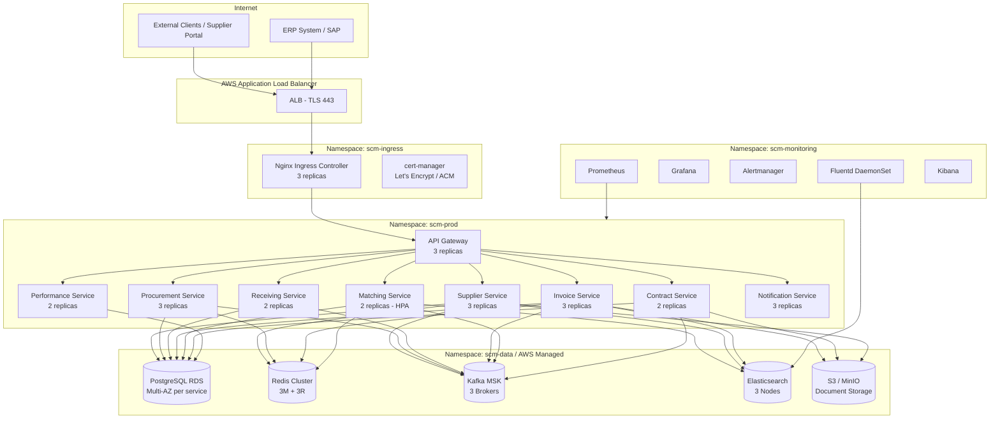

# Kubernetes Deployment Diagram — Supply Chain Management Platform

## Overview

The SCM Platform runs on a production-grade Kubernetes cluster (Amazon EKS) spanning **three AWS Availability Zones** (`us-east-1a`, `us-east-1b`, `us-east-1c`). The cluster provides high availability, fault tolerance, and zero-downtime deployments for all microservices. All node pools use EC2 instances with Pod Disruption Budgets (PDBs) ensuring at least 50% of replicas remain available during node maintenance.

---

## Namespace Structure

| Namespace | Purpose | Resource Quota |
|---|---|---|
| `scm-prod` | All production microservices | 40 CPU, 80Gi RAM |
| `scm-monitoring` | Prometheus, Grafana, Alertmanager | 8 CPU, 16Gi RAM |
| `scm-data` | Kafka operators, Redis Operator, Elasticsearch | 12 CPU, 32Gi RAM |
| `scm-ingress` | Nginx Ingress Controller, cert-manager | 4 CPU, 4Gi RAM |

---

## Cluster Topology Diagram



---

## Microservice Deployment Specifications

### API Gateway
| Property | Value |
|---|---|
| Replicas | 3 (one per AZ) |
| CPU Request / Limit | 1 CPU / 2 CPU |
| Memory Request / Limit | 1Gi / 2Gi |
| HPA | Min 3, Max 8, target CPU 70% |
| PDB | minAvailable: 2 |
| Image | kong:3.4-alpine |
| Port | 8000 (HTTP), 8443 (HTTPS), 8001 (Admin) |

### Supplier Service
| Property | Value |
|---|---|
| Replicas | 3 |
| CPU Request / Limit | 1 CPU / 2 CPU |
| Memory Request / Limit | 1Gi / 2Gi |
| HPA | Min 3, Max 6, target CPU 70% |
| PDB | minAvailable: 2 |
| Port | 8080 |

### Procurement Service
| Property | Value |
|---|---|
| Replicas | 3 |
| CPU Request / Limit | 1 CPU / 2 CPU |
| Memory Request / Limit | 2Gi / 4Gi |
| HPA | Min 3, Max 8, target CPU 70% |
| PDB | minAvailable: 2 |
| Port | 8081 |

### Receiving Service
| Property | Value |
|---|---|
| Replicas | 2 |
| CPU Request / Limit | 500m / 1 CPU |
| Memory Request / Limit | 1Gi / 2Gi |
| HPA | Min 2, Max 5, target CPU 75% |
| PDB | minAvailable: 1 |
| Port | 8082 |

### Invoice Service
| Property | Value |
|---|---|
| Replicas | 3 |
| CPU Request / Limit | 1 CPU / 2 CPU |
| Memory Request / Limit | 2Gi / 4Gi |
| HPA | Min 3, Max 8, target CPU 70% |
| PDB | minAvailable: 2 |
| Port | 8083 |

### Matching Service (CPU-Intensive)
| Property | Value |
|---|---|
| Replicas | 2 |
| CPU Request / Limit | 2 CPU / 4 CPU |
| Memory Request / Limit | 4Gi / 8Gi |
| HPA | Min 2, Max 10, target Kafka lag > 1000 msgs |
| PDB | minAvailable: 1 |
| Node Affinity | `compute-optimized` node pool (c5.2xlarge) |
| Port | 8084 |

### Contract Service
| Property | Value |
|---|---|
| Replicas | 2 |
| CPU Request / Limit | 500m / 1 CPU |
| Memory Request / Limit | 1Gi / 2Gi |
| HPA | Min 2, Max 4, target CPU 75% |
| PDB | minAvailable: 1 |
| Port | 8085 |

### Performance Service
| Property | Value |
|---|---|
| Replicas | 2 |
| CPU Request / Limit | 1 CPU / 2 CPU |
| Memory Request / Limit | 2Gi / 4Gi |
| HPA | Min 2, Max 5, target CPU 70% |
| PDB | minAvailable: 1 |
| Port | 8086 |

### Notification Service
| Property | Value |
|---|---|
| Replicas | 3 |
| CPU Request / Limit | 500m / 1 CPU |
| Memory Request / Limit | 512Mi / 1Gi |
| HPA | Min 3, Max 6, target CPU 80% |
| PDB | minAvailable: 2 |
| Port | 8087 |

---

## Data Tier

### PostgreSQL (Amazon RDS Multi-AZ)
Each service has an isolated database instance:

| Database | Instance Type | Multi-AZ | Storage | Backup |
|---|---|---|---|---|
| `supplier_db` | db.r6g.large | Yes | 100 GB gp3 | 7-day retention |
| `procurement_db` | db.r6g.xlarge | Yes | 200 GB gp3 | 7-day retention |
| `invoice_db` | db.r6g.xlarge | Yes | 200 GB gp3 | 7-day retention |
| `contract_db` | db.r6g.large | Yes | 100 GB gp3 | 7-day retention |
| `performance_db` | db.r6g.large | Yes | 100 GB gp3 | 7-day retention |

Each RDS instance is accessed via its own **PgBouncer** sidecar or pooler deployment in `scm-data` namespace for connection pooling.

### Redis Cluster
- **3 master shards + 3 replica nodes** (one replica per master)
- Deployed via **Amazon ElastiCache Redis Cluster Mode**
- Instance: `cache.r6g.large` per node
- Max Memory Policy: `allkeys-lru`
- Persistence: AOF enabled, snapshotting every 60 seconds

### Apache Kafka (Amazon MSK)
- **3 brokers** across 3 AZs
- Replication factor: **3** for all topics
- Min in-sync replicas: **2**
- Broker type: `kafka.m5.2xlarge`
- Storage: 1 TB EBS gp3 per broker, auto-scaling enabled
- Schema Registry: Confluent Schema Registry deployed in `scm-data`

### Elasticsearch (Amazon OpenSearch Service)
- **3 dedicated master nodes** (m6g.large)
- **3 data nodes** (r6g.2xlarge, 500 GB gp3 each)
- Index lifecycle policies: hot → warm (30d) → cold (90d) → delete (365d for operational logs, 3650d for audit logs)

### Document Storage (S3)
- Bucket: `scm-documents-prod` (versioning enabled)
- Bucket: `scm-contracts-prod` (versioning enabled, Object Lock for compliance)
- Server-side encryption: SSE-KMS
- Access: IAM roles via IRSA only (no public access)

---

## Ingress Configuration

- **Nginx Ingress Controller** deployed in `scm-ingress` namespace with 3 replicas
- TLS termination at Nginx using certificates issued by **ACM** (AWS Certificate Manager) via cert-manager
- Routing rules:
  - `api.scm.example.com/*` → API Gateway service
  - `portal.scm.example.com/*` → Supplier Portal (served by API Gateway with static asset offload to CloudFront)
  - `monitoring.scm.example.com/*` → Grafana (internal only, IP restricted)

---

## Service Mesh — Istio

- Istio `1.19` deployed with `istioctl`
- **mTLS enforced** between all services in `scm-prod` namespace via `PeerAuthentication` policy set to `STRICT`
- `AuthorizationPolicy` resources restrict inter-service communication:
  - Matching Service can only be called by Invoice Service and internal batch jobs
  - Notification Service can be called by all services
- **VirtualService + DestinationRule** for traffic splitting during blue-green deployments
- **Envoy sidecars** auto-injected via namespace label `istio-injection: enabled`

---

## Deployment Strategy

### Rolling Updates (Default)
All non-critical services use rolling updates with:
- `maxUnavailable: 0` (no downtime)
- `maxSurge: 1` (one extra pod during rollout)
- Readiness probe gates traffic until the new pod is ready

### Blue-Green Deployment (Critical Services)
Used for **Invoice Service** and **Matching Service** (financial correctness is critical):
1. Deploy `green` deployment alongside existing `blue` deployment
2. Run smoke tests against `green` via Istio VirtualService weight: `blue: 100, green: 0`
3. Gradually shift traffic: `blue: 90, green: 10` → `blue: 50, green: 50` → `blue: 0, green: 100`
4. Monitor error rates and latency in Grafana during shift
5. Delete `blue` deployment after 15-minute burn-in with `green: 100`

---

## Horizontal Pod Autoscaling (HPA)

### Matching Service — Queue-Depth HPA
The Matching Service scales based on Kafka consumer group lag, using the **KEDA** (Kubernetes Event-Driven Autoscaler) scaler:

```yaml
apiVersion: keda.sh/v1alpha1
kind: ScaledObject
metadata:
  name: matching-service-scaler
  namespace: scm-prod
spec:
  scaleTargetRef:
    name: matching-service
  minReplicaCount: 2
  maxReplicaCount: 10
  cooldownPeriod: 300
  triggers:
    - type: kafka
      metadata:
        bootstrapServers: kafka.scm-data.svc.cluster.local:9092
        consumerGroup: matching-service-group
        topic: scm.invoice.submitted
        lagThreshold: "1000"
```

All other services use standard CPU-based HPA with `targetAverageUtilization: 70`.

---

## Resource Quotas per Namespace

```yaml
# scm-prod namespace quota
apiVersion: v1
kind: ResourceQuota
metadata:
  name: scm-prod-quota
  namespace: scm-prod
spec:
  hard:
    requests.cpu: "24"
    requests.memory: 48Gi
    limits.cpu: "40"
    limits.memory: 80Gi
    count/pods: "80"
    count/services: "30"
    persistentvolumeclaims: "20"
```

---

## Persistent Volume Claims

| Service | PVC Name | Storage Class | Size | Access Mode |
|---|---|---|---|---|
| Elasticsearch Node 1 | `es-data-0` | `gp3-encrypted` | 500 Gi | ReadWriteOnce |
| Elasticsearch Node 2 | `es-data-1` | `gp3-encrypted` | 500 Gi | ReadWriteOnce |
| Elasticsearch Node 3 | `es-data-2` | `gp3-encrypted` | 500 Gi | ReadWriteOnce |
| Schema Registry | `schema-registry-data` | `gp3-encrypted` | 10 Gi | ReadWriteOnce |

RDS and MSK use managed storage — no PVCs required.

---

## Secrets Management

- **AWS Secrets Manager** is the source of truth for all secrets (DB passwords, API keys, OAuth client secrets)
- Secrets are synced into Kubernetes using the **External Secrets Operator (ESO)**:
  - ESO polls Secrets Manager every 5 minutes
  - `ExternalSecret` resources in each namespace pull only the secrets relevant to that namespace
- **No hardcoded secrets** in Helm values or ConfigMaps; all sensitive values reference `secretKeyRef`
- Service account tokens use **IRSA** (IAM Roles for Service Accounts) — no long-lived AWS credentials in pods

---

## Health Checks

All services implement the following probes:

```yaml
livenessProbe:
  httpGet:
    path: /actuator/health/liveness
    port: 8080
  initialDelaySeconds: 30
  periodSeconds: 10
  failureThreshold: 3

readinessProbe:
  httpGet:
    path: /actuator/health/readiness
    port: 8080
  initialDelaySeconds: 20
  periodSeconds: 5
  failureThreshold: 3
  successThreshold: 1

startupProbe:
  httpGet:
    path: /actuator/health/liveness
    port: 8080
  initialDelaySeconds: 10
  periodSeconds: 5
  failureThreshold: 12
```

Readiness probe gates traffic routing; liveness probe triggers pod restart on hang.

---

## Monitoring Stack

- **Prometheus** scrapes all services via `ServiceMonitor` resources (Prometheus Operator)
- **Grafana** dashboards:
  - SCM Overview: request rate, error rate, latency (p50/p95/p99) per service
  - Three-Way Match: match rate, exception rate, reconciliation lag
  - Kafka: consumer lag, producer throughput, broker health
  - Database: connection pool utilization, query latency, replication lag
- **Alertmanager** routes critical alerts to PagerDuty, warnings to Slack `#scm-alerts`

---

## Logging — EFK Stack

- **Fluentd** runs as a DaemonSet on every node, collecting container logs
- Logs are forwarded to **Amazon OpenSearch** (shared cluster with audit/search index)
- **Kibana** provides log search and dashboards
- Log format: structured JSON with fields: `timestamp`, `level`, `service`, `traceId`, `spanId`, `userId`, `message`
- Log retention: operational logs 30 days (hot), audit logs 10 years (cold tier / Glacier)
