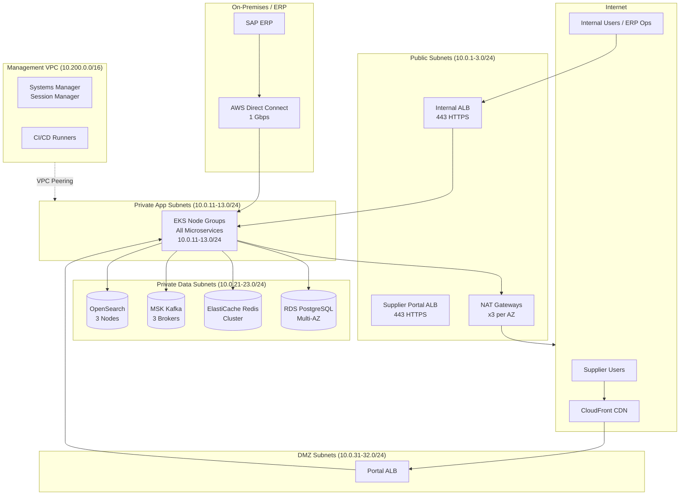

# Network Infrastructure — Supply Chain Management Platform

## Overview

The SCM Platform network is built on AWS within a dedicated **Production VPC** (`scm-prod-vpc`). The architecture enforces strict network segmentation across four subnet tiers, uses security groups and NACLs for defence-in-depth, and provides secure connectivity to on-premises ERP systems via AWS Direct Connect with VPN failover. All internet-facing traffic passes through AWS WAF and Shield Advanced.

---

## VPC Architecture

| VPC | CIDR | Region | Purpose |
|---|---|---|---|
| `scm-prod-vpc` | `10.0.0.0/16` | `us-east-1` | Production workloads |
| `scm-dr-vpc` | `10.1.0.0/16` | `us-west-2` | Disaster recovery |
| `erp-vpc` | `10.100.0.0/16` | On-prem peered | SAP ERP environment |
| `mgmt-vpc` | `10.200.0.0/16` | `us-east-1` | Bastion, CI/CD, monitoring |

---

## Subnet Layout

### Public Subnets — Load Balancers, NAT Gateways

| Subnet | CIDR | AZ | Resources |
|---|---|---|---|
| `public-us-east-1a` | `10.0.1.0/24` | us-east-1a | ALB, NAT Gateway |
| `public-us-east-1b` | `10.0.2.0/24` | us-east-1b | ALB, NAT Gateway |
| `public-us-east-1c` | `10.0.3.0/24` | us-east-1c | ALB, NAT Gateway |

Each AZ has its own NAT Gateway to prevent cross-AZ data transfer charges and to provide AZ-level resilience.

### Private Application Subnets — Kubernetes Node Groups

| Subnet | CIDR | AZ | Resources |
|---|---|---|---|
| `app-us-east-1a` | `10.0.11.0/24` | us-east-1a | EKS node group |
| `app-us-east-1b` | `10.0.12.0/24` | us-east-1b | EKS node group |
| `app-us-east-1c` | `10.0.13.0/24` | us-east-1c | EKS node group |

EKS nodes run in private subnets; no public IP assignment. Egress internet traffic routes through NAT Gateways. Kubernetes `LoadBalancer` services create internal NLBs within the private tier; external traffic enters via the public ALB.

### Private Data Subnets — Databases, Kafka, Redis

| Subnet | CIDR | AZ | Resources |
|---|---|---|---|
| `data-us-east-1a` | `10.0.21.0/24` | us-east-1a | RDS primary, Redis master, Kafka broker 1 |
| `data-us-east-1b` | `10.0.22.0/24` | us-east-1b | RDS standby, Redis replica, Kafka broker 2 |
| `data-us-east-1c` | `10.0.23.0/24` | us-east-1c | RDS read replica, Redis replica, Kafka broker 3 |

Data subnets have **no internet gateway route** and **no NAT route**. All traffic to data resources originates from the application subnets only.

### Supplier Portal DMZ Subnets — External-Facing Portal

| Subnet | CIDR | AZ | Resources |
|---|---|---|---|
| `dmz-us-east-1a` | `10.0.31.0/24` | us-east-1a | Supplier Portal ALB, CloudFront origin |
| `dmz-us-east-1b` | `10.0.32.0/24` | us-east-1b | Supplier Portal ALB (multi-AZ) |

The supplier portal is served via CloudFront → Supplier Portal ALB → API Gateway inside the private application tier. The DMZ subnets hold only the ALB; no application instances run here.

---

## Network Topology Diagram

---

## Security Groups

### ALB Security Group (`sg-alb-public`)
| Rule | Type | Protocol | Port | Source |
|---|---|---|---|---|
| Inbound | HTTPS | TCP | 443 | `0.0.0.0/0` |
| Inbound | HTTP | TCP | 80 | `0.0.0.0/0` (redirect to 443) |
| Outbound | Custom TCP | TCP | 8000-8090 | `sg-app` |

### Application Security Group (`sg-app`)
| Rule | Type | Protocol | Port | Source |
|---|---|---|---|---|
| Inbound | Custom TCP | TCP | 8000-8110 | `sg-alb-public` |
| Inbound | Custom TCP | TCP | 8000-8110 | `sg-app` (inter-service) |
| Inbound | Custom TCP | TCP | 15000-15010 | `sg-app` (Istio Envoy) |
| Outbound | PostgreSQL | TCP | 5432 | `sg-data` |
| Outbound | Redis | TCP | 6379 | `sg-data` |
| Outbound | Kafka | TCP | 9092 | `sg-data` |
| Outbound | HTTPS | TCP | 443 | `0.0.0.0/0` (via NAT) |

### Data Security Group (`sg-data`)
| Rule | Type | Protocol | Port | Source |
|---|---|---|---|---|
| Inbound | PostgreSQL | TCP | 5432 | `sg-app` |
| Inbound | Redis | TCP | 6379 | `sg-app` |
| Inbound | Kafka | TCP | 9092 | `sg-app` |
| Inbound | OpenSearch | TCP | 9200, 9300 | `sg-app` |
| Outbound | All | All | All | `sg-data` (intra-cluster replication) |

### Supplier Portal Security Group (`sg-supplier-portal`)
| Rule | Type | Protocol | Port | Source |
|---|---|---|---|---|
| Inbound | HTTPS | TCP | 443 | `0.0.0.0/0` |
| Inbound | Custom TCP | TCP | 8080 | `sg-alb-public` (Portal ALB only) |
| Outbound | Custom TCP | TCP | 8000-8090 | `sg-app` |

---

## Network Access Control Lists (NACLs)

### Public Subnet NACL
| Rule | Type | Protocol | Port Range | Source | Action |
|---|---|---|---|---|---|
| 100 | HTTPS | TCP | 443 | `0.0.0.0/0` | ALLOW |
| 110 | HTTP | TCP | 80 | `0.0.0.0/0` | ALLOW |
| 120 | Custom TCP | TCP | 1024-65535 | `0.0.0.0/0` | ALLOW (ephemeral) |
| 200 | Custom TCP | TCP | 8000-8090 | `10.0.11.0/22` | ALLOW (return) |
| 32767 | All | All | All | `0.0.0.0/0` | DENY |

### Private Application Subnet NACL
| Rule | Type | Protocol | Port Range | Source | Action |
|---|---|---|---|---|---|
| 100 | Custom TCP | TCP | 8000-8110 | `10.0.1.0/22` | ALLOW (from ALB) |
| 110 | Custom TCP | TCP | 8000-8110 | `10.0.11.0/22` | ALLOW (inter-service) |
| 120 | Custom TCP | TCP | 1024-65535 | `0.0.0.0/0` | ALLOW (ephemeral) |
| 130 | HTTPS | TCP | 443 | `0.0.0.0/0` | ALLOW (outbound via NAT, return) |
| 32767 | All | All | All | `0.0.0.0/0` | DENY |

### Private Data Subnet NACL
| Rule | Type | Protocol | Port Range | Source | Action |
|---|---|---|---|---|---|
| 100 | Custom TCP | TCP | 5432 | `10.0.11.0/22` | ALLOW (PostgreSQL) |
| 110 | Custom TCP | TCP | 6379 | `10.0.11.0/22` | ALLOW (Redis) |
| 120 | Custom TCP | TCP | 9092 | `10.0.11.0/22` | ALLOW (Kafka) |
| 130 | Custom TCP | TCP | 9200-9300 | `10.0.11.0/22` | ALLOW (OpenSearch) |
| 140 | Custom TCP | TCP | 1024-65535 | `10.0.21.0/22` | ALLOW (ephemeral/replication) |
| 32767 | All | All | All | `0.0.0.0/0` | DENY |

---

## VPC Peering and Transit Gateway

### Transit Gateway (`tgw-scm-prod`)
A Transit Gateway connects all VPCs to avoid the complexity of full-mesh peering:

| Attachment | VPC CIDR | Purpose |
|---|---|---|
| `scm-prod-vpc` | `10.0.0.0/16` | Production workloads |
| `scm-dr-vpc` | `10.1.0.0/16` | DR environment (passive) |
| `mgmt-vpc` | `10.200.0.0/16` | CI/CD and operations |
| `erp-vpc-peer` | `10.100.0.0/16` | ERP VPC (Direct Connect attachment) |

Transit Gateway route tables enforce access controls:
- `scm-prod` ↔ `erp` routes are limited to ports 8080-8090 (integration bus)
- `mgmt` ↔ `scm-prod` routes are limited to management ports only

---

## AWS Direct Connect / VPN for On-Premises ERP

### Direct Connect
- **Connection speed**: 1 Gbps Hosted Connection via AWS Direct Connect partner
- **Virtual Interfaces**: One Private VIF attached to Transit Gateway
- **BGP ASN**: 65000 (AWS side), 65001 (on-premises side)
- **Failover**: AWS Site-to-Site VPN as backup over internet

### VPN Failover
- IPsec VPN with IKEv2
- Two VPN tunnels per VPN connection (active/standby) for resilience
- BGP routes automatically prefer Direct Connect; VPN takes over within 60 seconds if Direct Connect fails

---

## Route 53 Private Hosted Zones

Service discovery within the cluster uses Kubernetes DNS (`cluster.local`) for pod-to-pod. Cross-service DNS uses Route 53 Private Hosted Zone `scm.internal`:

| DNS Record | Type | Target | TTL |
|---|---|---|---|
| `supplier-svc.scm.internal` | A | ALB internal | 30s |
| `procurement-svc.scm.internal` | A | ALB internal | 30s |
| `invoice-svc.scm.internal` | A | ALB internal | 30s |
| `kafka.scm.internal` | CNAME | MSK bootstrap | 60s |
| `redis.scm.internal` | CNAME | ElastiCache cluster | 60s |
| `db.supplier.scm.internal` | CNAME | RDS writer endpoint | 10s |
| `db-ro.supplier.scm.internal` | CNAME | RDS reader endpoint | 10s |

Route 53 health checks monitor all ALB targets and remove unhealthy endpoints within 30 seconds.

---

## CloudFront CDN

### Supplier Portal Distribution
| Setting | Value |
|---|---|
| Origins | Supplier Portal ALB (primary), S3 static assets (secondary) |
| Price Class | PriceClass_100 (US, Canada, Europe) |
| SSL Certificate | ACM cert `*.scm.example.com` |
| Minimum TLS Version | TLSv1.2_2021 |
| Geo Restriction | None (suppliers worldwide) |
| Cache Behaviors | `/static/*` cached 7 days; `/api/*` pass-through (no cache) |
| Origin Shield | Enabled (us-east-1) |

### WAF Web ACL (attached to CloudFront and ALB)
Managed rule groups active:
- `AWSManagedRulesCommonRuleSet` — OWASP Top 10 protections
- `AWSManagedRulesSQLiRuleSet` — SQL injection
- `AWSManagedRulesKnownBadInputsRuleSet` — Log4j, etc.
- Custom rate-based rule: block IPs exceeding 2000 requests/5 minutes
- Custom rule: block requests with malformed `Authorization` headers

---

## DDoS Protection — AWS Shield

- **AWS Shield Advanced** enabled on: CloudFront distributions, ALBs, Elastic IPs for NAT Gateways
- Shield Advanced provides:
  - 24/7 DDoS Response Team (DRT) access
  - Near real-time attack notifications via CloudWatch
  - Cost protection (credits for scaling costs during attacks)
  - Layer 3/4 and Layer 7 DDoS protection

---

## Network Monitoring — VPC Flow Logs

- VPC Flow Logs enabled on all subnets, published to **CloudWatch Logs** and **S3**
- S3 destination: `s3://scm-vpc-flow-logs-prod/`
- Retention: CloudWatch 30 days, S3 (Glacier after 90 days) 1 year
- Athena table configured over S3 for ad-hoc security investigations
- CloudWatch Metric Filters alert on:
  - Any traffic rejected by NACLs from unexpected CIDR ranges
  - Port scans (>50 rejected connections from single IP in 60 seconds)
  - Unusual outbound flows from data subnets

---

## Secure Access — Systems Manager Session Manager

- **No bastion host** with open SSH port; all operator access uses AWS Systems Manager Session Manager
- Session Manager provides browser-based or CLI shell access to EKS nodes and RDS proxy instances without opening port 22
- All sessions are logged to CloudTrail and S3 (`s3://scm-ssm-session-logs-prod/`)
- Access is controlled by IAM policies — only `scm-ops-engineers` IAM group has `ssm:StartSession` permission
- Emergency break-glass account (MFA-required) for incident response

---

## Egress Filtering — Proxy for Outbound API Calls

Microservices that need to call external APIs (currency exchange rates, email APIs, OFAC lists) route egress through a **Squid proxy** cluster deployed in the application subnet:

- Squid proxy deployed as a 2-replica Kubernetes deployment in `scm-prod`
- Allowlist of external domains:
  - `api.exchangeratesapi.io` (currency rates)
  - `api.sendgrid.com` (email)
  - `api.twilio.com` (SMS)
  - `api.ofac.treasury.gov` (OFAC screening)
  - `api.easypost.com` (logistics tracking)
- All other outbound HTTPS blocked at NAT Gateway (traffic not matching proxy routes is rejected)
- Proxy logs to CloudWatch for security review
