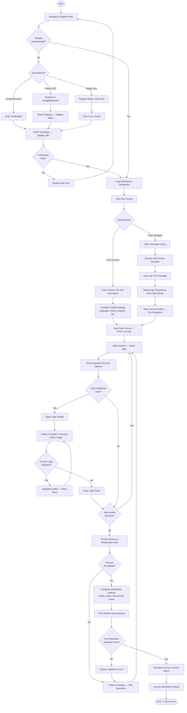
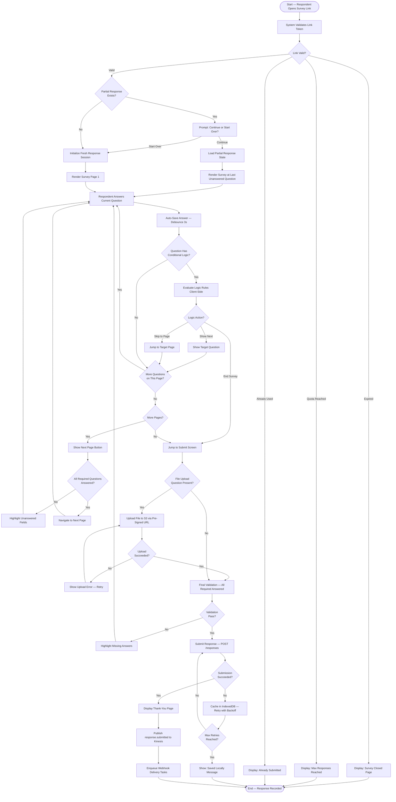
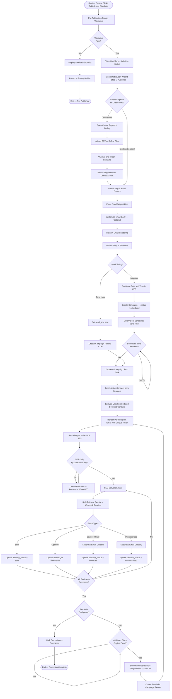
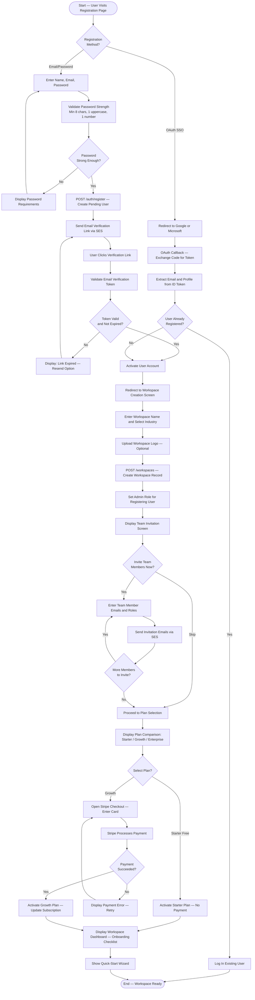
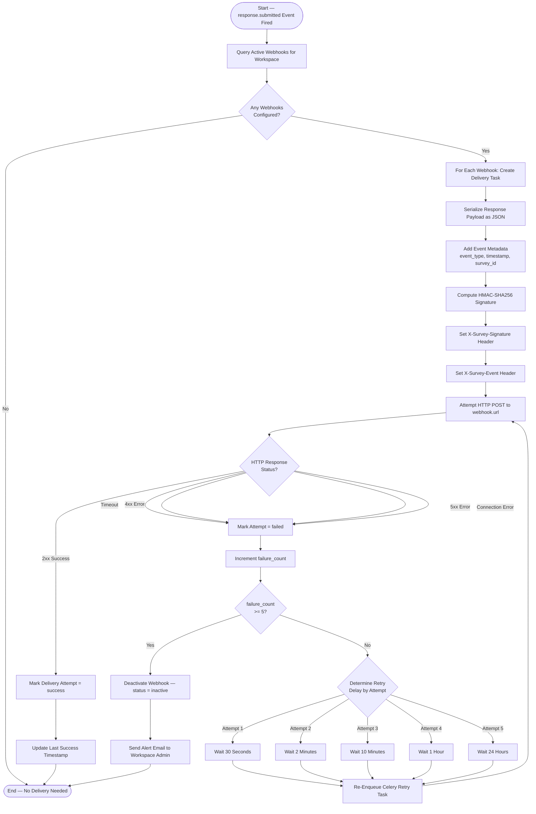

# Activity Diagrams — Survey and Feedback Platform

## Overview

This document presents six activity diagrams that model the key operational flows of the Survey and Feedback Platform. Each diagram uses Mermaid flowchart TD (top-down) syntax to represent process steps, decision gates, parallel execution paths, and start/end states. Together these diagrams provide developers, QA engineers, and business analysts with a precise visual reference for implementing and testing the platform's core workflows.

Activity diagrams map directly to the use cases defined in `analysis/use-case-diagram.md` and the detailed descriptions in `analysis/use-case-descriptions.md`. Decision nodes with Yes/No branches correspond to business rules documented in those files.

**Notation Guide:**
- `([...])` — Start / End terminal node
- `[...]` — Activity / Process step
- `{...}` — Decision gate (diamond)
- `[[...]]` — Subprocess / called activity

---

## 1. Survey Creation Flow

This flow covers the complete path from a Survey Creator logging into the platform through building a survey and publishing it for distribution. It models the primary success scenario with key decision branches for authentication method, template vs. scratch creation, question logic, and pre-publication validation.

---

## 2. Survey Response Submission Flow

This flow models the complete respondent journey from receiving a survey link through completing and submitting the response. It includes conditional logic routing, partial save behaviour, file upload handling, and offline resilience.

---

## 3. Email Distribution Campaign Flow

This flow covers the full lifecycle of an email distribution campaign: from the Creator initiating distribution through audience selection, scheduling, sending, and delivery event processing.

---

## 4. Report Generation Flow

This flow models the asynchronous report generation pipeline: from the Analyst requesting a report through data aggregation, chart rendering, PDF/Excel composition, S3 upload, and download delivery.

```mermaid
flowchart TD
    A([Start — Actor Clicks Export Report]) --> B{Feature Available\nfor Plan?}
    B -- No --> C[Display Upgrade Prompt]
    C --> ZZ([End])
    B -- Yes --> D[Display Export Configuration Dialog]
    D --> E[Select Format: PDF or Excel]
    E --> F[Configure Date Range and Filters]
    F --> G[Toggle Include Charts and Raw Table]
    G --> H[Click Generate Report]
    H --> I[POST /reports/generate — Receive job_id]
    I --> J[Show Progress Indicator in UI]
    J --> K[Celery Worker Picks Up Report Job]
    K --> L[Query Filtered Responses from PostgreSQL]
    L --> M{Large Dataset?\nOver 10k responses}
    M -- Yes --> N[Stream Data in Batches of 1000]
    M -- No --> O[Load All Data into Memory]
    N --> P[Aggregate Summary Statistics]
    O --> P
    P --> Q{Format?}
    Q -- PDF --> R[Render Chart Images via Matplotlib]
    R --> S[Compose PDF Structure\nCover, TOC, Summary Cards]
    S --> T[Add Per-Question Sections with Charts]
    T --> U{Include Raw\nResponse Table?}
    U -- Yes --> V[Append Raw Response Appendix — Max 1000 rows]
    U -- No --> W[Apply Workspace Branding and Footer]
    V --> W
    W --> X[Finalize PDF via ReportLab]
    X --> Y{Size Over 50 MB?}
    Y -- Yes --> Z[Re-Render Charts at Lower DPI]
    Z --> X
    Y -- No --> AA[Upload to S3 — workspace/exports/]
    Q -- Excel --> AB[Create XLSX Workbook via openpyxl]
    AB --> AC[Write Summary Sheet]
    AC --> AD[Write Per-Question Data Sheets]
    AD --> AE[Write Raw Responses Sheet]
    AE --> AA
    AA --> AF{S3 Upload\nSucceeded?}
    AF -- No --> AG[Retry Upload — Max 3 Attempts]
    AG --> AH{Retry\nExhausted?}
    AH -- Yes --> AI[Mark Job Failed — Notify Actor via Email]
    AI --> ZZ
    AH -- No --> AA
    AF -- Yes --> AJ[Update Job Record — status = complete]
    AJ --> AK[Send WebSocket Event to Actor UI]
    AK --> AL[UI Shows Download Button]
    AL --> AM[Actor Clicks Download]
    AM --> AN[Generate Pre-Signed S3 URL — 30 min TTL]
    AN --> AO[Browser Downloads File]
    AO --> AP[Log Export Event to Audit Trail]
    AP --> ZZ([End — Report Downloaded])
```

---

## 5. User Registration and Workspace Setup Flow

This flow covers new user onboarding: from initial registration through email verification, workspace creation, team invitation, and subscription plan configuration.

---

## 6. Webhook Delivery Flow

This flow models the full webhook delivery pipeline: from a triggering event through payload construction, HMAC signing, HTTP delivery, retry logic on failure, and automatic deactivation after repeated failures.

---

## Flow Descriptions

### 1. Survey Creation Flow
The survey creation flow begins with the Creator authenticating (via credentials, OAuth SSO, or magic link) and ends with the survey being transitioned to `active` and the Distribution Wizard launched. Key branches include choosing between scratch creation and template import, adding conditional logic (with circular-loop detection), previewing the survey, and passing pre-publication validation. Auto-save is an implicit background activity throughout the builder session.

### 2. Survey Response Submission Flow
This flow handles the full lifecycle of a single respondent session. The system validates the link token against multiple failure conditions before rendering the survey. Conditional logic is evaluated client-side in real time. The auto-save mechanism (debounced at 3 seconds per answer) enables partial response recovery. The final submission includes file upload completion, full validation, database transaction, Kinesis event publication, and asynchronous webhook delivery.

### 3. Email Distribution Campaign Flow
The distribution flow manages the complete email campaign lifecycle. It integrates with AWS SES for delivery and processes SES event callbacks (delivered, opened, clicked, bounced, unsubscribed) to maintain delivery status at the per-recipient level. The flow handles daily send quota enforcement with automatic overflow queuing and supports up to two reminder sends per recipient.

### 4. Report Generation Flow
Report generation is an entirely asynchronous flow coordinated by Celery. The web request initiates the job and returns immediately with a `job_id`; the UI polls via WebSocket for completion. The worker handles both PDF and Excel formats, manages large datasets through streaming pagination, enforces a 50 MB PDF size ceiling through DPI reduction, and delivers the file via a time-limited S3 pre-signed URL.

### 5. User Registration and Workspace Setup Flow
This flow covers two registration paths (email/password and OAuth SSO) and merges at the point of workspace creation. The onboarding wizard is designed for progressive commitment: team invitations and plan selection are optional during initial setup but are surfaced via the post-setup checklist. Stripe payment integration handles plan upgrades with immediate activation on successful payment.

### 6. Webhook Delivery Flow
Webhook delivery is decoupled from the response submission path via Celery. The delivery pipeline builds a signed payload and executes the HTTP POST. On failure, it implements a five-stage exponential backoff schedule (30s → 2min → 10min → 1hr → 24hr). After five consecutive failures, the webhook is automatically deactivated to protect consumer endpoints from continued failed requests, and the Workspace Admin is notified.

---

## Exception Paths

### Authentication Exceptions
- **Expired magic link:** The system prompts the user to request a new magic link. Previous link tokens are invalidated immediately upon reuse attempt.
- **OAuth provider unavailable:** If Google or Microsoft OAuth is unreachable, the system falls back to showing the email/password form with a notice about SSO unavailability.
- **Brute-force lockout:** After 10 failed login attempts within 15 minutes, the account is locked for 30 minutes. An unlock email is sent automatically.

### Survey Submission Exceptions
- **Survey deleted during active session:** If the survey is deleted by the Creator while a respondent is mid-completion, the next page load returns a 404 and the respondent is shown a "Survey no longer available" message.
- **File upload S3 pre-signed URL expired:** Pre-signed upload URLs expire after 15 minutes. If expired, the system generates a fresh URL and retries the upload transparently.
- **Concurrent submission conflict:** If two tabs submit the same token simultaneously, the second submission receives a 409 Conflict response and is shown the "already submitted" message.

### Distribution Exceptions
- **Segment contacts all suppressed:** If all contacts in the target segment are suppressed (unsubscribed or bounced), the campaign is created with `status = completed` immediately and the Creator is notified that zero emails were sent.
- **SES account suspended:** If AWS SES suspends the workspace's sending identity, all outbound email tasks are paused and the Workspace Admin receives an urgent notification with remediation steps.

### Webhook Exceptions
- **DNS resolution failure:** Treated as a connection error; triggers the retry backoff schedule.
- **Payload size exceeds 1 MB:** The system truncates open-text answer fields to 500 characters in the webhook payload. A `truncated: true` flag is included in the payload metadata.
- **Signing secret rotated during delivery:** If the signing secret is rotated, in-flight deliveries use the old secret. Retries use the current secret.

---

## Operational Policy Addendum

### 1. Response Data Privacy Policies

Activity flows involving response collection (Flow 2) must comply with the workspace's data processing configuration. When a survey is configured for anonymous responses, the geolocation capture step in Flow 2 is bypassed entirely — the system sets both IP address and location fields to `null` before persisting the response record. The auto-save partial response mechanism stores only question IDs and answer values; no PII is written to the partial save record for anonymous surveys.

For non-anonymous surveys, the IP address captured during submission is used solely for geographic analytics and is stored in truncated form (/24 prefix for IPv4, /48 prefix for IPv6) unless the workspace has explicitly opted into full IP logging for fraud prevention purposes. Full IP storage requires explicit GDPR documentation within the workspace's privacy policy configuration.

Data collected through embedded survey widgets (Flow 6 configuration) is subject to the same response privacy rules as direct-link submissions. The embed origin domain is recorded as metadata but is not exposed in analytics views accessible to Analysts.

### 2. Survey Distribution Policies

The email distribution flow (Flow 3) enforces CAN-SPAM and GDPR compliance at the infrastructure level. The platform's SES sending configuration includes a `List-Unsubscribe` header in every email, enabling one-click unsubscribe in supported email clients (Gmail, Outlook) independent of the unsubscribe link embedded in the email body.

Scheduled campaigns may be cancelled by the Creator up to 5 minutes before the scheduled send time. Cancellations within the 5-minute window may result in partial delivery if Celery workers have already begun enqueuing individual email tasks. In this case, the campaign status is updated to `partially_cancelled` and the Creator is shown the final delivery count.

Distribution to internal employees is subject to the same suppression rules as external distribution. Employees who have unsubscribed from survey emails cannot be force-resubscribed by a Workspace Admin; only the employee can re-subscribe via their notification preferences.

### 3. Analytics and Retention Policies

The report generation flow (Flow 4) produces artifacts subject to the following retention policy: generated PDF and Excel files are stored in S3 under the `[workspace-id]/exports/` prefix with a lifecycle rule that permanently deletes files after 30 days. The job record in PostgreSQL is retained for the same 30-day period as an auditable history of export activity. Pre-signed download URLs are valid for 30 minutes from generation; after expiry, the Analyst must regenerate the URL from the export history page.

Aggregated analytics data (DynamoDB) is retained independently of the export lifecycle and is available for dashboard queries for the full retention period defined by the workspace's subscription tier. Deletion of a survey does not immediately purge its aggregated analytics; a 30-day grace period applies to allow Admins to export data before it is purged.

### 4. System Availability Policies

All six activity flows have been designed with graceful degradation in mind. The response submission flow (Flow 2) is the highest-priority flow and is protected by an independent Redis-backed submission queue that accepts writes even when the primary PostgreSQL database is under maintenance. Writes queued in Redis are replayed to PostgreSQL within 5 minutes of database restoration.

The webhook delivery flow (Flow 6) operates entirely within the Celery worker fleet, which is separate from the web API fleet. This ensures that high webhook delivery load does not affect survey rendering or submission API response times. Worker auto-scaling is configured to add Celery workers when the queue depth exceeds 10,000 pending tasks for more than 60 seconds.

Report generation workers (Flow 4) are isolated on a dedicated Celery queue (`report-generation`) with a maximum concurrency of 10 workers per workspace to prevent any single workspace from monopolizing generation capacity. Jobs that exceed the 10-minute timeout are automatically retried once with a reduced dataset (last 30 days of data) and the actor is notified of the scope reduction.
