# BPMN Swimlane Diagrams — Survey and Feedback Platform

## Overview

This document presents four BPMN-style swimlane process diagrams for the Survey and Feedback Platform. Because Mermaid does not natively support BPMN notation, each diagram uses **Mermaid flowchart LR** (left-to-right layout) with `subgraph` blocks representing swimlanes. The diagrams adhere to the following BPMN-inspired conventions:

| Symbol | Mermaid Representation | BPMN Meaning |
|---|---|---|
| `([...])` | Circle node | Start / End Event |
| `[...]` | Rectangle node | Task |
| `{...}` | Diamond node | Gateway (Decision) |
| `[[...]]` | Subroutine node | Subprocess / Call Activity |
| Labeled arrows | `-- label -->` | Sequence Flow / Message Flow |
| `subgraph` | Horizontal band | Swimlane / Pool |

Each diagram includes: start and end events per swimlane where appropriate, task rectangles within each lane, decision gateways with Yes/No/labeled paths, message flows between lanes shown as cross-subgraph arrows, and data objects annotated as italic labels on arrows.

---

## 1. Survey Publication Process

This process covers the steps from a Survey Creator deciding to publish a survey through platform validation, email service engagement, and respondent access. Four swimlanes are involved: Survey Creator, Platform System, Email Service, and Respondent.

```mermaid
flowchart LR
    subgraph Creator["Survey Creator"]
        direction TB
        C1([Start])
        C2[Complete Survey Design in Builder]
        C3[Click Publish and Distribute]
        C4[Configure Distribution\nAudience, Subject, Schedule]
        C5[Review Summary and Confirm Send]
        C6{Satisfied with Preview?}
        C7[Edit Survey Content]
        C8[Receive Publish Confirmation]
        C9([End — Survey Live])
    end

    subgraph Platform["Platform System"]
        direction TB
        P1[Run Pre-Publication Validation]
        P2{Validation Passed?}
        P3[Return Validation Errors]
        P4[Transition Survey — status: active]
        P5[Create Distribution Campaign Record]
        P6{Send Now or Schedule?}
        P7[Enqueue Email Tasks in Celery]
        P8[Create Scheduled Task in Celery Beat]
        P9[Generate Unique Token per Recipient]
        P10[Track Campaign Delivery via SNS Events]
        P11[Update Dashboard — active survey]
    end

    subgraph EmailSvc["Email Service — AWS SES"]
        direction TB
        E1[Receive Email Batch from Celery]
        E2[Render HTML Email with Token Link]
        E3[Dispatch Email to Recipient]
        E4{Delivery Outcome?}
        E5[Record Sent Event — SNS]
        E6[Record Bounce Event — Suppress Address]
        E7[Record Open or Click Event]
    end

    subgraph Respondent["Respondent"]
        direction TB
        R1[Receive Survey Email in Inbox]
        R2[Click Survey Link in Email]
        R3[Platform Validates Token and Status]
        R4[Complete Survey and Submit Response]
        R5([End — Response Submitted])
    end

    C1 --> C2
    C2 --> C3
    C3 -->|Publish Request| P1
    P1 --> P2
    P2 -- No --> P3
    P3 -->|Validation Errors| C7
    C7 --> C6
    C6 -- No --> C2
    C6 -- Yes --> C3
    P2 -- Yes --> P4
    P4 --> C4
    C4 --> C5
    C5 -->|Campaign Config| P5
    P5 --> P6
    P6 -- Now --> P7
    P6 -- Scheduled --> P8
    P8 -->|At Scheduled Time| P7
    P7 --> P9
    P9 -->|Email Batches| E1
    E1 --> E2
    E2 --> E3
    E3 --> E4
    E4 -- Sent --> E5
    E4 -- Bounced --> E6
    E4 -- Opened/Clicked --> E7
    E5 -->|SNS Delivery Event| P10
    E6 -->|Suppression Event| P10
    E7 -->|Engagement Event| P10
    P10 --> P11
    P11 -->|Confirmation| C8
    C8 --> C9
    E3 -->|Email Delivered| R1
    R1 --> R2
    R2 -->|Token Validation| R3
    R3 --> R4
    R4 --> R5
```

---

## 2. Response Collection and Processing

This process models the journey of a survey response from the respondent submitting their answers through the frontend, API gateway, response processor, and analytics engine. Five swimlanes: Respondent, Frontend PWA, API Gateway, Response Processor, and Analytics Engine.

```mermaid
flowchart LR
    subgraph Resp["Respondent"]
        direction TB
        R1([Start — Open Survey Link])
        R2[View Survey Questions]
        R3[Answer Questions with Conditional Routing]
        R4[Click Submit]
        R5[View Thank-You Page]
        R6([End])
    end

    subgraph FE["Frontend PWA — React 18"]
        direction TB
        F1[Validate Link Token via GET /surveys/token]
        F2[Render Survey Questions and Pages]
        F3[Execute Client-Side Conditional Logic]
        F4[Auto-Save Partial Response to API]
        F5[Run Final Validation]
        F6{Validation Pass?}
        F7[Highlight Errors]
        F8[POST /responses — Submit Payload]
        F9{Submit Succeeded?}
        F10[Cache in IndexedDB — Retry with Backoff]
        F11[Render Thank-You Screen]
    end

    subgraph APIGW["API Gateway — FastAPI"]
        direction TB
        A1[Authenticate Request — Validate Token]
        A2[Check Survey Status and Quota]
        A3{Request Authorized?}
        A4[Return 403/404/410 Error]
        A5[Route to Response Submission Handler]
        A6[Validate Pydantic v2 Response Schema]
        A7{Schema Valid?}
        A8[Return 422 Unprocessable Entity]
        A9[Begin DB Transaction]
        A10[Return 201 Created with response_id]
    end

    subgraph RP["Response Processor — Celery"]
        direction TB
        RP1[Persist Response Record to PostgreSQL]
        RP2[Persist Answer Records — response_answers]
        RP3[Commit Transaction]
        RP4[Publish response.submitted to Kinesis]
        RP5[Query Active Webhooks for Workspace]
        RP6{Webhooks Configured?}
        RP7[Enqueue Webhook Delivery Tasks]
        RP8[Update Partial Response — status: completed]
    end

    subgraph AE["Analytics Engine — Kinesis → Lambda → DynamoDB"]
        direction TB
        AE1[Kinesis Consumer Lambda Triggered]
        AE2[Deserialize Response Event Payload]
        AE3[Increment Response Count in DynamoDB]
        AE4[Update Completion Rate and Avg Time]
        AE5[Update Per-Question Answer Distribution]
        AE6[Update NPS Buckets if NPS Present]
        AE7[Broadcast WebSocket Update to Dashboards]
    end

    R1 --> R2
    R2 -->|Load Survey| F1
    F1 --> F2
    F2 -->|Survey Rendered| R2
    R3 -->|Answer Input| F3
    F3 -->|Logic Update| F2
    R3 --> F4
    F4 -->|PATCH /responses/partial| A1
    R4 --> F5
    F5 --> F6
    F6 -- No --> F7
    F7 -->|Show Errors| R3
    F6 -- Yes --> F8
    F8 -->|POST /responses| A1
    A1 --> A2
    A2 --> A3
    A3 -- No --> A4
    A4 -->|Error Response| F9
    A3 -- Yes --> A5
    A5 --> A6
    A6 --> A7
    A7 -- No --> A8
    A8 -->|422 Error| F9
    A7 -- Yes --> A9
    A9 -->|Transactional Write| RP1
    RP1 --> RP2
    RP2 --> RP3
    RP3 -->|201 Created| A10
    A10 -->|Success Response| F9
    F9 -- Yes --> F11
    F9 -- No --> F10
    F10 -->|Retry| F8
    F11 -->|Thank-You Shown| R5
    R5 --> R6
    RP3 --> RP4
    RP4 -->|Stream Event| AE1
    AE1 --> AE2
    AE2 --> AE3
    AE3 --> AE4
    AE4 --> AE5
    AE5 --> AE6
    AE6 --> AE7
    RP3 --> RP5
    RP5 --> RP6
    RP6 -- Yes --> RP7
    RP6 -- No --> RP8
    RP7 --> RP8
```

---

## 3. Subscription Upgrade Process

This process models the subscription upgrade workflow from the Workspace Admin initiating the upgrade through the platform billing flow, Stripe payment processing, billing service record update, and notification delivery. Five swimlanes: Workspace Admin, Platform, Payment Gateway (Stripe), Billing Service, and Notification Service.

```mermaid
flowchart LR
    subgraph WAdmin["Workspace Admin"]
        direction TB
        AD1([Start — Navigate to Billing Page])
        AD2[Review Current Plan and Usage Metrics]
        AD3[Select Target Plan — Growth or Enterprise]
        AD4[Review Plan Features and Pro-Rated Price]
        AD5{Confirm Upgrade?}
        AD6[Enter or Confirm Payment Method]
        AD7[Click Confirm Upgrade]
        AD8[View Payment Processing State]
        AD9[Receive Upgrade Confirmation Email]
        AD10[Access New Plan Features and Limits]
        AD11([End — Upgraded])
    end

    subgraph PlatformB["Platform"]
        direction TB
        PB1[Fetch Current Subscription from DB]
        PB2[Calculate Pro-Rated Charge]
        PB3[Render Stripe Elements Payment Form]
        PB4[Create Stripe PaymentIntent via API]
        PB5[Return client_secret to Frontend]
        PB6[Receive payment_intent.succeeded Webhook]
        PB7{Webhook Signature Valid?}
        PB8[Discard — Invalid Webhook]
        PB9[Idempotency Check — Already Processed?]
        PB10[Mark Webhook Processed]
        PB11[Emit subscription.upgraded Internal Event]
    end

    subgraph StripeGW["Payment Gateway — Stripe"]
        direction TB
        ST1[Receive PaymentIntent Create Request]
        ST2[Tokenize Card via Stripe Elements]
        ST3[Charge Card or Apply Saved Method]
        ST4{Payment Result?}
        ST5[Return succeeded Event via Webhook]
        ST6[Return failed Event with Decline Code]
        ST7[Generate Invoice PDF]
    end

    subgraph BillingSvc["Billing Service"]
        direction TB
        BS1[Receive subscription.upgraded Event]
        BS2[Update workspace_subscriptions — new plan]
        BS3[Apply New Quotas — Survey, Seat, Response]
        BS4[Invalidate Plan Cache in Redis]
        BS5[Store Invoice Record in billing_invoices]
    end

    subgraph NotifSvc["Notification Service"]
        direction TB
        NS1[Receive Upgrade Confirmation Event]
        NS2[Send Upgrade Confirmation Email with Invoice]
        NS3[Create In-App Notification]
        NS4[Send Usage Limits Updated Notification]
    end

    AD1 --> AD2
    AD2 -->|Fetch Plan Data| PB1
    PB1 -->|Plan and Usage| AD2
    AD2 --> AD3
    AD3 -->|Plan Selection| PB2
    PB2 -->|Pro-Rated Amount| AD4
    AD4 --> AD5
    AD5 -- Cancel --> AD2
    AD5 -- Proceed --> AD6
    AD6 -->|Load Payment Form| PB3
    PB3 -->|Stripe Elements Widget| AD6
    AD7 -->|Submit Payment| PB4
    PB4 -->|Create PaymentIntent| ST1
    ST1 --> ST2
    ST2 --> ST3
    ST3 --> ST4
    ST4 -- Succeeded --> ST5
    ST4 -- Failed --> ST6
    ST5 -->|Webhook POST| PB6
    ST6 -->|Decline Response| PB5
    PB5 -->|Error to Frontend| AD8
    ST5 --> ST7
    PB6 --> PB7
    PB7 -- Invalid --> PB8
    PB7 -- Valid --> PB9
    PB9 -- Already Done --> PB10
    PB9 -- New --> PB11
    PB11 -->|subscription.upgraded| BS1
    BS1 --> BS2
    BS2 --> BS3
    BS3 --> BS4
    ST7 -->|Invoice Data| BS5
    BS4 -->|Limits Active| AD10
    BS5 -->|Invoice Stored| NS1
    NS1 --> NS2
    NS2 -->|Confirmation Email| AD9
    NS1 --> NS3
    NS3 -->|In-App Alert| AD10
    NS1 --> NS4
    AD9 --> AD11
    AD10 --> AD11
```

---

## 4. Team Invitation and Onboarding

This process models the complete workflow for a Workspace Admin inviting a new team member through to the new member fully onboarding into the workspace. Four swimlanes: Workspace Admin, Platform, Email Service, and New Member.

```mermaid
flowchart LR
    subgraph WA2["Workspace Admin"]
        direction TB
        WA1([Start — Navigate to Team Members])
        WA2a[Click Invite Member]
        WA3[Enter Invitee Email and Select Role]
        WA4[Optionally Add Personal Message]
        WA5[Click Send Invitation]
        WA6{Invitation Sent?}
        WA7[View Error and Retry]
        WA8[See Pending Invitation in Member List]
        WA9[Receive Member Joined Notification]
        WA10{Want to Change Role?}
        WA11[Select New Role from Dropdown]
        WA12[Confirm Role Change]
        WA13([End — Member Onboarded])
    end

    subgraph PlatI["Platform"]
        direction TB
        PI1[Validate Email Format and Duplication Check]
        PI2{Valid and Not Duplicate?}
        PI3[Return Error — Already Member or Invalid]
        PI4{Seat Quota Available?}
        PI5[Return Error — Seat Limit Reached]
        PI6[Create workspace_invitations Record\nUUID Token with 48h TTL]
        PI7[Enqueue Invitation Email Task]
        PI8[Store Pending Invitation Status]
        PI9[Validate Invitation Token on Click]
        PI10{Token Valid and Not Expired?}
        PI11[Return 410 Gone — Link Expired]
        PI12{User Has Platform Account?}
        PI13[Create Pending User Account]
        PI14[Accept Invitation — Create workspace_members]
        PI15[Assign Selected Role to New Member]
        PI16[Invalidate Invitation Token]
        PI17[Emit member.joined Event]
        PI18[Update Role in workspace_members]
        PI19[Revoke Cached Permissions in Redis]
        PI20[Emit role.changed Event]
    end

    subgraph EISvc["Email Service — AWS SES"]
        direction TB
        EI1[Receive Invitation Email Task]
        EI2[Render Invitation Email with Accept Link]
        EI3[Dispatch Email via AWS SES]
        EI4{Delivery Result?}
        EI5[Record Sent — Update invitation status]
        EI6[Record Bounce — Notify Admin]
        EI7[Receive Role Change Notification Task]
        EI8[Dispatch Role Change Email to Member]
    end

    subgraph NMember["New Member"]
        direction TB
        NM1[Receive Invitation Email in Inbox]
        NM2[Click Accept Invitation Link]
        NM3{Already Has Platform Account?}
        NM4[Log In with Existing Credentials or SSO]
        NM5[Complete Registration — Set Password]
        NM6[Land on Workspace Dashboard]
        NM7[View Assigned Role and Features]
        NM8[Complete Onboarding Checklist — Optional]
        NM9([End — Active Workspace Member])
    end

    WA1 --> WA2a
    WA2a --> WA3
    WA3 --> WA4
    WA4 --> WA5
    WA5 -->|POST /invitations| PI1
    PI1 --> PI2
    PI2 -- No --> PI3
    PI3 -->|Error Response| WA6
    WA6 -- No --> WA7
    WA7 --> WA3
    PI2 -- Yes --> PI4
    PI4 -- No --> PI5
    PI5 -->|Seat Limit Error| WA6
    PI4 -- Yes --> PI6
    PI6 --> PI7
    PI7 -->|Email Task| EI1
    PI6 --> PI8
    PI8 -->|Success Response| WA6
    WA6 -- Yes --> WA8
    EI1 --> EI2
    EI2 --> EI3
    EI3 --> EI4
    EI4 -- Sent --> EI5
    EI4 -- Bounced --> EI6
    EI6 -->|Bounce Alert| WA8
    EI3 -->|Invitation Email| NM1
    NM1 --> NM2
    NM2 -->|GET /invitations/accept?token=| PI9
    PI9 --> PI10
    PI10 -- No --> PI11
    PI11 -->|Expired Link| NM2
    PI10 -- Yes --> PI12
    PI12 -- No --> PI13
    PI13 -->|Registration Form| NM5
    NM5 --> PI14
    PI12 -- Yes --> NM4
    NM4 --> PI14
    NM3 -- Yes --> NM4
    NM3 -- No --> NM5
    PI14 --> PI15
    PI15 --> PI16
    PI16 --> PI17
    PI17 -->|member.joined Event| WA9
    WA9 --> WA10
    WA10 -- Yes --> WA11
    WA10 -- No --> WA13
    WA11 --> WA12
    WA12 -->|PATCH /members/role| PI18
    PI18 --> PI19
    PI19 --> PI20
    PI20 -->|Role Change Task| EI7
    EI7 --> EI8
    EI8 -->|Role Change Email| NM7
    PI17 -->|Workspace Access| NM6
    NM6 --> NM7
    NM7 --> NM8
    NM8 --> NM9
    WA12 --> WA13
```

---

## Process Descriptions

### Process 1 — Survey Publication Process
The survey publication process spans four actors and integrates real-time email delivery tracking via SNS event callbacks. The Platform System acts as the central orchestrator: it validates the survey before publication, transitions its status, creates the campaign record, and dispatches email tasks to Celery. AWS SES handles SMTP delivery at scale and feeds delivery events back to the platform via SNS, enabling per-recipient status tracking (sent, bounced, opened, clicked). The Respondent lane is simplified — the full respondent interaction is modelled in Process 2.

The critical decision gateway is the pre-publication validation check. Surveys with unresolved issues cannot be published; the Creator receives an itemized list and is returned to the builder. Once validated, the publication is irreversible through normal UI — the Creator may only close or pause the survey after publication, not revert to draft.

### Process 2 — Response Collection and Processing
This is the highest-throughput process in the platform, designed to handle up to 10,000 concurrent submissions. The Frontend PWA executes all conditional logic client-side to minimize server round-trips during survey navigation. Only the final submission, partial saves, and analytics events require API calls.

The API Gateway (FastAPI) performs lightweight validation (token auth, survey status, Pydantic schema check) before routing the payload to the Response Processor (Celery worker). The response is committed to PostgreSQL in a single database transaction before the API returns 201 Created — ensuring the client receives confirmation only after the write is durable. Post-commit, the processor publishes the Kinesis event and enqueues webhooks asynchronously, ensuring neither affects the response latency seen by the respondent.

The Analytics Engine operates entirely downstream of the response commitment, with up to 30 seconds of lag. Dashboard viewers receive real-time updates via WebSocket push from the Lambda processor.

### Process 3 — Subscription Upgrade Process
The upgrade process integrates with Stripe through the standard PaymentIntent pattern. The platform never handles raw card data; all payment details flow through Stripe Elements (tokenized client-side), keeping the platform's PCI DSS scope minimal. The `payment_intent.succeeded` Stripe webhook triggers the billing update — the platform's internal subscription state change is only executed after confirmed webhook receipt, preventing race conditions between the frontend redirect and the webhook callback.

Idempotency checking ensures that duplicate Stripe webhook deliveries do not result in duplicate plan activations. The Billing Service invalidates the plan quota cache in Redis immediately upon subscription update, ensuring that the new limits take effect on the very next API request from any workspace member.

### Process 4 — Team Invitation and Onboarding
The invitation process uses a secure time-limited token pattern. Invitation tokens are UUID v4 values stored in the database with a 48-hour TTL enforced at the application layer. When the invitee clicks the accept link, the platform validates the token before rendering either a registration form (new users) or a login redirect (existing users). The workspace membership record is created only after the invitee has successfully authenticated, preventing unauthorized membership creation.

Role assignment is atomic — the role is set at membership creation and is immediately authoritative. Subsequent role changes by the Admin take effect on the server side within milliseconds (Redis cache invalidation), though the affected member's active session reflects the change only on the next API call after the cache TTL expires (maximum 60 seconds).

---

## KPIs and SLAs

| Process | Metric | Target SLA |
|---|---|---|
| **Survey Publication** | Time from Confirm → Survey Active | < 2 seconds |
| **Survey Publication** | Email campaign enqueue latency (per 1,000 recipients) | < 5 seconds |
| **Survey Publication** | SES delivery rate (% emails reaching inbox) | ≥ 95% |
| **Survey Publication** | Bounce rate threshold (auto-suspend above) | > 5% bounce rate triggers review |
| **Response Collection** | Response submission API p95 latency | < 300 ms |
| **Response Collection** | Response submission API p99 latency | < 800 ms |
| **Response Collection** | Analytics dashboard update lag | ≤ 30 seconds |
| **Response Collection** | Webhook delivery initiation after submission | ≤ 10 seconds |
| **Subscription Upgrade** | Payment processing to plan activation | < 5 seconds |
| **Subscription Upgrade** | Invoice email delivery after payment | ≤ 60 seconds |
| **Subscription Upgrade** | Stripe webhook processing latency | < 2 seconds |
| **Team Invitation** | Invitation email delivery time | ≤ 60 seconds |
| **Team Invitation** | Time from accept-click to workspace access | < 3 seconds |
| **Team Invitation** | Role change propagation to auth cache | ≤ 60 seconds (Redis TTL) |

---

## Operational Policy Addendum

### 1. Response Data Privacy Policies

All response data flowing through Process 2 (Response Collection and Processing) is subject to workspace-level data isolation policies. The API Gateway enforces row-level isolation by validating that the submitted response token is scoped to the correct `workspace_id`. Cross-workspace data leakage is prevented at the database query level via workspace-scoped ORM filters applied on all read and write operations.

When a survey is configured for anonymous responses, the Response Processor's Celery task omits the `respondent_email`, `ip_address`, and `user_agent` fields from the response record entirely. These fields are set to `null` at the application layer before the database transaction begins, ensuring that even if a database audit log captures the transaction, no PII is logged. The partial-save mechanism for anonymous surveys stores only question-answer pairs keyed by a browser-generated UUID, with no linkage to any identity.

The Kinesis event payload published in the Response Processor follows the same anonymization rules: for anonymous surveys, respondent PII fields are excluded from the stream. This ensures that the DynamoDB analytics aggregation downstream never processes or retains PII even in the analytics tier, maintaining GDPR compliance through the full pipeline.

### 2. Survey Distribution Policies

The email distribution flow modelled in Process 1 enforces several technical compliance controls at the Email Service layer. Every email rendered by the SES Celery worker includes: a `List-Unsubscribe` header pointing to the platform's one-click unsubscribe endpoint, a `List-Unsubscribe-Post` header for RFC 8058 one-click compliance, and an unsubscribe link in the email body as a fallback.

For Process 1, the Platform System maintains a real-time suppression list in Redis. Before the Celery worker renders any email, it checks the recipient's email against the Redis suppression set (O(1) lookup). Suppressed addresses are silently skipped; the campaign delivery record updates the contact's status to `suppressed` without a delivery attempt. This check occurs at task dequeue time, ensuring that contacts who unsubscribed after the campaign was enqueued but before their email was sent are still excluded.

The scheduled campaign feature stores the audience segment ID, not a static contact list, at scheduling time. At send time, the worker re-evaluates the segment's dynamic filters and re-fetches the current contact list. This ensures that contacts added to the segment after scheduling are included, and contacts who have since unsubscribed are excluded via the suppression check.

### 3. Analytics and Retention Policies

The analytics pipeline in Process 2 is designed for eventual consistency with a defined maximum lag SLA of 30 seconds. The Kinesis Data Stream is configured with 24-hour retention on the stream shards, providing a replay buffer in case the Lambda consumer experiences downtime. On recovery, the Lambda consumer replays from the last committed sequence number (checkpoint stored in DynamoDB), ensuring no response events are permanently lost.

DynamoDB table design for analytics uses composite keys of `(survey_id, metric_type, date_bucket)` to support efficient time-series queries while maintaining O(1) single-metric lookups for real-time dashboard rendering. Write sharding (using a random suffix on partition keys) prevents hot-partition throttling during high-volume response periods (e.g., a survey with 10,000 simultaneous respondents).

The WebSocket broadcast is implemented using AWS API Gateway WebSocket API backed by DynamoDB connection tracking. The Lambda writes update events to a DynamoDB stream; a connection-fan-out Lambda reads the stream and pushes notifications to all connected WebSocket clients subscribed to the affected `survey_id`. This architecture scales to thousands of concurrent dashboard viewers without a dedicated WebSocket server.

### 4. System Availability Policies

The four processes modelled in this document have distinct availability profiles and corresponding fault tolerance designs:

**Process 1 (Survey Publication):** Publication itself is synchronous and low-latency. However, the email dispatch phase is decoupled via Celery. If the Celery broker (Redis) is unavailable, publication still succeeds (survey transitions to active) and a delayed-dispatch flag is set. When Celery recovers, the campaign tasks are picked up from a durable Redis-backed queue. No emails are lost during broker downtime periods of up to 24 hours.

**Process 2 (Response Collection):** The response submission API is the platform's highest-availability endpoint (99.95% SLA). It is deployed on dedicated ECS Fargate tasks separate from all other API services. A circuit breaker is implemented in the submission handler: if PostgreSQL write latency exceeds 2 seconds for 10 consecutive requests, the circuit opens and submissions are temporarily written to Redis with an async replay worker draining to PostgreSQL when latency normalizes.

**Process 3 (Subscription Upgrade):** The Stripe webhook receiver (`/webhooks/stripe`) is deployed as an independent Lambda function (not part of the main ECS API fleet) to ensure billing events continue to process even if the primary API fleet is under maintenance. The Lambda has its own dead-letter queue (SQS) for failed webhook processing attempts; unprocessed events are retried for up to 24 hours.

**Process 4 (Team Invitation):** Invitation email delivery failures (SES unavailability) are handled by the Celery retry mechanism (3 retries with 5-minute intervals). If SES remains unavailable beyond 15 minutes, the Admin is shown a warning in the team management page and can resend invitations manually when service is restored. Invitation tokens remain valid for 48 hours from creation, providing ample retry time.
