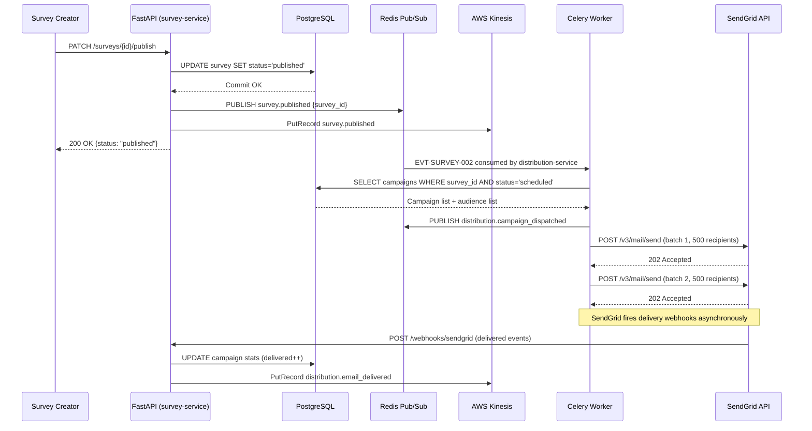
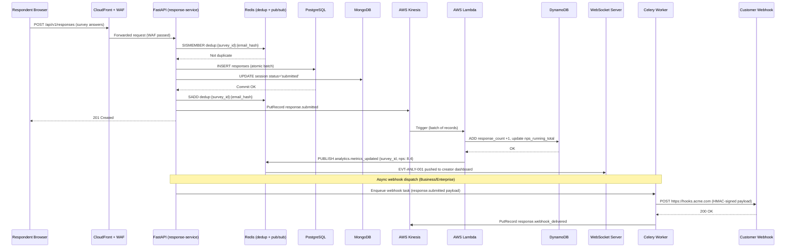
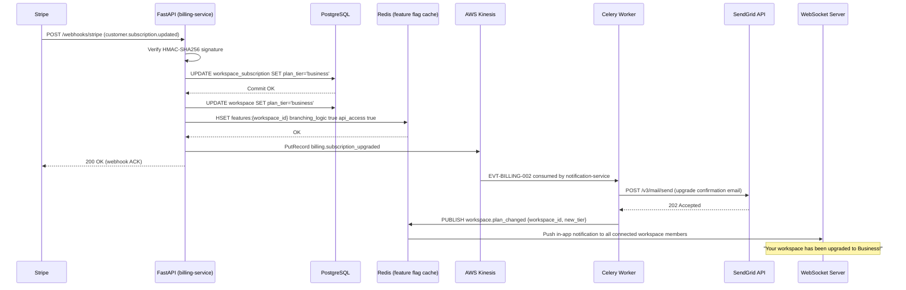

# Event Catalog — Survey and Feedback Platform

## Overview

The Survey and Feedback Platform employs an event-driven architecture to decouple services, enable
real-time analytics, and power integrations. Events are the authoritative record of meaningful state
changes across all platform domains.

**Event infrastructure:**
- **Redis Pub/Sub** — Low-latency internal fan-out for real-time WebSocket pushes and same-process
  consumers (dashboard counters, webhook dispatcher). Messages are ephemeral; not persisted.
- **AWS Kinesis Data Streams** — Durable, ordered event stream for the analytics pipeline. Kinesis
  stores each shard for 7 days. Lambda consumers perform aggregation into DynamoDB.
- **Celery Task Queue (Redis Broker)** — Used for delayed and retryable event side-effects
  (webhook dispatch, email notifications, CRM sync, report generation).

All services publish events after committing their database transaction to guarantee at-least-once
delivery. Consumers must be idempotent using the `event_id` UUID as a deduplication key.

---

## Event Naming Convention

Events follow a reverse-DNS dot-notation pattern: `{domain}.{resource}.{past_tense_verb}` or
`{domain}.{past_tense_verb}` for cross-resource domain events.

| Component | Convention | Example |
|---|---|---|
| Domain | Lowercase noun | `survey`, `response`, `billing` |
| Verb | Past tense, lowercase | `created`, `submitted`, `expired` |
| Full pattern | `domain.resource.verb` | `survey.published`, `response.submitted` |

**Schema versioning:** Every payload includes `schema_version` (semver). Breaking changes increment
the major version. Consumers must handle unknown fields gracefully (forward-compatible schemas).
Current baseline: `"1.0"`.

---
## Survey Domain Events
#### EVT-SURVEY-001 — `survey.created`
- **Producer:** `survey-service` | **Consumers:** `audit-service`, `notification-service`
- **Trigger:** Survey entity first persisted to PostgreSQL
- **Retention:** 7 days (Kinesis) | **SLA:** Consumed within 500 ms of emission

**Payload:**
```json
{
  "event_id": "uuid-v4",
  "event_type": "survey.created",
  "schema_version": "1.0",
  "timestamp": "2024-06-01T10:00:00.000Z",
  "workspace_id": "uuid",
  "survey_id": "uuid",
  "created_by": "uuid",
  "survey_title": "Q4 NPS Survey",
  "question_count": 0,
  "status": "draft"
}
```

#### EVT-SURVEY-002 — `survey.published`
- **Producer:** `survey-service` | **Consumers:** `distribution-service`, `audit-service`, `analytics-service`, `notification-service`
- **Trigger:** Survey status transitions from `draft` or `paused` to `published`
- **Retention:** 7 days (Kinesis) | **SLA:** Consumed within 1 s; distribution tasks enqueued within 2 s
- **Payload:** `{ event_id, event_type, schema_version, timestamp, workspace_id, survey_id, published_by, survey_title, distribution_count, expires_at }`

#### EVT-SURVEY-003 — `survey.paused`
- **Producer:** `survey-service` | **Consumers:** `audit-service`, `notification-service`, `distribution-service`
- **Trigger:** Survey status transitions from `published` to `paused` by a workspace member
- **Retention:** 7 days | **SLA:** ≤ 500 ms
- **Payload:** `{ event_id, event_type, schema_version, timestamp, workspace_id, survey_id, paused_by, reason }`

#### EVT-SURVEY-004 — `survey.closed`
- **Producer:** `survey-service` | **Consumers:** `audit-service`, `analytics-service`, `notification-service`, `webhook-dispatcher`
- **Trigger:** Survey manually closed, response cap reached (BR-FORM-007), or expiry triggered (BR-FORM-005)
- **Retention:** 7 days | **SLA:** ≤ 500 ms
- **Payload:** `{ event_id, event_type, schema_version, timestamp, workspace_id, survey_id, closed_by, close_reason, final_response_count }`

#### EVT-SURVEY-005 — `survey.expired`
- **Producer:** `survey-service` (Celery Beat scheduled job) | **Consumers:** `audit-service`, `notification-service`
- **Trigger:** Current UTC time passes the survey's `expires_at` timestamp; detected by hourly cron
- **Retention:** 7 days | **SLA:** ≤ 60 s from expiry moment
- **Payload:** `{ event_id, event_type, schema_version, timestamp, workspace_id, survey_id, expired_at, response_count }`

#### EVT-SURVEY-006 — `survey.deleted`
- **Producer:** `survey-service` | **Consumers:** `audit-service`, `storage-service`, `analytics-service`
- **Trigger:** Survey soft-deleted by an Admin or Owner; kicks off cascade cleanup schedule
- **Retention:** 7 days | **SLA:** ≤ 500 ms; hard-delete Celery job enqueued for 30 days later
- **Payload:** `{ event_id, event_type, schema_version, timestamp, workspace_id, survey_id, deleted_by, scheduled_hard_delete_at }`

#### EVT-SURVEY-007 — `survey.question_added`
- **Producer:** `survey-service` | **Consumers:** `audit-service`
- **Trigger:** A new question is appended or inserted into a survey in `draft` status
- **Retention:** 7 days | **SLA:** ≤ 500 ms
- **Payload:** `{ event_id, event_type, schema_version, timestamp, workspace_id, survey_id, question_id, question_type, position, added_by }`

#### EVT-SURVEY-008 — `survey.logic_updated`
- **Producer:** `survey-service` | **Consumers:** `audit-service`, `cache-service` (invalidate survey JSON cache)
- **Trigger:** Conditional logic rules on a survey are created, modified, or deleted
- **Retention:** 7 days | **SLA:** ≤ 500 ms; Redis cache invalidated synchronously
- **Payload:** `{ event_id, event_type, schema_version, timestamp, workspace_id, survey_id, updated_by, rule_count, logic_schema_version }`

#### EVT-SURVEY-009 — `survey.duplicated`
- **Producer:** `survey-service` | **Consumers:** `audit-service`
- **Trigger:** A survey is duplicated by a workspace member
- **Retention:** 7 days | **SLA:** ≤ 500 ms
- **Payload:** `{ event_id, event_type, schema_version, timestamp, workspace_id, source_survey_id, new_survey_id, duplicated_by, new_title }`

#### EVT-SURVEY-010 — `survey.response_cap_reached`
- **Producer:** `response-service` | **Consumers:** `survey-service`, `notification-service`
- **Trigger:** Atomic Redis response counter equals the survey's configured `response_limit`
- **Retention:** 7 days | **SLA:** ≤ 2 s; survey auto-closes within the same transaction cycle
- **Payload:** `{ event_id, event_type, schema_version, timestamp, workspace_id, survey_id, cap_value, final_count }`

---

## Response Domain Events
#### EVT-RESPONSE-001 — `response.session_started`
- **Producer:** `response-service` | **Consumers:** `analytics-service`, `session-cleanup-service`
- **Trigger:** Respondent opens survey link and a ResponseSession document is created in MongoDB
- **Retention:** 7 days (Kinesis) | **SLA:** ≤ 500 ms

**Payload:**
```json
{
  "event_id": "uuid-v4",
  "event_type": "response.session_started",
  "schema_version": "1.0",
  "timestamp": "2024-06-02T14:10:00.000Z",
  "workspace_id": "uuid",
  "survey_id": "uuid",
  "session_id": "6657a3bc2f1e4a001234abcd",
  "distribution_id": "uuid-or-null",
  "channel": "email",
  "is_anonymous": false,
  "ip_country": "US"
}
```

#### EVT-RESPONSE-002 — `response.submitted`
- **Producer:** `response-service` | **Consumers:** `analytics-service` (Kinesis), `webhook-dispatcher` (Celery), `crm-sync-service`, `notification-service`, `audit-service`
- **Trigger:** Respondent completes and submits the final survey page; all responses committed atomically
- **Retention:** 7 days (Kinesis stream); indefinite (DynamoDB aggregates) | **SLA:** ≤ 2 s to DynamoDB counter update; ≤ 5 s to webhook dispatch

**Payload:**
```json
{
  "event_id": "uuid-v4",
  "event_type": "response.submitted",
  "schema_version": "1.0",
  "timestamp": "2024-06-02T14:18:33.000Z",
  "workspace_id": "uuid",
  "survey_id": "uuid",
  "session_id": "6657a3bc2f1e4a001234abcd",
  "distribution_id": "uuid-or-null",
  "respondent_email_hash": "sha256:ab34cd...",
  "channel": "email",
  "is_anonymous": false,
  "duration_seconds": 503,
  "answer_count": 12,
  "nps_score": 9,
  "ip_country": "US",
  "schema_version": "1.0"
}
```

#### EVT-RESPONSE-003 — `response.partial_saved`
- **Producer:** `response-service` | **Consumers:** `analytics-service` (drop-off tracking), `session-cleanup-service`
- **Trigger:** Respondent navigates to the next page in a multi-page survey (page-save checkpoint)
- **Retention:** 7 days | **SLA:** ≤ 500 ms
- **Payload:** `{ event_id, event_type, schema_version, timestamp, workspace_id, survey_id, session_id, current_page, total_pages, elapsed_seconds }`

#### EVT-RESPONSE-004 — `response.session_expired`
- **Producer:** `session-cleanup-service` (Celery Beat nightly) | **Consumers:** `analytics-service`, `audit-service`
- **Trigger:** Partial ResponseSession document has not been updated for 7 days (configurable TTL)
- **Retention:** 7 days | **SLA:** Processed within 60 s of TTL expiry detection
- **Payload:** `{ event_id, event_type, schema_version, timestamp, workspace_id, survey_id, session_id, last_page_reached, started_at, expired_at }`

#### EVT-RESPONSE-005 — `response.edited`
- **Producer:** `response-service` | **Consumers:** `analytics-service` (recompute metrics), `audit-service`
- **Trigger:** Authenticated respondent modifies their previously submitted response within the editing window
- **Retention:** 7 days | **SLA:** ≤ 2 s to analytics recompute trigger
- **Payload:** `{ event_id, event_type, schema_version, timestamp, workspace_id, survey_id, session_id, edited_by, version_number, changed_question_ids }`

#### EVT-RESPONSE-006 — `response.erased`
- **Producer:** `privacy-service` | **Consumers:** `analytics-service` (adjust aggregates), `storage-service` (delete S3 files), `audit-service`
- **Trigger:** GDPR/CCPA erasure request fulfilled for a specific respondent's submission
- **Retention:** 7 days | **SLA:** Soft-delete within 24 h; hard-delete Celery job enqueued for T+30 days
- **Payload:** `{ event_id, event_type, schema_version, timestamp, workspace_id, survey_id, session_id, erasure_request_id, pii_fields_cleared, scheduled_hard_delete_at }`

#### EVT-RESPONSE-007 — `response.flagged`
- **Producer:** `moderation-service` | **Consumers:** `audit-service`, `notification-service`
- **Trigger:** A response is flagged by a workspace admin as spam, test, or requiring review
- **Retention:** 7 days | **SLA:** ≤ 500 ms
- **Payload:** `{ event_id, event_type, schema_version, timestamp, workspace_id, survey_id, session_id, flagged_by, flag_reason, excluded_from_analytics }`

#### EVT-RESPONSE-008 — `response.imported`
- **Producer:** `import-service` | **Consumers:** `analytics-service`, `audit-service`
- **Trigger:** A batch of responses is successfully imported from a CSV/XLSX file
- **Retention:** 7 days | **SLA:** ≤ 5 s to analytics update after import completes
- **Payload:** `{ event_id, event_type, schema_version, timestamp, workspace_id, survey_id, import_job_id, row_count, success_count, error_count, source_filename }`

#### EVT-RESPONSE-009 — `response.deduplication_blocked`
- **Producer:** `response-service` | **Consumers:** `analytics-service` (block rate metric), `audit-service`
- **Trigger:** Deduplication check (email or IP-based) blocks a submission attempt
- **Retention:** 7 days | **SLA:** ≤ 200 ms (synchronous before returning 409 to client)
- **Payload:** `{ event_id, event_type, schema_version, timestamp, workspace_id, survey_id, dedup_type, block_reason }`

#### EVT-RESPONSE-010 — `response.webhook_delivered`
- **Producer:** `webhook-dispatcher` | **Consumers:** `audit-service`, `webhook-health-service`
- **Trigger:** A `response.submitted` webhook payload is successfully delivered (HTTP 2xx received)
- **Retention:** 7 days | **SLA:** Recorded within 500 ms of successful delivery confirmation
- **Payload:** `{ event_id, event_type, schema_version, timestamp, workspace_id, webhook_endpoint_id, source_event_id, delivery_attempt, http_status, latency_ms }`

---

## Distribution Domain Events
#### EVT-DIST-001 — `distribution.campaign_created`
- **Producer:** `distribution-service` | **Consumers:** `audit-service`
- **Trigger:** A new SurveyDistribution record is persisted with status `draft`
- **Retention:** 7 days | **SLA:** ≤ 500 ms
- **Payload:** `{ event_id, event_type, schema_version, timestamp, workspace_id, campaign_id, survey_id, channel, audience_count }`

#### EVT-DIST-002 — `distribution.campaign_dispatched`
- **Producer:** `distribution-service` | **Consumers:** `analytics-service`, `audit-service`, `notification-service`
- **Trigger:** All send tasks for a campaign are enqueued in Celery (email/SMS batches submitted to provider)
- **Retention:** 7 days | **SLA:** ≤ 2 s after campaign status set to `sending`
- **Payload:** `{ event_id, event_type, schema_version, timestamp, workspace_id, campaign_id, survey_id, channel, total_recipients, batch_count, dispatched_at }`

#### EVT-DIST-003 — `distribution.email_delivered`
- **Producer:** `sendgrid-webhook-consumer` | **Consumers:** `analytics-service`, `distribution-service`
- **Trigger:** SendGrid fires `delivered` event for an individual email
- **Retention:** 7 days | **SLA:** ≤ 1 s from webhook receipt to counter update
- **Payload:** `{ event_id, event_type, schema_version, timestamp, workspace_id, campaign_id, sg_message_id, contact_email_hash, delivered_at }`

#### EVT-DIST-004 — `distribution.email_bounced`
- **Producer:** `sendgrid-webhook-consumer` | **Consumers:** `distribution-service`, `contact-service` (suppress)
- **Trigger:** SendGrid fires `bounce` event for a hard bounce
- **Retention:** 7 days | **SLA:** ≤ 1 s from webhook receipt; contact suppressed synchronously
- **Payload:** `{ event_id, event_type, schema_version, timestamp, workspace_id, campaign_id, sg_message_id, contact_email_hash, bounce_type, bounce_reason }`

#### EVT-DIST-005 — `distribution.link_clicked`
- **Producer:** `tracking-service` (redirect endpoint) | **Consumers:** `analytics-service`
- **Trigger:** Respondent clicks a personalized survey link in an email (tracked redirect)
- **Retention:** 7 days | **SLA:** ≤ 500 ms; redirect to survey must complete within 200 ms
- **Payload:** `{ event_id, event_type, schema_version, timestamp, workspace_id, campaign_id, survey_id, contact_email_hash, clicked_at, user_agent_type }`

#### EVT-DIST-006 — `distribution.sms_delivered`
- **Producer:** `twilio-webhook-consumer` | **Consumers:** `analytics-service`, `distribution-service`
- **Trigger:** Twilio fires `delivered` status callback for an SMS message
- **Retention:** 7 days | **SLA:** ≤ 1 s from webhook receipt
- **Payload:** `{ event_id, event_type, schema_version, timestamp, workspace_id, campaign_id, twilio_sid, contact_phone_hash, delivered_at }`

#### EVT-DIST-007 — `distribution.unsubscribed`
- **Producer:** `sendgrid-webhook-consumer` / `sms-opt-out-service` | **Consumers:** `contact-service`, `audit-service`, `notification-service`
- **Trigger:** Respondent clicks the email unsubscribe link or sends SMS STOP reply
- **Retention:** 7 days | **SLA:** Contact suppressed within 10 s of event receipt
- **Payload:** `{ event_id, event_type, schema_version, timestamp, workspace_id, contact_email_hash, channel, unsubscribed_at, source }`

#### EVT-DIST-008 — `distribution.campaign_completed`
- **Producer:** `distribution-service` | **Consumers:** `analytics-service`, `notification-service`, `audit-service`
- **Trigger:** All send batches for a campaign are processed (delivered + bounced + failed = total_recipients)
- **Retention:** 7 days | **SLA:** ≤ 2 s after final batch ACK
- **Payload:** `{ event_id, event_type, schema_version, timestamp, workspace_id, campaign_id, survey_id, total_sent, delivered, bounced, failed, completion_rate_pct }`

---

## Analytics Domain Events
#### EVT-ANLY-001 — `analytics.metrics_updated`
- **Producer:** `analytics-lambda` | **Consumers:** `websocket-service` (dashboard push), `notification-service` (threshold alerts)
- **Trigger:** DynamoDB counter update completes after consuming a `response.submitted` Kinesis event
- **Retention:** 7 days | **SLA:** ≤ 2 s from response submission to WebSocket push
- **Payload:** `{ event_id, event_type, schema_version, timestamp, workspace_id, survey_id, metric_type, new_value, delta, nps_score, csat_pct, completion_rate_pct }`

#### EVT-ANLY-002 — `analytics.threshold_alert_triggered`
- **Producer:** `analytics-service` | **Consumers:** `notification-service`, `webhook-dispatcher`
- **Trigger:** A metric (response count, NPS, CSAT) crosses a workspace-configured alert threshold
- **Retention:** 7 days | **SLA:** Alert delivered within 30 s of threshold breach
- **Payload:** `{ event_id, event_type, schema_version, timestamp, workspace_id, survey_id, alert_id, metric_type, threshold_value, actual_value, direction }`

#### EVT-ANLY-003 — `analytics.report_generated`
- **Producer:** `report-service` | **Consumers:** `notification-service`, `storage-service`, `audit-service`
- **Trigger:** A report export job completes and the output file is written to S3
- **Retention:** 7 days | **SLA:** ≤ 30 min for reports up to 100k rows; email notification on completion
- **Payload:** `{ event_id, event_type, schema_version, timestamp, workspace_id, report_id, survey_id, generated_by, format, row_count, s3_key, presigned_url_expires_at }`

#### EVT-ANLY-004 — `analytics.sentiment_computed`
- **Producer:** `sentiment-service` (Lambda, triggered by response.submitted) | **Consumers:** `analytics-service`
- **Trigger:** Amazon Comprehend returns sentiment classification for an open-text response
- **Retention:** 7 days | **SLA:** ≤ 10 s from response submission (async enrichment path)
- **Payload:** `{ event_id, event_type, schema_version, timestamp, workspace_id, survey_id, session_id, question_id, sentiment, confidence_scores, language_code }`

#### EVT-ANLY-005 — `analytics.nps_milestone`
- **Producer:** `analytics-lambda` | **Consumers:** `notification-service`, `webhook-dispatcher`
- **Trigger:** Survey NPS score crosses a configurable milestone (e.g., first 10 responses, NPS > 50)
- **Retention:** 7 days | **SLA:** ≤ 5 s from metric update to notification dispatch
- **Payload:** `{ event_id, event_type, schema_version, timestamp, workspace_id, survey_id, milestone_type, nps_score, response_count }`

#### EVT-ANLY-006 — `analytics.data_export_expired`
- **Producer:** `storage-lifecycle-service` (Celery Beat) | **Consumers:** `notification-service`, `audit-service`
- **Trigger:** A report export S3 object reaches its retention expiry date
- **Retention:** 7 days | **SLA:** ≤ 24 h from expiry to deletion and notification
- **Payload:** `{ event_id, event_type, schema_version, timestamp, workspace_id, report_id, s3_key, expired_at, format }`

---

## User / Workspace Domain Events
#### EVT-USER-001 — `user.registered`
- **Producer:** `auth-service` | **Consumers:** `notification-service` (welcome email), `audit-service`, `onboarding-service`
- **Trigger:** A new user account is created (email/password, OAuth, or magic link first-use)
- **Retention:** 7 days | **SLA:** Welcome email enqueued within 5 s
- **Payload:** `{ event_id, event_type, schema_version, timestamp, user_id, email_hash, auth_provider, workspace_id, invited_by }`

#### EVT-USER-002 — `user.login_succeeded`
- **Producer:** `auth-service` | **Consumers:** `audit-service`, `security-service` (anomaly detection)
- **Trigger:** Successful authentication for any auth method
- **Retention:** 7 days | **SLA:** ≤ 200 ms (synchronous with login response)
- **Payload:** `{ event_id, event_type, schema_version, timestamp, user_id, workspace_id, auth_method, ip_address, ip_country, user_agent_hash }`

#### EVT-USER-003 — `user.login_failed`
- **Producer:** `auth-service` | **Consumers:** `audit-service`, `security-service`
- **Trigger:** Failed authentication attempt (wrong password, expired magic link, invalid TOTP code)
- **Retention:** 7 days | **SLA:** ≤ 200 ms
- **Payload:** `{ event_id, event_type, schema_version, timestamp, attempted_email_hash, failure_reason, ip_address, ip_country, consecutive_failures }`

#### EVT-USER-004 — `user.mfa_enrolled`
- **Producer:** `auth-service` | **Consumers:** `audit-service`, `notification-service`
- **Trigger:** User completes TOTP MFA setup and verifies the first code
- **Retention:** 7 days | **SLA:** ≤ 500 ms
- **Payload:** `{ event_id, event_type, schema_version, timestamp, user_id, workspace_id, enrolled_at }`

#### EVT-USER-005 — `workspace.member_invited`
- **Producer:** `workspace-service` | **Consumers:** `notification-service`, `audit-service`
- **Trigger:** An Admin or Owner sends a workspace invitation to an email address
- **Retention:** 7 days | **SLA:** Invitation email enqueued within 5 s
- **Payload:** `{ event_id, event_type, schema_version, timestamp, workspace_id, invited_by, invitee_email_hash, role, expires_at }`

#### EVT-USER-006 — `workspace.member_role_changed`
- **Producer:** `workspace-service` | **Consumers:** `audit-service`, `notification-service`, `rbac-cache-service`
- **Trigger:** An Admin or Owner changes a member's role
- **Retention:** 7 days | **SLA:** RBAC cache invalidated within 1 s
- **Payload:** `{ event_id, event_type, schema_version, timestamp, workspace_id, changed_by, target_user_id, previous_role, new_role }`

#### EVT-USER-007 — `workspace.settings_updated`
- **Producer:** `workspace-service` | **Consumers:** `audit-service`, `cache-service`
- **Trigger:** Workspace name, branding, data residency, or SSO configuration is changed
- **Retention:** 7 days | **SLA:** ≤ 500 ms; CloudFront cache purged for branding changes
- **Payload:** `{ event_id, event_type, schema_version, timestamp, workspace_id, updated_by, changed_fields, previous_values }`

#### EVT-USER-008 — `workspace.deleted`
- **Producer:** `workspace-service` | **Consumers:** `data-lifecycle-service`, `billing-service`, `audit-service`
- **Trigger:** Workspace Owner initiates workspace deletion (starts 30-day soft-delete window)
- **Retention:** 7 days | **SLA:** Stripe subscription cancellation processed within 60 s
- **Payload:** `{ event_id, event_type, schema_version, timestamp, workspace_id, deleted_by, scheduled_hard_delete_at, member_count, survey_count }`

---

## Billing Domain Events
#### EVT-BILLING-001 — `billing.subscription_created`
- **Producer:** `billing-service` (Stripe webhook consumer) | **Consumers:** `workspace-service`, `audit-service`, `notification-service`
- **Trigger:** Stripe fires `customer.subscription.created` webhook; workspace plan upgraded from free
- **Retention:** 7 days | **SLA:** Workspace tier updated within 5 s of webhook receipt
- **Payload:** `{ event_id, event_type, schema_version, timestamp, workspace_id, stripe_subscription_id, plan_tier, billing_cycle, current_period_end, amount_cents, currency }`

#### EVT-BILLING-002 — `billing.subscription_upgraded`
- **Producer:** `billing-service` | **Consumers:** `workspace-service` (update tier), `feature-flag-service`, `audit-service`, `notification-service`
- **Trigger:** Stripe `customer.subscription.updated` webhook with a higher-tier price ID
- **Retention:** 7 days | **SLA:** Feature flags updated within 5 s; welcome email within 30 s
- **Payload:** `{ event_id, event_type, schema_version, timestamp, workspace_id, stripe_subscription_id, previous_tier, new_tier, effective_at }`

#### EVT-BILLING-003 — `billing.subscription_downgraded`
- **Producer:** `billing-service` | **Consumers:** `workspace-service`, `feature-flag-service`, `audit-service`
- **Trigger:** Stripe `customer.subscription.updated` webhook with a lower-tier price ID
- **Retention:** 7 days | **SLA:** Seat and feature enforcement updated at period end
- **Payload:** `{ event_id, event_type, schema_version, timestamp, workspace_id, stripe_subscription_id, previous_tier, new_tier, effective_at, enforcement_date }`

#### EVT-BILLING-004 — `billing.subscription_cancelled`
- **Producer:** `billing-service` | **Consumers:** `workspace-service`, `audit-service`, `notification-service`
- **Trigger:** Stripe `customer.subscription.deleted` webhook
- **Retention:** 7 days | **SLA:** Workspace reverted to free tier within 60 s
- **Payload:** `{ event_id, event_type, schema_version, timestamp, workspace_id, stripe_subscription_id, cancelled_by, cancellation_reason, access_until }`

#### EVT-BILLING-005 — `billing.payment_failed`
- **Producer:** `billing-service` | **Consumers:** `notification-service`, `audit-service`
- **Trigger:** Stripe `invoice.payment_failed` webhook; Stripe retry schedule is active
- **Retention:** 7 days | **SLA:** Payment failure email dispatched within 60 s
- **Payload:** `{ event_id, event_type, schema_version, timestamp, workspace_id, stripe_invoice_id, amount_cents, currency, failure_reason, retry_at, attempt_number }`

#### EVT-BILLING-006 — `billing.invoice_paid`
- **Producer:** `billing-service` | **Consumers:** `audit-service`, `notification-service`
- **Trigger:** Stripe `invoice.paid` webhook
- **Retention:** 7 days | **SLA:** Receipt email dispatched within 60 s
- **Payload:** `{ event_id, event_type, schema_version, timestamp, workspace_id, stripe_invoice_id, amount_cents, currency, period_start, period_end, pdf_url }`

---

## Integration / Webhook Domain Events
#### EVT-INTG-001 — `integration.webhook_endpoint_created`
- **Producer:** `integration-service` | **Consumers:** `audit-service`
- **Trigger:** A workspace member configures a new webhook endpoint
- **Retention:** 7 days | **SLA:** ≤ 500 ms
- **Payload:** `{ event_id, event_type, schema_version, timestamp, workspace_id, endpoint_id, url_hash, event_types, created_by }`

#### EVT-INTG-002 — `integration.webhook_delivery_failed`
- **Producer:** `webhook-dispatcher` | **Consumers:** `audit-service`, `notification-service` (alert admin after 3 failures)
- **Trigger:** Webhook HTTP call returns non-2xx or times out after 10 s; backoff retry scheduled
- **Retention:** 7 days | **SLA:** Admin alerted within 60 s of the 3rd consecutive failure
- **Payload:** `{ event_id, event_type, schema_version, timestamp, workspace_id, endpoint_id, source_event_id, attempt_number, http_status, error_message, next_retry_at }`

#### EVT-INTG-003 — `integration.webhook_moved_to_dlq`
- **Producer:** `webhook-dispatcher` | **Consumers:** `audit-service`, `notification-service` (critical alert)
- **Trigger:** 5th consecutive delivery failure; event moved to dead-letter queue
- **Retention:** 30 days (DLQ in Redis sorted set) | **SLA:** Admin notified within 60 s
- **Payload:** `{ event_id, event_type, schema_version, timestamp, workspace_id, endpoint_id, source_event_id, source_event_type, failure_count, dlq_key, original_payload_hash }`

#### EVT-INTG-004 — `integration.crm_sync_completed`
- **Producer:** `crm-sync-service` | **Consumers:** `audit-service`, `notification-service`
- **Trigger:** A batch CRM sync job (HubSpot or Salesforce) completes successfully
- **Retention:** 7 days | **SLA:** ≤ 5 min for batches up to 10k records
- **Payload:** `{ event_id, event_type, schema_version, timestamp, workspace_id, crm_provider, sync_type, records_synced, records_failed, duration_ms }`

#### EVT-INTG-005 — `integration.crm_sync_failed`
- **Producer:** `crm-sync-service` | **Consumers:** `audit-service`, `notification-service`
- **Trigger:** CRM API call returns a non-retryable error or all retries are exhausted
- **Retention:** 7 days | **SLA:** Admin alerted within 5 min of final failure
- **Payload:** `{ event_id, event_type, schema_version, timestamp, workspace_id, crm_provider, error_code, error_message, records_attempted, retry_count }`

#### EVT-INTG-006 — `integration.zapier_trigger_fired`
- **Producer:** `zapier-integration-service` | **Consumers:** `audit-service`
- **Trigger:** A Zapier-configured trigger event fires and dispatches to the Zapier REST hook URL
- **Retention:** 7 days | **SLA:** ≤ 2 s from source event to Zapier delivery
- **Payload:** `{ event_id, event_type, schema_version, timestamp, workspace_id, zap_hook_id, source_event_type, source_resource_id, http_status, latency_ms }`

---

## Event Flow Diagrams

### Flow 1 — Survey Published → Distribution Triggered → Emails Sent



### Flow 2 — Response Submitted → Analytics Updated → Webhook Fired



### Flow 3 — Subscription Upgraded → Feature Flags Updated → Notification Sent



---

## Dead Letter Queue Handling

Events that fail all retry attempts are moved to the Dead Letter Queue (DLQ) managed as a Redis
sorted set with score = `failed_at` epoch timestamp.

**DLQ key pattern:** `dlq:{workspace_id}:{event_type}`

**DLQ item structure:**
```json
{
  "dlq_entry_id": "uuid-v4",
  "source_event_id": "uuid-v4",
  "source_event_type": "response.submitted",
  "workspace_id": "uuid",
  "endpoint_id": "uuid",
  "original_payload": { "...": "..." },
  "failure_count": 5,
  "last_error": "Connection refused",
  "last_attempted_at": "2024-06-02T20:00:00Z",
  "moved_to_dlq_at": "2024-06-02T20:30:00Z"
}
```

**DLQ policies:**
- Items remain in the DLQ for 30 days before automatic expiry.
- Workspace admins may view and manually replay DLQ items via the integrations dashboard (Business+).
- Bulk replay is available to Super Admins via the ops tooling API.
- DLQ depth > 100 items for a single endpoint triggers automatic suspension and a Critical alert to
  the workspace admin and platform on-call engineer.

---

## Operational Policy Addendum

### 1. Response Data Privacy Policies
Event payloads must never include raw PII. Email, phone, and name fields are replaced with SHA-256
hashes before emission. IP addresses are omitted (country code may be included). DLQ
`original_payload` is encrypted with AES-256 via AWS KMS before writing to Redis. CloudWatch event
logs are subject to the 7-year audit retention policy (BR-DATA-004).

### 2. Survey Distribution Policies
`distribution.email_delivered`, `distribution.email_bounced`, and `distribution.unsubscribed` events
are the authoritative record for deliverability reporting. These events drive the campaign stats
JSONB column on the SurveyDistribution table via an idempotent Lambda consumer. Bounce events
immediately suppress the contact email in the workspace suppression list before the event is ACKed
to prevent any requeue from re-sending to the bounced address.

### 3. Analytics and Retention Policies
Kinesis shard count is provisioned at 4 shards (400 records/s, 4 MB/s write throughput) with
auto-scaling enabled between 2 and 20 shards based on 70% utilization. Lambda event source mapping
uses batch size 100 and parallelization factor 2 per shard. At-least-once delivery is guaranteed;
Lambda consumers use `event_id` for DynamoDB conditional writes to ensure idempotency. Kinesis
enhanced fan-out is used for the analytics consumer to achieve sub-second processing latency.

### 4. System Availability Policies
Kinesis PutRecord failures are retried with exponential backoff (50 ms, 200 ms, 1 s); on final
failure a Celery fallback task replays the event. The HTTP response to the respondent is never
blocked by event emission failure — responses are committed first. P99 latency SLAs: 
`response.submitted` → DynamoDB counter ≤ 2 s; `response.submitted` → webhook dispatch ≤ 5 s.
