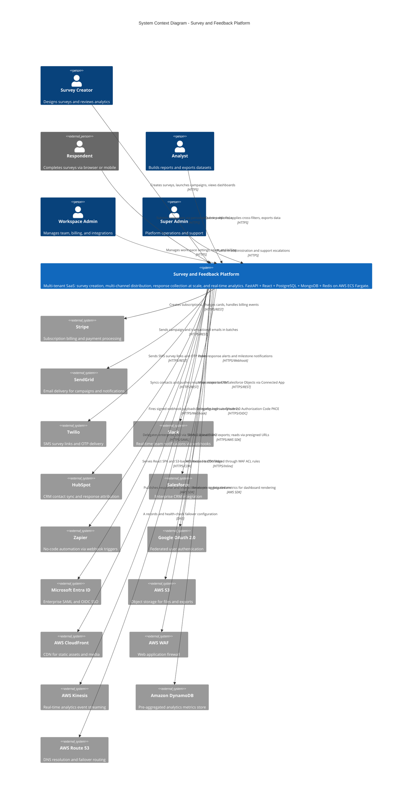

# System Context Diagram — Survey and Feedback Platform

## Overview

This document describes the system context (C4 Level 1) for the Survey and Feedback Platform — a
multi-tenant SaaS application enabling organizations to create, distribute, and analyze surveys across
email, SMS, web embed, and QR channels. It identifies every external actor and third-party system that
exchanges data with the platform, defines the communication interfaces, and establishes trust boundaries
used as inputs to security reviews and compliance audits.

**Technology summary:** FastAPI (Python 3.11) + async SQLAlchemy + Pydantic v2 backend; React 18 +
TypeScript + Zustand + react-hook-form + Recharts frontend; PostgreSQL 15, MongoDB 7, Redis 7 for
persistence; Celery + Redis for async task queues; JWT + OAuth 2.0 (Google, Microsoft SSO) + magic link
for auth; AWS ECS Fargate, RDS, ElastiCache, CloudFront, Route 53, WAF for infrastructure; Kinesis →
Lambda → DynamoDB for the real-time analytics pipeline.

---

## External Actors and Systems

| Actor / System | Type | Category | Role in System |
|---|---|---|---|
| Survey Creator | Human Actor | Primary User | Designs surveys, configures branching logic, launches distribution campaigns, monitors dashboards |
| Respondent | Human Actor | External User | Receives invitations; completes surveys via browser, mobile, or kiosk; anonymous or authenticated |
| Analyst | Human Actor | Internal User | Builds cross-filter reports, exports datasets, tracks NPS/CSAT/Sentiment trends |
| Workspace Admin | Human Actor | Administrative | Manages team members, roles, billing, integrations, and data residency configuration |
| Super Admin | Human Actor | Platform Operator | Internal engineer with elevated access for operations, support escalation, and data governance |
| Stripe | External SaaS | Payments | Subscription lifecycle, checkout sessions, invoice generation, failed-payment retries, customer portal |
| SendGrid | External SaaS | Email Delivery | Bulk campaign emails and transactional notifications; bounce/complaint webhooks; suppression sync |
| Twilio | External SaaS | SMS | SMS survey links and OTP delivery; inbound STOP/HELP reply handling; delivery status callbacks |
| Slack | External SaaS | Collaboration | Webhook push notifications for response milestones, quota alerts, and integration errors |
| HubSpot | External SaaS | CRM | Bi-directional contact sync; NPS/CSAT scores pushed to deal and contact properties |
| Salesforce | External SaaS | CRM | Enterprise mapping of responses to Salesforce Contacts, Leads, and Custom Objects |
| Zapier | External SaaS | Automation | Receives signed webhook events (response.submitted, survey.closed) to trigger no-code workflows |
| Google OAuth 2.0 | External IdP | Authentication | Federated sign-in for Google Workspace accounts via Authorization Code flow with PKCE |
| Microsoft Entra ID | External IdP | Authentication | Enterprise SSO for Microsoft 365 orgs via SAML 2.0 and OIDC; optional SCIM directory sync |
| AWS S3 | AWS Service | Object Storage | Stores file-upload responses, generated CSV/XLSX/PDF reports, survey media assets, audit archives |
| AWS CloudFront | AWS Service | CDN | Global edge distribution of React SPA, static assets, and S3 presigned content |
| AWS Route 53 | AWS Service | DNS | Authoritative DNS; latency-based and health-check failover routing across regions |
| AWS WAF | AWS Service | Security | Layer 7 firewall: OWASP CRS, IP rate limiting, geo-blocking, bot management rules |
| AWS Kinesis | AWS Service | Event Streaming | Ingests `response.submitted` and interaction events for the real-time analytics pipeline |
| AWS Lambda | AWS Service | Serverless | Kinesis consumers performing aggregation roll-ups and DynamoDB counter increments |
| Amazon DynamoDB | AWS Service | NoSQL | Pre-aggregated metrics: response counts, NPS trend series, CSAT percentages, question distributions |

---

## System Context Diagram

---

## Interface Descriptions

| External System | Protocol | Data Format | Frequency | Auth Method | Direction |
|---|---|---|---|---|---|
| Stripe | HTTPS REST v1 | JSON | On-demand + event webhooks | Bearer secret key; webhook HMAC-SHA256 | Outbound + Inbound webhook |
| SendGrid | HTTPS REST v3 | JSON (API); MIME (email) | Bulk <=500/req; transactional on-demand | API Key (Authorization header) | Outbound + Inbound event webhook |
| Twilio | HTTPS REST v2010-04-01 | JSON | On-demand per SMS | HTTP Basic Auth (Account SID + Token) | Outbound + Inbound status callback |
| Slack | HTTPS POST | JSON | Event-driven per alert | Bot OAuth token or Incoming Webhook URL | Outbound only |
| HubSpot | HTTPS REST v3 | JSON | Real-time on submit; hourly batch sync | OAuth 2.0 Bearer (refresh token flow) | Bi-directional |
| Salesforce | HTTPS REST v57.0 | JSON | Real-time on trigger; nightly full sync | OAuth 2.0 JWT Bearer (Connected App) | Bi-directional |
| Zapier | HTTPS POST | JSON | Event-driven per configured trigger | HMAC-SHA256 X-Webhook-Signature header | Outbound only |
| Google OAuth 2.0 | HTTPS / OIDC | JWT ID Token + JSON | On user login | Auth Code + PKCE; client secret | Outbound redirect + callback |
| Microsoft Entra ID | HTTPS SAML 2.0 / OIDC | XML SAML Assertion; JWT | On user login | X.509 signed SAML assertions | Outbound redirect + callback |
| AWS S3 | HTTPS + AWS SDK v3 | Binary uploads; JSON metadata | On-demand | IAM Task Role + STS credentials | Outbound |
| AWS CloudFront | HTTPS CDN | Static files; presigned content | Per browser request | CloudFront signed URLs (RSA) | Inbound to CDN edge |
| AWS WAF | Inline HTTPS | HTTP request inspection | Continuous (all requests) | AWS IAM infrastructure config | Inbound transparent filter |
| AWS Kinesis | HTTPS + AWS SDK v3 | JSON (Avro-compatible schema) | Per response event; <=100 ms publish | IAM Task Role | Outbound |
| Amazon DynamoDB | HTTPS + AWS SDK v3 | JSON DynamoDB Item format | Read per dashboard; Write via Lambda | IAM Role (Lambda execution role) | Bi-directional |
| AWS Route 53 | DNS UDP/TCP port 53 | DNS wire format | Per DNS TTL cycle | N/A (public authoritative DNS) | Inbound (infrastructure) |

---

## Trust Boundaries

### Boundary 1 — Public Internet Edge
All traffic from browsers, mobile clients, and inbound webhooks (Stripe, SendGrid, Twilio, HubSpot,
Salesforce) crosses the public internet. This boundary is protected by Route 53 latency routing, AWS
WAF ACLs, and CloudFront origin shield. TLS 1.2 minimum is required; TLS 1.3 is preferred. HSTS with
`max-age=31536000; includeSubDomains; preload` is enforced on all responses. Certificate issuance and
rotation are managed via AWS Certificate Manager (ACM) with automatic renewal 60 days before expiry.

### Boundary 2 — Platform DMZ (CloudFront + ALB)
CloudFront acts as a reverse proxy and origin shield, absorbs Layer 3/4 DDoS, and caches static
content at edge. The Application Load Balancer terminates TLS and routes API traffic to ECS Fargate
tasks. WAF rules apply at both CloudFront and ALB layers for defense-in-depth. Inbound webhook
endpoints operate under stricter per-IP rate limits (50 req/min) compared to public survey endpoints
(200 req/min). ALB access logs are streamed to S3 for 90-day retention.

### Boundary 3 — Application Tier (ECS Fargate Private Subnets 10.0.16.0/20)
FastAPI API containers, Celery workers, and Redis sidecars reside in private VPC subnets with no
direct internet access. All outbound API calls exit via NAT Gateway. Internal service-to-service
traffic uses AWS Service Connect with mTLS. Secrets (API keys, DB passwords, OAuth client secrets)
are stored in AWS Secrets Manager and injected via IAM Task Role at container startup — never baked
into container images or environment files in source control.

### Boundary 4 — Data Tier (Isolated Subnets 10.0.32.0/20)
RDS PostgreSQL 15 Multi-AZ, Amazon DocumentDB (MongoDB-compatible), and ElastiCache Redis 7 Cluster
Mode reside in isolated data subnets accessible only from the application-tier security group. RDS
uses IAM database authentication in addition to password credentials. ElastiCache requires TLS
in-transit and an AUTH token. All data at rest is encrypted with AWS KMS customer-managed keys (CMK).
Automated daily snapshots are retained for 35 days in a separate AWS account for backup isolation.

### Boundary 5 — Third-Party Integration Boundary
Outbound calls to Stripe, SendGrid, Twilio, HubSpot, Salesforce, and Zapier exit via NAT Gateway
with egress FQDN filtering (AWS Network Firewall). All inbound webhooks are authenticated via
HMAC-SHA256 signature verification before the payload is deserialized. Payloads failing signature
validation are rejected with HTTP 401 without logging body contents to prevent log-injection attacks.
OAuth tokens and API keys for third-party services are rotated quarterly and stored exclusively in
AWS Secrets Manager with versioning enabled.

---

## Data Flow Summary

### Flow 1 — Survey Creation and Publishing
Survey Creator submits survey definition → FastAPI validates schema (Pydantic v2) → PostgreSQL stores
survey and question records transactionally → Redis caches rendered survey JSON (TTL 5 min) → S3
stores any uploaded media assets in the `survey-assets` bucket → Celery publishes `survey.published`
event to Redis Pub/Sub and Kinesis for downstream consumers.

### Flow 2 — Email Campaign Distribution
Workspace Admin creates campaign → MongoDB stores audience list and contact records → Celery
distributes send tasks in batches of 500 → SendGrid REST API dispatches invitation emails with
tokenized respondent links → SendGrid fires delivery/open/click webhooks → PostgreSQL updates
distribution tracking status records and campaign analytics counters.

### Flow 3 — Response Submission
Respondent opens survey link → CloudFront serves React SPA → Browser POSTs to FastAPI response
endpoint → WAF inspects request → FastAPI validates session JWT and deduplication via Redis sorted
set → PostgreSQL commits response record atomically → Kinesis receives `response.submitted` event →
Lambda increments DynamoDB counters → WebSocket push to creator dashboard via Redis Pub/Sub (<=2 s
end-to-end SLA). Configured webhook endpoints receive signed `response.submitted` payloads via
Celery dispatcher (<=5 s SLA on Business/Enterprise).

### Flow 4 — Analytics and Reporting
Analyst opens report → React SPA fetches dashboard data → FastAPI reads pre-aggregated DynamoDB
metrics (p99 < 50 ms) → FastAPI queries PostgreSQL for raw cross-filter data on demand → Large
exports (>10,000 rows) enqueued as background Celery tasks → Generated XLSX/CSV written to S3
`exports` prefix → Presigned URL (TTL 1 h) returned to client → Email notification sent when export
is ready.

---

## Operational Policy Addendum

### 1. Response Data Privacy Policies (GDPR / CCPA)
The platform acts as a data processor under GDPR Article 28. Business and Enterprise subscribers must
execute a Data Processing Agreement (DPA) before collecting EU/EEA personal data. Workspaces select
data residency (US us-east-1, EU eu-west-1, APAC ap-southeast-1) pinning RDS, S3, and DynamoDB to
the chosen region. Data subject rights — access, rectification, erasure, and portability — are
self-serviced via the workspace Privacy Center. GDPR erasure triggers cascading soft-delete within
24 hours and hard-delete within 30 days. California consumers may exercise CCPA rights via the
privacy portal; requests are acknowledged within 10 business days and fulfilled within 45 days.
Sensitive-category surveys (health, biometrics, financial data) require an explicit consent question
before publishing. Consent records are retained immutably for 7 years as regulatory evidence.

### 2. Survey Distribution Policies (Anti-Spam)
Email campaigns require workspace domain verification — SPF, DKIM (2048-bit), and DMARC
(p=quarantine minimum) — before any send is permitted. Email addresses are pre-validated via
SendGrid's Email Validation API; addresses with a risk score > 0.75 are auto-suppressed. Daily send
quotas: Free (0), Starter (5,000), Business (50,000), Enterprise (custom, default 500,000). Every
outbound email carries an RFC 8058 `List-Unsubscribe-Post` header; unsubscribes are processed within
10 seconds. Workspaces with bounce rates > 5% or complaint rates > 0.1% are automatically suspended
from further email distribution pending admin review.

### 3. Analytics and Retention Policies
Raw response data default retention: 2 years (configurable 30 days–7 years on Enterprise). Kinesis
stream: 7-day retention. DynamoDB aggregates: indefinite (no TTL on aggregate records). Audit log:
7 years across all tiers. Analytics aggregates for segments with n < 10 are replaced with a
"Responses too few to display" placeholder to prevent respondent re-identification. Open-text
responses are excluded from bulk exports unless the respondent consented at submission time. Report
exports stored in S3: 7 days (Free), 90 days (Starter), 1 year (Business), up to 7 years (Enterprise).

### 4. System Availability Policies

| Tier | Availability SLA | RTO | RPO | Maintenance Window |
|---|---|---|---|---|
| Free | 99.5% best effort | 4 hours | 24 hours | Any time with 24 h notice |
| Starter | 99.9% (<=8.7 h/year) | 2 hours | 4 hours | Sundays 02:00-06:00 UTC |
| Business | 99.95% (<=4.4 h/year) | 1 hour | 1 hour | Sundays 03:00-05:00 UTC |
| Enterprise | 99.99% (<=52 min/year) | 15 minutes | 15 minutes | Pre-approved change windows |

RDS PostgreSQL Multi-AZ delivers automatic failover in < 60 s. ElastiCache Redis 7 Cluster Mode (3
shards, 2 replicas each) delivers 99.99% cache availability with automatic shard failover. ECS
Fargate API service maintains minimum 2 running tasks across 2 AZs with auto-scaling targeting
CPU < 70% and memory < 75%. CloudFront provides anycast edge resilience across 450+ global PoPs.
Route 53 health checks execute every 10 s with a 3-consecutive-failure threshold before DNS failover.
Availability is measured at the response submission endpoint returning HTTP 2xx within 10 s from
three geographically distributed synthetic monitoring probes. Scheduled maintenance windows are
excluded from SLA calculations. Service credits are issued per the SLA addendum in the subscription
contract for verified breaches.
