# Use-Case Diagram — Survey and Feedback Platform

## Overview

This document defines the system boundary and actor interactions for the Survey and Feedback Platform. The platform enables organizations to build surveys, distribute them to targeted audiences, collect responses, and derive insights through real-time analytics and reports. The system boundary encompasses the web application, API layer, background processing pipelines, and third-party integrations (email delivery, OAuth providers, payment processors, and webhook consumers).

Six distinct actor types interact with the platform. Human actors operate directly through the UI or API, while external system actors participate through automated integrations. All actors are subject to the workspace-scoped permission model — each user belongs to one or more workspaces, and their capabilities are governed by their role within that workspace.

---

## Actor Descriptions

| Actor | Type | Description |
|---|---|---|
| **Survey Creator** | Human (Primary) | A workspace member who designs surveys, configures logic, manages distribution campaigns, and reviews response data. Holds the Creator role. |
| **Respondent** | Human (Primary) | An end user (internal or external) who receives a survey link and submits a response. May or may not have a platform account. |
| **Analyst** | Human (Primary) | A workspace member with read-only access to response data, analytics dashboards, and report export capabilities. Cannot modify surveys. |
| **Workspace Admin** | Human (Primary) | Manages workspace settings, team membership, roles, subscription plans, billing, and integrations. Has full access to all surveys within the workspace. |
| **Super Admin** | Human (Secondary) | A platform-level administrator who manages all workspaces, monitors system health, enforces compliance, and handles escalations. |
| **External Systems** | System (Secondary) | Includes OAuth providers (Google, Microsoft), email delivery services (SES), payment gateways (Stripe), webhook consumer endpoints, and AWS analytics pipeline (Kinesis → Lambda → DynamoDB). |

---

## Use-Case Diagram

```mermaid
flowchart TD
    %% Actors
    SC([👤 Survey Creator])
    RE([👤 Respondent])
    AN([👤 Analyst])
    WA([👤 Workspace Admin])
    SA([👤 Super Admin])
    EX([⚙️ External Systems])

    %% ── FORM BUILDER SUBSYSTEM ──────────────────────────────
    subgraph FB["🗂️ Form Builder"]
        UC001[UC-001: Create Survey from Scratch]
        UC002[UC-002: Add Question with Conditional Logic]
        UC003[UC-003: Import Survey from Template]
        UC004[UC-004: Preview Survey]
        UC005[UC-005: Set Survey Expiry & Quota]
        UC006[UC-006: Enable Anonymous Responses]
    end

    %% ── DISTRIBUTION SUBSYSTEM ──────────────────────────────
    subgraph DS["📤 Survey Distribution"]
        UC007[UC-007: Publish and Distribute via Email]
        UC008[UC-008: Generate Shareable Link]
        UC009[UC-009: Embed Survey Widget]
        UC010[UC-010: Schedule Distribution Campaign]
        UC011[UC-011: Send Reminder Emails]
        UC012[UC-012: Target Audience Segment]
    end

    %% ── RESPONSE COLLECTION SUBSYSTEM ───────────────────────
    subgraph RC["📥 Response Collection"]
        UC013[UC-013: Submit Survey Response]
        UC014[UC-014: Resume Partial Response]
        UC015[UC-015: Validate Response Inputs]
        UC016[UC-016: Accept File Upload in Response]
        UC017[UC-017: Record Geolocation Metadata]
    end

    %% ── ANALYTICS SUBSYSTEM ─────────────────────────────────
    subgraph AY["📊 Analytics & Reports"]
        UC018[UC-018: View Real-Time Analytics Dashboard]
        UC019[UC-019: Apply Response Filters]
        UC020[UC-020: Generate NPS Report]
        UC021[UC-021: Export Report as PDF/Excel]
        UC022[UC-022: View Individual Response Detail]
        UC023[UC-023: Compare Survey Versions]
    end

    %% ── AUDIENCE MANAGEMENT SUBSYSTEM ───────────────────────
    subgraph AM["👥 Audience Management"]
        UC024[UC-024: Create Audience Segment]
        UC025[UC-025: Import Contacts via CSV]
        UC026[UC-026: Manage GDPR Consent]
        UC027[UC-027: Unsubscribe Respondent]
    end

    %% ── WORKSPACE & TEAM SUBSYSTEM ───────────────────────────
    subgraph WS["🏢 Workspace & Team"]
        UC028[UC-028: Invite Team Member]
        UC029[UC-029: Assign Role to Member]
        UC030[UC-030: Configure Workspace Settings]
        UC031[UC-031: Upgrade Subscription Plan]
    end

    %% ── INTEGRATIONS SUBSYSTEM ───────────────────────────────
    subgraph IN["🔗 Integrations"]
        UC032[UC-032: Configure Webhook]
        UC033[UC-033: Authenticate via OAuth SSO]
        UC034[UC-034: Trigger Webhook on Response]
        UC035[UC-035: API Key Management]
    end

    %% ── SUPER ADMIN SUBSYSTEM ────────────────────────────────
    subgraph SA_SYS["🛡️ Platform Administration"]
        UC036[UC-036: Manage All Workspaces]
        UC037[UC-037: View Platform Audit Log]
        UC038[UC-038: Enforce Compliance Rules]
    end

    %% ── Actor → Use-Case Connections ────────────────────────
    SC --> UC001
    SC --> UC002
    SC --> UC003
    SC --> UC004
    SC --> UC005
    SC --> UC006
    SC --> UC007
    SC --> UC008
    SC --> UC009
    SC --> UC010
    SC --> UC011
    SC --> UC012
    SC --> UC018
    SC --> UC019
    SC --> UC022
    SC --> UC024
    SC --> UC025

    RE --> UC013
    RE --> UC014
    RE --> UC027

    AN --> UC018
    AN --> UC019
    AN --> UC020
    AN --> UC021
    AN --> UC022
    AN --> UC023

    WA --> UC028
    WA --> UC029
    WA --> UC030
    WA --> UC031
    WA --> UC026
    WA --> UC032
    WA --> UC035

    SA --> UC036
    SA --> UC037
    SA --> UC038

    %% ── Include Relationships ────────────────────────────────
    UC001 -->|«include»| UC004
    UC007 -->|«include»| UC012
    UC007 -->|«include»| UC010
    UC013 -->|«include»| UC015
    UC013 -->|«include»| UC017
    UC020 -->|«include»| UC019
    UC021 -->|«include»| UC020

    %% ── Extend Relationships ────────────────────────────────
    UC002 -->|«extend»| UC001
    UC014 -->|«extend»| UC013
    UC016 -->|«extend»| UC013
    UC011 -->|«extend»| UC007
    UC023 -->|«extend»| UC018

    %% ── External System Connections ─────────────────────────
    EX -->|OAuth Token| UC033
    UC007 -->|Email Send Request| EX
    UC034 -->|Webhook POST| EX
    UC031 -->|Payment Event| EX
    UC013 -->|Kinesis Stream| EX
```

---

## Use-Case List

| ID | Name | Actor(s) | Description |
|---|---|---|---|
| UC-001 | Create Survey from Scratch | Survey Creator | Build a new survey by adding a title, description, questions, and global settings from a blank canvas. |
| UC-002 | Add Question with Conditional Logic | Survey Creator | Add a survey question and attach branching rules that show or skip subsequent questions based on answer values. |
| UC-003 | Import Survey from Template | Survey Creator | Start a new survey pre-populated from a system or personal template in the template library. |
| UC-004 | Preview Survey | Survey Creator | Render the survey in respondent view to verify question flow and styling before publishing. |
| UC-005 | Set Survey Expiry & Quota | Survey Creator | Configure an auto-close date/time and/or a maximum response count after which the survey stops accepting submissions. |
| UC-006 | Enable Anonymous Responses | Survey Creator | Toggle anonymization so respondent identity metadata is not stored or associated with responses. |
| UC-007 | Publish and Distribute via Email | Survey Creator | Finalize and publish a survey, then trigger an email campaign to a selected audience segment. |
| UC-008 | Generate Shareable Link | Survey Creator | Produce a public or password-protected URL that distributes the survey without an email campaign. |
| UC-009 | Embed Survey Widget | Survey Creator | Obtain an embeddable JavaScript snippet to render the survey inline on an external website. |
| UC-010 | Schedule Distribution Campaign | Survey Creator | Set a future send date and time for an email distribution campaign. |
| UC-011 | Send Reminder Emails | Survey Creator | Dispatch follow-up emails to recipients who have not yet submitted a response. |
| UC-012 | Target Audience Segment | Survey Creator | Select one or more named audience segments as distribution targets for an email campaign. |
| UC-013 | Submit Survey Response | Respondent | Complete and submit a survey by answering all required questions and confirming submission. |
| UC-014 | Resume Partial Response | Respondent | Return to an in-progress survey response saved in a previous session and continue from where work stopped. |
| UC-015 | Validate Response Inputs | System (internal) | Enforce question-level validation rules (required fields, character limits, rating ranges) during response submission. |
| UC-016 | Accept File Upload in Response | Respondent | Upload a file (image, PDF) as an answer to a file-type question within a survey. |
| UC-017 | Record Geolocation Metadata | System (internal) | Capture approximate geolocation derived from the respondent's IP address and store it with the response record. |
| UC-018 | View Real-Time Analytics Dashboard | Survey Creator, Analyst | Access a live dashboard showing response counts, completion rates, question-level charts, and NPS gauge. |
| UC-019 | Apply Response Filters | Survey Creator, Analyst | Filter the analytics dashboard by date range, audience segment, device type, or question answer value. |
| UC-020 | Generate NPS Report | Analyst | Compute Net Promoter Score across all eligible responses and render a breakdown of promoters, passives, and detractors. |
| UC-021 | Export Report as PDF/Excel | Analyst | Render a formatted report document containing charts and data tables and download it as PDF or Excel. |
| UC-022 | View Individual Response Detail | Survey Creator, Analyst | Open a single response record and inspect all question answers, metadata, and timestamps. |
| UC-023 | Compare Survey Versions | Analyst | Side-by-side comparison of response metrics between two published versions of the same survey. |
| UC-024 | Create Audience Segment | Survey Creator | Define a named group of contacts by uploading a list, applying filter criteria, or manual selection. |
| UC-025 | Import Contacts via CSV | Survey Creator | Upload a CSV file containing contact email addresses and optional metadata to populate an audience segment. |
| UC-026 | Manage GDPR Consent | Workspace Admin | View, record, and revoke respondent consent records; process data deletion requests; generate consent audit export. |
| UC-027 | Unsubscribe Respondent | Respondent | Opt out of future survey distribution emails via a one-click unsubscribe link embedded in email communications. |
| UC-028 | Invite Team Member | Workspace Admin | Send an invitation email to a new user with a designated workspace role. |
| UC-029 | Assign Role to Member | Workspace Admin | Change the workspace role assigned to an existing team member. |
| UC-030 | Configure Workspace Settings | Workspace Admin | Update workspace name, logo, default language, timezone, and email sender identity. |
| UC-031 | Upgrade Subscription Plan | Workspace Admin | Select a higher subscription tier, complete payment via Stripe, and activate the upgraded feature set. |
| UC-032 | Configure Webhook | Workspace Admin | Register a target URL, select trigger events (response submitted, survey closed), and set a signing secret. |
| UC-033 | Authenticate via OAuth SSO | Survey Creator, Analyst, Workspace Admin | Log in using Google or Microsoft identity provider through the OAuth 2.0 authorization code flow. |
| UC-034 | Trigger Webhook on Response | System (internal) | On response submission, serialize response payload, sign it with HMAC-SHA256, and deliver it to registered webhook URLs. |
| UC-035 | API Key Management | Workspace Admin | Generate, rotate, or revoke API keys used for programmatic access to the platform REST API. |

---

## Primary Use-Case Paths

### Path 1 — End-to-End Survey Creation and Distribution
1. Survey Creator logs in (UC-033 if SSO) or via magic link.
2. Creator creates a new survey from scratch (UC-001) or from a template (UC-003).
3. Creator adds questions and configures conditional branching logic (UC-002).
4. Creator previews the rendered survey (UC-004) and adjusts styling or logic.
5. Creator sets response quota and expiry (UC-005).
6. Creator creates or selects an audience segment (UC-024 / UC-012).
7. Creator publishes and triggers the email distribution campaign (UC-007), optionally scheduled (UC-010).
8. System sends emails via SES; reminder emails are dispatched automatically (UC-011) for non-respondents.

### Path 2 — Respondent Response Submission
1. Respondent receives an email and clicks the survey link; no account required.
2. Respondent loads the survey (system validates the link token and survey state).
3. Respondent answers questions; conditional logic hides/shows questions dynamically (UC-013 includes UC-015).
4. Respondent may pause mid-way and resume later (UC-014).
5. Respondent submits the response; geolocation metadata is captured (UC-017).
6. System writes response to PostgreSQL, streams event to Kinesis, and triggers registered webhooks (UC-034).

### Path 3 — Real-Time Analytics Review
1. Analyst or Survey Creator navigates to the survey's analytics dashboard (UC-018).
2. Analyst applies date range and segment filters (UC-019).
3. Analyst views NPS breakdown and score trend (UC-020).
4. Analyst exports a formatted PDF report (UC-021).
5. Analyst drills into individual response records for qualitative review (UC-022).

### Path 4 — Team Onboarding and Workspace Setup
1. Workspace Admin registers, verifies email, and creates a workspace.
2. Admin configures workspace settings: name, logo, timezone, sender identity (UC-030).
3. Admin invites team members by email (UC-028) and assigns roles (UC-029).
4. Admin upgrades to a paid subscription plan (UC-031) through Stripe.
5. Admin configures webhook endpoints for downstream system integration (UC-032).
6. Admin generates API keys for programmatic survey interaction (UC-035).

### Path 5 — GDPR Compliance Management
1. A data subject submits a deletion request via the published GDPR contact form.
2. Workspace Admin reviews the pending request in the Compliance dashboard (UC-026).
3. Admin locates the respondent's consent record and all associated responses.
4. Admin initiates anonymization or deletion; system purges PII from PostgreSQL and S3 within 72 hours.
5. Super Admin reviews the audit log entry confirming the deletion action (UC-037).
6. An automated confirmation email is sent to the data subject.

---

## Operational Policy Addendum

### 1. Response Data Privacy Policies

All response data collected through the platform is classified as either **personally identifiable (PII)** or **anonymous** based on the survey configuration. By default, respondent email addresses, IP addresses, and device fingerprints are stored alongside each response record. When the Survey Creator enables anonymous mode (UC-006), IP addresses are truncated to the /24 subnet prefix and no email linkage is stored.

**Retention:** Response data is retained for the duration of the workspace's active subscription plus a 90-day grace period post-cancellation. After the grace period, all response records and associated S3 file uploads are permanently deleted through a scheduled Celery purge job.

**Access Control:** Response data is accessible only to workspace members with Creator, Analyst, or Admin roles. API access requires a valid workspace-scoped API key. Super Admins may access response metadata (not answer content) solely for compliance and fraud investigation purposes, and all such access is audit-logged.

**Encryption:** All response data is encrypted at rest using AES-256 via AWS RDS encryption and AWS S3 SSE-KMS. Transit encryption enforces TLS 1.2 minimum via CloudFront and ALB listeners.

### 2. Survey Distribution Policies

Email distribution campaigns must comply with CAN-SPAM, CASL, and GDPR opt-in requirements. The platform enforces the following rules:

- Every distribution email must include a one-click unsubscribe link (UC-027). Suppression is applied within 10 seconds of click.
- Contacts imported via CSV (UC-025) must have verifiable opt-in consent recorded by the importing workspace. Workspaces that upload contacts without consent documentation are subject to account suspension.
- Daily email send limits apply per subscription tier: Starter — 1,000/day; Growth — 10,000/day; Enterprise — unlimited (subject to SES sending quota).
- Reminder emails (UC-011) may be sent at most twice per survey per respondent, with a minimum 48-hour gap between reminders.
- Distribution to purchased or third-party contact lists is prohibited and constitutes grounds for immediate workspace suspension.

### 3. Analytics and Retention Policies

Real-time analytics data flows from the response submission API through AWS Kinesis Data Streams into Lambda processors that write aggregated metrics to DynamoDB. Raw response records are stored in PostgreSQL.

**Data Freshness:** Dashboard metrics reflect a maximum lag of 30 seconds from submission to display. Historical trend charts are aggregated nightly by a scheduled Lambda job to maintain query performance at scale.

**Retention Tiers:**
- Raw response records: retained per subscription tier (Starter: 12 months, Growth: 36 months, Enterprise: unlimited).
- Pre-aggregated dashboard metrics in DynamoDB: retained for 24 months regardless of tier.
- Exported reports stored in S3: retained for 30 days, then auto-deleted.

**Analyst Access:** Analysts may only access data within their assigned workspace. Cross-workspace data access is prohibited. All export events are logged to the platform audit trail.

### 4. System Availability Policies

The platform targets **99.9% monthly uptime** (≤ 43.8 minutes of downtime per month) for all production API endpoints. The following SLAs apply:

| Component | Target Availability | RTO | RPO |
|---|---|---|---|
| Survey Response API | 99.95% | 5 min | 1 min |
| Dashboard / Analytics API | 99.9% | 15 min | 5 min |
| Email Distribution Service | 99.5% | 30 min | 15 min |
| Report Export Service | 99.0% | 60 min | 30 min |

Planned maintenance windows are scheduled between 02:00–04:00 UTC on Sundays and are communicated to all Workspace Admins at least 72 hours in advance via in-app notification and email. Emergency hotfixes may be deployed at any time with a minimum 30-minute advance notice. During maintenance, survey response collection remains active via a read-path bypass that queues writes to Redis for replay post-maintenance.
