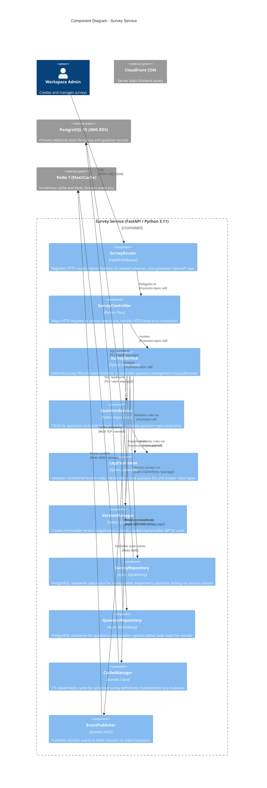
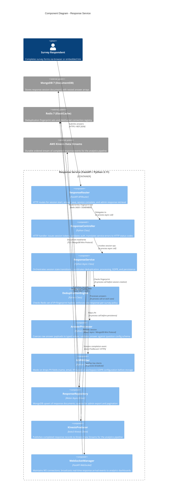
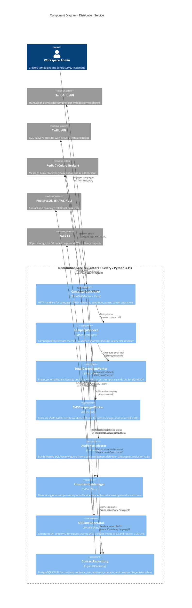
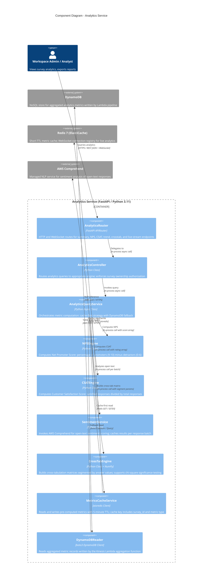

# C4 Component Diagram — Survey and Feedback Platform

## Overview

This document presents C4 Level 3 (Component) diagrams for each backend microservice in the
Survey and Feedback Platform. C4 Level 3 zooms into the internal structure of a single
**Container** (a running process or deployable unit) to show its constituent **Components** —
discrete, well-scoped units of functionality with defined interfaces and responsibilities.

**Scope:** Four services are documented here — Survey Service, Response Service, Distribution
Service, and Analytics Service. Each diagram shows:

- Components within the service boundary
- External systems and data stores that the service communicates with directly
- Named relationships with protocol or mechanism labels

These diagrams are generated from the perspective of a developer implementing or debugging a
specific service. For system-wide context, refer to the C4 Container diagram. For deployment
topology, refer to the Infrastructure Architecture document.

---

## Survey Service — C4 Component Diagram

The Survey Service owns the survey authoring lifecycle: creation, question management,
conditional logic validation, version snapshotting, publication, and state transitions.
It is a FastAPI application deployed as an AWS ECS Fargate task.

---

## Response Service — C4 Component Diagram

The Response Service manages the respondent-facing answer collection lifecycle. It handles
session issuance, real-time answer saving, deduplication, GDPR masking, and streaming of
completed responses to the analytics pipeline.

---

## Distribution Service — C4 Component Diagram

The Distribution Service manages campaign creation, audience targeting, and the bulk delivery
of survey invitations via email and SMS. All delivery work is performed asynchronously by
Celery workers to avoid blocking the API.

---

## Analytics Service — C4 Component Diagram

The Analytics Service provides on-demand metric computation, pre-computed dashboard summaries,
cross-tabulation, and real-time WebSocket streaming. It reads from DynamoDB (written by the
Kinesis → Lambda pipeline) and Redis (short-TTL metric cache).

---

## Component Descriptions

### Survey Service

| Component | Responsibility | Technology | Interface |
|---|---|---|---|
| `SurveyRouter` | HTTP routing and Pydantic v2 validation | FastAPI `APIRouter` | HTTP endpoints |
| `SurveyController` | Request/response translation and error mapping | Python class | Called by router |
| `SurveyService` | Survey lifecycle state machine, CRUD orchestration | Python async class | Called by controller |
| `QuestionService` | Question CRUD, ordering, type validation | Python async class | Called by controller |
| `LogicValidator` | Branch rule consistency and reference validation | Python dataclass | Called by services |
| `VersionManager` | Immutable survey snapshots on publish | Python class | Called by `SurveyService` |
| `SurveyRepository` | PostgreSQL survey table operations | async SQLAlchemy | Called by `SurveyService` |
| `QuestionRepository` | PostgreSQL question table operations | async SQLAlchemy | Called by `QuestionService` |
| `CacheManager` | Redis TTL cache for survey definitions | `aioredis` | Called by `SurveyService` |
| `EventPublisher` | Domain event publishing to Redis Streams | `aioredis` XADD | Called by `SurveyService` |

### Response Service

| Component | Responsibility | Technology | Interface |
|---|---|---|---|
| `ResponseRouter` | Session and answer HTTP routes | FastAPI `APIRouter` | HTTP endpoints |
| `ResponseController` | Session token issuance and HTTP translation | Python class | Called by router |
| `ResponseService` | Session state machine orchestration | Python async class | Called by controller |
| `DeduplicationEngine` | IP + fingerprint one-response enforcement | Python class + Redis | Called by `ResponseService` |
| `AnswerProcessor` | Raw answer coercion and schema validation | Python class | Called by `ResponseService` |
| `GDPRFilter` | PII field masking before storage | Python class | Called by `ResponseService` |
| `ResponseRepository` | MongoDB response document persistence | Motor async driver | Called by `ResponseService` |
| `KinesisProducer` | Completed response streaming to Kinesis | boto3 | Called by `ResponseService` |
| `WebSocketManager` | Real-time analytics WebSocket broadcast | FastAPI WebSocket | Called by `ResponseService` |

### Distribution Service

| Component | Responsibility | Technology | Interface |
|---|---|---|---|
| `CampaignController` | Campaign HTTP CRUD and action routes | FastAPI + Python class | HTTP endpoints |
| `CampaignService` | Campaign lifecycle state machine | Python async class | Called by controller |
| `EmailCampaignWorker` | Async email batch delivery | Celery task + SendGrid | Celery queue |
| `SMSCampaignWorker` | Async SMS batch delivery | Celery task + Twilio | Celery queue |
| `AudienceSelector` | Segment-based contact query builder | SQLAlchemy query | Called by `CampaignService` |
| `UnsubscribeManager` | Opt-out enforcement at send time | Python class | Called by delivery workers |
| `QRCodeGenerator` | Survey QR code generation and S3 upload | `qrcode` + boto3 | Called by `CampaignService` |
| `ContactRepository` | PostgreSQL contact and audience CRUD | async SQLAlchemy | Called by multiple components |

### Analytics Service

| Component | Responsibility | Technology | Interface |
|---|---|---|---|
| `AnalyticsRouter` | HTTP and WebSocket analytics routes | FastAPI `APIRouter` | HTTP + WS endpoints |
| `AnalyticsController` | Query routing and authorization | Python class | Called by router |
| `AnalyticsQueryService` | Cache-first metric orchestration | Python async class | Called by controller |
| `NPSEngine` | Net Promoter Score computation | Python | Called by `AnalyticsQueryService` |
| `CSATEngine` | Customer Satisfaction Score computation | Python | Called by `AnalyticsQueryService` |
| `SentimentService` | Open-text sentiment analysis via AWS Comprehend | boto3 | Called by `AnalyticsQueryService` |
| `CrossTabEngine` | Cross-tabulation matrix generation | Python + NumPy | Called by `AnalyticsQueryService` |
| `MetricsCacheService` | 5-minute TTL pre-computed metric cache | `aioredis` | Called by `AnalyticsQueryService` |
| `DynamoDBReader` | Reads Lambda-aggregated metrics from DynamoDB | boto3 | Called by `AnalyticsQueryService` |

---

## Inter-Service Communication

Services communicate via two mechanisms: **synchronous REST** (for user-facing request/response
flows) and **asynchronous events** (for decoupled state propagation).

### Synchronous REST Calls

| Caller | Callee | Endpoint | Trigger |
|---|---|---|---|
| Response Service | Survey Service | `GET /internal/surveys/{id}` | Validate survey is ACTIVE before accepting session |
| Distribution Service | Survey Service | `GET /internal/surveys/{id}/share-url` | Retrieve embeddable survey link for campaign |
| Analytics Service | Response Service | `GET /internal/surveys/{id}/responses/export` | Bulk response export for heavy cross-tab queries |

### Asynchronous Event Bus (Redis Streams)

| Producer | Stream Key | Event Type | Consumers |
|---|---|---|---|
| Survey Service | `survey.events` | `survey.published`, `survey.closed`, `survey.archived` | Analytics Service, Notification Service |
| Response Service | `response.events` | `response.completed`, `session.expired` | Analytics Service, Notification Service |
| Distribution Service | `campaign.events` | `campaign.sent`, `campaign.failed` | Notification Service, Billing Service |

### Analytics Pipeline (Kinesis → Lambda → DynamoDB)

The Response Service publishes each completed response to **AWS Kinesis Data Streams**. An
**AWS Lambda** function (triggered by Kinesis) aggregates metrics per survey in real-time and
writes results to **DynamoDB**. The Analytics Service reads these pre-aggregated records to
serve low-latency dashboard queries, bypassing full MongoDB scans.

---

## Operational Policy Addendum

### OPA-1: Service Boundary Enforcement

No service may connect to another service's data store directly. All cross-service data access
goes through the owning service's internal REST API or via the shared Redis Streams event bus.
Violations are detectable via network policy in AWS ECS and enforced as merge-blocking review
findings.

### OPA-2: Component Versioning and Backwards Compatibility

Internal REST API paths prefixed with `/internal/` are not subject to the public API versioning
contract but must maintain backwards-compatible request/response schemas for at least one release
cycle. Any breaking change to an internal endpoint requires simultaneous deployment of all
services that consume it (coordinated release).

### OPA-3: Health and Readiness Probes

Each service exposes `GET /health/live` (liveness: is the process running?) and
`GET /health/ready` (readiness: can it serve traffic? — checks DB connection, Redis ping, and
queue worker status). ECS Fargate uses these probes for zero-downtime rolling deployments and
automatic task replacement on failure.

### OPA-4: Secret and Configuration Management

All service credentials (database passwords, AWS keys, SendGrid API key, Twilio auth token,
JWT signing secret) are injected as environment variables from AWS Secrets Manager at container
start time. No secrets are baked into container images. Components access configuration via a
central `Settings` Pydantic model (pydantic-settings) that validates all required variables at
startup, causing the container to fail fast with a descriptive error if any credential is missing.
