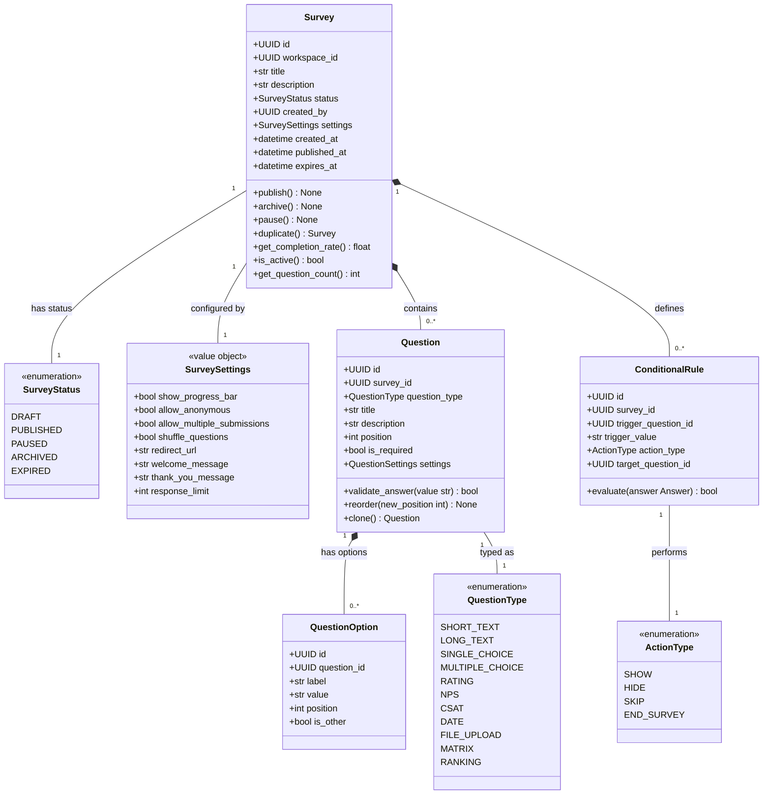
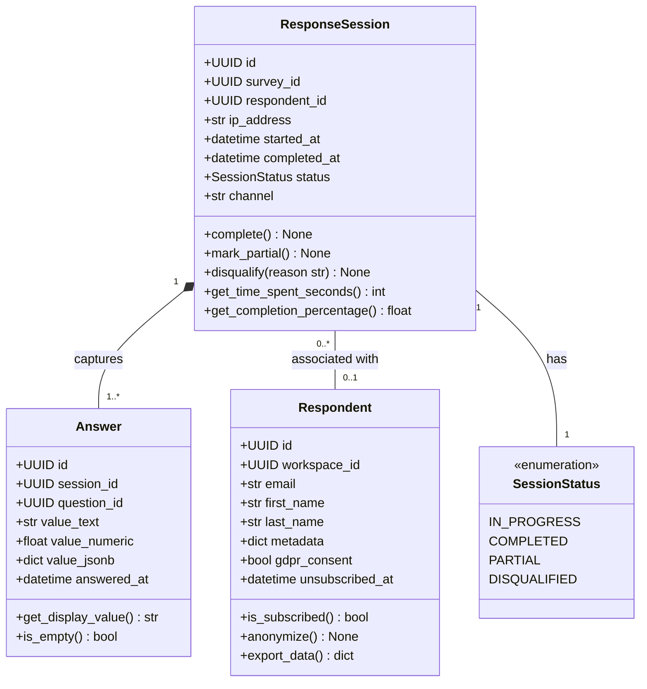
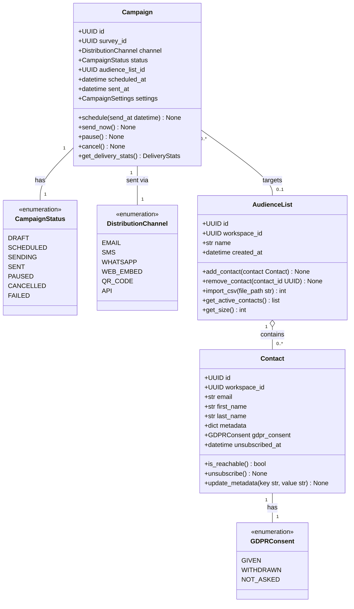
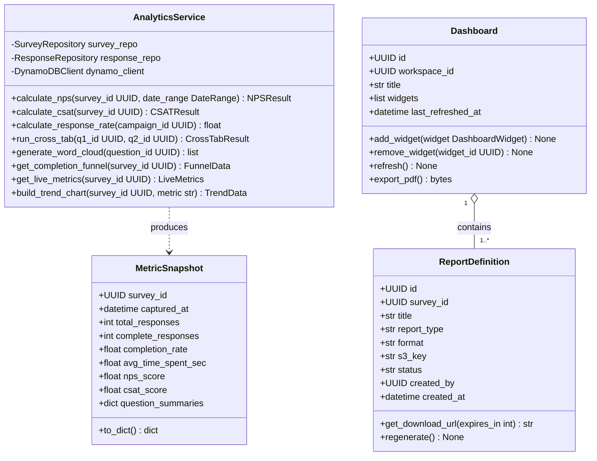
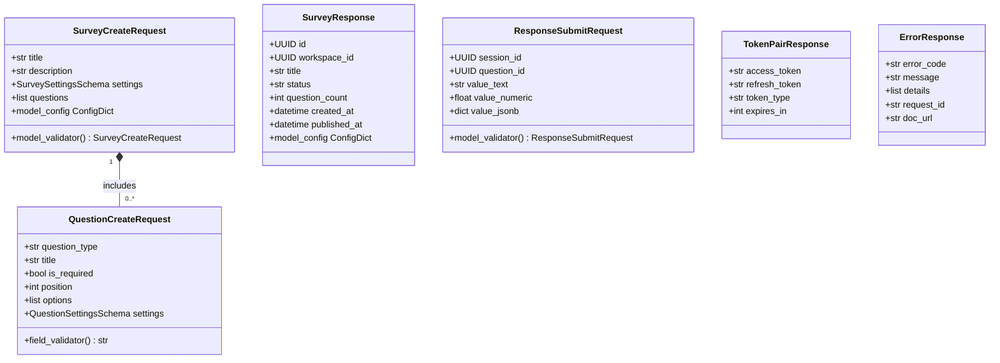
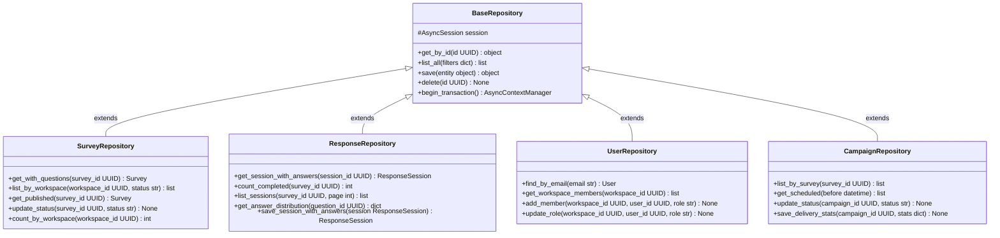

# Class Diagram — Survey and Feedback Platform

## Overview

This document models the platform's object-oriented design across six layers:

| Layer        | Description                                                            |
|--------------|------------------------------------------------------------------------|
| Domain       | Core business entities — Survey, Question, Response                    |
| Service      | Application services orchestrating domain operations                   |
| Repository   | Data-access layer abstracting PostgreSQL, MongoDB, and Redis           |
| Schema       | FastAPI Pydantic v2 request/response contracts                         |
| Enum         | Typed enumerations for all constrained attributes                      |
| Value Object | Immutable configuration and settings objects                           |

All Python methods are `async` by default (FastAPI + async SQLAlchemy). Repositories follow
the Unit of Work pattern. No cross-aggregate object references — only UUID identifiers cross
aggregate boundaries.

---

## Core Domain Classes

---

## Response Domain Classes

---

## Distribution Domain Classes

---

## Analytics Domain Classes

---

## Service Layer Classes

```mermaid
classDiagram
    class SurveyService {
        -SurveyRepository repo
        -RedisCache cache
        -EventBus event_bus
        +create_survey(workspace_id UUID, dto SurveyCreateDTO) Survey
        +update_survey(survey_id UUID, dto SurveyUpdateDTO) Survey
        +publish_survey(survey_id UUID) Survey
        +archive_survey(survey_id UUID) None
        +duplicate_survey(survey_id UUID) Survey
        +add_question(survey_id UUID, dto QuestionCreateDTO) Question
        +reorder_questions(survey_id UUID, positions list) None
        +set_conditional_rules(survey_id UUID, rules list) None
        +get_survey_with_questions(survey_id UUID) Survey
    }

    class ResponseService {
        -ResponseRepository repo
        -DeduplicationService dedup
        -KinesisProducer kinesis
        -WebhookService webhooks
        +start_session(survey_id UUID, channel str) ResponseSession
        +submit_answer(session_id UUID, dto AnswerDTO) Answer
        +complete_session(session_id UUID) ResponseSession
        +get_session(session_id UUID) ResponseSession
        +export_responses(survey_id UUID, fmt str) bytes
    }

    class DistributionService {
        -CampaignRepository repo
        -EmailProvider email_provider
        -SMSProvider sms_provider
        -AudienceRepository audience_repo
        +create_campaign(survey_id UUID, dto CampaignCreateDTO) Campaign
        +schedule_campaign(campaign_id UUID, send_at datetime) Campaign
        +send_campaign_now(campaign_id UUID) None
        +get_delivery_stats(campaign_id UUID) DeliveryStats
        +import_contacts(list_id UUID, file_path str) int
    }

    class AuthService {
        -UserRepository user_repo
        -RedisTokenStore token_store
        +login(email str, password str) TokenPair
        +oauth_login(provider str, code str) TokenPair
        +magic_link_login(email str) None
        +refresh_tokens(refresh_token str) TokenPair
        +logout(refresh_token str, access_jti str) None
        +verify_access_token(token str) TokenClaims
        +get_current_user(claims TokenClaims) User
    }

    class WebhookService {
        -WebhookRepository repo
        -CeleryApp celery
        +register_endpoint(workspace_id UUID, dto WebhookDTO) WebhookEndpoint
        +emit_event(event_type str, payload dict) None
        +deliver(endpoint_id UUID, payload dict) bool
        +get_delivery_logs(endpoint_id UUID) list
        +rotate_secret(endpoint_id UUID) str
    }
```

---

## FastAPI Pydantic Schema Classes

---

## Repository Pattern Classes

---

## Operational Policy Addendum

### 1. Domain Model Governance

All domain entity classes are immutable after construction; state changes go through named
command methods (e.g., `survey.publish()`, `session.complete()`). The `Survey` entity acts
as the aggregate root for the survey bounded context. No cross-aggregate object references —
only `UUID` identifiers cross boundaries, enforced by a lint rule (`no-cross-aggregate-import`).
Anemic domain model anti-pattern is explicitly prohibited; business logic belongs in entity
methods, not in service classes.

### 2. Service Boundary Rules

Each service class owns exactly one bounded context. Within the same process, inter-service
communication uses the internal `EventBus` backed by `asyncio.Queue`. Cross-process
communication uses Celery tasks (for job dispatch) or Kinesis events (for streaming analytics).
Services must never import each other's classes directly — circular imports are a build-time
error enforced via `import-linter` with a `contracts.ini` configuration.

### 3. Schema Versioning Policy

All Pydantic request schemas carry a `schema_version: int = 1` field. Breaking field changes
increment the major API version prefix (`/api/v2/`). Additive field additions are
backward-compatible and require no version bump. Deprecated fields are annotated with a
`@model_validator(mode='before')` that emits a structured deprecation warning at INFO level
and are removed no sooner than two minor releases after deprecation notice.

### 4. Testing Requirements

- **Domain classes:** 100 % unit test coverage; zero database I/O; all methods exercised via
  pytest with in-memory objects.
- **Service classes:** Integration tests against a live PostgreSQL instance provided by the
  `pytest-postgresql` fixture, running in an isolated schema per test function.
- **Repository classes:** Contract tests with a seeded test database; each test rolls back
  via a transaction savepoint to preserve isolation.
- **Pydantic schemas:** Property-based tests using Hypothesis covering edge-case inputs
  (empty strings, Unicode surrogates, max-length boundaries).
- **Factory fixtures:** `tests/factories/` uses `factory_boy` with `SQLAlchemyModelFactory`
  to generate fully-populated entities with sensible defaults.
