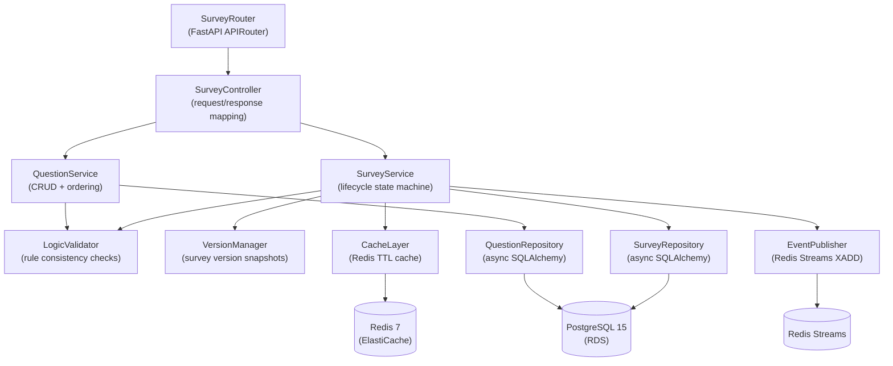
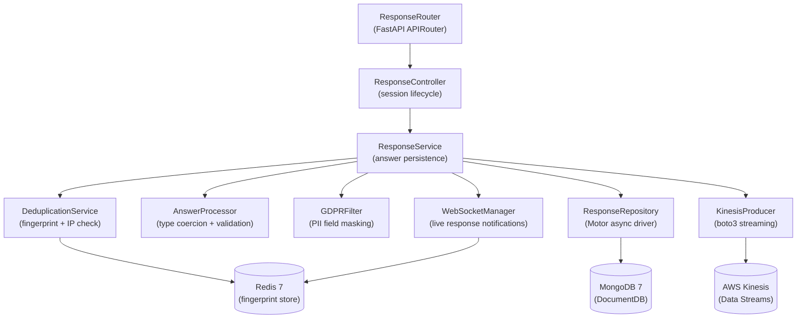
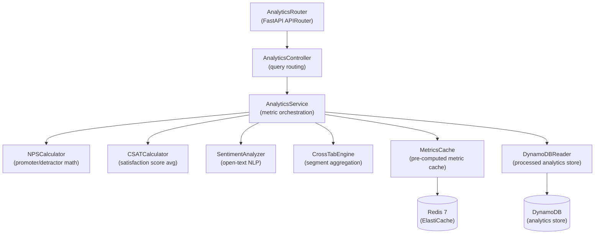
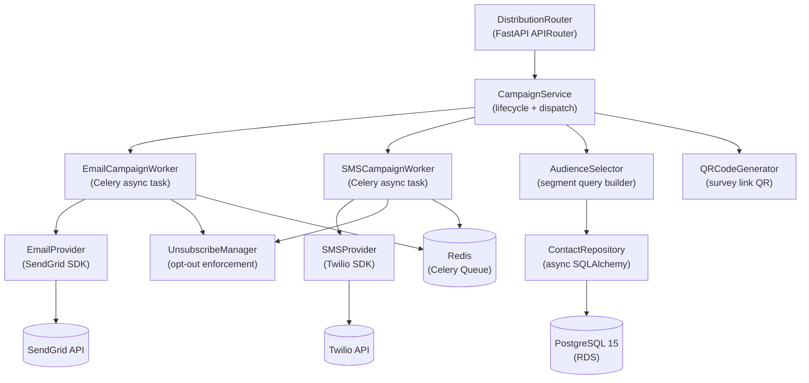
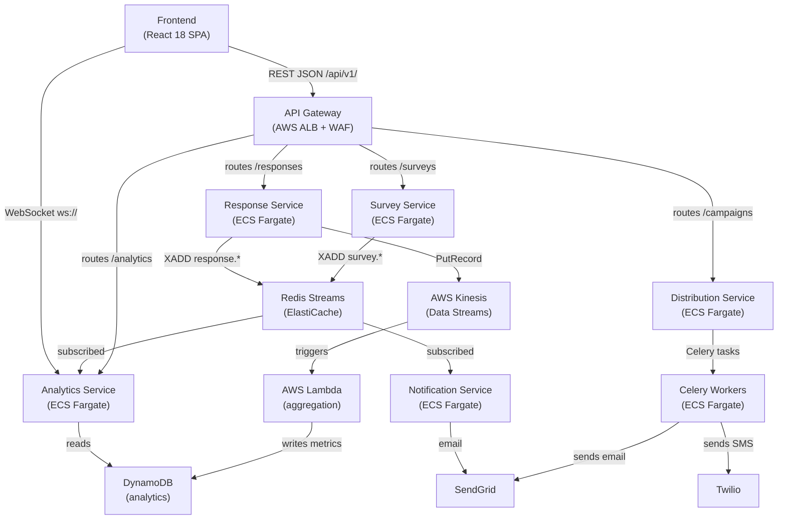

# Component Diagram — Survey and Feedback Platform

## Overview

This document describes the internal component architecture of the Survey and Feedback Platform,
organized into two layers: the **Frontend React application** and the **Backend microservices**.
Each component section is followed by a responsibility reference table and cross-service
interaction diagrams.

Components are defined at the level of discrete modules, classes, or React component trees that
own a specific concern. This document serves as the reference for developers implementing or
modifying individual components, and as input to onboarding and architecture reviews.

---

## Frontend Component Architecture

The frontend is a React 18 single-page application built with TypeScript, Zustand for global
state, `react-hook-form` for form management, and Recharts for analytics visualizations. It
communicates with backend services via a versioned REST API and a WebSocket connection for
live analytics streaming.

```mermaid
flowchart TD
    App["App (Root)"]

    App --> AuthProvider["AuthProvider\n(JWT + OAuth Context)"]
    App --> WorkspaceProvider["WorkspaceProvider\n(Zustand Store)"]
    App --> Router["React Router v6"]

    Router --> AuthPages
    Router --> Dashboard
    Router --> SurveyBuilder
    Router --> ResponseView
    Router --> AnalyticsDashboard
    Router --> ReportBuilder["ReportBuilder\n(PDF/CSV Export)"]
    Router --> AudienceManager["AudienceManager\n(Contact Lists)"]
    Router --> Settings["Settings\n(Workspace, Billing, Webhooks)"]

    subgraph AuthPages["Auth Pages"]
        Login["Login\n(email + password)"]
        Register["Register\n(new workspace)"]
        MagicLink["MagicLink\n(token verification)"]
        OAuthCallback["OAuthCallback\n(Google / Microsoft)"]
    end

    subgraph Dashboard["Dashboard"]
        SurveyList["SurveyList\n(paginated, filterable)"]
        AnalyticsSummary["AnalyticsSummary\n(workspace-level KPIs)"]
        RecentActivity["RecentActivity\n(audit feed)"]
    end

    subgraph SurveyBuilder["Survey Builder"]
        QuestionPalette["QuestionPalette\n(12 question type tiles)"]
        CanvasArea["CanvasArea\n(drag-and-drop editor)"]
        PreviewMode["PreviewMode\n(respondent simulation)"]
        PublishPanel["PublishPanel\n(settings, scheduling)"]
    end

    CanvasArea --> QuestionCard["QuestionCard\n(draggable, configurable)"]
    CanvasArea --> LogicRulesPanel["LogicRulesPanel\n(branch condition editor)"]

    subgraph ResponseView["Response View (Respondent-Facing)"]
        ProgressBar["ProgressBar\n(% complete indicator)"]
        QuestionRenderer["QuestionRenderer\n(handles all 12 question types)"]
        ConditionalController["ConditionalController\n(evaluates show/hide logic)"]
        SubmitHandler["SubmitHandler\n(validation + session finalization)"]
    end

    subgraph AnalyticsDashboard["Analytics Dashboard"]
        MetricCards["MetricCards\n(NPS score, CSAT, response count)"]
        TrendChart["TrendChart\n(Recharts line/bar chart)"]
        CrossTabulator["CrossTabulator\n(segment comparison table)"]
        WordCloud["WordCloud\n(open text frequency)"]
        LiveFeed["LiveFeed\n(WebSocket real-time stream)"]
    end

    QuestionRenderer --> TextInput["TextInput\n(short / long answer)"]
    QuestionRenderer --> RatingScale["RatingScale\n(NPS 0-10, star 1-5)"]
    QuestionRenderer --> MultipleChoice["MultipleChoice\n(single / multi select)"]
    QuestionRenderer --> MatrixQuestion["MatrixQuestion\n(grid ratings)"]
    QuestionRenderer --> FileUpload["FileUpload\n(S3 direct upload)"]
    QuestionRenderer --> DatePicker["DatePicker\n(date / datetime)"]
    QuestionRenderer --> SliderInput["SliderInput\n(numeric range)"]
```

### Frontend Component Descriptions

| Component | Responsibility | State Owner | Key Dependency |
|---|---|---|---|
| `AuthProvider` | Manages JWT tokens, refresh cycle, OAuth callbacks | Zustand `authStore` | `axios` interceptors |
| `WorkspaceProvider` | Active workspace context, subscription status, feature flags | Zustand `workspaceStore` | REST API |
| `SurveyList` | Lists surveys with status filters, search, pagination | Local + `surveyStore` | React Query |
| `CanvasArea` | Drag-and-drop question reordering; emits reorder API calls | Local (`dnd-kit`) | `SurveyBuilder` form context |
| `QuestionCard` | Renders a single question editor; binds to `react-hook-form` | Survey form context | `react-hook-form` |
| `LogicRulesPanel` | UI for defining conditional skip/show logic between questions | Survey form context | `react-hook-form` |
| `QuestionRenderer` | Dispatches to one of 12 typed sub-components based on `question_type` | Response session store | `ConditionalController` |
| `ConditionalController` | Evaluates branching logic rules in real-time against current answers | Response session store | Logic rule engine (client-side) |
| `SubmitHandler` | Validates all required answers, calls `/responses/{id}/complete` | Response session store | `react-hook-form` |
| `MetricCards` | Fetches and displays NPS, CSAT, completion rate; auto-refreshes | `analyticsStore` | REST + WebSocket |
| `TrendChart` | Renders response volume over time using Recharts `ComposedChart` | `analyticsStore` | Recharts |
| `CrossTabulator` | Segments response data by demographic or answer value | `analyticsStore` | REST API `/analytics/crosstab` |
| `WordCloud` | Renders word frequency for open-text questions | `analyticsStore` | `react-wordcloud` library |
| `PublishPanel` | Survey settings form: audience, expiry, response limits, sharing URL | Survey form context | REST API |

---

## Backend Service Components

The backend consists of four FastAPI microservices, each with a layered internal architecture:
Router → Controller → Service → Repository. Cross-cutting concerns (caching, event publishing,
GDPR filtering) are injected as discrete components into the service layer.

### Survey Service

### Response Service

### Analytics Service

### Distribution Service

---

## Component Interaction Diagram

This diagram shows how components communicate across service boundaries at runtime.

---

## Component Responsibilities

### Survey Service Components

| Component | Responsibility | Technology |
|---|---|---|
| `SurveyRouter` | HTTP route definitions, Pydantic v2 schema injection, OpenAPI docs | FastAPI `APIRouter` |
| `SurveyController` | Maps HTTP request to service call, handles HTTP-level errors | Python class |
| `SurveyService` | Survey CRUD, lifecycle state transitions, duplicate logic | Python async class |
| `QuestionService` | Question CRUD, bulk reorder, question type validation | Python async class |
| `LogicValidator` | Validates that branch rules reference existing questions and valid answer values | Python dataclass |
| `VersionManager` | Creates read-only version snapshots on publish; enables survey diff view | Python class |
| `SurveyRepository` | PostgreSQL SELECT/INSERT/UPDATE/DELETE for `surveys` table | async SQLAlchemy |
| `QuestionRepository` | PostgreSQL operations for `questions` and `question_options` tables | async SQLAlchemy |
| `CacheLayer` | Caches serialized survey definitions; invalidated on any mutation | `aioredis` |
| `EventPublisher` | Publishes domain events to Redis Streams; abstracts stream key naming | `aioredis` XADD |

### Response Service Components

| Component | Responsibility | Technology |
|---|---|---|
| `ResponseController` | Session start, answer save, session complete HTTP handlers | FastAPI |
| `ResponseService` | Orchestrates session state transitions and answer persistence | Python async class |
| `DeduplicationService` | Checks IP + fingerprint Redis set; enforces one-response-per-survey | `aioredis` |
| `AnswerProcessor` | Coerces raw input to typed answer values; validates against question config | Python class |
| `GDPRFilter` | Masks or drops PII fields based on workspace GDPR settings before storage | Python class |
| `ResponseRepository` | MongoDB upsert of response documents; reads for admin export | Motor async |
| `KinesisProducer` | Publishes completed response events to Kinesis for analytics pipeline | `boto3` |
| `WebSocketManager` | Broadcasts real-time response notifications to connected analytics clients | `fastapi-websockets` |

### Analytics Service Components

| Component | Responsibility | Technology |
|---|---|---|
| `AnalyticsController` | Routes analytics queries to appropriate calculator or cache | FastAPI |
| `AnalyticsService` | Orchestrates metric retrieval; cache-first with DynamoDB fallback | Python async class |
| `NPSCalculator` | Computes Net Promoter Score: `%promoters - %detractors` | Python |
| `CSATCalculator` | Computes Customer Satisfaction Score: `satisfied / total * 100` | Python |
| `SentimentAnalyzer` | Runs open-text responses through AWS Comprehend for sentiment scoring | `boto3` |
| `CrossTabEngine` | Builds cross-tabulation matrices segmented by question answer values | Python + NumPy |
| `MetricsCache` | Short-TTL Redis cache for pre-computed dashboard metrics (5 min TTL) | `aioredis` |
| `DynamoDBReader` | Retrieves aggregated metrics written by the Kinesis → Lambda pipeline | `boto3` |

### Distribution Service Components

| Component | Responsibility | Technology |
|---|---|---|
| `CampaignService` | Campaign CRUD, state machine transitions, audience snapshot locking | Python async class |
| `EmailCampaignWorker` | Celery task: batches contacts, calls SendGrid, records delivery status | Celery + SendGrid |
| `SMSCampaignWorker` | Celery task: batches contacts, calls Twilio, records delivery status | Celery + Twilio |
| `AudienceSelector` | Builds filtered contact query from audience segment definition | SQLAlchemy query builder |
| `UnsubscribeManager` | Maintains global and per-survey unsubscribe lists; enforced at send time | PostgreSQL + Redis |
| `QRCodeGenerator` | Generates QR code PNG for survey sharing URL; uploads to S3 | `qrcode` + `boto3` |
| `ContactRepository` | PostgreSQL CRUD for contacts, audiences, unsubscribe records | async SQLAlchemy |

---

## Operational Policy Addendum

### OPA-1: Component Isolation and Single Responsibility

Each component owns exactly one concern. No component may directly access another service's
database or cache namespace. Cross-service data access is performed exclusively through the
service's public REST API or via shared Redis Streams events. Violations of this rule are
treated as architectural defects requiring refactoring before merge.

### OPA-2: Dependency Injection and Testability

All backend components are instantiated via FastAPI's dependency injection system. Repositories,
cache clients, and external SDK clients are injected as dependencies, enabling unit tests to
substitute mock implementations without patching module globals. Integration tests use
`testcontainers-python` to spin up real PostgreSQL, MongoDB, and Redis instances.

### OPA-3: Frontend Component Boundary Contracts

React components must not directly import from sibling route modules. All shared state crosses
component boundaries via Zustand stores or React context only. Components that need server data
use React Query hooks co-located in a `hooks/` directory alongside the component, never raw
`fetch` or `axios` calls embedded in JSX render functions.

### OPA-4: Observability Requirements

Every backend component class emits structured OpenTelemetry spans for operations exceeding
100ms. Repository methods record query duration, row counts, and table names as span attributes.
Event publishers record the stream key and event type. Celery tasks record queue wait time and
execution duration. All spans are exported to AWS X-Ray via the OTLP exporter.
