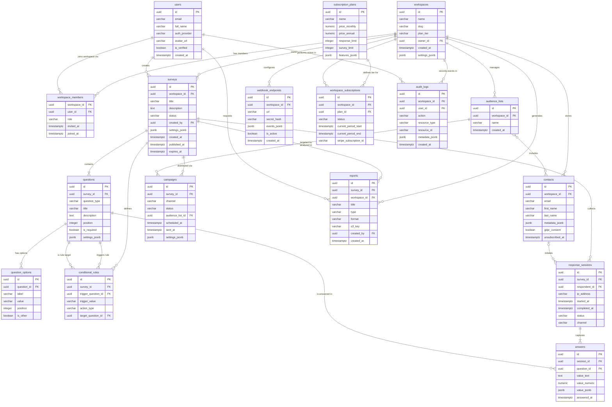

# ERD and Database Schema — Survey and Feedback Platform

## Overview

The Survey and Feedback Platform uses three storage tiers to balance transactional integrity,
query flexibility, and horizontal scalability:

| Tier               | Engine     | Version | Role                                                               |
|--------------------|------------|---------|---------------------------------------------------------------------|
| Primary relational | PostgreSQL | 15      | Surveys, users, workspaces, campaigns, responses, audit logs        |
| Document store     | MongoDB    | 7       | Flexible response payloads, rich rendering metadata                 |
| Cache / broker     | Redis      | 7       | Session state, rate-limit counters, Celery broker + result backend  |

**Design principles:**
- All primary keys are `UUID v4` generated by `gen_random_uuid()` (pgcrypto extension).
- All timestamps are `TIMESTAMPTZ` stored in UTC.
- JSONB columns store schema-flexible configuration; GIN indexes cover key-based lookups.
- Soft-delete pattern: rows are marked `deleted_at IS NOT NULL` rather than physically removed.
- Row-Level Security (RLS) policies enforce workspace isolation at the PostgreSQL layer.

---

## Entity-Relationship Diagram

Crow's foot notation: `||` exactly-one · `o{` zero-or-many · `|{` one-or-many · `}o` many (left) · `o|` zero-or-one.



---

## Table Definitions

### workspaces

```sql
CREATE EXTENSION IF NOT EXISTS "pgcrypto";

CREATE TABLE workspaces (
    id             UUID         NOT NULL DEFAULT gen_random_uuid(),
    name           VARCHAR(255) NOT NULL,
    slug           VARCHAR(100) NOT NULL,
    plan_tier      VARCHAR(50)  NOT NULL DEFAULT 'free',
    owner_id       UUID         NOT NULL,
    settings_jsonb JSONB        NOT NULL DEFAULT '{}',
    created_at     TIMESTAMPTZ  NOT NULL DEFAULT NOW(),
    deleted_at     TIMESTAMPTZ,
    CONSTRAINT pk_workspaces       PRIMARY KEY (id),
    CONSTRAINT uq_workspaces_slug  UNIQUE (slug),
    CONSTRAINT fk_workspaces_owner FOREIGN KEY (owner_id) REFERENCES users(id) ON DELETE RESTRICT,
    CONSTRAINT chk_workspaces_slug CHECK (slug ~ '^[a-z0-9-]{3,100}$')
);

COMMENT ON TABLE  workspaces                IS 'Top-level tenant unit; all survey data is scoped to a workspace.';
COMMENT ON COLUMN workspaces.slug           IS 'URL-safe unique identifier used in public survey links.';
COMMENT ON COLUMN workspaces.settings_jsonb IS 'Stores branding, notification preferences, and feature flags.';
```

### users

```sql
CREATE TABLE users (
    id            UUID         NOT NULL DEFAULT gen_random_uuid(),
    email         VARCHAR(320) NOT NULL,
    full_name     VARCHAR(255),
    auth_provider VARCHAR(50)  NOT NULL DEFAULT 'email',
    avatar_url    VARCHAR(2048),
    is_verified   BOOLEAN      NOT NULL DEFAULT FALSE,
    created_at    TIMESTAMPTZ  NOT NULL DEFAULT NOW(),
    deleted_at    TIMESTAMPTZ,
    CONSTRAINT pk_users       PRIMARY KEY (id),
    CONSTRAINT uq_users_email UNIQUE (email)
);

COMMENT ON COLUMN users.auth_provider IS 'One of: email, google, microsoft, magic_link.';
```

### workspace_members

```sql
CREATE TABLE workspace_members (
    workspace_id UUID        NOT NULL,
    user_id      UUID        NOT NULL,
    role         VARCHAR(50) NOT NULL DEFAULT 'viewer',
    invited_at   TIMESTAMPTZ NOT NULL DEFAULT NOW(),
    joined_at    TIMESTAMPTZ,
    CONSTRAINT pk_workspace_members PRIMARY KEY (workspace_id, user_id),
    CONSTRAINT fk_wm_workspace      FOREIGN KEY (workspace_id) REFERENCES workspaces(id) ON DELETE CASCADE,
    CONSTRAINT fk_wm_user           FOREIGN KEY (user_id)      REFERENCES users(id)      ON DELETE CASCADE,
    CONSTRAINT chk_wm_role          CHECK (role IN ('owner','admin','editor','analyst','viewer'))
);
```

### surveys

```sql
CREATE TABLE surveys (
    id             UUID          NOT NULL DEFAULT gen_random_uuid(),
    workspace_id   UUID          NOT NULL,
    title          VARCHAR(500)  NOT NULL,
    description    TEXT,
    status         VARCHAR(30)   NOT NULL DEFAULT 'draft',
    created_by     UUID          NOT NULL,
    settings_jsonb JSONB         NOT NULL DEFAULT '{}',
    created_at     TIMESTAMPTZ   NOT NULL DEFAULT NOW(),
    published_at   TIMESTAMPTZ,
    expires_at     TIMESTAMPTZ,
    deleted_at     TIMESTAMPTZ,
    CONSTRAINT pk_surveys           PRIMARY KEY (id),
    CONSTRAINT fk_surveys_workspace FOREIGN KEY (workspace_id) REFERENCES workspaces(id) ON DELETE CASCADE,
    CONSTRAINT fk_surveys_creator   FOREIGN KEY (created_by)   REFERENCES users(id)      ON DELETE RESTRICT,
    CONSTRAINT chk_surveys_status   CHECK (status IN ('draft','published','paused','archived','expired'))
);

COMMENT ON COLUMN surveys.settings_jsonb IS 'Welcome screen, thank-you screen, redirect URL, progress bar, response cap.';
```

### questions

```sql
CREATE TABLE questions (
    id             UUID          NOT NULL DEFAULT gen_random_uuid(),
    survey_id      UUID          NOT NULL,
    question_type  VARCHAR(50)   NOT NULL,
    title          VARCHAR(1000) NOT NULL,
    description    TEXT,
    position       INTEGER       NOT NULL DEFAULT 1,
    is_required    BOOLEAN       NOT NULL DEFAULT FALSE,
    settings_jsonb JSONB         NOT NULL DEFAULT '{}',
    deleted_at     TIMESTAMPTZ,
    CONSTRAINT pk_questions         PRIMARY KEY (id),
    CONSTRAINT fk_questions_survey  FOREIGN KEY (survey_id) REFERENCES surveys(id) ON DELETE CASCADE,
    CONSTRAINT chk_questions_type   CHECK (question_type IN (
        'short_text','long_text','single_choice','multiple_choice',
        'rating','nps','csat','date','file_upload','matrix','ranking'
    )),
    CONSTRAINT uq_question_position UNIQUE (survey_id, position) DEFERRABLE INITIALLY DEFERRED
);
```

### question_options

```sql
CREATE TABLE question_options (
    id          UUID         NOT NULL DEFAULT gen_random_uuid(),
    question_id UUID         NOT NULL,
    label       VARCHAR(500) NOT NULL,
    value       VARCHAR(500) NOT NULL,
    position    INTEGER      NOT NULL DEFAULT 1,
    is_other    BOOLEAN      NOT NULL DEFAULT FALSE,
    CONSTRAINT pk_question_options PRIMARY KEY (id),
    CONSTRAINT fk_qo_question      FOREIGN KEY (question_id) REFERENCES questions(id) ON DELETE CASCADE,
    CONSTRAINT uq_option_position  UNIQUE (question_id, position) DEFERRABLE INITIALLY DEFERRED
);
```

### conditional_rules

```sql
CREATE TABLE conditional_rules (
    id                  UUID        NOT NULL DEFAULT gen_random_uuid(),
    survey_id           UUID        NOT NULL,
    trigger_question_id UUID        NOT NULL,
    trigger_value       VARCHAR(500),
    action_type         VARCHAR(50) NOT NULL DEFAULT 'show',
    target_question_id  UUID        NOT NULL,
    CONSTRAINT pk_conditional_rules PRIMARY KEY (id),
    CONSTRAINT fk_cr_survey         FOREIGN KEY (survey_id)           REFERENCES surveys(id)   ON DELETE CASCADE,
    CONSTRAINT fk_cr_trigger        FOREIGN KEY (trigger_question_id) REFERENCES questions(id) ON DELETE CASCADE,
    CONSTRAINT fk_cr_target         FOREIGN KEY (target_question_id)  REFERENCES questions(id) ON DELETE CASCADE,
    CONSTRAINT chk_cr_action        CHECK (action_type IN ('show','hide','skip','end_survey')),
    CONSTRAINT chk_cr_no_self_loop  CHECK (trigger_question_id <> target_question_id)
);
```

### response_sessions

```sql
CREATE TABLE response_sessions (
    id            UUID        NOT NULL DEFAULT gen_random_uuid(),
    survey_id     UUID        NOT NULL,
    respondent_id UUID,
    ip_address    INET,
    started_at    TIMESTAMPTZ NOT NULL DEFAULT NOW(),
    completed_at  TIMESTAMPTZ,
    status        VARCHAR(30) NOT NULL DEFAULT 'in_progress',
    channel       VARCHAR(50) NOT NULL DEFAULT 'web',
    CONSTRAINT pk_response_sessions PRIMARY KEY (id),
    CONSTRAINT fk_rs_survey         FOREIGN KEY (survey_id)     REFERENCES surveys(id)  ON DELETE CASCADE,
    CONSTRAINT fk_rs_respondent     FOREIGN KEY (respondent_id) REFERENCES contacts(id) ON DELETE SET NULL,
    CONSTRAINT chk_rs_status        CHECK (status IN ('in_progress','completed','partial','disqualified'))
);
```

### answers (partitioned)

```sql
-- Partitioned by answered_at; child tables created monthly. See Partitioning Strategy.
CREATE TABLE answers (
    id             UUID        NOT NULL DEFAULT gen_random_uuid(),
    session_id     UUID        NOT NULL,
    question_id    UUID        NOT NULL,
    value_text     TEXT,
    value_numeric  NUMERIC(12,4),
    value_jsonb    JSONB,
    answered_at    TIMESTAMPTZ NOT NULL DEFAULT NOW(),
    CONSTRAINT pk_answers      PRIMARY KEY (id, answered_at),
    CONSTRAINT fk_ans_session  FOREIGN KEY (session_id)  REFERENCES response_sessions(id) ON DELETE CASCADE,
    CONSTRAINT fk_ans_question FOREIGN KEY (question_id) REFERENCES questions(id)         ON DELETE CASCADE
) PARTITION BY RANGE (answered_at);
```

### campaigns

```sql
CREATE TABLE campaigns (
    id               UUID        NOT NULL DEFAULT gen_random_uuid(),
    survey_id        UUID        NOT NULL,
    channel          VARCHAR(50) NOT NULL,
    status           VARCHAR(30) NOT NULL DEFAULT 'draft',
    audience_list_id UUID,
    scheduled_at     TIMESTAMPTZ,
    sent_at          TIMESTAMPTZ,
    settings_jsonb   JSONB       NOT NULL DEFAULT '{}',
    created_at       TIMESTAMPTZ NOT NULL DEFAULT NOW(),
    CONSTRAINT pk_campaigns      PRIMARY KEY (id),
    CONSTRAINT fk_camp_survey    FOREIGN KEY (survey_id)        REFERENCES surveys(id)        ON DELETE CASCADE,
    CONSTRAINT fk_camp_audience  FOREIGN KEY (audience_list_id) REFERENCES audience_lists(id) ON DELETE SET NULL,
    CONSTRAINT chk_camp_channel  CHECK (channel IN ('email','sms','whatsapp','web_embed','qr_code','api')),
    CONSTRAINT chk_camp_status   CHECK (status  IN ('draft','scheduled','sending','sent','paused','cancelled','failed'))
);
```

### audit_logs

```sql
CREATE TABLE audit_logs (
    id             UUID         NOT NULL DEFAULT gen_random_uuid(),
    workspace_id   UUID         NOT NULL,
    user_id        UUID,
    action         VARCHAR(100) NOT NULL,
    resource_type  VARCHAR(100) NOT NULL,
    resource_id    VARCHAR(255),
    metadata_jsonb JSONB        NOT NULL DEFAULT '{}',
    created_at     TIMESTAMPTZ  NOT NULL DEFAULT NOW(),
    CONSTRAINT pk_audit_logs   PRIMARY KEY (id),
    CONSTRAINT fk_al_workspace FOREIGN KEY (workspace_id) REFERENCES workspaces(id) ON DELETE CASCADE,
    CONSTRAINT fk_al_user      FOREIGN KEY (user_id)      REFERENCES users(id)      ON DELETE SET NULL
);
```

---

## Index Strategy

| Table                  | Index Name                    | Columns                         | Type   | Rationale                                               |
|------------------------|-------------------------------|---------------------------------|--------|---------------------------------------------------------|
| workspaces             | idx_workspaces_slug           | slug                            | B-Tree | Public URL resolution; unique constraint covers equality |
| workspaces             | idx_workspaces_owner          | owner_id                        | B-Tree | List all workspaces owned by a user                     |
| surveys                | idx_surveys_workspace_status  | (workspace_id, status)          | B-Tree | Dashboard listing with status filter                    |
| surveys                | idx_surveys_published_at      | published_at DESC               | B-Tree | Active survey discovery sorted by recency               |
| surveys                | idx_surveys_settings_gin      | settings_jsonb                  | GIN    | Key-based JSONB feature-flag queries                    |
| questions              | idx_questions_survey_pos      | (survey_id, position)           | B-Tree | Ordered question retrieval for survey render            |
| response_sessions      | idx_rs_survey_completed       | (survey_id, completed_at)       | B-Tree | Response count and completion-rate aggregations         |
| response_sessions      | idx_rs_respondent             | respondent_id                   | B-Tree | Contact response history lookup                         |
| answers                | idx_answers_session           | session_id                      | B-Tree | Fetch all answers for a session (per partition)         |
| answers                | idx_answers_question_ts       | (question_id, answered_at)      | B-Tree | Per-question analytics aggregation over date ranges     |
| contacts               | idx_contacts_workspace_email  | (workspace_id, email)           | B-Tree | Deduplication on bulk contact import                    |
| campaigns              | idx_campaigns_survey_status   | (survey_id, status)             | B-Tree | Campaign management per survey                          |
| campaigns              | idx_campaigns_scheduled       | scheduled_at                    | B-Tree | Celery beat job: fetch campaigns due for sending        |
| audit_logs             | idx_audit_workspace_ts        | (workspace_id, created_at DESC) | B-Tree | Compliance audit trail queries with time filter         |
| audit_logs             | idx_audit_resource            | (resource_type, resource_id)    | B-Tree | Resource-scoped audit history                           |

---

## Partitioning Strategy

The `answers` table is the highest-volume table (tens of millions of rows per active workspace).
It is range-partitioned by `answered_at` in monthly intervals. New partitions are pre-created by an
EventBridge-triggered Lambda that runs on the first day of each month, always creating two months ahead.

```sql
-- January 2025 partition
CREATE TABLE answers_2025_01 PARTITION OF answers
    FOR VALUES FROM ('2025-01-01 00:00:00+00') TO ('2025-02-01 00:00:00+00');

-- February 2025 partition
CREATE TABLE answers_2025_02 PARTITION OF answers
    FOR VALUES FROM ('2025-02-01 00:00:00+00') TO ('2025-03-01 00:00:00+00');

-- Safety net for rows that fall outside declared partitions
CREATE TABLE answers_default PARTITION OF answers DEFAULT;
```

**Partition pruning:** Queries filtering on `answered_at` prune irrelevant child tables. `ANALYZE` runs nightly via pg_cron.

**Old-data archival:** Partitions older than 24 months are detached, exported to S3, then dropped. S3 Glacier lifecycle applies at 90 days.

---

## MongoDB Collections

MongoDB 7 stores response documents capturing full rendering context and supporting nested answer structures.
### `response_documents` Collection

```json
{
  "_id": "ObjectId",
  "session_id": "uuid-string",
  "survey_id": "uuid-string",
  "workspace_id": "uuid-string",
  "respondent_fingerprint": "sha256-hex-string",
  "channel": "email | web | api | qr_code | sms",
  "started_at": "ISODate",
  "completed_at": "ISODate",
  "answers": [
    {
      "question_id": "uuid-string",
      "question_type": "nps | single_choice | matrix",
      "question_title": "string",
      "raw_value": "any",
      "normalized_value": "any",
      "skipped": false,
      "time_spent_ms": 4200,
      "revision": 1
    }
  ],
  "metadata": {
    "user_agent": "string",
    "referrer": "string",
    "utm_source": "string",
    "geo": { "country": "US", "region": "CA", "city": "San Francisco" },
    "device_type": "desktop | mobile | tablet"
  },
  "schema_version": 2
}
```

**Collection indexes:**
```javascript
db.response_documents.createIndex({ "session_id": 1 }, { unique: true });
db.response_documents.createIndex({ "survey_id": 1, "completed_at": -1 });
db.response_documents.createIndex({ "workspace_id": 1, "channel": 1 });
db.response_documents.createIndex(
  { "answers.question_id": 1, "answers.raw_value": 1 },
  { name: "idx_answer_values" }
);
```

## Redis Key Patterns

| Key Pattern                       | Type    | TTL      | Purpose                                                    |
|-----------------------------------|---------|----------|------------------------------------------------------------|
| `survey:{id}:meta`                | Hash    | 300 s    | Cached survey metadata (title, status, settings)           |
| `survey:{id}:questions`           | String  | 300 s    | Serialised ordered question list for fast survey render    |
| `session:{id}:progress`           | Hash    | 86400 s  | In-progress respondent answer state (resume support)       |
| `rate:{ip}:submit`                | Counter | 60 s     | IP-based response submission rate limiter                  |
| `rate:{workspace_id}:api`         | Counter | 60 s     | Per-workspace API rate limiter (requests per minute)       |
| `user:{id}:session`               | String  | 1800 s   | Active user session data                                   |
| `refresh:{token_sha256}`          | String  | 604800 s | Refresh token to user_id mapping (7-day TTL)               |
| `blacklist:{jti}`                 | String  | 900 s    | Revoked access token JTI blacklist (matches JWT exp + 60s) |
| `analytics:{survey_id}:live`      | Hash    | 30 s     | Live response count and NPS score for real-time dashboard  |
| `webhook:retry:{delivery_id}`     | ZSet    | no TTL   | Scheduled retry times; score is Unix timestamp             |
| `webhook:dead_letter`             | List    | no TTL   | Permanently failed webhook events awaiting operator triage |

---

## Operational Policy Addendum

### 1. Data Retention Policy

| Data Class                      | Retention Period              | Disposal Method                           |
|---------------------------------|-------------------------------|-------------------------------------------|
| Active responses                | Indefinite (workspace active) | Soft-delete only                          |
| Completed responses (free tier) | 12 months                     | Hard-delete + S3 Glacier archive          |
| Audit logs                      | 7 years (regulatory minimum)  | Monthly partition detach then S3 Glacier  |
| Deleted workspace data          | 30-day grace period           | Background Celery hard-delete job         |
| Redis ephemeral keys            | Per-TTL (max 7 days)          | Automatic Redis key expiry                |
| Report files (S3)               | Until owner deletes           | S3 lifecycle: Intelligent-Tiering at 30d  |

### 2. Access Control & Row-Level Security

All tables with a `workspace_id` column have PostgreSQL RLS enabled. A FastAPI middleware
injects `SET LOCAL app.current_workspace_id = ?` before every query, and each table has a
policy `USING (workspace_id = current_setting('app.current_workspace_id')::UUID)`. Celery
workers use a dedicated `app_worker` role that sets this variable per task. The superuser
role is never exposed outside the RDS security group.

### 3. Backup & Disaster Recovery

- **RDS PostgreSQL:** Daily automated snapshots (35-day retention); PITR to any second; nightly cross-region copy to `us-west-2`.
- **MongoDB Atlas:** Continuous backup with 7-day PITR; daily snapshots retained 30 days.
- **Redis:** AOF persistence (`appendfsync everysec`); treated as ephemeral — cache miss falls back to PostgreSQL.
- **RTO:** < 1 h (PostgreSQL), < 5 min (Redis Multi-AZ failover). **RPO:** < 5 min (PostgreSQL), < 1 min (MongoDB).

### 4. GDPR & Privacy Compliance
- `contacts.gdpr_consent` records explicit consent; full log in `contacts.metadata_jsonb.consent_log`.
- `contacts.unsubscribed_at` suppresses outbound campaigns; the Celery task `sync_unsubscribes` runs hourly.
- **Right to portability (Art. 20):** `GET /api/v1/contacts/{id}/export` returns a machine-readable JSON bundle within 72 h.
- **Right to erasure (Art. 17):** `DELETE /api/v1/contacts/{id}` anonymises `ip_address`, hashes `email` (SHA-256), and redacts NPS free-text within 30 days.
