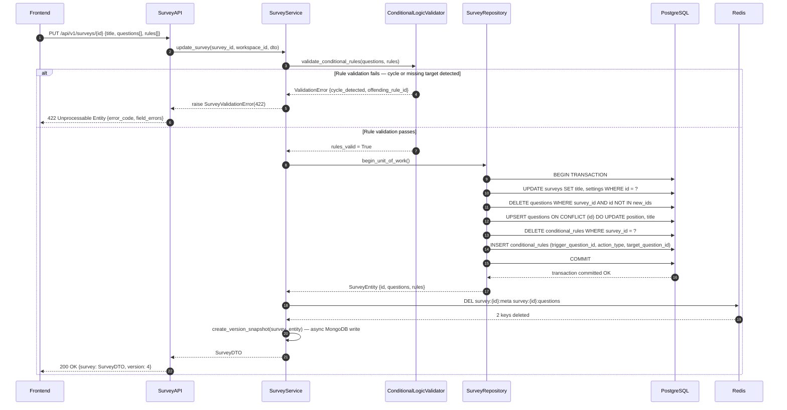
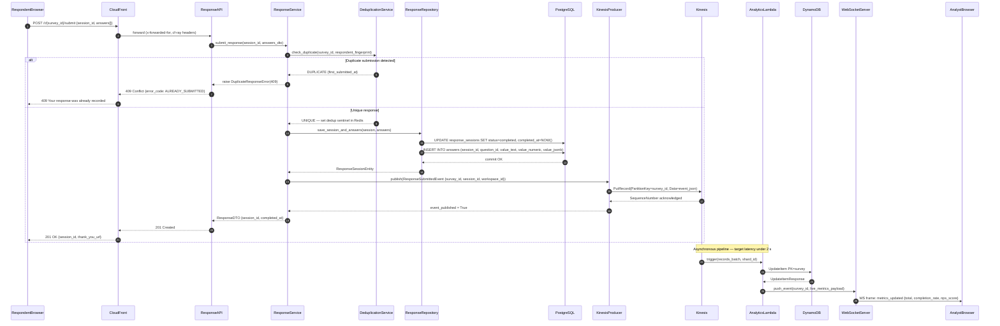
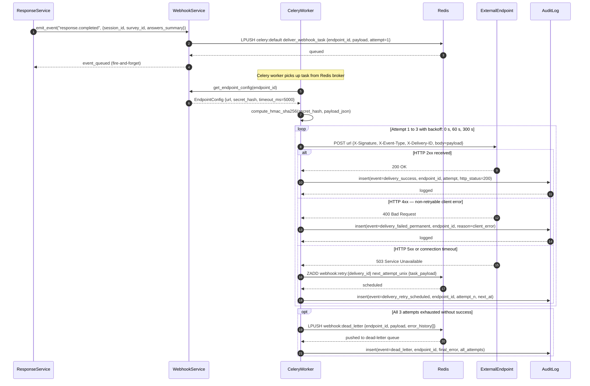
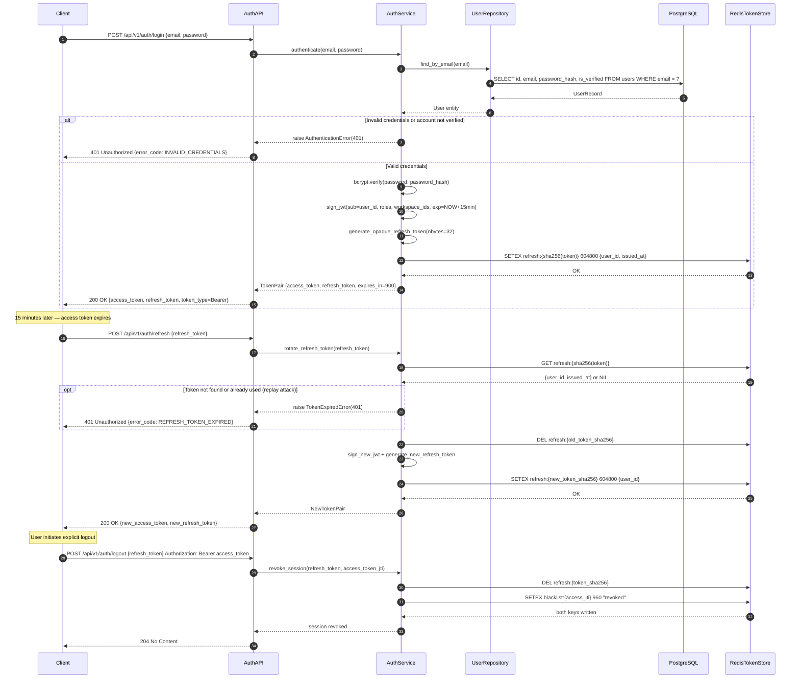
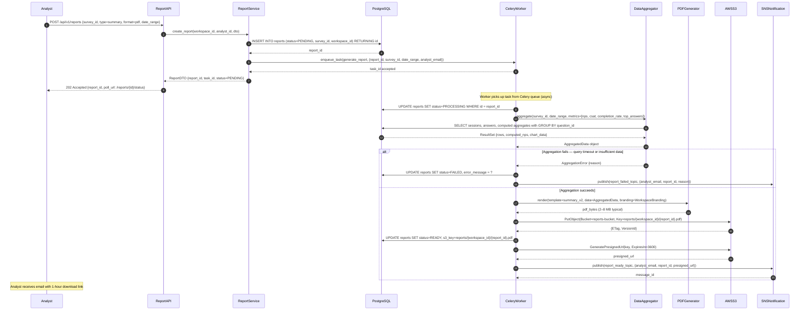

# Sequence Diagrams — Survey and Feedback Platform

## Overview

This document contains five sequence diagrams covering the most critical flows in the platform.

| ID      | Flow                                        | Primary Stakeholder   |
|---------|---------------------------------------------|-----------------------|
| SD-001  | Survey Builder — Save with Conditional Logic | Survey Editor         |
| SD-002  | Response Submission with Real-Time Analytics | Respondent + Analyst  |
| SD-003  | Webhook Delivery with Exponential Retry      | Platform + Integrator |
| SD-004  | JWT Auth and Refresh Token Rotation          | All Authenticated Users|
| SD-005  | Async Report Generation and Delivery         | Analyst               |

**Notation conventions:**

| Symbol     | Meaning                                    |
|------------|--------------------------------------------|
| `->>`      | Synchronous request (solid arrow)          |
| `-->>`     | Response or async return (dashed arrow)    |
| `alt/else` | Conditional branch                         |
| `loop`     | Repeated operation                         |
| `opt`      | Optional operation                         |
| `Note over`| Cross-participant annotation               |

All API endpoints are authenticated via JWT Bearer token unless otherwise stated.
Internal service-to-service calls are in-process function invocations unless annotated
with a queue or stream label.

---

## SD-001: Survey Builder — Save Survey with Conditional Logic

**Trigger:** An editor saves changes to a survey including question reordering and
conditional skip rules in the drag-and-drop builder.
**Pre-condition:** User holds `editor` or `admin` role in the workspace; survey exists
with `status = draft` or `status = paused`.
**Post-condition:** Survey is persisted, Redis cache is invalidated, and a version snapshot
is created in MongoDB.



---

## SD-002: Response Submission with Real-Time Analytics

**Trigger:** A respondent submits the final answer on the last page of the survey.
**Pre-condition:** A `response_session` row exists with `status = in_progress`.
**Post-condition:** Session is marked complete, answers persisted, event streamed to Kinesis,
and the analyst dashboard is updated via WebSocket within 2 seconds.



---

## SD-003: Webhook Delivery with Exponential Retry

**Trigger:** `ResponseService` emits a `response.completed` domain event after a session
is successfully persisted.
**Pre-condition:** At least one `webhook_endpoints` row with `is_active = true` subscribed
to the `response.completed` event type for the workspace.
**Post-condition:** HTTP delivery succeeds and is logged, or the event enters the dead-letter
queue after three failed attempts.



---

## SD-004: JWT Auth + Refresh Token Flow

**Trigger:** User submits login credentials; later the access token expires and the client
silently refreshes it; finally the user explicitly logs out.
**Pre-condition:** User account exists and `is_verified = true`.
**Post-condition:** On logout, both the refresh token and the access token JTI are revoked
in Redis so they cannot be reused even if intercepted.



---

## SD-005: Async Report Generation

**Trigger:** An analyst requests a PDF summary report for a survey with optional date-range
and metric filters.
**Pre-condition:** Survey has at least one completed response session.
**Post-condition:** PDF is stored in S3, the report row is updated to `status = READY`, and
the analyst receives an email containing a pre-signed S3 download URL valid for 1 hour.



---

## Error Handling Patterns

The following patterns apply consistently across all sequence flows described above.

### Idempotency Keys

All `POST` mutating endpoints accept an `Idempotency-Key` header. The first response is
cached in Redis at `idempotency:{key}` for 24 hours. Subsequent requests with the same key
return the cached response without re-executing the handler. This prevents duplicate
submissions on network retries.

### Circuit Breaker on External Calls

Calls to external webhook endpoints, email providers, and SMS gateways are wrapped in a
circuit breaker (Tenacity library, state stored in Redis at `circuit:{service_name}`).
Three consecutive failures open the circuit for 60 seconds. While open, the service returns
a synthetic `503` and logs a `CIRCUIT_OPEN` audit event rather than hammering the downstream.

### Structured Error Responses

All API errors follow the `ErrorResponse` schema:
```json
{
  "error_code": "SURVEY_NOT_FOUND",
  "message": "Survey abc123 does not exist or is not accessible in this workspace.",
  "details": [],
  "request_id": "req_01J4...",
  "doc_url": "https://docs.surveyplatform.io/errors/SURVEY_NOT_FOUND"
}
```
HTTP status codes map to error categories: `400` validation, `401` auth, `403` authorisation,
`404` not found, `409` conflict, `422` domain rule violation, `429` rate-limit, `5xx` platform.

### Distributed Tracing

Every inbound HTTP request generates a `trace_id` (UUID v7, monotonic) that propagates
via the `X-Trace-ID` header to all downstream services, Celery task metadata, Kinesis
event payloads, and CloudWatch log entries. This enables end-to-end correlation of a single
response submission from the CDN edge to DynamoDB analytics write.

---

## Operational Policy Addendum

### 1. SLA & Timeout Policy

| Operation                       | P50 Target | P99 Target | Hard Timeout |
|---------------------------------|-----------|-----------|--------------|
| Survey render (GET)             | 80 ms     | 300 ms    | 5 s          |
| Response submission (POST)      | 120 ms    | 500 ms    | 10 s         |
| Webhook delivery attempt        | —         | —         | 5 s          |
| Report generation (background)  | 30 s      | 5 min     | 15 min       |
| Auth login                      | 150 ms    | 600 ms    | 5 s          |
| Live analytics push             | 500 ms    | 2 s       | 5 s          |

All FastAPI endpoints declare explicit `timeout` middleware. Celery tasks have `soft_time_limit`
(triggers `SoftTimeLimitExceeded`) and `time_limit` (SIGKILL) configured per the table above.

### 2. Idempotency Requirements

- Response submission: idempotent on `session_id`; duplicate sessions return `409`.
- Campaign send: idempotent on `(campaign_id, recipient_email)`; re-sends are suppressed by
  the delivery-log deduplication check before SMTP/SMS dispatch.
- Webhook delivery: each delivery event has a `delivery_id` (UUID); the external endpoint
  receives `X-Delivery-ID` to allow client-side deduplication.
- Report generation: calling `POST /reports` twice with identical parameters within 5 minutes
  returns the existing `PENDING` or `PROCESSING` report rather than creating a duplicate.

### 3. Circuit Breaker Policy

Services protected by circuit breakers:

| Service          | Failure Threshold | Open Duration | Half-Open Probe |
|------------------|-------------------|---------------|-----------------|
| External webhooks | 3 consecutive 5xx | 60 s          | 1 request       |
| Email provider    | 5 within 2 min    | 120 s         | 1 request       |
| SMS gateway       | 5 within 2 min    | 120 s         | 1 request       |
| PDF renderer      | 2 consecutive err | 30 s          | 1 request       |

Circuit state is stored in Redis (`circuit:{service}:state`, TTL = open duration) so all
Celery workers share the same breaker state rather than each maintaining independent counters.

### 4. Observability Requirements

Every sequence flow emits the following telemetry:

- **Structured logs:** JSON to CloudWatch Logs; mandatory fields — `trace_id`, `span_id`,
  `service`, `level`, `message`, `duration_ms`, `http_status` (where applicable).
- **Metrics:** Custom CloudWatch metrics — `response_submission_count`, `webhook_delivery_latency_ms`,
  `report_generation_duration_ms`, `auth_failure_count` — with `workspace_id` and `survey_id`
  dimensions where the cardinality is bounded.
- **Distributed traces:** AWS X-Ray segments for all HTTP handlers and Celery tasks; sub-segments
  for every database query and external HTTP call.
- **Alerts:** PagerDuty alarm triggers when `webhook_dead_letter_queue_depth > 10` or
  `auth_failure_count > 50 per minute` or any `5xx` error rate exceeds 1 % over 5 minutes.
