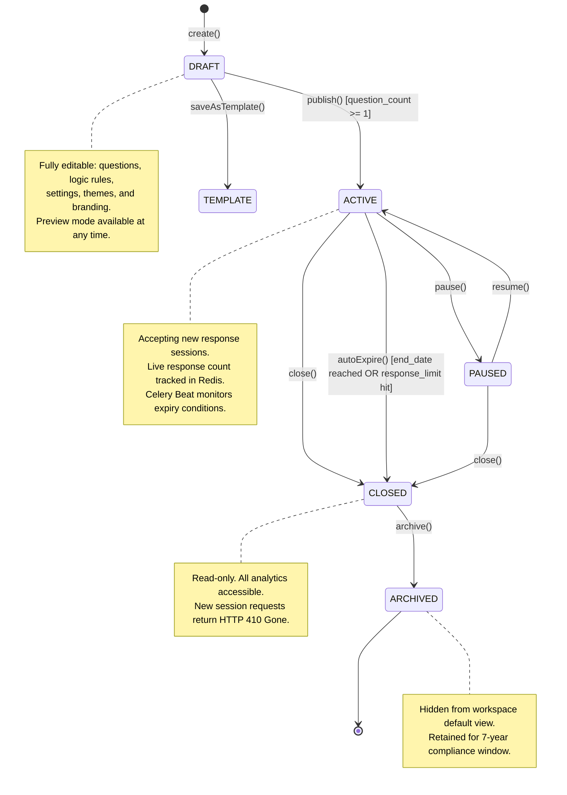
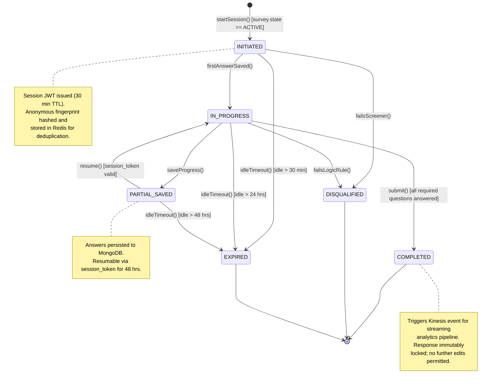
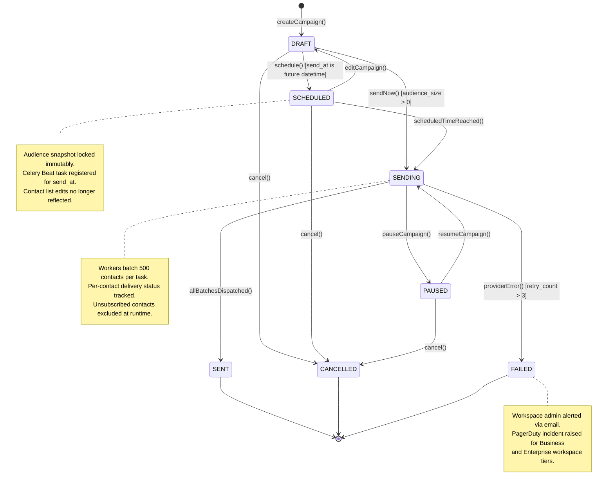
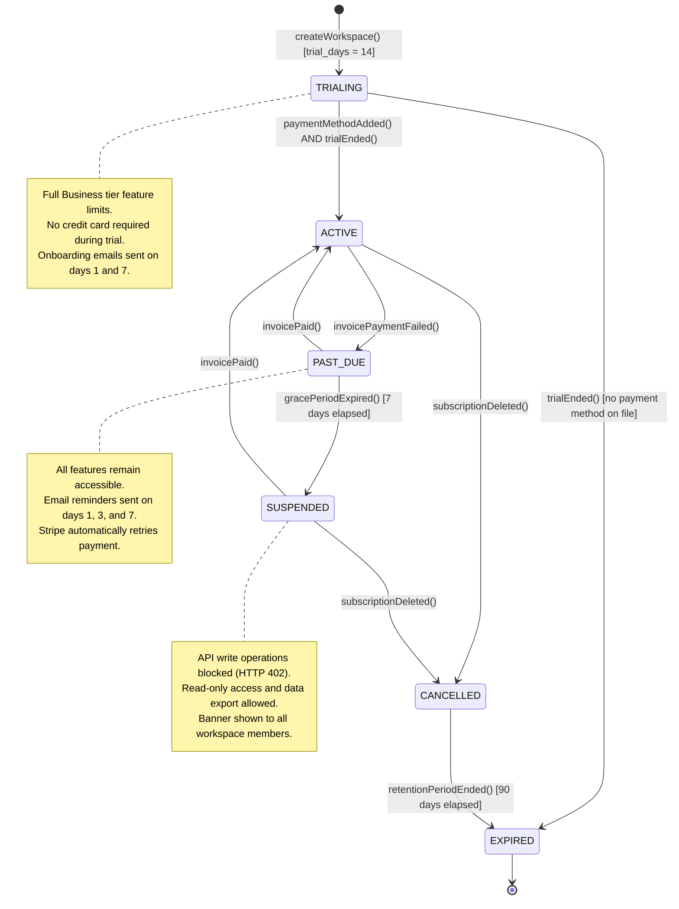
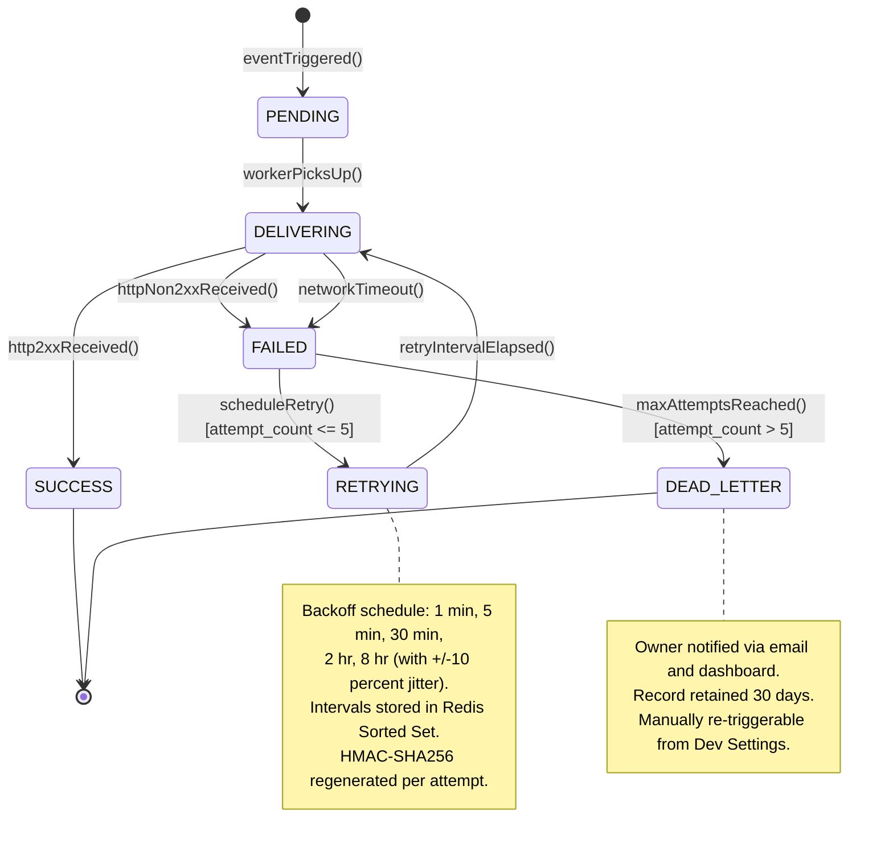

# State Machine Diagrams — Survey and Feedback Platform

## Overview

This document defines formal state machines for all stateful entities in the Survey and Feedback
Platform. Each specification includes: valid states, permitted transitions, guard conditions
(pre-conditions), side-effect actions, and prohibited operations per state. These definitions are
the authoritative contract enforced by the FastAPI backend service layer.

State transitions are implemented via Python service classes with async SQLAlchemy persistence
hooks. Every transition emits a domain event published to **Redis Streams**, consumed downstream
by the Analytics, Notification, and Billing services. All transitions are recorded in an
append-only `state_audit_log` table in PostgreSQL.

---

## 1. Survey Lifecycle State Machine

### Description

A Survey entity progresses from creation through publication, active data collection, closure,
and long-term archival. The state machine enforces workflow integrity and gates respondent access
based on the current state. Duplicate operations always create a new DRAFT survey regardless of
the source survey's state.

> **Duplicate:** Duplicating a survey from any state creates a new survey in `DRAFT` state.
> The source survey is unaffected; response data is never copied to the duplicate.

---

## 2. Response Session State Machine

### Description

A response session tracks a single respondent's journey through a survey — from page load to
completion, disqualification, or expiry. Sessions are identified by a signed JWT `session_token`
issued at start time.

---

## 3. Campaign (Distribution) State Machine

### Description

A Campaign orchestrates bulk delivery of survey invitations via email (SendGrid) or SMS (Twilio)
to a defined audience. Celery workers process deliveries in batches of 500 contacts.

---

## 4. Workspace Subscription State Machine

### Description

Workspace subscription states are driven exclusively by Stripe webhook events. The billing status
gates feature availability and write access across the entire workspace.

---

## 5. Webhook Delivery State Machine

### Description

Each outbound webhook invocation follows a structured delivery lifecycle with exponential-backoff
automatic retry and dead-lettering for persistent failures. HMAC-SHA256 signatures are computed
on every delivery attempt.

---

## State Transition Tables

### 1. Survey Lifecycle

| From State | Event | Guard Condition | Action | To State |
|---|---|---|---|---|
| `[initial]` | `create()` | — | Insert survey record; create audit entry | `DRAFT` |
| `DRAFT` | `publish()` | `question_count >= 1` | Set `published_at`; emit `survey.published` event | `ACTIVE` |
| `DRAFT` | `saveAsTemplate()` | — | Copy to `survey_templates`; set `is_template=true` | `TEMPLATE` |
| `ACTIVE` | `pause()` | — | Set `paused_at`; reject new session requests | `PAUSED` |
| `ACTIVE` | `close()` | — | Set `closed_at`; emit `survey.closed` event | `CLOSED` |
| `ACTIVE` | `autoExpire()` | end_date reached OR response_limit hit | Celery Beat triggers scheduled task | `CLOSED` |
| `PAUSED` | `resume()` | — | Clear `paused_at`; accept new sessions | `ACTIVE` |
| `PAUSED` | `close()` | — | Set `closed_at`; emit `survey.closed` event | `CLOSED` |
| `CLOSED` | `archive()` | — | Set `archived_at`; remove from active workspace lists | `ARCHIVED` |
| `ANY` | `duplicate()` | — | Create new survey in DRAFT; copy questions only | `DRAFT (new)` |

### 2. Response Session

| From State | Event | Guard Condition | Action | To State |
|---|---|---|---|---|
| `[initial]` | `startSession()` | `survey.state == ACTIVE` | Issue session JWT; hash fingerprint in Redis | `INITIATED` |
| `INITIATED` | `firstAnswerSaved()` | — | Set `started_at`; persist first answer | `IN_PROGRESS` |
| `INITIATED` | `failsScreener()` | Logic rule triggered on entry | Record disqualification reason | `DISQUALIFIED` |
| `INITIATED` | `idleTimeout()` | idle > 30 min | Remove session token from Redis | `EXPIRED` |
| `IN_PROGRESS` | `saveProgress()` | — | Upsert answers document in MongoDB | `PARTIAL_SAVED` |
| `IN_PROGRESS` | `submit()` | All required questions have answers | Finalize; emit `response.completed` to Kinesis | `COMPLETED` |
| `IN_PROGRESS` | `failsLogicRule()` | Disqualification branch rule matched | Record disqualification reason | `DISQUALIFIED` |
| `IN_PROGRESS` | `idleTimeout()` | idle > 24 hrs | Purge partial data from MongoDB | `EXPIRED` |
| `PARTIAL_SAVED` | `resume()` | Session token valid and not expired | Load saved answers from MongoDB | `IN_PROGRESS` |
| `PARTIAL_SAVED` | `idleTimeout()` | idle > 48 hrs | Purge session data from MongoDB | `EXPIRED` |

### 3. Campaign (Distribution)

| From State | Event | Guard Condition | Action | To State |
|---|---|---|---|---|
| `[initial]` | `createCampaign()` | — | Insert campaign record in PostgreSQL | `DRAFT` |
| `DRAFT` | `schedule()` | `send_at > now()` | Lock audience snapshot; register Celery Beat task | `SCHEDULED` |
| `DRAFT` | `sendNow()` | `audience_size > 0` | Enqueue Celery dispatch task immediately | `SENDING` |
| `DRAFT` | `cancel()` | — | Set `cancelled_at`; emit `campaign.cancelled` | `CANCELLED` |
| `SCHEDULED` | `scheduledTimeReached()` | — | Celery Beat triggers batch dispatch workers | `SENDING` |
| `SCHEDULED` | `cancel()` | — | Revoke Celery Beat task; set `cancelled_at` | `CANCELLED` |
| `SCHEDULED` | `editCampaign()` | — | Revoke scheduled task; unlock audience snapshot | `DRAFT` |
| `SENDING` | `allBatchesDispatched()` | — | Update delivery stats; emit `campaign.sent` | `SENT` |
| `SENDING` | `pauseCampaign()` | — | Suspend active workers after current batch | `PAUSED` |
| `SENDING` | `providerError()` | `retry_count > 3` | Alert admin; create incident record | `FAILED` |
| `PAUSED` | `resumeCampaign()` | — | Re-enqueue remaining audience batches | `SENDING` |

### 4. Workspace Subscription

| From State | Event | Guard Condition | Action | To State |
|---|---|---|---|---|
| `[initial]` | `createWorkspace()` | — | Start 14-day trial; apply Business tier limits | `TRIALING` |
| `TRIALING` | `paymentMethodAdded() + trialEnded()` | — | Activate paid subscription in Stripe | `ACTIVE` |
| `TRIALING` | `trialEnded()` | No payment method on file | Downgrade to Free tier limits | `EXPIRED` |
| `ACTIVE` | `invoicePaymentFailed()` | Stripe webhook received | Send day-1 reminder; start 7-day grace period | `PAST_DUE` |
| `ACTIVE` | `subscriptionDeleted()` | Stripe webhook received | Schedule 90-day retention countdown | `CANCELLED` |
| `PAST_DUE` | `invoicePaid()` | Stripe webhook received | Clear past_due flag; restore full access | `ACTIVE` |
| `PAST_DUE` | `gracePeriodExpired()` | 7 days elapsed since first failed payment | Block write operations (HTTP 402) | `SUSPENDED` |
| `SUSPENDED` | `invoicePaid()` | — | Restore full feature access immediately | `ACTIVE` |
| `CANCELLED` | `retentionPeriodEnded()` | 90 days elapsed post-cancellation | Queue irreversible data deletion job | `EXPIRED` |

### 5. Webhook Delivery

| From State | Event | Guard Condition | Action | To State |
|---|---|---|---|---|
| `[initial]` | `eventTriggered()` | — | Insert delivery record; enqueue Celery task | `PENDING` |
| `PENDING` | `workerPicksUp()` | — | Record `attempted_at`; sign payload with HMAC-SHA256 | `DELIVERING` |
| `DELIVERING` | `http2xxReceived()` | — | Record `delivered_at` and response body | `SUCCESS` |
| `DELIVERING` | `httpNon2xxReceived()` | — | Record failure; increment `attempt_count` | `FAILED` |
| `DELIVERING` | `networkTimeout()` | — | Record timeout; increment `attempt_count` | `FAILED` |
| `FAILED` | `scheduleRetry()` | `attempt_count <= 5` | Calculate backoff delay; add to Redis Sorted Set | `RETRYING` |
| `FAILED` | `maxAttemptsReached()` | `attempt_count > 5` | Move to dead letter; email alert to owner | `DEAD_LETTER` |
| `RETRYING` | `retryIntervalElapsed()` | — | Re-enter delivery cycle with fresh HMAC signature | `DELIVERING` |

---

## Business Rules per State

### Survey Business Rules

| State | Allowed Operations | Prohibited Operations |
|---|---|---|
| `DRAFT` | Edit questions, logic, settings, branding; preview; duplicate | Accept responses; view aggregate analytics |
| `TEMPLATE` | Instantiate as a new DRAFT survey; view template content | Publish directly; accept responses |
| `ACTIVE` | Accept responses; view live analytics; pause; close; duplicate | Edit questions or logic rules; delete questions |
| `PAUSED` | View analytics; resume; close; export current data | Accept new response sessions |
| `CLOSED` | View full analytics; export (CSV/XLSX/JSON); archive; duplicate | Accept responses; resume collection; edit content |
| `ARCHIVED` | View historical data; clone to new DRAFT survey | Publish; distribute; accept responses |

### Response Session Business Rules

- A respondent's IP + device fingerprint combination is limited to **1 completed session per
  survey** unless `allow_multiple_responses = true` on the survey configuration.
- `PARTIAL_SAVED` sessions are resumable for **48 hours** via the original `session_token` JWT.
- `DISQUALIFIED` sessions are excluded from public analytics counts but retained for quota
  management and audit purposes.
- `COMPLETED` sessions trigger a `response.completed` Kinesis event, initiating real-time
  metric recalculation in the Analytics pipeline.

### Campaign Business Rules

- Audience snapshot is **immutable** after transitioning to `SCHEDULED`. Contact list
  modifications do not affect campaigns already in the scheduling queue.
- `FAILED` campaigns generate a PagerDuty incident for **Business** and **Enterprise** workspace
  tiers only.
- Unsubscribed and hard-bounced contacts are **automatically excluded** at dispatch time
  regardless of audience list membership.

### Workspace Subscription Business Rules

- `SUSPENDED` workspaces retain full data in read-only mode; write operations return
  `HTTP 402 Payment Required` with response header `X-Subscription-Status: suspended`.
- Workspace owners receive email notifications at transitions to `PAST_DUE`, `SUSPENDED`,
  and `EXPIRED`.
- `EXPIRED` workspaces enter a final 30-day data deletion grace window before permanent removal.

### Webhook Delivery Business Rules

- Retry backoff schedule: **1 min → 5 min → 30 min → 2 hr → 8 hr** with ±10% random jitter
  applied to prevent thundering-herd scenarios.
- HMAC-SHA256 payload signatures are regenerated fresh on every retry using the endpoint's
  current secret value (rotations take effect immediately).
- `DEAD_LETTER` entries are retained for **30 days** and are manually re-triggerable from
  the Developer Settings dashboard.

---

## Operational Policy Addendum

### OPA-1: State Persistence and Audit Trail

Every state transition is recorded in the `state_audit_log` PostgreSQL table with: entity type,
entity UUID, prior state, new state, triggering event name, actor identity (user UUID or the
literal string `system`), UTC timestamp, and a JSONB metadata blob. This log is append-only,
exempt from GDPR erasure requests as a compliance record, and replicated nightly to S3 Glacier
for a minimum 7-year retention window.

### OPA-2: Concurrency and Optimistic Locking

All state-bearing entities include a `version` INTEGER column. Service layer updates use a
conditional `UPDATE ... WHERE version = :expected_version` pattern. If two concurrent requests
attempt to transition the same entity, the second writer receives `HTTP 409 Conflict`. Clients
must re-fetch the entity and retry the transition only if it remains valid from the refreshed
state.

### OPA-3: Event-Driven Side Effects

Domain events emitted on state transitions are consumed by: **Analytics Service** (metric
recalculation), **Notification Service** (email and in-app alerts to workspace owners), and
**Billing Service** (metered feature usage recording). All events carry a UUID `event_id`; each
consumer implements idempotent deduplication using a Redis SET with a 24-hour TTL window.

### OPA-4: Invalid Transition Handling

Attempts to invoke an event not permitted from the entity's current state return
`HTTP 422 Unprocessable Entity` with JSON body containing error code
`INVALID_STATE_TRANSITION`, the entity's current state, the attempted event, and the complete
list of valid events available from the current state — enabling client-side error recovery
and UI guard updates without additional round-trips.
