# Architecture Diagram — Survey and Feedback Platform

## Overview

The Survey and Feedback Platform is a multi-tenant SaaS application for creating, distributing, and analysing surveys and feedback forms at scale. Its architecture is organized into six logical tiers that cleanly separate user-facing delivery, edge security, application logic, asynchronous processing, data persistence, and external integrations.

**Client Tier** hosts four surface types: the primary React 18 SPA consumed by workspace members (survey creators, analysts, and administrators), a mobile-optimised Progressive Web App for respondents on handheld devices, an embeddable JavaScript snippet widget deployable on any third-party website or product, and a direct REST API surface consumed by partner systems and data pipelines.

**CDN Layer** uses AWS CloudFront as a global content delivery network. Static SPA assets (JS bundles, CSS, images) are cached at over 400 edge locations with automatic invalidation on each CI/CD deployment. Dynamic survey pages are served from the origin on first load and edge-cached per survey ID with a configurable TTL.

**Edge / Gateway Layer** combines AWS WAF for L7 filtering (OWASP Top-10 managed rule groups, IP-based and JWT-claim-based rate limiting, geo-blocking), Route 53 for health-check-aware latency-based DNS routing, and the AWS Application Load Balancer for HTTP/2 termination and path-based routing to ECS services.

**Application Layer** comprises eight domain-specific FastAPI microservices deployed as independent ECS Fargate task definitions. Each service owns its API surface, its data access patterns, and its independent auto-scaling policy. Services communicate synchronously for request/response operations and asynchronously through Celery tasks and Redis Pub/Sub for all side effects and background operations.

**Message Layer** contains three distinct mechanisms: Celery workers backed by Redis broker for durable task queuing (email dispatch, report generation, webhook delivery); Redis Pub/Sub for low-latency real-time event fan-out (live response counters, dashboard updates); and AWS Kinesis Data Streams for ordered, durable event streaming from the Response Service to the analytics Lambda consumer.

**Data Layer** adopts polyglot persistence: RDS PostgreSQL 15 as the primary relational store for all structured domain entities; MongoDB 7 for flexible response document storage with rich querying; ElastiCache Redis 7 for distributed caching, session management, and message brokering; and DynamoDB for pre-aggregated analytics metrics written by Lambda and queried in sub-50ms by the Analytics Service.

---

## Architecture Principles

1. **Cloud-Native First**: All workloads run on AWS managed services — ECS Fargate (no EC2 provisioning), RDS (automated patching and failover), ElastiCache (managed Redis cluster), Kinesis, and S3 — eliminating undifferentiated infrastructure management overhead.

2. **Domain-Oriented Decomposition**: Each microservice maps to a single bounded context defined by Domain-Driven Design principles, ensuring team autonomy, independent deployment cadences, and clear ownership boundaries.

3. **Stateless Services**: No application service stores request state in local memory. Sessions are held in Redis, domain data in PostgreSQL, and blobs in S3, so any running task replica can handle any inbound request without affinity constraints.

4. **Event-Driven Decoupling**: Side effects — email delivery, analytics aggregation, webhook dispatch — are decoupled from the primary request path via Celery tasks and Kinesis streams, improving p99 write-path latency and enabling independent scaling of processing capacity.

5. **Defense in Depth**: Security controls exist at every architectural layer: CloudFront signed URLs and geo-blocking, WAF OWASP rule groups, JWT verification at the API gateway, service-to-service IAM task roles, VPC security groups, and encrypted data at rest (AES-256) and in transit (TLS 1.3).

6. **Separation of Read and Write Paths**: High-volume read workloads (analytics dashboards, report downloads) are served from DynamoDB and S3 respectively, fully decoupled from the PostgreSQL transactional write path, preventing read amplification from degrading write throughput.

7. **Observability by Design**: Structured JSON logs (python-json-logger) ship to CloudWatch Logs with consistent correlation IDs. AWS X-Ray traces span every inbound request through all downstream calls. CloudWatch alarms notify PagerDuty for P1/P2 SLO breaches within 60 seconds.

8. **Polyglot Persistence**: Storage technology is chosen by workload characteristics — PostgreSQL for strong consistency and relational joins, MongoDB for schema-flexible document storage, Redis for ephemeral high-throughput operations, DynamoDB for horizontally scalable time-series aggregates.

9. **Graceful Degradation**: Circuit breakers implemented with `tenacity` ensure transient failures in external services (SendGrid, Stripe, Twilio, HubSpot) do not cascade to core survey creation and response submission flows. Feature flags (LaunchDarkly) allow real-time capability disablement.

10. **Infrastructure as Code**: All AWS resources are defined in Terraform modules versioned in Git. Deployments use GitHub Actions with AWS OIDC federation, eliminating long-lived IAM access keys from CI pipelines.

---

## Architecture Diagram

```mermaid
flowchart TD
    subgraph CLIENT["Client Layer"]
        SPA["React 18 SPA\nTypeScript + Zustand"]
        PWA["Mobile PWA\nReact 18 + Service Worker"]
        WIDGET["Embed Widget\nVanilla JS Snippet"]
        API_C["External API Consumers\nPartner Integrations"]
    end

    subgraph CDN_LAYER["CDN Layer"]
        CF["AWS CloudFront\nEdge Caching + Compression"]
    end

    subgraph EDGE["Edge / Gateway Layer"]
        WAF["AWS WAF\nOWASP Rules + Rate Limiting"]
        R53["Route 53\nLatency-Based DNS Routing"]
        ALB["AWS ALB\nHTTP/2 Termination + Path Routing"]
    end

    subgraph APP["Application Layer — ECS Fargate"]
        SURVEY["Survey Service\nFastAPI :8001"]
        RESPONSE["Response Service\nFastAPI :8002"]
        ANALYTICS["Analytics Service\nFastAPI :8003"]
        DIST["Distribution Service\nFastAPI :8004"]
        AUTH["Auth Service\nFastAPI :8005"]
        NOTIF["Notification Service\nFastAPI :8006"]
        REPORT["Report Service\nFastAPI :8007"]
        WEBHOOK["Webhook Service\nFastAPI :8008"]
    end

    subgraph MSG["Message Layer"]
        CELERY["Celery Workers\nRedis Broker + Result Backend"]
        REDIS_PS["Redis Pub/Sub\nReal-time Event Channels"]
        KINESIS["AWS Kinesis Data Streams\nResponse Event Stream"]
    end

    subgraph DATALAYER["Data Layer"]
        PG["RDS PostgreSQL 15\nMulti-AZ Primary"]
        REDIS_CACHE["ElastiCache Redis 7\nCluster Mode Enabled"]
        MONGO["MongoDB 7\nReplica Set 3-node"]
        DYNAMO["DynamoDB\nOn-Demand Capacity"]
    end

    subgraph STORE["Storage Layer"]
        S3["AWS S3\nVersioned + Lifecycle Policies"]
    end

    subgraph EXT["External Services"]
        SENDGRID["SendGrid\nTransactional + Bulk Email"]
        TWILIO["Twilio\nSMS + Voice"]
        STRIPE["Stripe\nSubscription Billing"]
        SLACK["Slack\nWebhook Notifications"]
        HUBSPOT["HubSpot\nCRM Integration"]
    end

    SPA -->|"HTTPS / HTTP2"| CF
    PWA -->|"HTTPS / HTTP2"| CF
    WIDGET -->|"HTTPS / CORS"| CF
    API_C -->|"REST + API Key"| R53

    CF -->|"Origin fetch on cache miss"| WAF
    WAF -->|"Filtered + inspected traffic"| R53
    R53 -->|"Latency-based A record"| ALB

    ALB -->|"path: /api/surveys"| SURVEY
    ALB -->|"path: /api/responses"| RESPONSE
    ALB -->|"path: /api/analytics"| ANALYTICS
    ALB -->|"path: /api/distribution"| DIST
    ALB -->|"path: /api/auth"| AUTH
    ALB -->|"path: /api/reports"| REPORT
    ALB -->|"path: /api/webhooks"| WEBHOOK

    SURVEY -->|"Publish survey events"| REDIS_PS
    RESPONSE -->|"PutRecord response events"| KINESIS
    DIST -->|"Enqueue send_campaign"| CELERY
    REPORT -->|"Enqueue generate_report"| CELERY
    WEBHOOK -->|"Enqueue deliver_webhook"| CELERY
    AUTH -->|"Publish token events"| REDIS_PS

    KINESIS -->|"Lambda Kinesis trigger"| DYNAMO
    CELERY -->|"Execute notification tasks"| NOTIF

    SURVEY -->|"asyncpg read/write"| PG
    RESPONSE -->|"asyncpg read/write"| PG
    RESPONSE -->|"motor insert answers"| MONGO
    AUTH -->|"asyncpg read/write"| PG
    AUTH -->|"aioredis session store"| REDIS_CACHE
    ANALYTICS -->|"boto3 query"| DYNAMO
    ANALYTICS -->|"aioredis get/set"| REDIS_CACHE
    REPORT -->|"asyncpg read"| PG
    REPORT -->|"motor aggregate"| MONGO
    DIST -->|"asyncpg read/write"| PG
    WEBHOOK -->|"asyncpg read/write"| PG

    REPORT -->|"boto3 put_object"| S3
    SURVEY -->|"presigned URL generation"| S3

    NOTIF -->|"SMTP relay / API"| SENDGRID
    NOTIF -->|"REST API"| TWILIO
    WEBHOOK -->|"HTTP POST event payload"| SLACK
    WEBHOOK -->|"HTTP POST event payload"| HUBSPOT
    DIST -->|"Subscription + Usage API"| STRIPE
```

---

## Service Descriptions

| Service | Responsibility | Tech Stack | Port | Scaling Strategy |
|---------|---------------|------------|------|-----------------|
| **Survey Service** | CRUD for surveys, questions, options, conditional logic rules, templates, versioning, and workspace settings | FastAPI, SQLAlchemy 2.x async, Pydantic v2, asyncpg | 8001 | CPU target 60%; 2–20 Fargate tasks |
| **Response Service** | Accept, validate, and persist survey responses; session management; idempotency via Redis token; quota enforcement | FastAPI, motor (async MongoDB), asyncpg | 8002 | RequestCountPerTarget; 4–40 tasks |
| **Analytics Service** | NPS, CSAT, CES aggregation; completion rates; per-question analytics; time-series trends; live SSE endpoint | FastAPI, boto3, pandas, aioredis | 8003 | CPU + latency composite; 2–16 tasks |
| **Distribution Service** | Campaign management; audience segmentation; contact list management; throttled multi-channel distribution scheduling | FastAPI, Celery, SQLAlchemy, asyncpg | 8004 | Celery queue depth; 2–12 tasks |
| **Auth Service** | JWT access/refresh tokens; OAuth 2.0 (Google, Microsoft); magic link; API key management; RBAC policy enforcement | FastAPI, PyJWT, authlib, asyncpg | 8005 | Stable 2–8 tasks; sessions in Redis |
| **Notification Service** | Internal Celery worker dispatching email, SMS, and in-app notifications; Jinja2 template rendering; unsubscribe tracking | FastAPI, Celery, Jinja2, httpx | 8006 | Worker concurrency 8–64 by queue depth |
| **Report Service** | Async PDF/Excel/CSV report generation; chart rendering; S3 upload; signed CloudFront download URL issuance | FastAPI, Celery, WeasyPrint, openpyxl, boto3 | 8007 | Queue depth; 2–10 memory-optimized tasks |
| **Webhook Service** | Webhook endpoint CRUD; event routing by type filter; retry with exponential backoff (max 5 attempts); delivery log | FastAPI, Celery, httpx, asyncpg | 8008 | Queue depth; 2–8 tasks |

---

## Communication Patterns

### Synchronous REST (Inbound Request Path)
User-initiated operations — survey CRUD, response submission, analytics queries — travel as HTTPS/JSON REST calls through CloudFront → WAF → ALB → target service. Pydantic v2 models validate all request bodies at the service boundary. Error responses conform to RFC 7807 Problem Details format (`application/problem+json`). Internal service-to-service calls use `httpx.AsyncClient` with connection pooling over the private ECS VPC network (e.g., `http://auth-service.internal:8005`).

### Asynchronous Task Queue (Celery + Redis)
Email campaign dispatch, report generation, and webhook delivery are submitted as Celery tasks to named Redis queues (`queue:campaigns`, `queue:reports`, `queue:webhooks`) by the originating FastAPI service. Celery workers deployed as separate ECS task definitions consume from these queues. Tasks serialize their payloads as JSON and acknowledge only after successful execution. Failed tasks follow an exponential backoff retry policy with delays of 10s, 30s, 90s, 270s, 810s before entry into a dead-letter sorted set for manual inspection.

### Event Streaming (AWS Kinesis)
Every accepted survey response published by the Response Service results in a structured record written to the `survey-responses` Kinesis Data Stream (partition key: `survey_id`). A Python Lambda function (`analytics-aggregator`) reads from stream shards in batches of up to 100 records, performs in-memory rolling aggregation (response count, completion rate, NPS delta), and performs conditional upserts into DynamoDB per-survey metric items. This decouples the analytics write path from response ingestion.

### Real-Time Pub/Sub (Redis + Server-Sent Events)
Survey lifecycle events (published, paused, closed), live response count increments, and NPS score deltas are published to Redis Pub/Sub channels keyed as `survey:{survey_id}:events`. The Analytics Service bridges these channels to browser clients through an SSE endpoint (`GET /api/analytics/live/{survey_id}`). The React SPA consumes SSE via the native `EventSource` API, enabling live dashboard updates without WebSocket infrastructure.

### Service Mesh (Internal mTLS)
All service-to-service HTTP traffic within the ECS cluster uses AWS App Mesh (Envoy sidecar) with mTLS enforced by ACM Private CA certificates. Traffic policies enforce circuit breaking (5xx error threshold: 50%), retry budgets (3 retries per request), and connection pool limits per service.

---

## Data Layer Architecture

| Store | Version | Primary Use Cases | Consistency Model | Backup / Recovery |
|-------|---------|------------------|-------------------|-------------------|
| **RDS PostgreSQL 15** | 15.x, Multi-AZ | Surveys, questions, users, workspaces, campaigns, audit logs | Strong ACID, serializable isolation | PITR 30 days; daily automated snapshots |
| **MongoDB 7** | 7.x, 3-node Replica Set | Survey response documents, raw answer payloads, media references | Eventual with primary-read default; failover < 10s | Continuous oplog shipping; daily snapshots |
| **ElastiCache Redis 7** | 7.x, Cluster Mode (6 shards) | Sessions, rate-limit counters, response cache, Celery broker, Pub/Sub | Eventual; AOF fsync every 1s | AOF persistence + RDB snapshots every 15 min |
| **DynamoDB** | Managed (on-demand) | Survey analytics aggregates, per-question distributions, NPS time-series | Eventual (strong read available at 2× RCU) | PITR enabled; 35-day retention |
| **AWS S3** | N/A (managed) | Generated reports (PDF/Excel), media uploads, raw export CSVs, widget bundles | Strong read-after-write | Cross-Region Replication to `us-west-2`; versioning enabled |

Data flows are unidirectional where possible to prevent circular dependencies. PostgreSQL is the system of record for all relational entities. MongoDB receives writes exclusively from the Response Service. DynamoDB receives writes exclusively from the Kinesis Lambda consumer. Redis is treated as a reconstructable cache — no business-critical data exists only in Redis.

---

## Network and Security Architecture

All ECS services run within a private VPC subnet. Only the ALB is internet-accessible (via Internet Gateway). ECS tasks have no public IP addresses and egress through a managed NAT Gateway. Security groups restrict intra-service traffic to specific ports and protocols. IAM task roles follow least-privilege — the Survey Service role grants `s3:PutObject` on the media bucket prefix only; it does not have `rds:*` (connection is via password from Secrets Manager).

| Control Point | Mechanism | Coverage |
|--------------|-----------|----------|
| Edge filtering | AWS WAF (OWASP + rate limit rules) | All inbound HTTP traffic |
| TLS termination | ACM certificate on ALB, TLS 1.3 | All client connections |
| Authentication | JWT (RS256) validated by Auth Service | All authenticated API routes |
| Authorisation | RBAC claims in JWT payload | Per-resource permission checks |
| Secrets management | AWS Secrets Manager (auto-rotation 90d) | DB passwords, API keys, OAuth secrets |
| Encryption at rest | AES-256 (RDS, S3, DynamoDB, EBS) | All persistent data stores |

---

## Operational Policy Addendum

### OPA-ARCH-001: Zero-Downtime Deployment
ECS rolling deployments maintain a minimum healthy task percentage of 100% and maximum of 200%. The Auth Service and any service executing PostgreSQL schema migrations uses AWS CodeDeploy blue/green deployments with an automated rollback trigger if HTTP 5xx error rate exceeds 1% within 5 minutes post-cutover. Database migrations are applied via a pre-deploy ECS task (`alembic upgrade head`) before the new service version is promoted, and every migration must be backward-compatible with the previous service version to support the overlap period.

### OPA-ARCH-002: Multi-Region Disaster Recovery
The primary region is `us-east-1`. RDS maintains a read replica in `us-west-2` that can be promoted to primary within 30 minutes (RTO target). S3 buckets use synchronous Cross-Region Replication to `us-west-2` (RPO = 0). Route 53 health checks monitor the `us-east-1` ALB at 10-second intervals; on sustained failure, DNS failover routes traffic to a warm standby ALB in `us-west-2` within 60 seconds. Recovery drill exercises are conducted quarterly with documented results.

### OPA-ARCH-003: Auto-Scaling and Capacity Management
ECS auto-scaling uses target tracking policies to maintain average CPU at 60% across all service replicas. The Response Service additionally tracks `ALBRequestCountPerTarget` with a target of 500 req/min per task. DynamoDB is provisioned in on-demand mode, with no capacity planning required. ElastiCache auto-scales read replicas when primary CPU exceeds 70% for 5 consecutive minutes. All scaling baselines are reviewed quarterly using 90th-percentile metrics from the trailing 30-day period.

### OPA-ARCH-004: Dependency and Vulnerability Management
Python base images (`python:3.11-slim-bookworm`) are rebuilt weekly via a scheduled GitHub Actions workflow to incorporate OS security patches. CVEs rated CVSS ≥ 7.0 in application dependencies (tracked by `pip-audit`) are remediated within 72 hours. PostgreSQL and Redis minor-version upgrades are applied within 14 days of availability through automated RDS/ElastiCache maintenance windows. AWS WAF managed rule groups are auto-updated by AWS on a rolling basis. All third-party OAuth client secrets and Stripe webhook secrets are rotated every 90 days via Secrets Manager rotation Lambdas.
