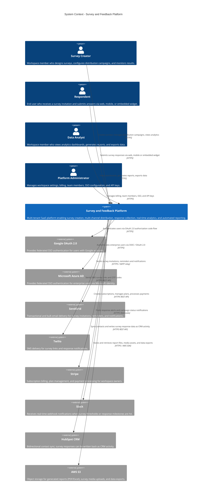

# C4 Context and Container Diagram — Survey and Feedback Platform

## Overview

This document describes the Survey and Feedback Platform architecture using the C4 model (Context, Container, Component, Code). The C4 model provides a hierarchical set of software architecture diagrams that progressively reveal detail at four levels of abstraction:

- **Level 1 — System Context**: Shows the platform as a single box in relation to external users and external systems. Answers the question: "What does this system do, and who uses it?"
- **Level 2 — Container**: Zooms inside the platform boundary to reveal the major deployable units (applications, services, databases, queues) and how they interact. Answers: "What are the high-level technology choices and how do they communicate?"
- **Level 3 — Component** *(covered in detailed-design documentation)*: Zooms inside individual containers to show internal components and their responsibilities.
- **Level 4 — Code** *(covered in detailed-design documentation)*: Shows class/module-level design for specific components.

This document covers Levels 1 and 2. The audience is architects, senior engineers, and product stakeholders who need to understand the overall platform structure without diving into implementation details.

---

## Level 1: System Context Diagram

The context diagram positions the Survey and Feedback Platform as a single system and shows all people and external software systems that interact with it. It is intentionally technology-agnostic and communicates the "big picture" to any stakeholder.

### Context Narrative

The platform serves four primary user personas interacting through different surfaces: workspace administrators configure the platform once; survey creators operate the platform daily through the SPA; respondents interact through the most lightweight interface available (SPA, PWA, or embedded widget); analysts consume data through dashboards and downloadable reports.

External system dependencies split cleanly into identity (Google, Microsoft), communication (SendGrid, Twilio), monetization (Stripe), collaboration (Slack), and CRM integration (HubSpot). The platform treats all external systems as outbound-only dependencies with circuit breakers — failure of any external system must not affect the core create/distribute/collect loop.

---

## Level 2: Container Diagram

The container diagram zooms inside the platform boundary to reveal the deployable units, their technology choices, and their inter-container communication patterns.

```mermaid
C4Container
  title Container Diagram - Survey and Feedback Platform

  Person(creator, "Survey Creator", "Creates surveys and views analytics")
  Person(respondent, "Respondent", "Submits survey responses")
  Person(analyst, "Data Analyst", "Views reports and dashboards")

  System_Boundary(sfp, "Survey and Feedback Platform") {
    Container(spa, "React SPA", "React 18, TypeScript, Zustand, react-hook-form, Recharts", "Browser-based single-page application for survey management, campaign setup, and analytics dashboards.")
    Container(widget, "Embed Widget", "Vanilla JS, PostMessage API", "Self-contained JavaScript snippet embeddable on any third-party website to collect in-context feedback.")
    Container(apigw, "API Gateway Service", "FastAPI, Python 3.11, Pydantic v2", "Single ingress point: validates JWT tokens, enforces rate limits, routes requests to downstream services.")
    Container(survey_svc, "Survey Service", "FastAPI, SQLAlchemy 2.x async, asyncpg", "Manages survey lifecycle — CRUD, question management, conditional logic, templates, versioning, and workspace settings.")
    Container(response_svc, "Response Service", "FastAPI, motor (async MongoDB), asyncpg", "Accepts and validates survey responses, enforces submission quotas, manages anonymous and identified sessions.")
    Container(analytics_svc, "Analytics Service", "FastAPI, boto3, pandas, aioredis", "Serves real-time and historical analytics: NPS, CSAT, completion rates, per-question distributions, and SSE live stream.")
    Container(dist_svc, "Distribution Service", "FastAPI, Celery, SQLAlchemy, asyncpg", "Manages distribution campaigns, contact audience segmentation, throttled multi-channel message scheduling.")
    Container(auth_svc, "Auth Service", "FastAPI, PyJWT, authlib, asyncpg", "Issues and validates JWT access/refresh tokens, handles OAuth 2.0 flows, magic link authentication, and API key management.")
    Container(report_svc, "Report Service", "FastAPI, Celery, WeasyPrint, openpyxl, boto3", "Generates PDF, Excel, and CSV reports asynchronously; uploads to S3; issues signed CloudFront download URLs.")
    Container(webhook_svc, "Webhook Service", "FastAPI, Celery, httpx, asyncpg", "Manages webhook endpoint registration and delivers event payloads to subscriber URLs with retry logic.")
    Container(notif_svc, "Notification Service", "Celery worker, Jinja2, httpx", "Internal worker consuming Celery tasks to dispatch email (SendGrid), SMS (Twilio), and in-app notifications.")
    Container(celery_broker, "Celery / Redis Broker", "Redis 7, Celery 5.x", "Redis lists act as Celery task queues for campaigns, reports, webhooks, and notifications.")
    Container(kinesis, "Kinesis + Lambda Consumer", "AWS Kinesis Data Streams, Python Lambda", "Response event stream; Lambda aggregates records in real time and writes metrics to DynamoDB.")

    ContainerDb(postgres, "PostgreSQL 15", "RDS PostgreSQL 15, Multi-AZ", "Primary relational store: surveys, questions, users, workspaces, campaigns, contacts, audit logs, billing records.")
    ContainerDb(mongo, "MongoDB 7", "MongoDB 7 Atlas, Replica Set", "Document store for survey response sessions and individual answer payloads with flexible schema per question type.")
    ContainerDb(redis, "Redis 7", "ElastiCache Redis 7, Cluster Mode", "Distributed cache, session token store, rate-limit counters, Celery broker, and Pub/Sub event bus.")
    ContainerDb(dynamo, "DynamoDB", "AWS DynamoDB, on-demand", "Analytics aggregate store: per-survey metrics, per-question distributions, NPS time-series updated by Lambda consumer.")
    ContainerDb(s3, "AWS S3", "S3, versioned + lifecycle", "Object store for generated reports, media uploads, CSV exports, and static widget bundles.")
  }

  System_Ext(sendgrid, "SendGrid", "Email delivery")
  System_Ext(twilio, "Twilio", "SMS delivery")
  System_Ext(stripe, "Stripe", "Billing")
  System_Ext(google_oauth, "Google OAuth", "SSO")
  System_Ext(ms_sso, "Microsoft SSO", "SSO")
  System_Ext(hubspot, "HubSpot", "CRM")
  System_Ext(slack_ext, "Slack", "Notifications")

  Rel(creator, spa, "Uses survey builder, campaign management, and analytics dashboard", "HTTPS")
  Rel(analyst, spa, "Views reports and analytics dashboards", "HTTPS")
  Rel(respondent, widget, "Submits embedded survey response", "HTTPS")
  Rel(respondent, spa, "Submits survey via public survey link", "HTTPS")

  Rel(spa, apigw, "All API calls", "HTTPS / REST / JSON")
  Rel(widget, apigw, "Submit response, load survey definition", "HTTPS / REST / JSON")

  Rel(apigw, survey_svc, "Routes /api/surveys/* requests", "HTTP internal")
  Rel(apigw, response_svc, "Routes /api/responses/* requests", "HTTP internal")
  Rel(apigw, analytics_svc, "Routes /api/analytics/* requests", "HTTP internal")
  Rel(apigw, dist_svc, "Routes /api/distribution/* requests", "HTTP internal")
  Rel(apigw, auth_svc, "Routes /api/auth/* + token validation", "HTTP internal")
  Rel(apigw, report_svc, "Routes /api/reports/* requests", "HTTP internal")
  Rel(apigw, webhook_svc, "Routes /api/webhooks/* requests", "HTTP internal")

  Rel(survey_svc, postgres, "Read/write surveys, questions, logic rules", "asyncpg / SQL")
  Rel(survey_svc, s3, "Generate presigned upload URLs for media", "AWS SDK / HTTPS")
  Rel(response_svc, postgres, "Read/write response sessions, quotas", "asyncpg / SQL")
  Rel(response_svc, mongo, "Insert answer documents per session", "motor / MongoDB Wire")
  Rel(response_svc, kinesis, "Publish response event record", "boto3 / HTTPS")
  Rel(response_svc, redis, "Idempotency token check + session cache", "aioredis")
  Rel(analytics_svc, dynamo, "Query pre-aggregated metrics", "boto3 / HTTPS")
  Rel(analytics_svc, redis, "Cache analytics results; subscribe to live events", "aioredis / Pub/Sub")
  Rel(auth_svc, postgres, "Read/write users, tokens, API keys", "asyncpg / SQL")
  Rel(auth_svc, redis, "Store/invalidate session tokens", "aioredis")
  Rel(auth_svc, google_oauth, "OAuth 2.0 authorization code exchange", "HTTPS")
  Rel(auth_svc, ms_sso, "OIDC authorization code exchange", "HTTPS")
  Rel(dist_svc, postgres, "Read/write campaigns, contacts, lists", "asyncpg / SQL")
  Rel(dist_svc, celery_broker, "Enqueue send_campaign tasks", "Celery / Redis")
  Rel(dist_svc, stripe, "Create/manage workspace subscriptions", "HTTPS REST")
  Rel(report_svc, postgres, "Read survey and response metadata", "asyncpg / SQL")
  Rel(report_svc, mongo, "Aggregate answer documents for report", "motor / MongoDB Wire")
  Rel(report_svc, celery_broker, "Enqueue generate_report tasks", "Celery / Redis")
  Rel(report_svc, s3, "Upload generated report files", "boto3 / HTTPS")
  Rel(webhook_svc, postgres, "Read/write webhook endpoints + delivery logs", "asyncpg / SQL")
  Rel(webhook_svc, celery_broker, "Enqueue deliver_webhook tasks", "Celery / Redis")
  Rel(webhook_svc, slack_ext, "POST event payload to Slack webhook URL", "HTTPS")
  Rel(webhook_svc, hubspot, "POST event payload to HubSpot webhook", "HTTPS")
  Rel(notif_svc, sendgrid, "Send transactional and bulk email", "HTTPS / SMTP")
  Rel(notif_svc, twilio, "Send SMS notifications", "HTTPS REST")
  Rel(kinesis, dynamo, "Write aggregated response metrics", "boto3 / HTTPS")

  UpdateLayoutConfig($c4ShapeInRow="4", $c4BoundaryInRow="1")
```

---

## Container Descriptions

| Container | Type | Technology | Primary Responsibilities |
|-----------|------|------------|------------------------|
| React SPA | Single-Page App | React 18, TypeScript, Zustand | Survey builder UI, campaign management, analytics dashboards, report downloads, workspace settings |
| Embed Widget | Client-Side App | Vanilla JS, PostMessage | Inline survey rendering on third-party sites; posts answers to API Gateway |
| API Gateway Service | Backend Service | FastAPI, Pydantic v2 | JWT validation, rate limiting, request routing, correlation-ID injection |
| Survey Service | Backend Service | FastAPI, SQLAlchemy, asyncpg | Survey/question CRUD, conditional logic evaluation, template management |
| Response Service | Backend Service | FastAPI, motor, asyncpg | Response acceptance, deduplication, quota enforcement, Kinesis publication |
| Analytics Service | Backend Service | FastAPI, boto3, pandas | Metrics aggregation queries, DynamoDB reads, SSE live stream, Redis caching |
| Distribution Service | Backend Service | FastAPI, Celery, SQLAlchemy | Campaign lifecycle, audience management, send scheduling, Stripe billing |
| Auth Service | Backend Service | FastAPI, PyJWT, authlib | Token issuance/validation, OAuth flows, magic link, API key hashing |
| Report Service | Backend Service | FastAPI, Celery, WeasyPrint | Async report generation, S3 upload, signed URL creation |
| Webhook Service | Backend Service | FastAPI, Celery, httpx | Endpoint registration, event delivery, retry tracking, delivery logs |
| Notification Service | Celery Worker | Celery, Jinja2, httpx | Email/SMS dispatch, template rendering, unsubscribe enforcement |
| PostgreSQL 15 | Relational DB | RDS PostgreSQL 15, Multi-AZ | Authoritative store for all structured domain entities |
| MongoDB 7 | Document DB | MongoDB 7, Replica Set | Flexible schema store for survey responses and answer payloads |
| Redis 7 | In-Memory Store | ElastiCache Redis 7, Cluster | Cache, sessions, Celery broker, rate limits, Pub/Sub bus |
| DynamoDB | Managed NoSQL | AWS DynamoDB, on-demand | Pre-aggregated analytics metrics and time-series data |
| AWS S3 | Object Storage | S3, versioned | Reports, media, exports, static assets |

---

## Technology Decisions

### ADR-001: FastAPI over Django REST Framework
**Decision**: Use FastAPI (with async SQLAlchemy and motor) for all backend services.
**Rationale**: FastAPI's native `async/await` support is essential for the Response Service which must handle high concurrent submission bursts without blocking threads. The automatic OpenAPI schema generation reduces API documentation overhead. Pydantic v2 models provide compile-time-like validation. DRF is synchronous by default and requires ASGI adapters to achieve equivalent async performance.
**Alternatives Considered**: Django REST Framework (rejected: synchronous default, heavier ORM), Flask/Quart (rejected: no automatic schema generation, smaller ecosystem), Go + Gin (rejected: team Python expertise, shared Pydantic models across services).

### ADR-002: PostgreSQL + MongoDB Polyglot Persistence
**Decision**: Use PostgreSQL as the primary relational store and MongoDB for survey response documents.
**Rationale**: Survey response payloads are heterogeneous — a text question produces a string value, a matrix produces a nested object, a file upload produces a reference array. Forcing this into a PostgreSQL JSONB column works but loses document-level indexing flexibility. MongoDB's flexible schema allows each answer to be stored as a typed document matching its question type. PostgreSQL retains strong ACID guarantees for all relational entities (users, surveys, campaigns, billing).
**Alternatives Considered**: Pure PostgreSQL with JSONB (rejected: complex aggregation queries for analytics), Pure MongoDB (rejected: no ACID transactions for multi-step operations like survey publication), Amazon Aurora Serverless (rejected: cold-start latency, unpredictable cost at scale).

### ADR-003: Celery + Redis over AWS SQS + Lambda
**Decision**: Use Celery with Redis broker for internal task queuing rather than SQS-triggered Lambda.
**Rationale**: Celery provides synchronous task result tracking, task chaining (report generation → S3 upload → URL generation is a Celery chain), and worker-level concurrency control. Redis is already present in the stack as a session/cache store, eliminating an additional managed service. Celery workers run as ECS tasks co-located with services, reducing cold-start latency versus Lambda for long-running tasks such as PDF report generation.
**Alternatives Considered**: AWS SQS + Lambda (rejected: Lambda 15-minute timeout limits for large PDF generation, cold-start latency, harder task chaining), AWS Step Functions (rejected: over-engineered for simple sequential tasks, higher cost), RQ (rejected: smaller ecosystem, less monitoring tooling).

### ADR-004: AWS Kinesis over Kafka
**Decision**: Use AWS Kinesis Data Streams for the response event stream feeding analytics.
**Rationale**: Kinesis is a fully managed service with zero operational overhead — no cluster provisioning, broker upgrades, or partition management. The response event volume (estimated peak 5,000 events/min) fits well within a 10-shard Kinesis stream without custom consumer logic. Kinesis integrates natively with Lambda as an event source mapping, eliminating the need for a Kafka consumer application.
**Alternatives Considered**: Apache Kafka on MSK (rejected: operational complexity, over-specified for current volume), AWS SQS FIFO (rejected: no replay capability, no ordering within partitions by survey_id), EventBridge (rejected: limited throughput, no stream-level consumer batching).

### ADR-005: Zustand over Redux Toolkit
**Decision**: Use Zustand for client-side state management in the React SPA.
**Rationale**: The SPA state model is relatively shallow — active survey, workspace settings, current user, and UI toggle states. Zustand provides a minimal boilerplate API with excellent TypeScript inference. Redux Toolkit adds 30+ KB of bundle weight and requires substantial boilerplate for simple store slices. Zustand's selector-based subscriptions minimize unnecessary re-renders in the analytics dashboard with live SSE updates.
**Alternatives Considered**: Redux Toolkit (rejected: excessive boilerplate, heavier bundle), React Query / TanStack Query (complementary; used for server state/cache, Zustand manages UI state), Jotai (rejected: atom model is more complex for team onboarding).

---

## Deployment Topology

All containers are deployed to AWS in the `us-east-1` region as the primary operational region, with disaster recovery infrastructure in `us-west-2`.

**Compute**: All FastAPI services run as ECS Fargate task definitions within a private VPC subnet. Each service is an independent ECS Service with its own task definition, auto-scaling policy, and CloudWatch alarms. Services are registered with the ALB as target groups and receive traffic through path-based routing rules.

**Networking**: The VPC has three tiers — public subnets (ALB only), private application subnets (ECS tasks, ElastiCache), and isolated database subnets (RDS, no internet egress). NAT Gateways in each AZ provide outbound internet access for ECS tasks calling external APIs.

**DNS**: Route 53 hosts the `surveys.example.com` hosted zone. The primary ALB is reached via an alias A record. CloudFront distributions are fronted by `cdn.surveys.example.com` and `app.surveys.example.com` with ACM certificates.

**Container Registry**: Docker images are stored in AWS ECR. Each service has its own ECR repository with image scanning enabled. Lifecycle policies retain the last 20 tagged images; untagged images are purged after 7 days.

---

## Operational Policy Addendum

### OPA-C4-001: Container Ownership and On-Call Responsibility
Each container is owned by a named engineering team with a designated on-call rotation. The owning team is responsible for SLO compliance, dependency upgrades, and incident response. Ownership is documented in the service's `CODEOWNERS` file. Cross-container API contracts (request/response schemas) are versioned and changes require a backward-compatibility review in the platform architecture review board.

### OPA-C4-002: Container Health and Readiness
Every FastAPI service exposes a `/health/live` endpoint (returns HTTP 200 if process is healthy) and a `/health/ready` endpoint (returns HTTP 200 only if all downstream dependencies — database connections, Redis connectivity — are available). ECS health checks use `/health/live`. ALB target group health checks use `/health/ready` to prevent traffic routing to a service with broken database connections.

### OPA-C4-003: Data Access Boundary Enforcement
No container may directly access another container's primary data store. Cross-context data access must occur through the owning service's API. For example, the Distribution Service must not issue direct SQL queries against the Response Service's MongoDB collection; it must call the Response Service's REST API. This boundary is enforced by VPC security group rules (each database security group allows inbound connections only from its owning service's security group).

### OPA-C4-004: Container Resource Limits
All ECS task definitions specify explicit CPU and memory reservations and limits. Minimum allocations are 0.5 vCPU / 512 MB for lightweight services (Webhook, Auth) and 1 vCPU / 2 GB for compute-intensive services (Report Service during PDF generation, Analytics Service). Services exceeding memory limits are terminated by ECS and replaced automatically. OOM events trigger CloudWatch alarms that notify the on-call engineer within 2 minutes.
