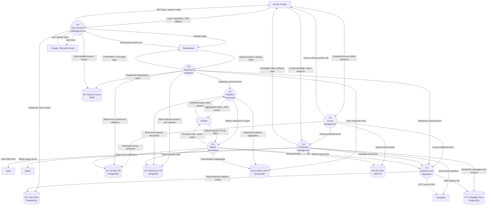
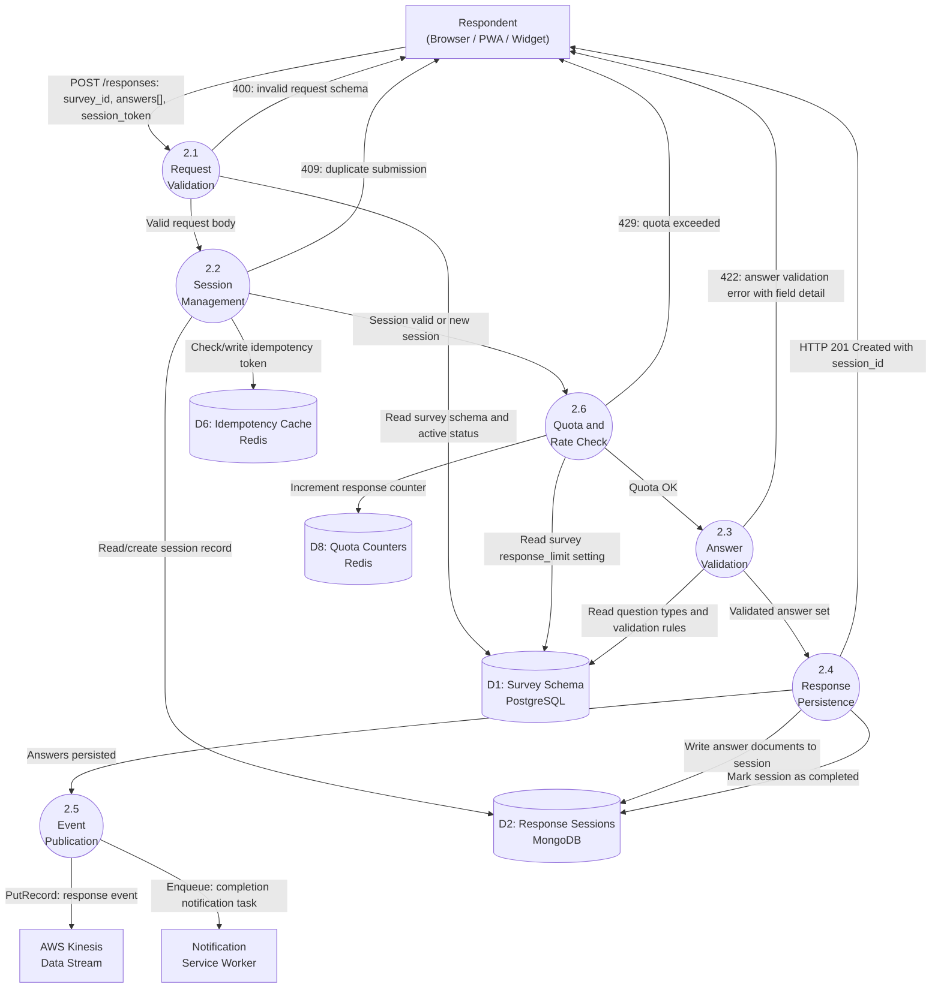

# Data Flow Diagram — Survey and Feedback Platform

## Overview

This document presents the data flow architecture of the Survey and Feedback Platform using structured Data Flow Diagrams (DFDs) at three levels of abstraction. DFDs model a system as a set of processes, data flows, data stores, and external entities without prescribing implementation technology, making them suitable for communicating data movement to both technical and non-technical stakeholders.

**DFD Notation used in this document (implemented with Mermaid flowchart):**
- **External Entities** (rectangles `[]`): Actors or systems outside the platform boundary that originate or consume data.
- **Processes** (rounded rectangles `(())`): Transformations applied to data as it moves through the system.
- **Data Stores** (cylinders `[()]`): Persistent repositories where data is stored for later retrieval.
- **Data Flows** (labeled arrows `-->`): The movement of data between entities, processes, and stores.

**Levels covered:**
- **Level 0 (Context DFD)**: The entire platform as a single process. Shows all external entities and the data crossing the system boundary.
- **Level 1 DFD**: Explodes the single process into seven major functional processes and their interactions with data stores.
- **Level 2 DFD for Process 2.0 (Response Collection)**: Detailed breakdown of the most data-intensive process in the platform.

---

## Level 0 DFD — System Context

The Level 0 diagram treats the platform as a single black-box transformation and maps all external data flows crossing the system boundary.

```mermaid
flowchart TD
    CREATOR["Survey Creator"]
    RESPONDENT["Respondent"]
    ANALYST["Analyst / Admin"]
    SENDGRID["SendGrid\n(Email Provider)"]
    TWILIO["Twilio\n(SMS Provider)"]
    STRIPE["Stripe\n(Billing)"]
    GOOGLE["Google / Microsoft OAuth"]
    HUBSPOT["HubSpot CRM"]
    SLACK["Slack"]
    S3_EXT["AWS S3\n(Object Storage)"]

    PLATFORM(("Survey and\nFeedback Platform"))

    CREATOR -->|"Survey definitions, campaign config, workspace settings"| PLATFORM
    PLATFORM -->|"Survey URLs, analytics dashboards, report downloads"| CREATOR

    RESPONDENT -->|"Survey responses, file uploads"| PLATFORM
    PLATFORM -->|"Survey pages, confirmation messages"| RESPONDENT

    ANALYST -->|"Report requests, dashboard queries, export requests"| PLATFORM
    PLATFORM -->|"Analytics data, generated reports, data exports"| ANALYST

    PLATFORM -->|"Email invitations, reminders, notifications"| SENDGRID
    SENDGRID -->|"Delivery status, bounce events, unsubscribe events"| PLATFORM

    PLATFORM -->|"SMS survey links, OTP codes"| TWILIO
    TWILIO -->|"Delivery receipts"| PLATFORM

    PLATFORM -->|"Subscription create/update/cancel, usage records"| STRIPE
    STRIPE -->|"Payment confirmation, subscription status, invoices"| PLATFORM

    PLATFORM -->|"OAuth authorization request"| GOOGLE
    GOOGLE -->|"Authorization code, user profile, ID token"| PLATFORM

    PLATFORM -->|"Contact upserts, survey response activity"| HUBSPOT
    HUBSPOT -->|"Contact records, sync acknowledgement"| PLATFORM

    PLATFORM -->|"Response alerts, campaign status events"| SLACK

    PLATFORM -->|"Report files, media assets, export CSVs"| S3_EXT
    S3_EXT -->|"Stored object metadata, presigned download URLs"| PLATFORM
```

---

## Level 1 DFD — Main Processes

The Level 1 diagram decomposes the platform into its seven major functional processes, showing how data flows between them through shared and private data stores.

---

## Level 2 DFD — Process 2.0: Response Collection

Response Collection is the highest-throughput and most latency-sensitive process. This Level 2 breakdown reveals its internal sub-processes and the data flows between them.

---

## Data Flow Inventory

The following table catalogues all significant data flows identified across the three DFD levels.

| Flow ID | From | To | Data Description | Format | Est. Volume |
|---------|------|----|-----------------|--------|-------------|
| DF-001 | Survey Creator | Survey Service | Survey definition: title, questions, options, logic rules | JSON / REST | 50–500 req/day |
| DF-002 | Survey Service | PostgreSQL (D1) | Survey and question records on create/update | SQL INSERT/UPDATE | ~500 writes/day |
| DF-003 | Survey Creator | Distribution Service | Campaign config: audience, channel, schedule, template | JSON / REST | 10–100 req/day |
| DF-004 | Distribution Service | SendGrid | Bulk email batch: recipients, survey URL, variables | JSON / HTTPS | 100K–1M emails/day |
| DF-005 | Distribution Service | Twilio | SMS batch: phone numbers, survey short URL | JSON / HTTPS | 1K–50K SMS/day |
| DF-006 | Respondent | Response Service | Response payload: survey_id, session_token, answers[] | JSON / REST | 500–50K req/hr (peak) |
| DF-007 | Response Service | MongoDB (D2) | Answer documents keyed by session_id | BSON documents | 500–50K writes/hr |
| DF-008 | Response Service | Kinesis | Response event: survey_id, session_id, timestamp, type | JSON / KPL | 500–50K records/hr |
| DF-009 | Kinesis Lambda | DynamoDB (D3) | Aggregated metrics: response_count, completion_rate, nps | JSON / SDK | 100–5K upserts/hr |
| DF-010 | Analytics Service | DynamoDB (D3) | Metrics query per survey_id with optional time range | SDK Query | 1K–20K reads/hr |
| DF-011 | Analytics Service | Redis (D6) | Cached analytics result keyed by survey + filter hash | Redis SET w/ TTL | 5K–50K ops/hr |
| DF-012 | Auth Service | Google / Microsoft | OAuth authorization code exchange | JSON / HTTPS | 100–500 req/hr |
| DF-013 | Google / Microsoft | Auth Service | ID token, access token, user profile payload | JSON / HTTPS | 100–500 resp/hr |
| DF-014 | Auth Service | PostgreSQL (D4) | User upsert on first SSO login; refresh token record | SQL INSERT/UPDATE | 100–500/hr |
| DF-015 | Auth Service | Redis (D6) | JWT session token (key: user_id, TTL: 7 days) | Redis SET | 100–500 writes/hr |
| DF-016 | Report Service | PostgreSQL (D1) | Survey schema, campaign metadata, response stats | SQL SELECT | 10–100 reads/day |
| DF-017 | Report Service | MongoDB (D2) | Aggregation pipeline over answer documents | MongoDB aggregate | 10–100 queries/day |
| DF-018 | Report Service | S3 (D5) | Generated PDF/Excel/CSV report file upload | Multipart PUT | 10–100 uploads/day |
| DF-019 | Webhook Service | External endpoints | HTTP POST: event_type, payload, HMAC-SHA256 signature | JSON / HTTPS | 1K–100K events/day |
| DF-020 | Distribution Service | Stripe | Create subscription, report metered usage, fetch invoice | JSON / REST | 10–1K req/day |
| DF-021 | Stripe | Distribution Service | Webhook: customer.subscription.updated, invoice.paid | JSON / HTTPS | 10–100 events/day |
| DF-022 | Webhook Service | HubSpot | Contact activity: survey completion with response summary | JSON / HTTPS | 100–10K events/day |
| DF-023 | Survey Service | S3 (D5) | Presigned PUT URL for media; file stored direct by client | Presigned URL | 10–500/day |
| DF-024 | Report Service | CloudFront | Signed download URL for report file (5-min TTL) | CF signed URL | 10–100/day |

---

## Data Classification

All data flowing through the platform is classified into one of four sensitivity tiers. Classification governs encryption requirements, access control policies, retention periods, and logging rules.

### Public Data
Data shareable without restriction. Includes: survey titles and questions for published surveys, aggregate NPS and completion rates on public-facing dashboards, embed widget JavaScript bundles, and public survey landing pages.
- **Encryption in transit**: TLS required
- **Encryption at rest**: Applied by default (AES-256)
- **Access control**: No authentication required for read
- **Retention**: Minimum 30 days; governed by workspace settings

### Internal Data
Data visible only to authenticated workspace members. Includes: survey draft definitions, campaign configurations, distribution lists, individual response summaries without PII, workspace analytics, and generated report files.
- **Encryption in transit**: TLS 1.3 mandatory
- **Encryption at rest**: AES-256 with shared KMS key
- **Access control**: Valid JWT with workspace membership claim required
- **Retention**: Minimum 12 months; configurable to 7 years per workspace plan

### Confidential Data
Sensitive business data requiring role-based access controls and audit logging. Includes: respondent email addresses and phone numbers, identified response records, HubSpot CRM payloads, Stripe customer and payment data, and contact import files.
- **Encryption in transit**: TLS 1.3 mandatory
- **Encryption at rest**: AES-256 with per-workspace KMS key; MongoDB CSFLE for PII fields
- **Access control**: JWT with explicit role claim (owner, admin, analyst); every access audit logged
- **Retention**: GDPR/CCPA compliant deletion within 30 days of erasure request

### Restricted Data
Credentials, secrets, and cryptographic material. Includes: JWT signing keys, OAuth client secrets, database passwords, API keys, Stripe webhook secrets, and HMAC signing keys.
- **Storage**: AWS Secrets Manager exclusively — never in source code, environment variables, or logs
- **Access control**: IAM role-based with MFA required for human access
- **Rotation**: Automated rotation every 90 days via Secrets Manager Lambda rotator
- **Audit**: Every access attempt logged to AWS CloudTrail; alerts on anomalous access patterns

---

## Operational Policy Addendum

### OPA-DFD-001: Data Lineage and Audit Logging
Every data write that modifies a survey definition, user record, campaign, or billing subscription generates an immutable audit log entry in the `audit_log` PostgreSQL table. Audit records contain: ISO 8601 event timestamp, actor identity (user_id or service name), action verb (create/update/delete/publish/archive), resource type, resource ID, SHA-256 hash of before-state, and SHA-256 hash of after-state. Audit log rows are INSERT-only and protected by a trigger that rejects UPDATE and DELETE operations. Logs are retained for a minimum of 7 years and are explicitly excluded from data erasure workflows.

### OPA-DFD-002: PII Handling and Data Minimisation
Personally Identifiable Information (respondent email, name, phone, IP address, user-agent) is collected only when the survey creator explicitly enables identified responses. Anonymous surveys store only a pseudonymous UUID session identifier. PII fields in MongoDB response documents are encrypted at field level using MongoDB Client-Side Field Level Encryption with workspace-scoped AWS KMS data keys. PII is never included in application log output; a Pydantic serialisation hook strips email patterns, phone numbers, and IP addresses from all log records before CloudWatch Logs ingestion. The schema for DF-007 enforces this by omitting PII fields from the raw answer document structure.

### OPA-DFD-003: Cross-Border Data Transfer Controls
By default, all data is stored and processed in AWS `us-east-1`. Workspaces requiring EU data residency (GDPR Article 46) are provisioned in `eu-west-1` with cross-region replication explicitly disabled at the S3 bucket, RDS, and ElastiCache level. Data transferred to external services (SendGrid, Twilio, HubSpot) is governed by signed Data Processing Agreements with each vendor. For EU-residency workspaces, outbound data flows DF-004, DF-005, and DF-022 are routed through EU-region endpoints of those services. Transfer outside the contracted region requires explicit workspace owner consent and is blocked at the application layer by a region-enforcement middleware check on the workspace's `data_region` attribute.

### OPA-DFD-004: Data Retention and Deletion Workflow
Survey response data is retained for the period specified in the workspace subscription plan: Starter (12 months), Professional (36 months), Enterprise (configurable, up to 7 years). Upon plan expiry or workspace deletion request, a Celery scheduled task initiates a phased deletion sequence: Phase 1 — mark all workspace records as `pending_deletion` (visible in admin console only); Phase 2 — export a final archive JSON bundle to S3 Glacier for 90-day cold storage and issue a download link to the workspace owner; Phase 3 — permanently delete MongoDB response documents, DynamoDB metric items, and PostgreSQL rows in reverse dependency order (answers → sessions → campaigns → surveys → workspace); Phase 4 — S3 objects are removed via lifecycle expiration rule triggered by an `x-amz-meta-deletion-scheduled` object tag. The entire workflow completes within 30 days of the deletion trigger, satisfying GDPR Article 17 right to erasure obligations.
