# Domain Model — Survey and Feedback Platform

## Overview

The Survey and Feedback Platform domain model is designed using Domain-Driven Design (DDD) principles. The domain is partitioned into seven distinct bounded contexts, each representing a cohesive area of business capability with its own ubiquitous language, data model, and team ownership. Bounded contexts communicate with each other through well-defined integration events and anti-corruption layers, preventing domain concepts from bleeding across context boundaries.

**Strategic Design Summary:**
- **Survey Context**: Core domain. Owns the lifecycle of surveys, questions, branching logic, and templates.
- **Response Context**: Core domain. Owns the collection and storage of respondent answers and session data.
- **Distribution Context**: Supporting domain. Manages how surveys reach respondents through campaigns and channels.
- **Analytics Context**: Supporting domain. Derives insight from raw response data through aggregation and reporting.
- **Identity Context**: Generic subdomain. Handles workspace membership, user authentication, and authorisation.
- **Billing Context**: Generic subdomain. Manages subscription plans, usage metering, and invoice generation.
- **Integration Context**: Supporting domain. Exposes the platform's events and data to external systems via webhooks and API keys.

---

## Bounded Contexts

```mermaid
flowchart LR
    subgraph SURVEY_CTX["Survey Context"]
        Srv["Survey"]
        Qstn["Question"]
        QOpt["QuestionOption"]
        Tmpl["Template"]
        CRule["ConditionalRule"]
    end

    subgraph RESPONSE_CTX["Response Context"]
        RSess["ResponseSession"]
        Ans["Answer"]
        Resp["Respondent"]
    end

    subgraph DIST_CTX["Distribution Context"]
        Camp["Campaign"]
        AudList["AudienceList"]
        Cont["Contact"]
        Chan["Channel"]
    end

    subgraph ANALYTICS_CTX["Analytics Context"]
        Metric["Metric"]
        Rpt["Report"]
        Dash["Dashboard"]
    end

    subgraph IDENTITY_CTX["Identity Context"]
        Usr["User"]
        Wksp["Workspace"]
        Tm["Team"]
        Rl["Role"]
    end

    subgraph BILLING_CTX["Billing Context"]
        Sub["Subscription"]
        Pln["Plan"]
        Inv["Invoice"]
        Usg["UsageRecord"]
    end

    subgraph INTEGRATION_CTX["Integration Context"]
        Wh["WebhookEndpoint"]
        AKey["APIKey"]
        Intg["ThirdPartyIntegration"]
    end

    SURVEY_CTX -->|"SurveyPublished event\nsurvey_id, workspace_id"| DIST_CTX
    SURVEY_CTX -->|"Survey schema ref\nsurvey_id"| RESPONSE_CTX
    RESPONSE_CTX -->|"ResponseReceived event\nsurvey_id, session_id"| ANALYTICS_CTX
    DIST_CTX -->|"CampaignDelivered event\ncampaign_id, recipient_count"| ANALYTICS_CTX
    IDENTITY_CTX -->|"Workspace + User context\nworkspace_id, user_id, role"| SURVEY_CTX
    IDENTITY_CTX -->|"Auth context\nrespondent_token, is_anonymous"| RESPONSE_CTX
    ANALYTICS_CTX -->|"UsageMetrics event\nworkspace_id, response_count"| BILLING_CTX
    INTEGRATION_CTX -->|"EventDelivery\nevent_type, payload"| SURVEY_CTX
    INTEGRATION_CTX -->|"EventDelivery\nevent_type, payload"| RESPONSE_CTX
    BILLING_CTX -->|"PlanEntitlements\nmax_surveys, max_responses"| SURVEY_CTX
    BILLING_CTX -->|"PlanEntitlements\nmax_responses_month"| RESPONSE_CTX
```

---

## Domain Model Class Diagram

```mermaid
classDiagram
    class Workspace {
        +UUID id
        +String name
        +String slug
        +String plan_id
        +String data_region
        +Boolean is_active
        +DateTime created_at
        +DateTime updated_at
        +invite_member(email str, role str) None
        +update_plan(plan_id str) None
        +get_usage_stats() UsageStats
        +is_within_survey_limit() bool
    }

    class User {
        +UUID id
        +UUID workspace_id
        +String email
        +String full_name
        +String role
        +String auth_provider
        +String auth_provider_id
        +Boolean is_active
        +DateTime last_login_at
        +DateTime created_at
        +generate_access_token() str
        +revoke_all_tokens() None
        +has_permission(permission str) bool
    }

    class Survey {
        +UUID id
        +UUID workspace_id
        +UUID created_by
        +String title
        +String description
        +String status
        +Boolean is_anonymous
        +Boolean collect_email
        +int response_limit
        +Dict settings
        +String welcome_message
        +String thank_you_message
        +DateTime starts_at
        +DateTime ends_at
        +DateTime created_at
        +publish() None
        +archive() None
        +duplicate() Survey
        +get_response_count() int
        +is_accepting_responses() bool
    }

    class Question {
        +UUID id
        +UUID survey_id
        +String type
        +String text
        +String description
        +Boolean is_required
        +int order_index
        +Dict validation_rules
        +String placeholder_text
        +DateTime created_at
        +validate_answer(value Any) bool
        +get_options() List~QuestionOption~
    }

    class QuestionOption {
        +UUID id
        +UUID question_id
        +String label
        +String value
        +int order_index
        +String image_url
        +Boolean is_other
    }

    class ConditionalRule {
        +UUID id
        +UUID survey_id
        +UUID source_question_id
        +String operator
        +Any condition_value
        +String action
        +UUID target_question_id
        +UUID target_page_id
        +evaluate(answer Any) bool
        +get_action_description() str
    }

    class Campaign {
        +UUID id
        +UUID survey_id
        +UUID workspace_id
        +UUID created_by
        +String name
        +String channel
        +String status
        +UUID audience_list_id
        +String email_subject
        +String email_template_id
        +int throttle_per_hour
        +DateTime scheduled_at
        +DateTime launched_at
        +DateTime completed_at
        +launch() None
        +pause() None
        +cancel() None
        +get_delivery_stats() DeliveryStats
    }

    class AudienceList {
        +UUID id
        +UUID workspace_id
        +String name
        +String description
        +int contact_count
        +DateTime updated_at
        +add_contact(contact Contact) None
        +remove_contact(contact_id UUID) None
        +import_csv(file_path str) int
        +export_csv() str
    }

    class Contact {
        +UUID id
        +UUID workspace_id
        +String email
        +String first_name
        +String last_name
        +String phone
        +Dict custom_fields
        +Boolean is_unsubscribed
        +String unsubscribe_reason
        +DateTime unsubscribed_at
        +DateTime created_at
        +unsubscribe(reason str) None
        +resubscribe() None
    }

    class ResponseSession {
        +UUID id
        +UUID survey_id
        +String respondent_identifier
        +String ip_address
        +String user_agent
        +String referrer
        +String status
        +Boolean is_preview
        +DateTime started_at
        +DateTime completed_at
        +int time_spent_seconds
        +complete() None
        +disqualify(reason str) None
        +get_completion_rate() float
    }

    class Answer {
        +UUID id
        +UUID session_id
        +UUID question_id
        +Any value
        +String raw_value
        +int time_spent_seconds
        +DateTime answered_at
        +validate() bool
        +get_normalized_value() Any
    }

    class Report {
        +UUID id
        +UUID survey_id
        +UUID workspace_id
        +UUID requested_by
        +String title
        +String format
        +String status
        +Dict filters
        +String s3_key
        +String download_url
        +DateTime expires_at
        +DateTime requested_at
        +DateTime completed_at
        +generate() None
        +get_signed_download_url(ttl int) str
        +is_expired() bool
    }

    class Subscription {
        +UUID id
        +UUID workspace_id
        +UUID plan_id
        +String stripe_subscription_id
        +String stripe_customer_id
        +String status
        +DateTime current_period_start
        +DateTime current_period_end
        +Boolean cancel_at_period_end
        +cancel(reason str) None
        +upgrade(plan_id str) None
        +is_active() bool
        +days_until_renewal() int
    }

    class Plan {
        +UUID id
        +String name
        +String code
        +Decimal monthly_price_usd
        +Decimal annual_price_usd
        +int max_surveys
        +int max_responses_per_month
        +int max_team_members
        +int max_audience_contacts
        +Dict features
        +Boolean is_active
        +is_feature_enabled(feature str) bool
        +get_price(billing_interval str) Decimal
    }

    class WebhookEndpoint {
        +UUID id
        +UUID workspace_id
        +String url
        +List~str~ event_types
        +String secret_key
        +Boolean is_active
        +int failure_count
        +DateTime last_triggered_at
        +DateTime created_at
        +sign_payload(payload dict) str
        +deliver(event dict) DeliveryResult
        +disable_on_repeated_failure() None
    }

    Workspace "1" --o "0..*" User : has members
    Workspace "1" --* "0..*" Survey : owns
    Workspace "1" --* "0..*" Campaign : manages
    Workspace "1" --* "0..*" AudienceList : maintains
    Workspace "1" --> "1" Subscription : has active
    Workspace "1" --* "0..*" WebhookEndpoint : configures
    User "0..*" --> "1" Workspace : belongs to
    Survey "1" --* "2..*" Question : contains
    Survey "1" --> "0..*" Campaign : distributed via
    Survey "1" --> "0..*" ConditionalRule : governs logic
    Survey "1" --> "0..*" ResponseSession : receives
    Survey "1" --> "0..*" Report : generates
    Question "1" --* "0..*" QuestionOption : has options
    Question "1" --> "0..*" ConditionalRule : sources
    Campaign "1" --> "0..*" AudienceList : targets
    AudienceList "1" --o "0..*" Contact : contains
    ResponseSession "1" --* "1..*" Answer : contains
    Answer "0..*" --> "1" Question : answers
    Subscription "0..*" --> "1" Plan : governed by
```

---

## Aggregate Roots

Aggregates define transactional boundaries. All state changes to entities within an aggregate must pass through the aggregate root, which enforces all business invariants before any state is persisted.

| Aggregate | Root | Contained Entities | Invariants Enforced |
|-----------|------|--------------------|--------------------|
| **Survey Aggregate** | `Survey` | `Question`, `QuestionOption`, `ConditionalRule` | Minimum 1 question required to publish; conditional rules may only reference questions within the same survey; `response_limit` must be positive if set |
| **ResponseSession Aggregate** | `ResponseSession` | `Answer` | One answer per question per session; survey must be in `published` status; response_limit not exceeded at commit |
| **Campaign Aggregate** | `Campaign` | `CampaignRecipient`, `DeliveryLog` | Campaign can only launch against a published survey; throttle rate must not exceed workspace plan channel limit |
| **Workspace Aggregate** | `Workspace` | `WorkspaceSettings`, `UsageCounter` | Total live surveys within plan limit; team member count within plan limit; deletion cascades to all owned resources |
| **Subscription Aggregate** | `Subscription` | `Invoice`, `UsageRecord` | Only one active subscription per workspace; plan downgrade effective only at period end; usage counters reset on period renewal |
| **AudienceList Aggregate** | `AudienceList` | `Contact` | Contact email must be unique within workspace; unsubscribed contacts excluded from all campaign sends automatically |
| **WebhookEndpoint Aggregate** | `WebhookEndpoint` | `DeliveryAttempt` | Endpoint auto-disabled after 5 consecutive failure deliveries; `event_types` must be a non-empty subset of the platform event catalogue |

---

## Domain Services

Domain services encapsulate business logic that does not naturally belong to a single entity or aggregate root. They are stateless and operate on domain objects.

| Service | Responsibility | Consumes | Produces |
|---------|---------------|----------|----------|
| `SurveyPublicationService` | Validates all pre-publication requirements (min questions, no orphaned rules, active workspace subscription) before transitioning status to `published` | `Survey`, `Workspace`, `Plan` | `SurveyPublishedEvent` |
| `ResponseQuotaService` | Atomically checks and increments the response counter in Redis against workspace monthly limit and survey `response_limit` | `ResponseSession`, `Subscription`, `Plan` | Quota approved or `QuotaExceededError` |
| `ConditionalLogicEvaluator` | Evaluates a set of conditional rules against a submitted answer to determine which questions or pages to show, hide, or skip | `ConditionalRule`, `Answer` | Next question/page instruction set |
| `CampaignDispatchService` | Segments audience contacts, applies throttle rate, generates personalised survey URLs with tracking tokens, enqueues Celery send tasks | `Campaign`, `AudienceList`, `Contact` | `CampaignSendTask` records |
| `NpsCalculationService` | Computes Net Promoter Score from NPS question answers: (promoters% − detractors%) × 100 | Set of `Answer` for NPS questions | `NpsScore` value object |
| `ReportAssemblyService` | Orchestrates data retrieval from PostgreSQL and MongoDB, applies requested filters, builds the report data model for the rendering engine | `Survey`, `ResponseSession`, `Answer` | `ReportDataModel` |
| `WebhookDeliveryService` | Signs event payload with HMAC-SHA256, dispatches HTTP POST with configurable timeout, records attempt, schedules retry on failure | `WebhookEndpoint`, domain event | `DeliveryAttempt` record |

---

## Domain Events

Domain events are immutable records of facts that have occurred. They are the primary integration mechanism between bounded contexts and the source of the audit trail.

| Event | Source Aggregate | Key Payload Fields | Subscribing Contexts |
|-------|-----------------|-------------------|---------------------|
| `SurveyPublished` | Survey | survey_id, workspace_id, question_count, published_at | Distribution, Integration |
| `SurveyArchived` | Survey | survey_id, workspace_id, archived_by, archived_at | Distribution, Analytics, Integration |
| `ResponseCompleted` | ResponseSession | survey_id, session_id, respondent_type, completed_at, time_spent_seconds | Analytics, Integration, Billing |
| `CampaignLaunched` | Campaign | campaign_id, survey_id, recipient_count, channel, launched_at | Integration |
| `CampaignCompleted` | Campaign | campaign_id, delivered_count, bounced_count, open_count, click_count | Analytics, Integration |
| `WorkspaceMemberInvited` | Workspace | workspace_id, invitee_email, role, invited_by | Identity (notification dispatch) |
| `SubscriptionUpgraded` | Subscription | workspace_id, old_plan_code, new_plan_code, effective_at | Survey, Response (quota reset) |
| `SubscriptionCancelled` | Subscription | workspace_id, cancellation_reason, effective_at | Survey, Distribution |
| `WebhookDeliveryFailed` | WebhookEndpoint | endpoint_id, attempt_count, last_http_status, next_retry_at | Integration (retry scheduler) |
| `ReportReady` | Report | report_id, survey_id, requested_by, download_url, expires_at | Integration, Notification |

---

## Value Objects

Value objects are immutable domain concepts defined entirely by their attribute values. They have no identity and are compared by value equality.

| Value Object | Attributes | Validation Rules |
|-------------|------------|-----------------|
| `EmailAddress` | `address: str` | RFC 5321 format; max 254 chars; local part max 64 chars |
| `SurveyUrl` | `base_url: str`, `survey_id: UUID`, `token: Optional[str]` | HTTPS scheme required; survey_id must be valid UUID4; token URL-safe base64 |
| `NpsScore` | `score: int`, `promoters_pct: float`, `passives_pct: float`, `detractors_pct: float` | score ∈ [-100, 100]; three percentages sum to 100.0 |
| `DateRange` | `start: datetime`, `end: datetime` | end must be after start; both must be timezone-aware (UTC) |
| `ThrottleRate` | `messages_per_hour: int` | Range [1, 10000]; must not exceed workspace plan's channel rate limit |
| `HmacSignature` | `algorithm: str`, `signature: str`, `timestamp: int` | algorithm must be `sha256`; timestamp within 5-minute clock skew window |
| `MoneyAmount` | `amount: Decimal`, `currency: str` | amount ≥ 0.00; currency is ISO 4217 three-letter code |
| `UsageStats` | `survey_count: int`, `response_count: int`, `period_start: datetime` | All counts ≥ 0; period_start timezone-aware UTC |

---

## Ubiquitous Language Glossary

The following terms form the shared language used by domain experts and engineers across all contexts. Code, API field names, documentation, and verbal communication must use these terms consistently without deviation or synonym substitution.

| Term | Definition |
|------|------------|
| **Workspace** | The top-level multi-tenant container for all platform resources. Corresponds to an organisation or team. Has exactly one active Subscription at any time. |
| **Survey** | A structured data collection instrument consisting of one or more Questions, optionally governed by conditional logic, and distributed to Respondents via Campaigns or direct links. |
| **Question** | A single prompt within a Survey to which Respondents provide an Answer. Has a type: `single_choice`, `multi_choice`, `text`, `long_text`, `rating`, `nps`, `matrix`, `file_upload`, `date`, `ranking`. |
| **Question Option** | A discrete selectable value for a choice-type Question, presented to Respondents as a radio button, checkbox, or dropdown item. |
| **Conditional Rule** | A branching instruction that shows, hides, skips, or redirects to a Question or Page based on a Respondent's previous Answer. Informally called "skip logic" or "branching logic". |
| **Template** | A reusable, pre-built Survey structure that Survey Creators can clone as a starting point. Templates cannot be published directly; they must be copied into a new Survey first. |
| **Response Session** | A single Respondent's complete interaction with a Survey from initial page load to final submission. Contains one Answer per answered Question. |
| **Answer** | The value provided by a Respondent for a specific Question within a Response Session. Its structure varies by Question type (string, integer, array, object). |
| **Respondent** | A person who completes a Survey. May be identified (email known) or anonymous (only a pseudonymous UUID is stored). |
| **Campaign** | A managed distribution event that delivers a Survey to an Audience List via a specified Channel on a schedule with configurable throttling. |
| **Audience List** | A curated list of Contacts used as the target population for one or more Campaigns. |
| **Contact** | A person in the workspace's address book, identified uniquely by email address within the workspace. May be unsubscribed from future campaigns. |
| **Channel** | The delivery mechanism for a Campaign: `email`, `sms`, `in_app`, or `link`. |
| **Completion Rate** | The percentage of Response Sessions that reached the final submission step out of all Sessions that were started for a given Survey. |
| **NPS (Net Promoter Score)** | A loyalty metric derived from a 0–10 rating question. Scores 0–6 = Detractors, 7–8 = Passives, 9–10 = Promoters. Formula: (Promoters% − Detractors%) × 100. Range: -100 to +100. |
| **CSAT (Customer Satisfaction Score)** | Average satisfaction rating from a 1–5 scale question, expressed as (sum of ratings / max possible score) × 100%. |
| **CES (Customer Effort Score)** | A measure of respondent effort on a 1–7 scale, averaged across all respondents. Lower is better. |
| **Survey Status** | Lifecycle state of a Survey: `draft` → `published` → `paused` / `archived`. Only `published` surveys accept Responses. |
| **Session Status** | Lifecycle state of a Response Session: `in_progress`, `completed`, `disqualified`, `partial`. |
| **Campaign Status** | Lifecycle state of a Campaign: `draft`, `scheduled`, `sending`, `paused`, `completed`, `cancelled`. |
| **Embed Widget** | A JavaScript snippet provided to Survey Creators for embedding a Survey directly in a third-party website without redirecting the Respondent. |
| **Magic Link** | A time-limited, single-use authentication URL sent to a user's email address as a passwordless login mechanism. Expires after 15 minutes. |
| **Report** | An asynchronously generated document (PDF, Excel, or CSV) summarising Survey results, filtered by date range, respondent attributes, or question responses. |
| **Dashboard** | A real-time view of Survey analytics: response count, completion rate, NPS trend, average time-to-complete, and per-question distributions. |
| **Webhook** | An HTTP callback URL registered by an external system to receive platform domain events (e.g., `ResponseCompleted`, `SurveyPublished`) as they occur. |
| **API Key** | A long-lived, hashed credential issued to a Workspace for programmatic REST API access. Scoped to a defined permission set (read-only, write, admin). |
| **Subscription** | The billing agreement binding a Workspace to a Plan and its entitlements for the duration of the current billing period. |
| **Plan** | A pricing tier defining resource limits (`max_surveys`, `max_responses_per_month`, `max_team_members`) and feature entitlements. |
| **Entitlement** | A specific platform capability (e.g., `custom_domain`, `white_label`, `advanced_logic`, `api_access`, `sso`) included in a Plan. |
| **Idempotency Token** | A client-supplied UUID v4 included in Response submission requests. Stored in Redis with a 24-hour TTL to prevent duplicate Response Sessions from accidental retries. |
| **Aggregate Root** | The single entity through which all state changes to an Aggregate must pass, enforcing all domain invariants before persistence. |
| **Bounded Context** | A logical boundary within which a particular domain model and ubiquitous language apply consistently and without ambiguity. |
| **Domain Event** | An immutable record of a significant state change that has occurred within the domain, used for cross-context integration and audit. Events are named in past tense. |

---

## Operational Policy Addendum

### OPA-DM-001: Domain Model Versioning and Migration
The domain model schema is versioned using Alembic for PostgreSQL and structured migration scripts for MongoDB collections. Every schema change must be backward-compatible for at least one full deployment cycle to support zero-downtime rolling deployments. Additive changes (new nullable columns, new optional fields) are pre-deployed before the code changes that use them. Breaking changes (column renames, type changes) require a three-phase migration: (1) add new column/field, (2) dual-write to both old and new, (3) migrate existing data and remove old. The Alembic revision history is the authoritative schema changelog.

### OPA-DM-002: Entity Identifier Strategy
All domain entities use UUID v4 primary keys generated by the application layer (using `uuid.uuid4()` in Python), not by the database, ensuring portability across PostgreSQL, MongoDB, and DynamoDB. UUID v4 identifiers are stored as native `UUID` type in PostgreSQL (not `VARCHAR(36)`) for storage efficiency and B-tree index performance. Sequential integer IDs are prohibited for any external-facing entity to prevent enumeration attacks. Surrogate integer sequences are permitted only for internal join tables and append-only log tables where ordering is semantically meaningful.

### OPA-DM-003: Ubiquitous Language Governance
The glossary in this document is the authoritative source of domain terminology for the Survey and Feedback Platform. Any proposed addition or modification to the ubiquitous language requires review by the domain architect and written sign-off from at least one product domain expert before code changes are merged. Pull request code review gates verify that new class names, method names, API field names, and database column names align with approved glossary terms. Synonymous terms (e.g., "form" vs "survey", "participant" vs "respondent", "poll" vs "survey") are prohibited in code symbols — only the canonical term from this glossary may be used.

### OPA-DM-004: Cross-Context Communication Contracts
Integration events published between bounded contexts are independently versioned (e.g., `ResponseCompleted.v1`, `ResponseCompleted.v2`). Consumers must implement the tolerant reader pattern — unknown fields in an event payload are silently ignored rather than causing parse failures. Breaking event schema changes follow a deprecation protocol: the new version is published in parallel with the old version for a minimum 60-day migration window before the old version is retired. All event schemas are documented in `docs/event-catalog.md` and validated at publish time using Pydantic discriminated union models. Historical event replay is available for up to 7 days from Kinesis stream retention.
