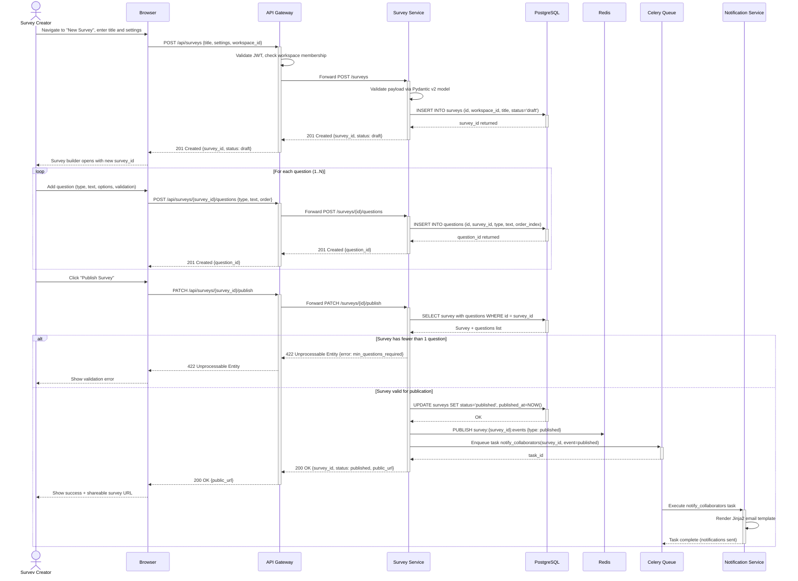
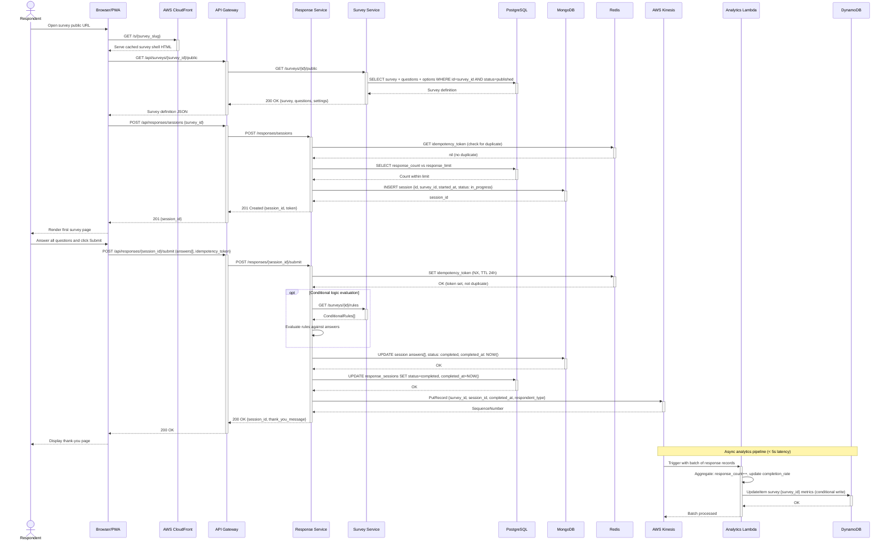
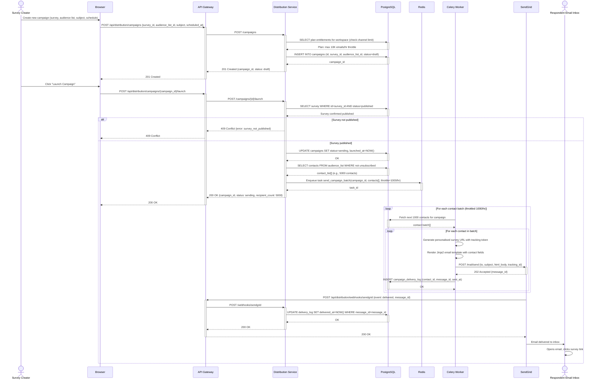
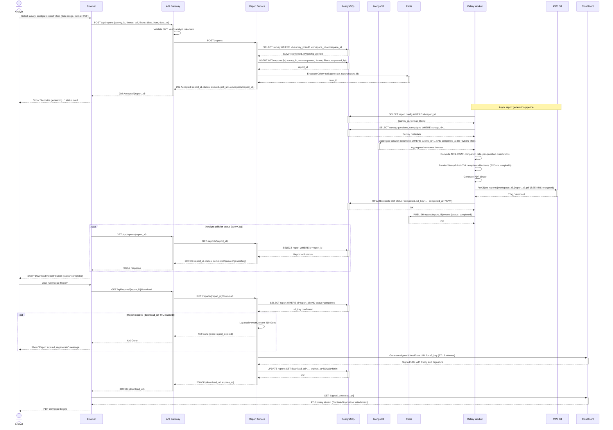

# System Sequence Diagrams — Survey and Feedback Platform

## Overview

System Sequence Diagrams (SSDs) document the interactions between external actors and the platform as a black box, then progressively reveal service-level participants for key use cases. Each diagram captures a specific end-to-end system interaction with realistic message labels, HTTP methods, payload hints, and conditional/loop flows.

The five diagrams cover the most critical user journeys:
- **SSD-001**: Survey creation and publication workflow
- **SSD-002**: Survey response submission with real-time analytics
- **SSD-003**: Email distribution campaign creation and delivery
- **SSD-004**: OAuth 2.0 login flow (Google SSO)
- **SSD-005**: Asynchronous report generation and download

Notation conventions: solid arrows (`->>`) indicate synchronous calls; dashed arrows (`-->>`) indicate responses or callbacks. `activate`/`deactivate` marks show when a participant is processing. `alt`, `opt`, and `loop` blocks show conditional and iterative behaviour.

---

## SSD-001: Create and Publish Survey

This sequence covers a survey creator building a survey in the SPA, saving it, adding questions, and publishing it to make it live for respondents.



---

## SSD-002: Submit Survey Response

This sequence covers a respondent loading a published survey, answering questions, and submitting — with real-time analytics updating in the background.



---

## SSD-003: Email Distribution Campaign

This sequence covers a workspace member creating an email campaign, launching it, and the platform distributing survey invitations to all contacts in the audience list.



---

## SSD-004: OAuth 2.0 Login Flow (Google SSO)

This sequence documents the complete OAuth 2.0 authorisation code flow for a user authenticating via Google SSO.

```mermaid
sequenceDiagram
    actor User
    participant Browser
    participant APIGW as API Gateway
    participant AuthSvc as Auth Service
    participant DB as PostgreSQL
    participant Redis
    participant Google as Google OAuth 2.0

    User->>Browser: Click "Sign in with Google"
    Browser->>+APIGW: GET /api/auth/oauth/google/authorize
    APIGW->>+AuthSvc: GET /auth/oauth/google/authorize
    AuthSvc->>AuthSvc: Generate state=CSRF token, nonce, code_verifier (PKCE)
    AuthSvc->>+Redis: SET oauth_state:{state} = {nonce, code_verifier} TTL 10min
    Redis-->>-AuthSvc: OK
    AuthSvc-->>-APIGW: 302 Redirect to Google with client_id, redirect_uri, scope, state, code_challenge
    APIGW-->>-Browser: 302 Redirect
    Browser->>+Google: GET /o/oauth2/v2/auth?client_id=...&state=...&scope=openid email profile
    Google-->>-Browser: Show Google consent screen

    User->>Browser: Approve permissions
    Browser->>+Google: POST consent approval
    Google-->>-Browser: 302 Redirect to redirect_uri?code=AUTH_CODE&state=STATE

    Browser->>+APIGW: GET /api/auth/oauth/google/callback?code=AUTH_CODE&state=STATE
    APIGW->>+AuthSvc: GET /auth/oauth/google/callback

    AuthSvc->>+Redis: GET oauth_state:{state}
    Redis-->>-AuthSvc: {nonce, code_verifier} (state validated)

    alt State mismatch or expired
        AuthSvc-->>APIGW: 400 Bad Request {error: invalid_state}
        APIGW-->>Browser: 400 Bad Request
        Browser-->>User: Show error page
    else State valid
        AuthSvc->>+Google: POST /token {code, client_id, client_secret, redirect_uri, code_verifier}
        Google-->>-AuthSvc: {access_token, id_token, refresh_token, expires_in}
        AuthSvc->>AuthSvc: Verify id_token signature, extract sub, email, name, picture

        AuthSvc->>+DB: SELECT user WHERE auth_provider=google AND auth_provider_id=sub
        DB-->>-AuthSvc: User record (or nil for new user)

        alt New user (first SSO login)
            AuthSvc->>+DB: INSERT INTO users (id, email, full_name, auth_provider, auth_provider_id)
            DB-->>-AuthSvc: user_id
        else Existing user
            AuthSvc->>+DB: UPDATE users SET last_login_at=NOW(), full_name=name
            DB-->>-AuthSvc: OK
        end

        AuthSvc->>AuthSvc: Generate JWT access_token (RS256, exp: 15min) and refresh_token (exp: 7d)
        AuthSvc->>+Redis: SET session:{user_id} = refresh_token_hash TTL 7d
        Redis-->>-AuthSvc: OK
        AuthSvc->>+Redis: DEL oauth_state:{state}
        Redis-->>-AuthSvc: OK
        AuthSvc-->>-APIGW: 200 OK {access_token, refresh_token, user: {id, email, name, workspace_id}}
        APIGW-->>-Browser: Set-Cookie: refresh_token (httpOnly, secure, SameSite=Strict); Body: {access_token, user}
        Browser-->>User: Redirect to dashboard, user authenticated
    end
```

---

## SSD-005: Generate and Download Report

This sequence covers an analyst requesting a PDF report, the platform generating it asynchronously, and the analyst downloading it via a signed CloudFront URL.



---

## Interaction Patterns

The five SSDs illustrate four recurring integration patterns used throughout the platform:

### Pattern 1: Synchronous Request-Response (SSD-001, SSD-002)
Short-lived operations (survey CRUD, response submission) complete within a single HTTP request-response cycle. FastAPI services process the request, persist state, and return within SLA (p99 < 200ms). Pydantic v2 validation rejects malformed payloads before any database writes occur.

### Pattern 2: Asynchronous Task Queue (SSD-003, SSD-005)
Long-running operations (email dispatch for thousands of contacts, PDF generation) are submitted as Celery tasks and return `202 Accepted` immediately. Callers poll a status endpoint or subscribe to a SSE channel to receive completion notifications. Tasks include correlation IDs (report_id, campaign_id) for deduplication and status tracking.

### Pattern 3: OAuth 2.0 Authorization Code + PKCE (SSD-004)
The standard OAuth 2.0 authorization code flow is implemented with PKCE (Proof Key for Code Exchange) to prevent authorization code interception attacks. State tokens and PKCE verifiers are stored in Redis with a 10-minute TTL and deleted after use to prevent replay. JWTs use RS256 asymmetric signing — the Auth Service holds the private key; other services validate using the JWKS public endpoint.

### Pattern 4: Event-Driven Analytics Pipeline (SSD-002)
Response submission writes to MongoDB synchronously, then publishes a lightweight event to Kinesis asynchronously. The Lambda consumer aggregates events in real time and writes pre-computed metrics to DynamoDB, enabling sub-50ms analytics query times regardless of response volume. This separates the write-path latency (response submission) from the read-path latency (analytics dashboard queries).

---

## Operational Policy Addendum

### OPA-SSD-001: API Response Time SLOs
The platform maintains the following p99 latency targets measured at the ALB: Survey CRUD operations ≤ 150ms; Response submission ≤ 200ms; Analytics dashboard query ≤ 300ms (DynamoDB path) or ≤ 500ms (aggregation path on cache miss); Report status poll ≤ 100ms; OAuth callback ≤ 500ms (including Google token exchange). SLO breaches trigger CloudWatch alarms with PagerDuty notification within 60 seconds. SLO compliance is reported weekly in the engineering operations review.

### OPA-SSD-002: Idempotency and Duplicate Submission Prevention
All state-mutating API operations that may be retried by clients (response submission, campaign launch) require an `Idempotency-Key` header (UUID v4). The server stores the idempotency key in Redis with the outcome (HTTP status + response body hash) for 24 hours. Identical requests within the 24-hour window return the cached response without re-executing the operation. Clients are responsible for generating a new idempotency key for intentional retries after a corrected submission.

### OPA-SSD-003: JWT Token Lifecycle Management
Access tokens have a 15-minute expiry. Refresh tokens have a 7-day expiry and are stored as HMAC-SHA256 hashes in Redis (not as plaintext). Token refresh occurs silently in the SPA using an axios interceptor that detects 401 responses and calls `POST /api/auth/token/refresh` before retrying the original request. On logout, the refresh token is deleted from Redis (server-side revocation), rendering it immediately invalid regardless of its remaining TTL. Forced logout (e.g., due to suspicious activity) invalidates all active refresh tokens for a user by deleting all Redis keys matching `session:{user_id}:*`.

### OPA-SSD-004: External Service Circuit Breakers
All calls to external services (Google OAuth, SendGrid, Twilio, Stripe, HubSpot) are wrapped with `tenacity` retry policies and circuit breakers. Initial retry delays are 1s, 3s, 9s with jitter. After 5 consecutive failures within a 60-second window, the circuit opens and subsequent calls fail fast with a cached error response for 30 seconds before attempting a probe. Circuit state transitions (open → half-open → closed) are logged with structured events and trigger CloudWatch metrics for operational visibility. Response submission (SSD-002) bypasses circuit breaker checks for non-essential calls (e.g., HubSpot sync) to maintain sub-200ms p99 latency on the critical path.
