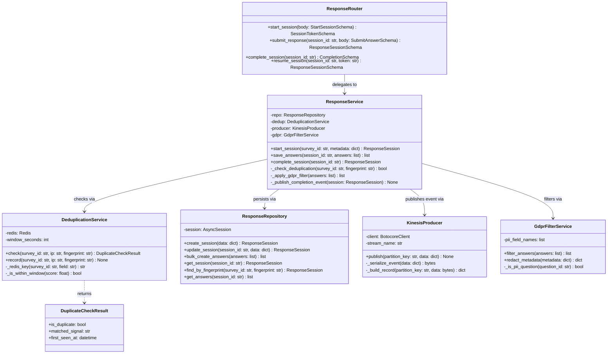
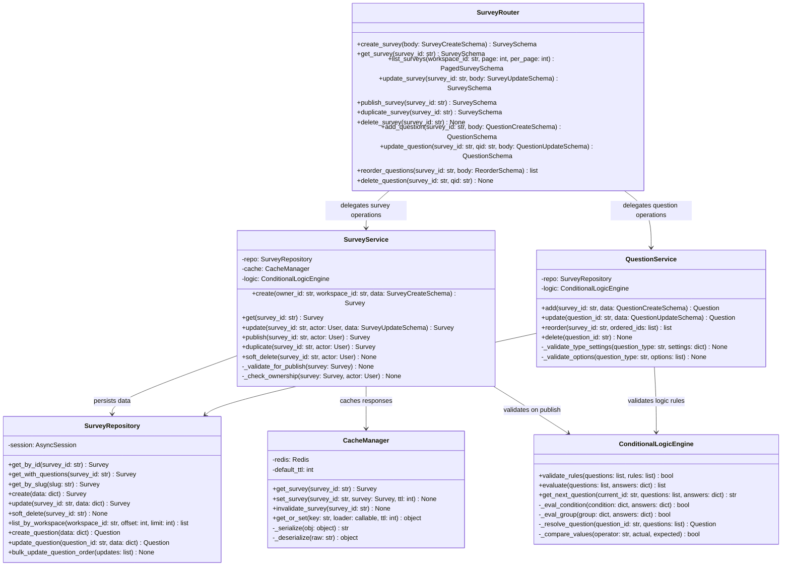
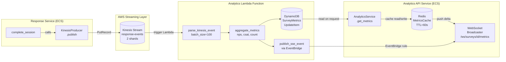
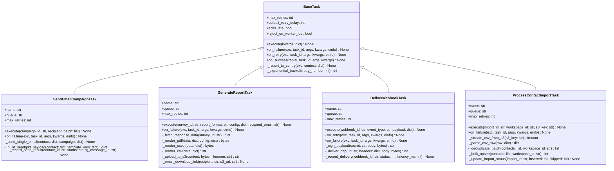
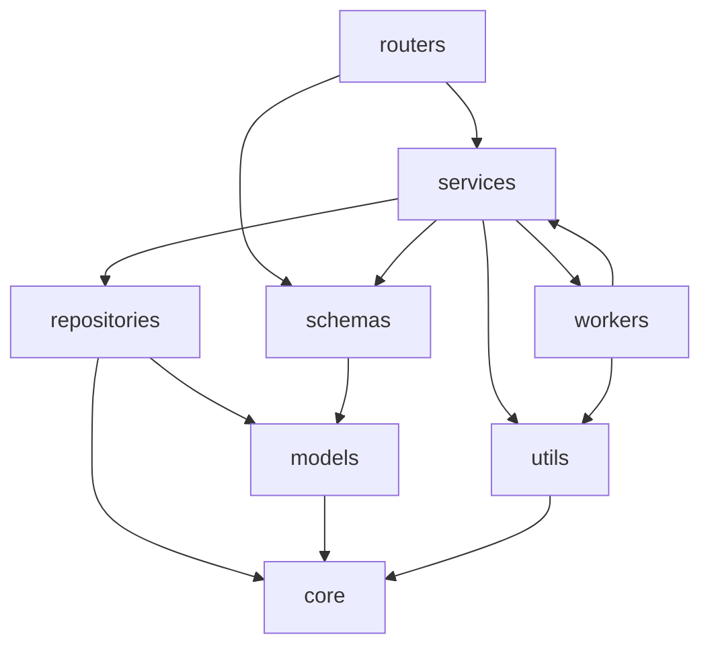

# C4 Code Diagram — Survey and Feedback Platform

## Overview

This document presents C4 Level 4 (Code) diagrams for the Survey and Feedback Platform's core services. Level 4 diagrams zoom into individual classes, their methods, and how they interact within a single deployable service. These diagrams are the implementation contract; class names, method signatures, and relationships here are the canonical reference for developers writing the code.

All diagrams use the following conventions:
- `+` prefix: public method or attribute
- `-` prefix: private method or attribute
- `-->` arrow: runtime dependency / method delegation
- `<|--` arrow: inheritance
- `..>` arrow: creates or returns an instance

---

## Survey Service — Response Submission Code-Level Diagram

This diagram covers the classes involved in receiving, validating, deduplicating, persisting, and publishing a survey response.



---

## Survey Builder Code-Level Diagram

This diagram shows the classes in the Survey Builder module, covering survey lifecycle management, question operations, conditional logic evaluation, and caching.



---

## Analytics Pipeline Code-Level Diagram

This flowchart shows the end-to-end data path from a completed survey response through the Kinesis streaming pipeline to the real-time WebSocket dashboard.



### Lambda Function Handler Logic

```python
import json
import base64
import boto3
from decimal import Decimal


dynamodb = boto3.resource("dynamodb")
table = dynamodb.Table("SurveyMetrics")


def handler(event: dict, context) -> dict:
    records = event.get("Records", [])
    for record in records:
        raw = base64.b64decode(record["kinesis"]["data"])
        payload = json.loads(raw)
        _process_response_completed(payload)
    return {"statusCode": 200, "processed": len(records)}


def _process_response_completed(payload: dict) -> None:
    survey_id = payload["survey_id"]
    date_hour = _get_date_hour_key(payload["completed_at"])
    nps_score = payload.get("nps_score")
    time_seconds = payload.get("time_to_complete_seconds", 0)

    update_expr = "ADD #count :one, #total_time :time"
    expr_names = {"#count": "response_count", "#total_time": "total_time_seconds"}
    expr_values = {":one": Decimal(1), ":time": Decimal(time_seconds)}

    if nps_score is not None:
        update_expr += ", #nps_sum :nps"
        expr_names["#nps_sum"] = "nps_sum"
        expr_values[":nps"] = Decimal(nps_score)

    table.update_item(
        Key={"survey_id": survey_id, "date_hour": date_hour},
        UpdateExpression=update_expr,
        ExpressionAttributeNames=expr_names,
        ExpressionAttributeValues=expr_values,
    )
```

---

## Celery Task Code Structure

This diagram shows the Celery task class hierarchy. All tasks extend `BaseTask` which provides standardized failure logging, Sentry error reporting, and retry policy helpers.



### Celery Task Registration

```python
from celery import Celery
from kombu import Queue

app = Celery("survey_platform")
app.config_from_object("app.core.celery_config")

app.conf.task_queues = (
    Queue("email", routing_key="email"),
    Queue("reports", routing_key="reports"),
    Queue("webhooks", routing_key="webhooks"),
    Queue("imports", routing_key="imports"),
)

app.conf.task_routes = {
    "workers.email_tasks.SendEmailCampaignTask": {"queue": "email"},
    "workers.report_tasks.GenerateReportTask": {"queue": "reports"},
    "workers.webhook_tasks.DeliverWebhookTask": {"queue": "webhooks"},
    "workers.import_tasks.ProcessContactImportTask": {"queue": "imports"},
}
```

---

## Module Dependency Graph

This diagram shows the import dependency graph within the `response-service`. Arrows point from the importing module to the imported module. No circular imports are permitted; this graph is validated in CI by `import-linter`.



---

## Key Design Patterns

### Repository Pattern with Abstract Base

The repository pattern decouples persistence logic from business logic and enables easy substitution of fake implementations in tests.

```python
from abc import ABC, abstractmethod
from uuid import UUID
from typing import TypeVar, Generic

T = TypeVar("T")


class AbstractRepository(ABC, Generic[T]):
    @abstractmethod
    async def get_by_id(self, entity_id: UUID) -> T | None:
        raise NotImplementedError

    @abstractmethod
    async def create(self, data: dict) -> T:
        raise NotImplementedError

    @abstractmethod
    async def update(self, entity_id: UUID, data: dict) -> T | None:
        raise NotImplementedError

    @abstractmethod
    async def soft_delete(self, entity_id: UUID) -> None:
        raise NotImplementedError
```

### Unit of Work Pattern

The Unit of Work wraps a single database session and ensures that all repository operations within a service method either commit together or roll back entirely.

```python
from contextlib import asynccontextmanager
from sqlalchemy.ext.asyncio import AsyncSession, async_sessionmaker
from typing import AsyncGenerator


class UnitOfWork:
    def __init__(self, session_factory: async_sessionmaker) -> None:
        self._session_factory = session_factory

    @asynccontextmanager
    async def begin(self) -> AsyncGenerator[AsyncSession, None]:
        async with self._session_factory() as session:
            async with session.begin():
                try:
                    yield session
                except Exception:
                    await session.rollback()
                    raise


# Usage in service layer
class ResponseService:
    def __init__(self, uow: UnitOfWork) -> None:
        self._uow = uow

    async def complete_session(self, session_id: str) -> ResponseSession:
        async with self._uow.begin() as db:
            repo = ResponseRepository(db)
            session = await repo.update_session(session_id, {"status": "completed"})
            self._publish_completion_event(session)
            return session
```

### Event Publisher Pattern

The `KinesisProducer` abstracts AWS SDK calls and provides a clean interface for publishing domain events. It is injected as a dependency and can be replaced with a mock in tests.

```python
import json
import boto3
from dataclasses import dataclass, asdict
from datetime import datetime, timezone


@dataclass
class ResponseCompletedEvent:
    event_type: str = "response.completed"
    survey_id: str = ""
    session_id: str = ""
    workspace_id: str = ""
    completed_at: str = ""
    answer_count: int = 0
    time_to_complete_seconds: int = 0
    nps_score: int | None = None


class KinesisProducer:
    def __init__(self, stream_name: str, region: str = "us-east-1") -> None:
        self._client = boto3.client("kinesis", region_name=region)
        self._stream_name = stream_name

    def publish(self, partition_key: str, data: dict) -> None:
        self._client.put_record(
            StreamName=self._stream_name,
            Data=self._serialize_event(data),
            PartitionKey=partition_key,
        )

    def _serialize_event(self, data: dict) -> bytes:
        return json.dumps(data, default=str).encode("utf-8")
```

### Strategy Pattern for Question Type Renderers

Each question type has a dedicated renderer that knows how to serialize its answer for storage and deserialize it for display.

```python
from abc import ABC, abstractmethod


class QuestionRenderer(ABC):
    @abstractmethod
    def validate_answer(self, answer: object, question: dict) -> None:
        raise NotImplementedError

    @abstractmethod
    def serialize_answer(self, answer: object) -> dict:
        raise NotImplementedError

    @abstractmethod
    def deserialize_answer(self, stored: dict) -> object:
        raise NotImplementedError


class NpsRenderer(QuestionRenderer):
    def validate_answer(self, answer: object, question: dict) -> None:
        if not isinstance(answer, int) or not (0 <= answer <= 10):
            raise ValueError("NPS answer must be an integer between 0 and 10")

    def serialize_answer(self, answer: object) -> dict:
        return {"answer_numeric": int(answer)}

    def deserialize_answer(self, stored: dict) -> int:
        return int(stored["answer_numeric"])


class MultipleChoiceRenderer(QuestionRenderer):
    def validate_answer(self, answer: object, question: dict) -> None:
        if not isinstance(answer, list):
            raise ValueError("Multiple choice answer must be a list")
        valid_ids = {opt["id"] for opt in question.get("options", [])}
        for item in answer:
            if item not in valid_ids:
                raise ValueError(f"Option '{item}' is not valid for this question")
        min_sel = question.get("settings", {}).get("min_selections", 1)
        max_sel = question.get("settings", {}).get("max_selections", len(valid_ids))
        if not (min_sel <= len(answer) <= max_sel):
            raise ValueError(f"Select between {min_sel} and {max_sel} options")

    def serialize_answer(self, answer: object) -> dict:
        return {"answer_json": answer}

    def deserialize_answer(self, stored: dict) -> list:
        return stored["answer_json"]


RENDERER_REGISTRY: dict[str, QuestionRenderer] = {
    "nps": NpsRenderer(),
    "multiple_choice": MultipleChoiceRenderer(),
}


def get_renderer(question_type: str) -> QuestionRenderer:
    renderer = RENDERER_REGISTRY.get(question_type)
    if renderer is None:
        raise ValueError(f"No renderer registered for question type: {question_type}")
    return renderer
```

---

## Operational Policy Addendum

### A.1 Diagram Maintenance Policy

All diagrams in this document are considered living architecture documentation. When a class is added, renamed, or has its public interface changed, the corresponding diagram must be updated in the same pull request as the code change. A CI check (`python scripts/validate_diagrams.py`) parses all Mermaid blocks in this file and verifies that referenced class names exist in the codebase. Diagrams that become stale (code changed without diagram update) are flagged during the weekly architecture review. The Lead Architect is the owner of this document; all diagram changes require their approval.

### A.2 Architecture Decision Records

Every significant design choice — selection of a library, choice of database schema shape, adoption of a design pattern — must be captured in an ADR stored in `docs/adr/`. ADRs follow the MADR (Markdown Architectural Decision Records) template with sections: Context, Decision, Rationale, Consequences, and Alternatives Considered. ADRs are immutable once merged; superseded decisions reference the new ADR that replaced them. The ADR index is maintained in `docs/adr/README.md`. Engineers are expected to read all ADRs in the area they are working before beginning implementation.

### A.3 Architecture Review Process

Any change that affects a service boundary, introduces a new external dependency, modifies the data model of a shared entity, or changes the event schema on Kinesis requires an architecture review before implementation. The engineer proposing the change creates a design document in `docs/proposals/` describing the problem, the proposed solution, and at least two alternatives. The Lead Architect schedules a 45-minute review with all affected engineers. Decisions from the review are captured in an ADR. Emergency changes during a P1 incident bypass this process but must be reviewed and formalized within 5 business days.

### A.4 Cross-Team Communication

Changes to shared interfaces — Kinesis event schemas, shared database tables, inter-service HTTP contracts, and Celery task signatures — must be communicated to all teams via a Slack announcement in `#architecture-changes` at least 3 business days before deployment to staging. Breaking changes to public API endpoints follow the API versioning policy: the old version is maintained for a minimum of 90 days with a `Sunset` header indicating the deprecation date. The analytics team must be notified of any change to the Kinesis `ResponseCompletedEvent` schema with at least 2 weeks notice to update the Lambda consumer.
