# Deployment Diagram — Survey and Feedback Platform

## Overview

The Survey and Feedback Platform is deployed on AWS using a multi-AZ architecture in the
`us-east-1` region. The deployment leverages ECS Fargate for container orchestration,
eliminating the need to manage EC2 instances directly. All workloads are distributed across
two Availability Zones (`us-east-1a` and `us-east-1b`) to ensure high availability and
fault tolerance.

Key architectural decisions:
- **Stateless services** run on ECS Fargate in private subnets, scaled independently.
- **PostgreSQL 15 (RDS Multi-AZ)** serves as the primary transactional database with automated failover.
- **MongoDB Atlas** (M30, 3-node replica set) hosts flexible survey schema documents.
- **ElastiCache Redis 7** (cluster mode, 3 shards) handles caching, session storage, and pub/sub.
- **Kinesis → Lambda → DynamoDB** forms the real-time analytics ingestion pipeline.
- **CloudFront + WAF** sit in front of all public traffic for CDN caching and threat protection.
- All secrets are stored in **AWS Secrets Manager**; configuration lives in **Parameter Store**.

---

## Deployment Diagram

```mermaid
flowchart TD
    Internet([🌐 Internet])

    subgraph DNS["Route 53 — DNS Layer"]
        R53[Route 53\nHosted Zone\nsurvey-platform.com]
    end

    subgraph CDN["CloudFront — CDN Layer"]
        CF[CloudFront Distribution\nStatic Assets + Survey Embed\ncdn.survey-platform.com]
    end

    subgraph WAF_Layer["AWS WAF"]
        WAF[WAF Web ACL\nOWASP Rules + Rate Limiting\nGeo Blocking]
    end

    subgraph PublicSubnets["Public Subnets — us-east-1a / us-east-1b"]
        ALB[Application Load Balancer\napi.survey-platform.com\nHTTPS:443]
        IGW[Internet Gateway]
        NATGW_A[NAT Gateway\nus-east-1a]
        NATGW_B[NAT Gateway\nus-east-1b]
    end

    subgraph PrivateSubnets_A["Private App Subnet — us-east-1a (10.0.10.0/24)"]
        direction TB
        SVC_SURVEY_A[survey-service\n1 task · 1 vCPU · 2 GB]
        SVC_RESP_A[response-service\n2 tasks · 2 vCPU · 4 GB]
        SVC_ANALYTICS_A[analytics-service\n1 task · 1 vCPU · 2 GB]
        SVC_DIST_A[distribution-service\n1 task + Celery worker]
        SVC_AUTH_A[auth-service\n1 task · 0.5 vCPU · 1 GB]
        SVC_REPORT_A[report-service\n1 task + Celery worker]
        SVC_WEBHOOK_A[webhook-service\n1 task · 0.5 vCPU · 1 GB]
    end

    subgraph PrivateSubnets_B["Private App Subnet — us-east-1b (10.0.11.0/24)"]
        direction TB
        SVC_SURVEY_B[survey-service\n1 task · 1 vCPU · 2 GB]
        SVC_RESP_B[response-service\n2 tasks · 2 vCPU · 4 GB]
        SVC_ANALYTICS_B[analytics-service\n1 task · 1 vCPU · 2 GB]
        SVC_DIST_B[distribution-service\n1 task + Celery worker]
        SVC_AUTH_B[auth-service\n1 task · 0.5 vCPU · 1 GB]
        SVC_WEBHOOK_B[webhook-service\n1 task · 0.5 vCPU · 1 GB]
    end

    subgraph DataLayer["Data Tier — Private Subnets"]
        subgraph RDS_Group["RDS PostgreSQL 15 Multi-AZ"]
            RDS_PRI[RDS Primary\ndb.r6g.xlarge\nus-east-1a]
            RDS_STB[RDS Standby\ndb.r6g.xlarge\nus-east-1b]
        end
        REDIS[ElastiCache Redis 7\nCluster Mode — 3 Shards\n1 Primary + 1 Replica each]
        MONGO[MongoDB Atlas\nM30 · 3-Node Replica Set\nDedicated Cluster]
        DYNAMO[DynamoDB\nOn-Demand Capacity\nGlobal Tables]
    end

    subgraph Storage["AWS S3"]
        S3_ASSETS[S3 Bucket\nsurvey-platform-assets\nPublic + CloudFront OAC]
        S3_REPORTS[S3 Bucket\nsurvey-platform-reports\nPrivate — Presigned URLs]
    end

    subgraph AnalyticsPipeline["Real-Time Analytics Pipeline"]
        KINESIS[Kinesis Data Streams\n4 Shards\n24h Retention]
        LAMBDA[Lambda Function\nanalytics-processor\n512 MB · 60s timeout]
    end

    subgraph Observability["Observability + Operations"]
        CW[CloudWatch\nMetrics + Logs + Alarms\nDashboards]
        XRAY[AWS X-Ray\nDistributed Tracing]
        SM[Secrets Manager\nDB Creds + API Keys\nAuto-Rotation 30d]
    end

    Internet --> R53
    R53 --> CF
    R53 --> ALB
    CF --> WAF
    WAF --> ALB
    CF --> S3_ASSETS

    ALB --> SVC_SURVEY_A
    ALB --> SVC_SURVEY_B
    ALB --> SVC_RESP_A
    ALB --> SVC_RESP_B
    ALB --> SVC_ANALYTICS_A
    ALB --> SVC_ANALYTICS_B
    ALB --> SVC_DIST_A
    ALB --> SVC_DIST_B
    ALB --> SVC_AUTH_A
    ALB --> SVC_AUTH_B
    ALB --> SVC_REPORT_A
    ALB --> SVC_WEBHOOK_A
    ALB --> SVC_WEBHOOK_B

    SVC_SURVEY_A & SVC_SURVEY_B --> RDS_PRI
    SVC_RESP_A & SVC_RESP_B --> RDS_PRI
    SVC_ANALYTICS_A & SVC_ANALYTICS_B --> RDS_PRI
    SVC_AUTH_A & SVC_AUTH_B --> RDS_PRI
    SVC_REPORT_A --> RDS_PRI
    RDS_PRI --- RDS_STB

    SVC_SURVEY_A & SVC_SURVEY_B --> REDIS
    SVC_RESP_A & SVC_RESP_B --> REDIS
    SVC_DIST_A & SVC_DIST_B --> REDIS
    SVC_AUTH_A & SVC_AUTH_B --> REDIS

    SVC_SURVEY_A & SVC_SURVEY_B --> MONGO
    SVC_RESP_A & SVC_RESP_B --> MONGO
    SVC_ANALYTICS_A & SVC_ANALYTICS_B --> MONGO

    SVC_ANALYTICS_A & SVC_ANALYTICS_B --> DYNAMO
    SVC_REPORT_A --> DYNAMO

    SVC_REPORT_A --> S3_REPORTS
    SVC_DIST_A & SVC_DIST_B --> S3_ASSETS

    SVC_RESP_A & SVC_RESP_B --> KINESIS
    KINESIS --> LAMBDA
    LAMBDA --> DYNAMO

    SVC_SURVEY_A & SVC_SURVEY_B & SVC_RESP_A & SVC_RESP_B --> CW
    SVC_ANALYTICS_A & SVC_AUTH_A & SVC_REPORT_A --> CW
    CW --> XRAY
    SM --> SVC_SURVEY_A
    SM --> SVC_RESP_A
    SM --> SVC_AUTH_A

    NATGW_A --> IGW
    NATGW_B --> IGW
    IGW --> Internet
```



---

## ECS Task Definitions

| Service | CPU (vCPU) | Memory | Min Replicas | Max Replicas | Health Check Endpoint | Health Check Interval |
|---|---|---|---|---|---|---|
| survey-service | 1 | 2 GB | 2 | 10 | `GET /health` | 30s |
| response-service | 2 | 4 GB | 4 | 20 | `GET /health` | 15s |
| analytics-service | 1 | 2 GB | 2 | 8 | `GET /health` | 30s |
| distribution-service | 1 | 2 GB | 2 | 6 | `GET /health` | 30s |
| distribution-celery | 0.5 | 1 GB | 2 | 10 | Process heartbeat | 60s |
| auth-service | 0.5 | 1 GB | 2 | 8 | `GET /health` | 30s |
| report-service | 2 | 4 GB | 1 | 4 | `GET /health` | 60s |
| report-celery | 1 | 2 GB | 1 | 6 | Process heartbeat | 60s |
| webhook-service | 0.5 | 1 GB | 2 | 8 | `GET /health` | 30s |

**Common Task Settings:**
- **Launch Type:** Fargate
- **Network Mode:** `awsvpc`
- **Operating System:** Linux/X86_64
- **Log Driver:** `awslogs` → CloudWatch Logs (`/ecs/survey-platform/<service>`)
- **IAM Task Role:** `ecs-task-role-<service>` (least-privilege per service)
- **IAM Execution Role:** `ecs-execution-role` (shared, ECR pull + CloudWatch)
- **Container Registry:** ECR (`<account>.dkr.ecr.us-east-1.amazonaws.com/survey/<service>`)
- **Environment Variables:** Injected via ECS Secrets (Secrets Manager ARNs)

---

## RDS Configuration

### Instance Specification

| Parameter | Value |
|---|---|
| Engine | PostgreSQL 15.4 |
| Instance Class | `db.r6g.xlarge` (4 vCPU, 32 GB RAM) |
| Storage Type | `gp3` |
| Allocated Storage | 500 GB |
| Max Allocated Storage | 2 TB (autoscaling enabled) |
| Storage IOPS | 12,000 (provisioned) |
| Storage Throughput | 500 MB/s |
| Multi-AZ | Enabled (synchronous replication to standby) |
| Publicly Accessible | No |
| Subnet Group | `survey-platform-db-subnet-group` |
| Parameter Group | `survey-platform-pg15` (custom — `max_connections=500`, `shared_buffers=8GB`) |

### Backup and Recovery

| Parameter | Value |
|---|---|
| Automated Backups | Enabled |
| Backup Retention Period | 30 days |
| Backup Window | 03:00–04:00 UTC (low traffic) |
| Point-in-Time Recovery (PITR) | Enabled |
| Maintenance Window | Sunday 04:00–05:00 UTC |
| Deletion Protection | Enabled |
| Final Snapshot | Required on deletion |
| Cross-Region Backup | Replicated to `us-west-2` via AWS Backup |

### Read Replicas

| Replica | Region | Instance | Use Case |
|---|---|---|---|
| `survey-platform-rr-1` | `us-east-1` | `db.r6g.large` | Analytics read queries |
| `survey-platform-rr-2` | `us-west-2` | `db.r6g.large` | Cross-region DR + reporting |

---

## Scaling Policies

### ECS Service Auto Scaling

All services use **Application Auto Scaling** with **Target Tracking** as the primary policy,
supplemented by **Step Scaling** for burst events.

| Service | Metric | Target | Scale-Out Cooldown | Scale-In Cooldown |
|---|---|---|---|---|
| survey-service | CPU Utilization | 60% | 120s | 300s |
| response-service | CPU Utilization | 65% | 60s | 300s |
| response-service | SQS Queue Depth | <50 messages | 60s | 180s |
| analytics-service | CPU Utilization | 70% | 120s | 300s |
| distribution-service | Celery Queue Depth | <100 tasks | 90s | 300s |
| auth-service | Request Count | 1000 RPS | 60s | 300s |
| report-celery | Celery Queue Depth | <20 tasks | 120s | 600s |
| webhook-service | CPU Utilization | 60% | 60s | 300s |

### Step Scaling — Response Service Burst

| Alarm Condition | Adjustment |
|---|---|
| CPU > 70% for 2 minutes | +2 tasks |
| CPU > 85% for 1 minute | +4 tasks |
| CPU < 30% for 10 minutes | −1 task |

### RDS Scaling

RDS PostgreSQL does not auto-scale vertically. Scaling plan:
- **Storage autoscaling:** Triggers at 90% utilization, grows in 100 GB increments.
- **Connection pooling:** PgBouncer sidecar runs on each ECS service to pool DB connections
  (transaction mode, max 20 connections per container → 500 total max).
- **Vertical scale-up:** Performed via maintenance window if P95 CPU consistently exceeds 70%.

### ElastiCache Scaling

- Redis cluster mode with 3 shards; each shard has 1 primary + 1 replica.
- **Online resharding** available: scale from 3 → 6 shards without downtime.
- Trigger: memory utilization > 75% for 15 minutes.

---

## CI/CD Pipeline

### Pipeline Overview

```
Developer Push → GitHub (feature branch)
       ↓
GitHub Actions: PR Checks
  ├─ pytest (unit + integration tests)
  ├─ ruff + mypy (Python linting)
  ├─ eslint + tsc --noEmit (frontend)
  └─ docker build --no-cache (smoke test)
       ↓
Merge to main → GitHub Actions: Build & Push
  ├─ docker build --platform linux/amd64
  ├─ docker tag :<git-sha> + :latest
  ├─ aws ecr get-login-password | docker login
  └─ docker push → ECR
       ↓
GitHub Actions: Deploy to Staging (ECS Rolling)
  ├─ aws ecs update-service --force-new-deployment
  ├─ wait for service stability (--timeout 600)
  └─ smoke test: curl https://staging-api.survey-platform.com/health
       ↓
Manual Approval Gate (GitHub Environment Protection)
       ↓
GitHub Actions: Deploy to Production
  ├─ aws ecs update-service (rolling: min 50%, max 200%)
  ├─ wait for service stability
  └─ post-deploy: Datadog / CloudWatch synthetic monitor check
```

### GitHub Actions Secrets Required

| Secret | Value Source |
|---|---|
| `AWS_ACCESS_KEY_ID` | IAM OIDC (no long-lived keys) |
| `AWS_SECRET_ACCESS_KEY` | IAM OIDC (no long-lived keys) |
| `ECR_REGISTRY` | `<account>.dkr.ecr.us-east-1.amazonaws.com` |
| `ECS_CLUSTER` | `survey-platform-prod` |

### Rollback Strategy

- **Automatic rollback** triggers if ECS deployment does not reach `RUNNING` state
  within 10 minutes (circuit breaker enabled on all services).
- **Manual rollback:** Re-deploy previous ECR image tag via:
  `aws ecs update-service --task-definition <service>:<previous-revision>`

---

## Operational Policy Addendum

### 1. On-Call and Incident Response

All production services are monitored 24/7. CloudWatch alarms route to SNS topics which
fan out to PagerDuty for on-call alerting. Severity levels:

- **P1 (Critical):** Platform down or data loss risk. Page on-call immediately. Response SLA: 15 minutes.
- **P2 (High):** Degraded performance affecting >10% of users. Response SLA: 1 hour.
- **P3 (Medium):** Non-critical feature failure. Response SLA: next business day.

Runbooks for all P1/P2 scenarios are maintained in Confluence and linked from each CloudWatch
alarm description. Post-incident reviews (PIRs) are mandatory for all P1 incidents and must
be completed within 48 hours.

### 2. Change Management

All infrastructure changes must go through the following process:

1. **Infrastructure as Code (IaC):** All AWS resources are provisioned via Terraform. No
   manual console changes are permitted in production. Terraform state is stored in S3
   (`survey-platform-tfstate`) with DynamoDB locking.
2. **Pull Request Review:** All Terraform and application changes require at least 2
   approvals from senior engineers.
3. **Staging Validation:** Changes deploy to staging first and must pass a 24-hour soak
   period for significant changes (new services, schema migrations).
4. **Deployment Windows:** Non-emergency production deployments occur Tuesday–Thursday,
   10:00–16:00 UTC. Emergency hotfixes may deploy at any time with on-call approval.

### 3. Database Migration Policy

Schema migrations are managed with **Alembic** (PostgreSQL) and versioned migration scripts
(MongoDB). Policy:

- Migrations must be backward-compatible for at least one release cycle (blue-green safe).
- Destructive operations (DROP COLUMN, DROP TABLE) require a two-phase approach:
  Phase 1 — stop writing to the column; Phase 2 — drop after 2+ weeks.
- All migrations must be tested against a production-sized data snapshot in staging before
  production execution.
- Migrations run as a pre-deployment ECS task (`db-migrate` task definition) before the
  rolling update begins.

### 4. Cost Governance

Monthly infrastructure cost targets are reviewed in sprint retrospectives.
Key controls:

- **AWS Cost Explorer** alerts trigger at 80% of monthly budget.
- **Compute Savings Plans** cover baseline ECS Fargate usage (1-year term, no upfront).
- **Reserved Instances** for RDS (`db.r6g.xlarge`, 1-year, partial upfront).
- **S3 Intelligent Tiering** is enabled on both buckets; objects >128 KB are automatically
  moved to cheaper tiers after 30 days of no access.
- Unused ECR images older than 90 days are pruned via ECR lifecycle policies.
- CloudWatch Log Groups have a 90-day retention policy to control log storage costs.
