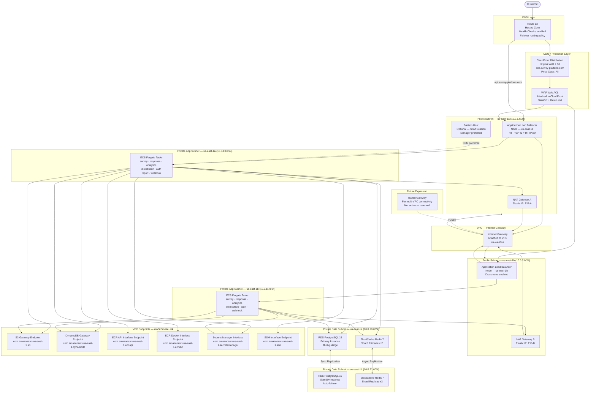

# Network Infrastructure — Survey and Feedback Platform

## Overview

The Survey and Feedback Platform network is built on a single AWS VPC (`10.0.0.0/16`)
deployed in `us-east-1` across two Availability Zones. The design follows a **three-tier
network model**: a public tier for internet-facing resources, a private application tier
for ECS containers, and a private data tier for databases and caches.

Key network design principles:
- **Defense in depth:** WAF → ALB → Security Groups → NACLs → VPC Endpoints form layered controls.
- **No direct internet access from private subnets:** All outbound traffic from ECS/RDS
  routes through NAT Gateways or VPC Endpoints, never directly to the internet.
- **AWS-native service connectivity:** S3, DynamoDB, ECR, and Secrets Manager are accessed
  via VPC Endpoints, keeping traffic on the AWS backbone and reducing NAT costs.
- **High availability:** Dual NAT Gateways (one per AZ) eliminate cross-AZ NAT traffic
  and single points of failure.
- **Observability:** VPC Flow Logs capture all accepted and rejected traffic for security
  analysis and troubleshooting.

---

## Network Topology Diagram



---

## Security Groups Configuration

### alb-sg — Application Load Balancer

| Direction | Source / Destination | Port | Protocol | Description |
|---|---|---|---|---|
| Inbound | `0.0.0.0/0` | 443 | TCP | HTTPS from internet |
| Inbound | `0.0.0.0/0` | 80 | TCP | HTTP (redirect to HTTPS) |
| Outbound | `ecs-survey-sg` | 8000 | TCP | Forward to survey-service |
| Outbound | `ecs-response-sg` | 8001 | TCP | Forward to response-service |
| Outbound | `ecs-auth-sg` | 8002 | TCP | Forward to auth-service |
| Outbound | `ecs-analytics-sg` | 8003 | TCP | Forward to analytics-service |
| Outbound | `ecs-dist-sg` | 8004 | TCP | Forward to distribution-service |
| Outbound | `ecs-report-sg` | 8005 | TCP | Forward to report-service |
| Outbound | `ecs-webhook-sg` | 8006 | TCP | Forward to webhook-service |

### ecs-survey-sg — Survey Service

| Direction | Source / Destination | Port | Protocol | Description |
|---|---|---|---|---|
| Inbound | `alb-sg` | 8000 | TCP | Traffic from ALB |
| Outbound | `rds-sg` | 5432 | TCP | PostgreSQL |
| Outbound | `redis-sg` | 6379 | TCP | Redis cache |
| Outbound | `0.0.0.0/0` | 443 | TCP | HTTPS to MongoDB Atlas, S3 EP |
| Outbound | `0.0.0.0/0` | 53 | UDP | DNS resolution |

### ecs-response-sg — Response Service

| Direction | Source / Destination | Port | Protocol | Description |
|---|---|---|---|---|
| Inbound | `alb-sg` | 8001 | TCP | Traffic from ALB |
| Outbound | `rds-sg` | 5432 | TCP | PostgreSQL |
| Outbound | `redis-sg` | 6379 | TCP | Redis (Celery broker) |
| Outbound | `0.0.0.0/0` | 443 | TCP | HTTPS to Kinesis EP, MongoDB |
| Outbound | `0.0.0.0/0` | 53 | UDP | DNS resolution |

### ecs-auth-sg — Auth Service

| Direction | Source / Destination | Port | Protocol | Description |
|---|---|---|---|---|
| Inbound | `alb-sg` | 8002 | TCP | Traffic from ALB |
| Outbound | `rds-sg` | 5432 | TCP | PostgreSQL (user records) |
| Outbound | `redis-sg` | 6379 | TCP | Redis (session tokens) |
| Outbound | `0.0.0.0/0` | 443 | TCP | HTTPS: SES, Google/MS OAuth |
| Outbound | `0.0.0.0/0` | 53 | UDP | DNS resolution |

### ecs-analytics-sg — Analytics Service

| Direction | Source / Destination | Port | Protocol | Description |
|---|---|---|---|---|
| Inbound | `alb-sg` | 8003 | TCP | Traffic from ALB |
| Outbound | `rds-sg` | 5432 | TCP | PostgreSQL read queries |
| Outbound | `redis-sg` | 6379 | TCP | Redis cache reads |
| Outbound | `0.0.0.0/0` | 443 | TCP | DynamoDB EP, MongoDB Atlas |
| Outbound | `0.0.0.0/0` | 53 | UDP | DNS resolution |

### ecs-dist-sg — Distribution Service

| Direction | Source / Destination | Port | Protocol | Description |
|---|---|---|---|---|
| Inbound | `alb-sg` | 8004 | TCP | Traffic from ALB |
| Outbound | `redis-sg` | 6379 | TCP | Redis (Celery broker) |
| Outbound | `0.0.0.0/0` | 443 | TCP | SES (email), S3 EP (assets) |
| Outbound | `0.0.0.0/0` | 53 | UDP | DNS resolution |

### ecs-report-sg — Report Service

| Direction | Source / Destination | Port | Protocol | Description |
|---|---|---|---|---|
| Inbound | `alb-sg` | 8005 | TCP | Traffic from ALB |
| Outbound | `rds-sg` | 5432 | TCP | PostgreSQL |
| Outbound | `redis-sg` | 6379 | TCP | Redis (Celery broker) |
| Outbound | `0.0.0.0/0` | 443 | TCP | S3 EP (reports), DynamoDB EP |
| Outbound | `0.0.0.0/0` | 53 | UDP | DNS resolution |

### ecs-webhook-sg — Webhook Service

| Direction | Source / Destination | Port | Protocol | Description |
|---|---|---|---|---|
| Inbound | `alb-sg` | 8006 | TCP | Traffic from ALB |
| Outbound | `0.0.0.0/0` | 443 | TCP | HTTPS to external webhook URLs |
| Outbound | `0.0.0.0/0` | 53 | UDP | DNS resolution |

### rds-sg — RDS PostgreSQL

| Direction | Source / Destination | Port | Protocol | Description |
|---|---|---|---|---|
| Inbound | `ecs-survey-sg` | 5432 | TCP | From survey-service |
| Inbound | `ecs-response-sg` | 5432 | TCP | From response-service |
| Inbound | `ecs-auth-sg` | 5432 | TCP | From auth-service |
| Inbound | `ecs-analytics-sg` | 5432 | TCP | From analytics-service |
| Inbound | `ecs-report-sg` | 5432 | TCP | From report-service |
| Inbound | `lambda-sg` | 5432 | TCP | From analytics Lambda (if needed) |
| Outbound | None | — | — | No outbound rules required |

### redis-sg — ElastiCache Redis

| Direction | Source / Destination | Port | Protocol | Description |
|---|---|---|---|---|
| Inbound | `ecs-survey-sg` | 6379 | TCP | From survey-service |
| Inbound | `ecs-response-sg` | 6379 | TCP | From response-service |
| Inbound | `ecs-auth-sg` | 6379 | TCP | From auth-service |
| Inbound | `ecs-analytics-sg` | 6379 | TCP | From analytics-service |
| Inbound | `ecs-dist-sg` | 6379 | TCP | From distribution-service |
| Inbound | `ecs-report-sg` | 6379 | TCP | From report-service |
| Outbound | None | — | — | No outbound rules required |

### lambda-sg — Analytics Lambda

| Direction | Source / Destination | Port | Protocol | Description |
|---|---|---|---|---|
| Inbound | None | — | — | Lambda is triggered by Kinesis event source mapping |
| Outbound | `rds-sg` | 5432 | TCP | Optional: enrichment queries |
| Outbound | `0.0.0.0/0` | 443 | TCP | DynamoDB EP, CloudWatch Logs |
| Outbound | `0.0.0.0/0` | 53 | UDP | DNS resolution |

---

## Network ACLs

Network ACLs provide a stateless, subnet-level layer of defense. Rules are numbered; lower
numbers are evaluated first.

### Public Subnet NACL (`nacl-public`)

Applies to: `public-1a` (10.0.1.0/24) and `public-1b` (10.0.2.0/24)

| Rule # | Type | Protocol | Port Range | Source/Dest | Action |
|---|---|---|---|---|---|
| 100 | Inbound | TCP | 443 | 0.0.0.0/0 | ALLOW |
| 110 | Inbound | TCP | 80 | 0.0.0.0/0 | ALLOW |
| 120 | Inbound | TCP | 1024–65535 | 0.0.0.0/0 | ALLOW (return traffic) |
| 200 | Inbound | TCP | 22 | 10.0.0.0/8 | ALLOW (Bastion — internal only) |
| 32766 | Inbound | All | All | 0.0.0.0/0 | DENY |
| 100 | Outbound | TCP | 443 | 0.0.0.0/0 | ALLOW |
| 110 | Outbound | TCP | 8000–8099 | 10.0.10.0/23 | ALLOW (to private app) |
| 120 | Outbound | TCP | 1024–65535 | 0.0.0.0/0 | ALLOW (return traffic) |
| 32766 | Outbound | All | All | 0.0.0.0/0 | DENY |

### Private App Subnet NACL (`nacl-private-app`)

Applies to: `private-app-1a` (10.0.10.0/24) and `private-app-1b` (10.0.11.0/24)

| Rule # | Type | Protocol | Port Range | Source/Dest | Action |
|---|---|---|---|---|---|
| 100 | Inbound | TCP | 8000–8099 | 10.0.1.0/23 | ALLOW (from public subnets / ALB) |
| 110 | Inbound | TCP | 1024–65535 | 0.0.0.0/0 | ALLOW (return traffic from NAT/internet) |
| 120 | Inbound | TCP | 5432 | 10.0.20.0/23 | ALLOW (return from RDS) |
| 130 | Inbound | TCP | 6379 | 10.0.20.0/23 | ALLOW (return from Redis) |
| 32766 | Inbound | All | All | 0.0.0.0/0 | DENY |
| 100 | Outbound | TCP | 5432 | 10.0.20.0/23 | ALLOW (to RDS) |
| 110 | Outbound | TCP | 6379 | 10.0.20.0/23 | ALLOW (to Redis) |
| 120 | Outbound | TCP | 443 | 0.0.0.0/0 | ALLOW (to NAT/VPC Endpoints) |
| 130 | Outbound | TCP | 1024–65535 | 10.0.1.0/23 | ALLOW (responses to ALB) |
| 32766 | Outbound | All | All | 0.0.0.0/0 | DENY |

### Private Data Subnet NACL (`nacl-private-data`)

Applies to: `private-data-1a` (10.0.20.0/24) and `private-data-1b` (10.0.21.0/24)

| Rule # | Type | Protocol | Port Range | Source/Dest | Action |
|---|---|---|---|---|---|
| 100 | Inbound | TCP | 5432 | 10.0.10.0/23 | ALLOW (PostgreSQL from app tier) |
| 110 | Inbound | TCP | 6379 | 10.0.10.0/23 | ALLOW (Redis from app tier) |
| 32766 | Inbound | All | All | 0.0.0.0/0 | DENY |
| 100 | Outbound | TCP | 1024–65535 | 10.0.10.0/23 | ALLOW (return traffic to app tier) |
| 32766 | Outbound | All | All | 0.0.0.0/0 | DENY |

---

## DNS Architecture

### Hosted Zone: `survey-platform.com`

All DNS records are managed in Route 53 Hosted Zone `survey-platform.com` (public).

| Record | Type | Target | Routing Policy | TTL |
|---|---|---|---|---|
| `survey-platform.com` | A (Alias) | CloudFront Distribution | Simple | 300s |
| `www.survey-platform.com` | CNAME | `survey-platform.com` | Simple | 300s |
| `api.survey-platform.com` | A (Alias) | ALB DNS name | Latency-based | 60s |
| `cdn.survey-platform.com` | CNAME | CloudFront Distribution | Simple | 300s |
| `staging.survey-platform.com` | A (Alias) | Staging ALB DNS | Simple | 60s |
| `_dmarc.survey-platform.com` | TXT | `v=DMARC1; p=quarantine; rua=mailto:dmarc@survey-platform.com` | Simple | 3600s |

### Route 53 Health Checks

| Health Check | Target | Protocol | Path | Interval | Failure Threshold |
|---|---|---|---|---|---|
| `hc-api-primary` | `api.survey-platform.com` | HTTPS | `/health` | 30s | 3 failures |
| `hc-api-us-east-1a` | ALB node IP A | HTTPS | `/health` | 10s | 2 failures |
| `hc-api-us-east-1b` | ALB node IP B | HTTPS | `/health` | 10s | 2 failures |
| `hc-dr-us-west-2` | DR ALB endpoint | HTTPS | `/health` | 30s | 3 failures |

### Failover Routing Configuration

The `api.survey-platform.com` record uses **failover routing**:
- **Primary record:** Points to `us-east-1` ALB (associated with `hc-api-primary`).
- **Secondary record:** Points to `us-west-2` DR ALB (dormant unless primary fails health check).

Route 53 DNS TTL for the failover record is 60 seconds to enable rapid propagation.

---

## Load Balancer Configuration

### ALB Listener Rules (HTTPS:443)

Rules are evaluated in priority order:

| Priority | Condition | Action |
|---|---|---|
| 1 | Host: `api.survey-platform.com` + Path: `/v1/surveys*` | Forward → `tg-survey-service` |
| 2 | Host: `api.survey-platform.com` + Path: `/v1/responses*` | Forward → `tg-response-service` |
| 3 | Host: `api.survey-platform.com` + Path: `/v1/auth*` | Forward → `tg-auth-service` |
| 4 | Host: `api.survey-platform.com` + Path: `/v1/analytics*` | Forward → `tg-analytics-service` |
| 5 | Host: `api.survey-platform.com` + Path: `/v1/distribute*` | Forward → `tg-dist-service` |
| 6 | Host: `api.survey-platform.com` + Path: `/v1/reports*` | Forward → `tg-report-service` |
| 7 | Host: `api.survey-platform.com` + Path: `/v1/webhooks*` | Forward → `tg-webhook-service` |
| 8 | Host: `api.survey-platform.com` + Path: `/health` | Fixed 200 response |
| 9 | Default | Return 404 fixed response |

### ALB Listener Rules (HTTP:80)

| Priority | Condition | Action |
|---|---|---|
| 1 | All requests | Redirect to HTTPS (301 permanent) |

### Target Groups

| Target Group | Port | Protocol | Health Check Path | Healthy Threshold | Unhealthy Threshold | Timeout | Interval |
|---|---|---|---|---|---|---|---|
| `tg-survey-service` | 8000 | HTTP | `/health` | 2 | 3 | 5s | 15s |
| `tg-response-service` | 8001 | HTTP | `/health` | 2 | 2 | 5s | 10s |
| `tg-auth-service` | 8002 | HTTP | `/health` | 2 | 3 | 5s | 15s |
| `tg-analytics-service` | 8003 | HTTP | `/health` | 2 | 3 | 5s | 15s |
| `tg-dist-service` | 8004 | HTTP | `/health` | 2 | 3 | 5s | 30s |
| `tg-report-service` | 8005 | HTTP | `/health` | 2 | 3 | 10s | 30s |
| `tg-webhook-service` | 8006 | HTTP | `/health` | 2 | 3 | 5s | 15s |

**Common Target Group Settings:**
- **Target Type:** `ip` (required for ECS Fargate `awsvpc` mode)
- **Load Balancing Algorithm:** Least Outstanding Requests
- **Slow Start Duration:** 30 seconds (gives new tasks time to warm up before receiving full traffic)
- **Stickiness:** Disabled (all services are stateless; session state in Redis)
- **Connection Draining (Deregistration Delay):** 300 seconds

### SSL/TLS Termination

- TLS is terminated at the ALB using an **ACM wildcard certificate** (`*.survey-platform.com`).
- ALB security policy: `ELBSecurityPolicy-TLS13-1-2-2021-06` (TLS 1.2 minimum, TLS 1.3 preferred).
- Backend communication (ALB → ECS) uses HTTP within the VPC private network, protected by
  security groups. For regulated workloads, mutual TLS (mTLS) can be enabled using
  ALB's mutual authentication feature with ACM Private CA.

---

## VPC Flow Logs and Network Monitoring

### VPC Flow Logs Configuration

| Parameter | Value |
|---|---|
| Flow Log Name | `survey-platform-vpc-flow-logs` |
| Resource | VPC `vpc-survey-platform-prod` |
| Traffic Type | `ALL` (accepted + rejected) |
| Destination | CloudWatch Logs group `/vpc/survey-platform/flow-logs` |
| IAM Role | `vpc-flow-logs-delivery-role` |
| Log Format | Custom (includes `pkt-srcaddr`, `pkt-dstaddr`, `flow-direction`) |
| Log Retention | 90 days |
| Aggregation Interval | 60 seconds |

### CloudWatch Logs Insights — Flow Log Analysis Queries

```
# Rejected traffic to RDS (potential unauthorized access attempt)
fields @timestamp, srcAddr, dstAddr, dstPort, action
| filter dstPort = 5432 and action = "REJECT"
| stats count() as attempts by srcAddr
| sort attempts desc
| limit 20

# Top source IPs by bytes transferred (anomaly detection)
fields @timestamp, srcAddr, bytes
| stats sum(bytes) as total_bytes by srcAddr
| sort total_bytes desc
| limit 20

# Traffic to non-standard ports (security monitoring)
fields @timestamp, srcAddr, dstAddr, dstPort, action
| filter dstPort != 443 and dstPort != 80 and dstPort != 5432
| filter dstPort != 6379 and dstPort != 53 and dstPort != 8000
| filter action = "ACCEPT"
| sort @timestamp desc
| limit 50
```

### Network Performance Monitoring

| Metric | Source | Alarm Threshold | Action |
|---|---|---|---|
| ALB `ActiveConnectionCount` | CloudWatch | >50,000 | Scale ECS tasks |
| ALB `TargetResponseTime` P95 | CloudWatch | >2 seconds | PagerDuty P2 |
| ALB `HTTPCode_Target_5XX` rate | CloudWatch | >5% of requests | PagerDuty P1 |
| NAT Gateway `ErrorPortAllocation` | CloudWatch | >0 | Investigate source exhaustion |
| NAT Gateway `BytesOutToDestination` | CloudWatch | Anomaly detection | Slack alert (potential data exfil) |
| VPC Flow Log rejected count | Logs Insights (scheduled) | >100/5min same src IP | Security SNS alert |

---

## DDoS Protection

### AWS Shield Standard

AWS Shield Standard is automatically enabled at no additional charge for all AWS resources.
It provides protection against:
- **Network-layer attacks (L3):** UDP reflection, SYN floods — absorbed by AWS edge infrastructure.
- **Transport-layer attacks (L4):** TCP SYN floods, ACK floods — AWS scrubbing centers mitigate.
- **Common DNS attacks:** Rate limiting at Route 53 edge.

For enhanced protection, **AWS Shield Advanced** is evaluated annually. The cost ($3,000/month)
is justified if the platform processes transactions where downtime exceeds that cost.

### WAF Rate Limiting Rules

The WAF Web ACL (attached to both CloudFront and ALB) enforces the following rate limits:

| Rule Name | Scope | Limit | Window | Action |
|---|---|---|---|---|
| `rate-limit-global` | All requests, by IP | 2,000 requests | 5 minutes | BLOCK for 5 min |
| `rate-limit-survey-submit` | `POST /v1/responses*`, by IP | 30 requests | 1 minute | BLOCK for 10 min |
| `rate-limit-auth-login` | `POST /v1/auth/login`, by IP | 10 requests | 1 minute | BLOCK for 15 min |
| `rate-limit-magic-link` | `POST /v1/auth/magic-link`, by IP | 5 requests | 1 minute | BLOCK for 30 min |
| `rate-limit-api-key` | All requests, by `X-API-Key` header | 10,000 requests | 1 minute | BLOCK for 1 min |

### WAF Geo-Blocking

A geo-block rule denies traffic from countries as required by the platform's compliance
policy (configurable via WAF managed rule group). The rule uses AWS's IP geo-location
database updated in near real-time.

### CloudFront DDoS Absorption

CloudFront acts as an L7 reverse proxy, absorbing traffic spikes at the edge before they
reach the ALB and ECS tasks:
- **Connection limits:** CloudFront maintains persistent connections to the origin (ALB),
  reducing TCP handshake overhead under attack.
- **Cache hit rate:** High cache rate for survey embed widgets and static assets means most
  requests never reach the origin during volumetric attacks.
- **IP reputation lists:** CloudFront integrates with AWS WAF's IP reputation managed rule
  group, blocking known malicious IPs at the edge.
- **Request inspection:** WAF rules applied at CloudFront inspect headers, URI, body for
  malicious patterns before forwarding to origin.

---

## Operational Policy Addendum

### 1. Network Change Management

All network changes (security group rules, NACL updates, VPC routing, DNS records) must
follow the change management process:

- **Terraform-only:** All network resources are defined in the `vpc` and `security` Terraform
  modules. Direct console modifications are prohibited and detected by weekly drift scans.
- **Security Group Reviews:** Quarterly automated audit using AWS Config rule
  `vpc-sg-open-only-to-authorized-ports` to detect over-permissive rules.
- **Emergency Changes:** Temporary allow rules (e.g., during incident investigation) must
  be documented as a GitHub issue, time-bounded, and removed within 24 hours.
- **DNS TTL Pre-lowering:** Before planned failover or DNS changes, TTLs are reduced to
  60 seconds at least 1 hour in advance to ensure rapid propagation.

### 2. Network Capacity and Throughput Planning

| Bottleneck | Current Capacity | Trigger for Expansion |
|---|---|---|
| NAT Gateway throughput | 45 Gbps per gateway | >70% sustained → add AZ or split workloads |
| ALB new connections/sec | 100,000/sec | >80,000/sec P95 → contact AWS to raise limit |
| Security group rules | 60 inbound per SG (AWS default) | >50 rules → request limit increase or restructure |
| VPC Endpoints per service | 1 per AZ per endpoint | N/A — interface endpoints are per-AZ by design |

NAT Gateway egress costs are monitored monthly. If egress exceeds $200/month, the team
reviews which services are sending data to the internet and evaluates VPC Endpoint additions.

### 3. Incident Response — Network-Specific

**Scenario: DDoS / Traffic Spike**
1. WAF and Shield automatically absorb L3/L4 attacks.
2. If ALB 5xx rate rises: check WAF `BlockedRequests` count — if high, attack is being mitigated.
3. If legitimate traffic spike: ECS auto-scaling adds tasks within 2–3 minutes.
4. If CloudFront origin overloaded: temporarily enable CloudFront cache behaviors for
   API responses (with short TTL) as a last resort.

**Scenario: RDS Connectivity Lost from ECS**
1. Check security group `rds-sg` inbound rules — not modified?
2. Check NACL `nacl-private-data` — no DENY rules added?
3. Check RDS endpoint DNS resolution from ECS task (`nslookup` via ECS Exec).
4. Check RDS instance status in console — failover in progress?

**Scenario: VPC Endpoint Failure**
1. Services that use VPC Endpoints (S3, DynamoDB, ECR, Secrets Manager) will fail silently
   if endpoint policy denies traffic.
2. Check VPC Endpoint state in console (should be `available`).
3. Check endpoint policy — ensure `ecs-task-role-*` IAM roles are permitted.
4. Fallback: ECS tasks can route through NAT Gateway as temporary mitigation; update
   security group to allow outbound 443 to `0.0.0.0/0` on affected subnets.

### 4. VPC Endpoint Policy and PrivateLink Management

VPC Endpoints reduce NAT costs and keep traffic on the AWS backbone. Current endpoints:

| Endpoint | Type | Services Using It | Policy |
|---|---|---|---|
| `vpce-s3` | Gateway | All ECS services, Lambda | Allow `s3:PutObject`, `s3:GetObject` to platform buckets only |
| `vpce-dynamodb` | Gateway | analytics-service, report-service, Lambda | Allow `dynamodb:*` for platform tables only |
| `vpce-ecr-api` | Interface | ECS (image pulls during task startup) | Allow ECR API actions for platform ECR repos |
| `vpce-ecr-dkr` | Interface | ECS (Docker layer pulls) | Allow ECR Docker protocol for platform ECR repos |
| `vpce-secretsmanager` | Interface | All ECS services | Allow `secretsmanager:GetSecretValue` for platform secrets |
| `vpce-ssm` | Interface | All ECS services, Bastion | Allow SSM Session Manager for platform EC2/ECS |

Endpoint policies follow least-privilege: each endpoint policy restricts which accounts,
IAM principals, and resources can be accessed. This prevents a compromised ECS task from
accessing S3 buckets or DynamoDB tables belonging to other AWS accounts via the endpoint.
