# Telemedicine Platform

> A HIPAA-compliant, cloud-native telehealth platform delivering secure video consultations, e-prescriptions, EHR integration, and end-to-end insurance billing — bridging patients and licensed providers across any device, anywhere.

[](./infrastructure/hipaa-controls.md)
[](./requirements/requirements-document.md)
[](./high-level-design/system-architecture.md)
[](./infrastructure/aws-architecture.md)

---

## Documentation Structure

| Folder / File | Type | Description |
|---|---|---|
| `requirements/` | Requirements | Functional requirements, user stories, acceptance criteria, and use cases |
| `analysis/` | Analysis | Domain model, entity analysis, workflow mapping, and stakeholder analysis |
| `high-level-design/` | Architecture | System architecture, component diagrams, integration patterns, and data flows |
| `detailed-design/` | Design | Service-level API specifications, database schemas, and sequence diagrams |
| `infrastructure/` | Infrastructure | AWS architecture, HIPAA controls, network topology, and disaster recovery |
| `implementation/` | Engineering | Dev environment setup, coding standards, testing strategy, and CI/CD pipeline |
| `edge-cases/` | Quality | Error handling playbooks, compliance edge cases, and failure scenarios |
| `README.md` | Overview | This file — platform overview, quick start, and architecture summary |

---

## Key Features

### Video Consultations (WebRTC + Amazon Chime SDK)

Real-time encrypted video consultations using WebRTC peer-to-peer transport, with Amazon Chime SDK as the TURN/STUN-assisted media relay for restricted network environments. Features include adaptive bitrate streaming for bandwidth-constrained connections, virtual waiting rooms displaying estimated wait times, multi-party video for care team consultations (up to 8 participants), screen sharing for medical image and document review, automatic recording consent capture compliant with state wiretapping laws, real-time call quality telemetry with automated reconnection on network disruption, and provider-controlled session recording stored encrypted in AWS S3.

### Appointment Scheduling

Provider calendar management with real-time slot availability calculated from configurable schedule templates and booking rules. Supports timezone-aware booking that correctly handles DST transitions, two-way Google Calendar and Microsoft Outlook synchronisation via OAuth 2.0, multi-channel automated reminders (SMS, email, push notification) with configurable lead times per patient preference, patient-initiated rescheduling and cancellation with payer-specific policy enforcement, waitlist management with automatic promotion when slots open, and recurring appointment series for chronic care and preventive health programs.

### E-Prescriptions (DEA / EPCS Compliant)

Electronic prescribing with full EPCS (Electronic Prescribing of Controlled Substances) compliance including two-factor identity proofing for DEA Schedule II–V medications. Real-time drug-drug and drug-allergy interaction alerts from First Databank, formulary checking against payer Preferred Drug Lists, pharmacy routing via the SureScripts network (70,000+ pharmacies), patient-managed pharmacy preferences, structured refill request workflows with provider review queue, state-level prescribing authority validation against provider DEA registration, and a tamper-evident prescription audit trail stored for 10 years per DEA requirement.

### EHR Integration (HL7 FHIR R4)

Bidirectional HL7 FHIR R4 integration with Epic, Cerner, and Athenahealth using SMART on FHIR authorisation. Supports patient demographics and insurance synchronisation, LOINC-coded lab result ingestion, Continuity of Care Document (CCD) import and export for transitions of care, allergy and medication reconciliation across system boundaries, care team coordination across organisations, and longitudinal health record construction spanning all encounters regardless of the originating system.

### Insurance Billing

Real-time eligibility verification (EDI 270/271) via Availity and Change Healthcare clearinghouses executed before every consultation. Automated CPT and ICD-10 code suggestions derived from consultation documentation, CMS-1500 claim generation, 837P/837I EDI file submission to 900+ payers, ERA/835 automated payment posting with line-item reconciliation, pre-consultation patient cost estimation with copay and coinsurance calculation, prior authorisation (PA) request management with payer portal integration, and structured denial management with appeal tracking and root-cause categorisation for quality improvement.

### Emergency Escalation

AI-assisted distress pattern detection during consultations generating clinical review prompts when indicators of crisis are detected. Integrated 911 CAD dispatch workflow with patient geolocation (IP geolocation enriched by GPS with explicit prior consent), emergency contact notification via Twilio voice call and SMS, automated Continuity of Care Document (CCD) delivery to the receiving emergency facility upon handoff, mandatory post-emergency follow-up appointment scheduling within 48 hours, and a complete incident documentation package supporting quality review and regulatory reporting.

### HIPAA Compliance

PHI encrypted at rest with AES-256-GCM via AWS KMS customer-managed keys with per-tenant key isolation and envelope encryption. TLS 1.3 enforced for all data in transit with HSTS and certificate pinning on mobile clients. Role-based access control with attribute-based policy overlays managed through Open Policy Agent (OPA), immutable audit trail for every PHI read/write/export via AWS CloudTrail with 6-year retention, 15-minute provider session timeout with short-lived JWT token rotation, break-glass emergency access with mandatory post-access review within 24 hours, BAA management registry for all sub-processors, and automated breach detection with HITECH-compliant HHS notification workflow.

---

## Technology Stack

| Layer | Technology | Version | Rationale |
|---|---|---|---|
| Frontend Web | React + TypeScript + Tailwind CSS | React 18 | Type-safe, accessible component architecture |
| Mobile Client | React Native (iOS & Android) | 0.73 | Shared business logic with web; native device APIs |
| Backend API | Node.js + TypeScript + Express | Node 20 LTS | Async I/O for high-concurrency real-time workloads |
| GraphQL Layer | Apollo Server + codegen | 4.x | Flexible queries for complex EHR data graphs |
| Video Infrastructure | WebRTC + Amazon Chime SDK | SDK 3.x | HIPAA-eligible managed media relay infrastructure |
| Primary Database | PostgreSQL on AWS RDS | 16 | ACID transactions; row-level security for PHI isolation |
| Cache & Session | Redis on AWS ElastiCache | 7.x | Sub-millisecond session state and rate limiting |
| Message Queue | AWS SQS + SNS | — | Durable async event processing at scale |
| Clinical Search | AWS OpenSearch | 2.x | Full-text clinical record search with field-level encryption |
| Object Storage | AWS S3 with SSE-KMS | — | HIPAA-eligible encrypted document and media storage |
| Auth & Identity | AWS Cognito + PKCE | — | Managed HIPAA-eligible IdP with MFA and OIDC |
| Container Platform | AWS EKS (Kubernetes) | 1.29 | Auto-scaling, multi-AZ, pod-level workload isolation |
| Infrastructure as Code | Terraform + Helm | TF 1.6 | Reproducible, version-controlled, auditable infrastructure |
| Observability | Datadog + AWS CloudTrail | — | Full-stack APM, HIPAA audit logging, and anomaly detection |

---

## Getting Started

### Prerequisites

| Tool | Minimum Version | Purpose |
|---|---|---|
| Node.js | 20.x LTS | Backend API and frontend development runtime |
| Docker + Docker Compose | 24.x + 2.x | Local development service orchestration |
| AWS CLI | 2.x | Cloud resource access and LocalStack operations |
| kubectl | 1.28+ | Kubernetes cluster operations |
| Terraform | 1.6+ | Infrastructure provisioning and state management |
| psql | 15+ | Database migration verification and schema inspection |

> **Security notice:** A signed Business Associate Agreement (BAA) must be in place with AWS, Twilio, SureScripts, Change Healthcare, and all other configured third-party services before processing any Protected Health Information. The local development environment uses synthetic non-PHI data exclusively.

### Quick Start

```bash
# Clone the repository
git clone https://github.com/your-org/telemedicine-platform.git
cd telemedicine-platform

# Copy and configure environment variables
cp .env.example .env.local
# Edit .env.local — see Key Environment Variables below

# Install all Node.js dependencies
npm install

# Start local infrastructure (PostgreSQL, Redis, LocalStack for AWS service mocks)
docker compose up -d

# Verify all containers are healthy
docker compose ps

# Run database migrations
npm run db:migrate

# Seed development fixtures — synthetic, non-PHI data only
npm run db:seed:dev

# Start all services in development mode
npm run dev
```

After startup, the following endpoints are available locally:

| Service | URL | Notes |
|---|---|---|
| Web Application | http://localhost:3000 | Patient and provider portal |
| REST API | http://localhost:4000/api/v1 | Core API |
| GraphQL Playground | http://localhost:4000/graphql | Interactive schema explorer |
| API Health Check | http://localhost:4000/health | Liveness and readiness probes |
| LocalStack Dashboard | http://localhost:4566 | Mock AWS service console |

### Key Environment Variables

| Variable | Description | Required In |
|---|---|---|
| `DATABASE_URL` | PostgreSQL connection string | All environments |
| `REDIS_URL` | Redis connection URL | All environments |
| `AWS_REGION` | AWS deployment region (e.g. `us-east-1`) | All environments |
| `COGNITO_USER_POOL_ID` | AWS Cognito User Pool ID | All environments |
| `COGNITO_CLIENT_ID` | OIDC client identifier | All environments |
| `KMS_KEY_ARN` | AWS KMS CMK ARN for PHI encryption | All environments |
| `CHIME_APP_INSTANCE_ARN` | Amazon Chime SDK application instance ARN | All environments |
| `TWILIO_ACCOUNT_SID` | Twilio account SID for SMS/voice | All environments |
| `TWILIO_AUTH_TOKEN` | Twilio auth token | All environments |
| `SURESCRIPTS_API_KEY` | SureScripts e-prescription API key | Production only |
| `CHANGE_HEALTHCARE_API_KEY` | Insurance clearinghouse API key | Production only |
| `FHIR_SERVER_BASE_URL` | EHR FHIR R4 base URL | Production only |

---

## Architecture Overview

```mermaid
C4Context
    title Telemedicine Platform — System Context

    Person(patient, "Patient", "Books appointments, joins video consultations, manages prescriptions and health records")
    Person(provider, "Provider (MD / PA / NP)", "Conducts consultations, issues e-prescriptions, documents clinical notes")
    Person(admin, "Platform Administrator", "Manages users, compliance reporting, and system configuration")
    Person(billing, "Billing Staff", "Processes insurance claims, manages denials, posts ERA payments")

    System_Boundary(platform, "Telemedicine Platform") {
        System(web, "Web & Mobile Applications", "React SPA + React Native — patient and provider portals")
        System(api, "API Gateway & Microservices", "Node.js REST + GraphQL — business logic and service orchestration")
        System(video, "Video Service", "WebRTC signalling server + Amazon Chime SDK media sessions")
        System(data, "Data Platform", "PostgreSQL PHI store · Redis cache · S3 encrypted object store")
    }

    System_Ext(ehr, "EHR Systems", "Epic, Cerner, Athenahealth — patient records via HL7 FHIR R4")
    System_Ext(pharmacy, "SureScripts Network", "E-prescription routing to 70,000+ pharmacies nationwide")
    System_Ext(clearinghouse, "Insurance Clearinghouses", "Change Healthcare / Availity — eligibility checks and claims (EDI)")
    System_Ext(emergency, "Emergency Services (911)", "CAD dispatch integration for emergency escalation workflows")
    System_Ext(lab, "Reference Laboratories", "Quest Diagnostics, LabCorp — HL7 v2 lab result delivery")
    System_Ext(notifications, "Twilio", "SMS, voice, and push notification delivery")
    System_Ext(calendar, "Calendar APIs", "Google Calendar, Microsoft Graph — provider availability sync")

    Rel(patient, web, "Books, joins consultations, manages health records", "HTTPS / WSS")
    Rel(provider, web, "Conducts consultations, prescribes, documents notes", "HTTPS / WSS")
    Rel(admin, web, "Administers users and platform configuration", "HTTPS")
    Rel(billing, web, "Processes claims and posts payments", "HTTPS")
    Rel(web, api, "All application API interactions", "HTTPS / GraphQL over WSS")
    Rel(api, video, "Creates and manages video sessions", "Internal gRPC / WSS")
    Rel(api, data, "Reads and writes encrypted PHI", "TLS — PostgreSQL wire protocol")
    Rel(api, ehr, "Syncs patient records bidirectionally", "HL7 FHIR R4 / HTTPS")
    Rel(api, pharmacy, "Routes e-prescriptions via NCPDP SCRIPT", "SureScripts / HTTPS")
    Rel(api, clearinghouse, "Verifies eligibility and submits claims", "EDI 270/271/837/835 / HTTPS")
    Rel(api, emergency, "Dispatches emergency alerts with geolocation", "CAD REST API / HTTPS")
    Rel(api, lab, "Ingests LOINC-coded lab results", "HL7 v2.5.1 / SFTP + HTTPS")
    Rel(api, notifications, "Sends reminders, alerts, and confirmations", "Twilio REST / HTTPS")
    Rel(api, calendar, "Syncs provider schedule availability", "OAuth 2.0 / HTTPS")
```



---

## HIPAA Compliance

The platform treats HIPAA Privacy Rule (45 CFR Part 164 Subpart E) and Security Rule (45 CFR Part 164 Subpart C) as first-class architectural constraints, not post-hoc additions.

| Control Category | Safeguard Type | Implementation Detail |
|---|---|---|
| Access Control (§164.312(a)) | Technical | RBAC + ABAC via Open Policy Agent; MFA mandatory for all provider and admin roles |
| Audit Controls (§164.312(b)) | Technical | Immutable CloudTrail logs for all PHI access events; 6-year retention on S3 Glacier |
| Data Integrity (§164.312(c)) | Technical | SHA-256 checksums on PHI records; cryptographically chained audit log entries |
| Transmission Security (§164.312(e)) | Technical | TLS 1.3 minimum everywhere; HSTS enforced; certificate pinning on iOS/Android clients |
| Encryption at Rest (§164.312(a)(2)(iv)) | Technical | AES-256-GCM via AWS KMS CMKs; per-tenant key isolation with envelope encryption |
| Automatic Logoff (§164.312(a)(2)(iii)) | Technical | 15-minute idle timeout for providers; 30 minutes for patients; short-lived JWT rotation |
| Emergency Access (§164.312(a)(2)(ii)) | Administrative | Break-glass MFA override with mandatory post-access audit review within 24 hours |
| BAA Management (§164.308(b)) | Administrative | Signed BAAs tracked for all sub-processors in a vendor registry with annual renewal |
| Workforce Training (§164.308(a)(5)) | Administrative | Annual HIPAA training completion required for system access; completion tracked per employee |
| Breach Notification (§164.400) | Administrative | Automated anomaly detection; 60-day HHS notification workflow; patient letter generation |

---

## Documentation Status

| Document | Path | Status |
|---|---|---|
| Platform README | `README.md` | Complete |
| Requirements Document | `requirements/requirements-document.md` | Complete |
| User Stories | `requirements/user-stories.md` | Complete |
| Use Cases | `requirements/use-cases.md` | Complete |
| Domain Analysis | `analysis/domain-analysis.md` | Complete |
| Entity Relationship Analysis | `analysis/entity-analysis.md` | Complete |
| Workflow Analysis | `analysis/workflow-analysis.md` | Complete |
| Stakeholder Analysis | `analysis/stakeholder-analysis.md` | Complete |
| System Architecture | `high-level-design/system-architecture.md` | Complete |
| Component Diagram | `high-level-design/component-diagram.md` | Complete |
| Data Flow Diagram | `high-level-design/data-flow.md` | Complete |
| Integration Architecture | `high-level-design/integration-architecture.md` | Complete |
| Video Service Design | `detailed-design/video-service.md` | Complete |
| Appointment Service Design | `detailed-design/appointment-service.md` | Complete |
| Prescription Service Design | `detailed-design/prescription-service.md` | Complete |
| EHR Integration Design | `detailed-design/ehr-integration.md` | Complete |
| Billing Service Design | `detailed-design/billing-service.md` | Complete |
| Emergency Service Design | `detailed-design/emergency-service.md` | Complete |
| Authentication Design | `detailed-design/auth-service.md` | Complete |
| Notification Service Design | `detailed-design/notification-service.md` | Complete |
| API Specifications | `detailed-design/api-specifications.md` | Complete |
| Database Schema | `detailed-design/database-schema.md` | Complete |
| AWS Architecture | `infrastructure/aws-architecture.md` | Complete |
| HIPAA Controls | `infrastructure/hipaa-controls.md` | Complete |
| Network Security | `infrastructure/network-security.md` | Complete |
| Kubernetes Configuration | `infrastructure/kubernetes.md` | Complete |
| Disaster Recovery | `infrastructure/disaster-recovery.md` | Complete |
| Development Setup | `implementation/dev-setup.md` | Complete |
| Coding Standards | `implementation/coding-standards.md` | Complete |
| Testing Strategy | `implementation/testing-strategy.md` | Complete |
| CI/CD Pipeline | `implementation/cicd-pipeline.md` | Complete |
| Security Implementation | `implementation/security-implementation.md` | Complete |
| Video Edge Cases | `edge-cases/video-edge-cases.md` | Complete |
| Billing Edge Cases | `edge-cases/billing-edge-cases.md` | Complete |
| Emergency Edge Cases | `edge-cases/emergency-edge-cases.md` | Complete |
| Compliance Edge Cases | `edge-cases/compliance-edge-cases.md` | Complete |
| Integration Edge Cases | `edge-cases/integration-edge-cases.md` | Complete |

---

## Contributing

### Development Standards

- **Branching**: `feature/<ticket-id>-short-description` or `fix/<ticket-id>-short-description`
- **Commit messages**: [Conventional Commits](https://www.conventionalcommits.org/) — `feat:`, `fix:`, `docs:`, `refactor:`, `test:`, `chore:`
- **Pull Requests**: Two approvals required — one domain engineer and one security/compliance reviewer for any change touching PHI storage, transmission paths, or access control
- **PHI in tests**: All test fixtures must use synthetic non-PHI data generated by `scripts/fixtures/`; real patient data must never appear in source control or CI logs
- **HIPAA review**: Changes to PHI storage, transmission paths, access control, or audit logging require explicit sign-off from the HIPAA Security Officer before merging to `main`

### Code Quality Gates

| Gate | Threshold | Tooling |
|---|---|---|
| Unit test coverage | ≥ 80% overall; 100% for auth and all PHI-handling modules | Jest + c8 |
| TypeScript strict mode | Zero `any` types in production code | tsc --strict |
| OWASP static analysis | Zero High or Critical severity findings | SonarQube |
| Dependency vulnerabilities | Zero Critical CVEs unpatched | Dependabot + npm audit |
| API contract tests | 100% of documented endpoints covered | Pact |
| Accessibility | WCAG 2.1 AA compliant | axe-core + Lighthouse CI |

### Security Disclosures

Security vulnerabilities must **not** be reported via public GitHub issues. Email `security@your-org.com` with a full description, reproduction steps, affected components, and impact assessment. We follow a 90-day coordinated disclosure timeline and credit researchers in our security advisories.
