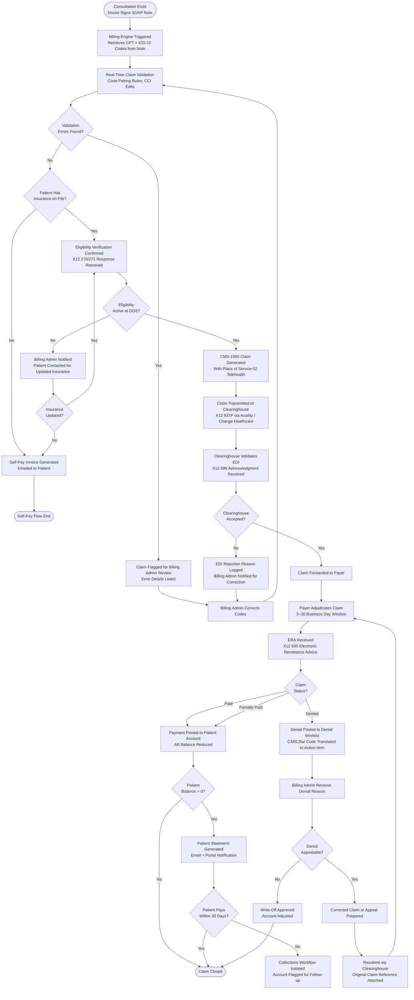

# Activity Diagrams — Telemedicine Platform

## Overview

This document contains activity flow diagrams for the three most critical end-to-end processes in the Telemedicine Platform: the patient consultation lifecycle, the e-prescription workflow, and the insurance claim flow. Each diagram uses Mermaid flowchart syntax and is annotated with system responsibilities, decision points, and compliance checkpoints.

---

## Patient Consultation Flow

This flow covers the patient journey from provider search through post-consultation follow-up. Compliance checkpoints (HIPAA, state licensure, eligibility verification) are embedded at the appropriate decision points.

```mermaid
flowchart TD
    A([Patient Opens Platform]) --> B[Search Providers by Specialty / Insurance / Language]
    B --> C[System Queries Provider Availability]
    C --> D{Provider Available\nin Patient's State?}
    D -- No --> E[Show Out-of-State Warning\nFilter to Licensed Providers]
    E --> B
    D -- Yes --> F[Select Provider and Time Slot]
    F --> G{Appointment > 15 min\nfrom Now?}
    G -- No --> H[Show Booking Error:\nMinimum 15-minute Advance Notice]
    H --> F
    G -- Yes --> I[Insurance Eligibility Check\nX12 270 Request]
    I --> J{Eligibility\nConfirmed?}
    J -- No --> K[Notify Patient: Update Insurance\nor Proceed as Self-Pay]
    K --> L{Patient Chooses\nSelf-Pay?}
    L -- No --> M[Booking Paused — Insurance Update Required]
    L -- Yes --> N[Booking Confirmed as Self-Pay]
    J -- Yes --> N
    N --> O[Send Confirmation Email + SMS]
    O --> P[Patient Receives Intake Form Link\n24 Hours Before Appointment]
    P --> Q[Patient Completes Intake Forms\nMedications, Allergies, Chief Complaint]
    Q --> R{All Required\nFields Complete?}
    R -- No --> S[Auto-Save Partial Form\nReminder Sent 1 Hour Before Appointment]
    R -- Yes --> T[Intake Submitted — Doctor Notified]
    S --> T
    T --> U[Pre-Visit Reminder Sent\n1 Hour Before Appointment]
    U --> V[Join Now Button Activates\n5 Minutes Before Appointment]
    V --> W[Platform Runs Pre-Flight Check\nCamera, Mic, Bandwidth, Browser]
    W --> X{Pre-Flight\nPassed?}
    X -- No --> Y[Show Troubleshooting Guide\nOffer Audio-Only Fallback]
    Y --> Z{Patient Accepts\nAudio-Only?}
    Z -- No --> AA[Appointment Rescheduled\nPatient Notified]
    Z -- Yes --> AB[Enter Audio-Only Waiting Room]
    X -- Yes --> AB
    AB --> AC[Patient Waits in Virtual Waiting Room]
    AC --> AD[Doctor Joins and Reviews Intake]
    AD --> AE[Doctor Admits Patient to Consultation]
    AE --> AF[Video / Audio Session Established\nDTLS-SRTP Encrypted]
    AF --> AG[Nurse Performs Triage if Applicable\nVitals Recorded]
    AG --> AH[Doctor Conducts Clinical Assessment]
    AH --> AI{Emergency\nCondition Detected?}
    AI -- Yes --> AJ[Emergency Escalation Workflow\nSee Emergency Flow]
    AI -- No --> AK[Doctor Completes SOAP Note\nICD-10 Diagnosis Coded]
    AK --> AL{Prescription\nRequired?}
    AL -- Yes --> AM[e-Prescription Workflow\nSee Prescription Flow]
    AL -- No --> AN{Lab Tests\nRequired?}
    AM --> AN
    AN -- Yes --> AO[Doctor Creates Lab Order\nLOINC-Coded Tests Selected]
    AO --> AP[Order Transmitted to Lab\nFHIR R4 ServiceRequest]
    AN -- No --> AQ[Doctor Signs SOAP Note\nCryptographic Signature Applied]
    AP --> AQ
    AQ --> AR{Note Signed\nWithin Session?}
    AR -- No --> AS[Unsigned Note Reminder Queued\n8h / 16h / 23h Alerts]
    AR -- Yes --> AT[Consultation Record Finalized]
    AS --> AT
    AT --> AU[Consultation Summary Generated\nVisible in Patient Portal Within 1 Hour]
    AU --> AV[Post-Visit Survey Sent to Patient]
    AV --> AW[Insurance Billing Workflow\nSee Claim Flow]
    AW --> AX[Follow-up Appointment Offered\nif Recommended in SOAP Plan]
    AX --> AY([Consultation Complete])
```

---

## E-Prescription Workflow

This flow covers the prescription lifecycle from clinician authoring through pharmacy dispensing, including DEA EPCS compliance, PDMP querying, and drug interaction checking.

```mermaid
flowchart TD
    A([Doctor Initiates Prescription\nDuring or After Consultation]) --> B[Open Prescription Form\nPre-populated with Patient Allergies + Medications]
    B --> C[Doctor Searches Medication by Name / NDC]
    C --> D[System Runs Real-Time DDI Check\nAgainst Active Medications]
    D --> E{Drug Interaction\nSeverity?}
    E -- Critical --> F[Block Submission\nDisplay Contraindication Alert\nAlternative Medications Suggested]
    F --> C
    E -- Moderate --> G[Display Override Dialog\nDoctor Must Enter Clinical Reason]
    G --> H{Doctor Accepts\nOverride?}
    H -- No --> C
    H -- Yes --> I[Interaction Override Logged\nwith Reason and Clinician Identity]
    E -- None / Minimal --> I
    I --> J[Doctor Specifies Dose, Route, Frequency, Quantity, Refills]
    J --> K{Controlled\nSubstance Schedule II–V?}
    K -- No --> L[Route to Standard e-Prescribing\nNCPDP SCRIPT]
    K -- Yes --> M[EPCS Workflow Initiated]
    M --> N[System Queries State PDMP\nAppriss NarxCare API]
    N --> O[PDMP Report Displayed to Doctor\nCurrent State + NarxScore]
    O --> P{PDMP Query\nSucceeded?}
    P -- No --> Q[PDMP Failure Alert\nDoctor Must Attest Manual Review\nor Defer Prescription]
    Q --> R{Doctor Attests\nManual Review?}
    R -- No --> S[Prescription Deferred\nSchedule Follow-up]
    R -- Yes --> T[Attestation Logged with Timestamp]
    P -- Yes --> T
    T --> U[EPCS Two-Factor Authentication Required\nKnowledge Factor + Hard Token / Biometric]
    U --> V{2FA\nVerified?}
    V -- No --> W[Authentication Failure Logged\nMax 3 Attempts Then Lock]
    W --> X{Lock\nTriggered?}
    X -- Yes --> Y[Clinician Account Locked\nSecurity Alert to Admin]
    X -- No --> U
    V -- Yes --> L
    L --> Z[Prescription Transmitted to Surescripts\nNCPDP SCRIPT v2017071]
    Z --> AA{Transmission\nSucceeded?}
    AA -- No --> AB[Retry Queue — 3 Attempts at 30s Intervals]
    AB --> AC{All Retries\nFailed?}
    AC -- Yes --> AD[Doctor Notified of Transmission Failure\nOffer Paper Rx Fallback]
    AC -- No --> AA
    AA -- Yes --> AE[Pharmacy Receives Prescription]
    AE --> AF[Patient Notified: Rx Sent to Pharmacy\nIn-App + SMS with Pharmacy Name]
    AF --> AG{Pharmacy Sends\nFill Confirmation?}
    AG -- No --> AH[Pharmacist Clarification Request Routed to Doctor]
    AG -- Yes --> AI[Patient Notified: Rx Ready for Pickup]
    AI --> AJ([Prescription Dispensed])
```

---

## Insurance Claim Submission Flow

This flow covers the billing lifecycle from consultation end through payment posting, including eligibility confirmation, claim generation, clearinghouse submission, and denial management.

---

## Diagram Notes

**Emergency Escalation Cross-Reference**: The Emergency Escalation branch in the Patient Consultation Flow is fully detailed in `edge-cases/emergency-escalation.md`.

**PDMP Failure Handling**: The PDMP failure branch in the E-Prescription flow is subject to BR-002 (Business Rules). A clinician who attests manual PDMP review without a successful query result is creating a compliance record that is flagged for quality assurance review within 48 hours.

**Place of Service Code**: All telehealth claims submitted to Medicare and Medicaid must use Place of Service (POS) code 02 (Telehealth Provided Other than in Patient's Home) or POS 10 (Telehealth Provided in Patient's Home), depending on the Medicare Physician Fee Schedule rules current at the time of service. The billing module maintains this mapping table and updates it with each CMS annual physician fee schedule release.
