# BPMN Swimlane Diagram — Telemedicine Platform

## Overview

This document contains BPMN-style swimlane diagrams for the most complex cross-functional workflows in the Telemedicine Platform. Each swimlane represents a distinct actor or system boundary, making compliance responsibilities and handoff points explicit. The primary diagram covers the end-to-end e-prescription process from the moment a clinician decides to prescribe through pharmacy dispensing.

---

## E-Prescription Process: Consultation to Pharmacy Dispensing

The e-prescription process spans four lanes: Patient, Doctor, Platform, and Pharmacy. Controlled substance prescriptions (DEA Schedule II–V) follow the EPCS branch, which introduces additional DEA-compliance steps. Non-controlled prescriptions follow the standard path.

```mermaid
flowchart LR
    subgraph Patient["🧑 Patient"]
        direction TB
        P1([Consultation in Progress])
        P2[Confirm Preferred Pharmacy\nor Select New Pharmacy]
        P3[Receive Rx Notification\nIn-App + SMS]
        P4{Pharmacy\nAcceptable?}
        P5[Request Pharmacy Change\nvia Portal]
        P6[Pick Up Medication\nor Home Delivery]
    end

    subgraph Doctor["👨‍⚕️ Doctor"]
        direction TB
        D1[Clinical Decision:\nPrescription Required]
        D2[Open Prescription Form\nMedication Search + Dosing]
        D3{Controlled\nSubstance?}
        D4[Standard Rx Path\nNo EPCS Required]
        D5[Initiate EPCS Workflow\nDEA Schedule II–V]
        D6[Review PDMP Report\nNarxScore + History]
        D7{Clinical\nJustification Clear?}
        D8[Document Clinical Rationale\nFor Controlled Substance]
        D9[Complete EPCS\n2FA Authentication]
        D10[Review DDI Alert\nif Present]
        D11{Override or\nModify Rx?}
        D12[Enter Override Reason\nIn Mandatory Field]
        D13[Submit Prescription]
        D14[Review Pharmacy\nClarification Request]
        D15[Respond to Clarification\nor Modify Rx]
    end

    subgraph Platform["⚙️ Platform"]
        direction TB
        PL1[Load Patient Meds + Allergies\ninto Rx Form Context]
        PL2[Execute Real-Time\nDDI + Allergy Check]
        PL3{DDI Severity?}
        PL4[Block Submission\nCritical Interaction Alert]
        PL5[Moderate Interaction\nOverride Dialog Shown]
        PL6[Log Override with\nClinician ID + Reason]
        PL7[Query State PDMP\nAppriss NarxCare API]
        PL8{PDMP\nQuery OK?}
        PL9[Log PDMP Failure\nRequire Attestation]
        PL10[Verify DEA Registration\nActive + State-Valid]
        PL11{DEA Valid\nfor Patient State?}
        PL12[Block EPCS\nDEA Error Alert to Doctor]
        PL13[Transmit Rx to Surescripts\nNCPDP SCRIPT v2017071]
        PL14{Surescripts\nACK Received?}
        PL15[Retry Queue\n3 × 30-second Intervals]
        PL16{All Retries\nFailed?}
        PL17[Notify Doctor of\nTransmission Failure]
        PL18[Offer Paper Rx Fallback\nFax or Print]
        PL19[Notify Patient:\nRx Transmitted]
        PL20[Log Prescription Record\nWith Audit Trail]
        PL21[Route Clarification\nRequest to Doctor]
        PL22[Store Fill Confirmation\nLink to Consultation Record]
    end

    subgraph Pharmacy["💊 Pharmacy"]
        direction TB
        PH1[Receive Prescription\nvia Surescripts]
        PH2[Verify Patient Identity\nName, DOB, Address]
        PH3{Insurance\nCoverage Check}
        PH4[Process Insurance\nAdjudication]
        PH5[Patient Pays Copay\nCash Price if Uninsured]
        PH6{Drug In\nStock?}
        PH7[Order Drug\nfrom Wholesaler]
        PH8[Dispense Medication\nLabel with Instructions]
        PH9[Send Fill Confirmation\nvia Surescripts]
        PH10[Send Clarification\nRequest if Needed]
        PH11[Home Delivery\nif Selected]
    end

    %% Cross-lane connections
    P1 --> D1
    D1 --> P2
    P2 --> PL1
    PL1 --> D2
    D2 --> PL2
    PL2 --> PL3
    PL3 -- Critical --> PL4
    PL4 --> D10
    PL3 -- Moderate --> PL5
    PL5 --> D10
    D10 --> D11
    D11 -- Override --> D12
    D12 --> PL6
    D11 -- Modify --> D2
    PL6 --> D3
    PL3 -- None --> D3
    D3 -- No --> D4
    D3 -- Yes --> D5
    D5 --> PL7
    PL7 --> PL8
    PL8 -- Fail --> PL9
    PL9 --> D6
    PL8 -- OK --> D6
    D6 --> D7
    D7 -- No --> D8
    D8 --> PL10
    D7 -- Yes --> PL10
    PL10 --> PL11
    PL11 -- Invalid --> PL12
    PL12 --> D14
    PL11 -- Valid --> D9
    D9 --> D13
    D4 --> D13
    D13 --> PL13
    PL13 --> PL14
    PL14 -- No ACK --> PL15
    PL15 --> PL16
    PL16 -- Yes --> PL17
    PL17 --> PL18
    PL18 --> D14
    PL16 -- No --> PL13
    PL14 -- ACK OK --> PL19
    PL19 --> P3
    PL19 --> PL20
    PL20 --> PH1
    PH1 --> PH2
    PH2 --> PH3
    PH3 -- Covered --> PH4
    PH4 --> PH5
    PH3 -- Not Covered --> PH5
    PH5 --> PH6
    PH6 -- No --> PH7
    PH7 --> PH6
    PH6 -- Yes --> PH8
    PH8 --> PH9
    PH9 --> PL22
    PL22 --> P4
    P4 -- Yes --> P6
    P4 -- No --> P5
    P5 --> PL21
    PL21 --> D14
    D14 --> D15
    D15 --> PL13
    PH10 --> PL21
    P6 --> PH11
```

---

## Lane Responsibilities

### Patient Lane
The patient initiates the prescription need implicitly by presenting their condition. Their active responsibilities during the prescription process are limited to confirming their preferred pharmacy and ultimately receiving the medication. If the patient disagrees with the pharmacy choice or the pharmacy sends a clarification, the patient can initiate a change request through the portal, which re-enters the platform routing logic.

### Doctor Lane
The clinician bears primary responsibility for the prescription decision, clinical justification, PDMP review, drug interaction review, and EPCS authentication for controlled substances. All override decisions are logged permanently against the clinician's DEA number and NPI. The doctor is the only actor who can resolve pharmacy clarification requests; the platform routes these back immediately.

### Platform Lane
The platform enforces all regulatory and safety controls programmatically: DDI checking, allergy checking, PDMP integration, DEA registration verification, Surescripts transmission with retry logic, patient notification, and audit logging. The platform is the system of record for all prescription events. No prescription reaches a pharmacy without passing through all platform validation steps.

### Pharmacy Lane
The pharmacy receives the prescription from Surescripts, verifies patient identity, adjudicates insurance, dispenses the medication, and sends a fill confirmation. The pharmacy may send clarification requests back to the prescribing clinician through Surescripts. The platform routes these requests to the doctor and tracks resolution.

---

## Decision Points and Compliance Obligations

| Decision Point | Business Rule | Compliance Requirement |
|---|---|---|
| Controlled Substance? | BR-002: DEA registration required | 21 CFR Part 1311 EPCS |
| PDMP Query Required | BR-002: PDMP mandatory for CII–CV | State PDMP mandates (47 states) |
| DEA Valid for Patient State | BR-003: License in patient's state | DEA Practitioner Registration |
| DDI Critical Blocker | BR-005 analog: Patient safety | FDA drug labeling, CPOE standards |
| EPCS 2FA Authentication | BR-002: Two-factor identity proofing | 21 CFR 1311.105 identity verification |
| Transmission Failure Handling | BR-008 analog: Timely care delivery | NCPDP SCRIPT error handling spec |

---

## Audit Trail Events Generated

Every transition across lane boundaries generates a structured audit log event stored in the platform's append-only audit store. The following events are captured for every prescription:

| Event | Trigger | PHI Captured |
|---|---|---|
| `PrescriptionFormOpened` | Doctor opens form | Patient ID, Clinician ID, Consultation ID |
| `DDICheckCompleted` | Platform completes DDI check | Medications checked, severity, result |
| `DDIOverrideRecorded` | Doctor overrides interaction | Override reason, clinician attestation |
| `PDMPQueried` | Platform queries PDMP | Query timestamp, NarxScore, clinician ID |
| `EPCSAuthenticated` | 2FA passes | Clinician DEA, authentication method |
| `PrescriptionSubmitted` | Doctor submits | Medication, dose, quantity, pharmacy |
| `SurescriptsACKReceived` | Pharmacy ACK | Message ID, pharmacy NPI, timestamp |
| `PrescriptionFillConfirmed` | Pharmacy fills | Fill date, pharmacy, quantity dispensed |
