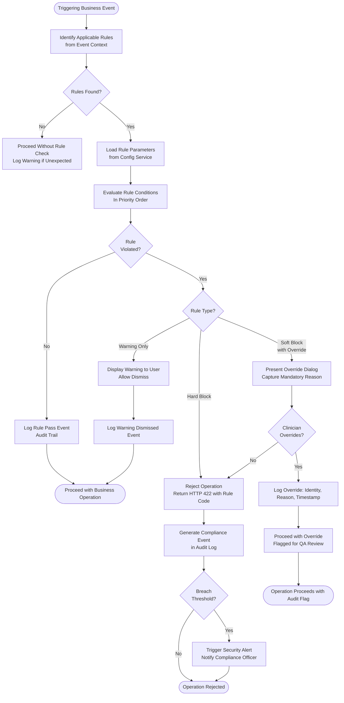

# Business Rules — Telemedicine Platform

## Enforceable Rules

Business rules in the Telemedicine Platform are enforced programmatically at the application layer and are subject to no override without an explicit documented exception process. Each rule is identified by a stable code (BR-NNN), tied to one or more regulatory obligations, and mapped to the service(s) responsible for enforcement.

---

**BR-001 — HIPAA Minimum Necessary Standard for PHI Access**

- **Statement**: Any access to Protected Health Information (PHI) must be limited to the minimum data elements necessary to accomplish the intended purpose. Users must not access PHI beyond the scope of their current clinical or operational task.
- **Regulatory Basis**: HIPAA Privacy Rule, 45 CFR § 164.502(b) — Minimum Necessary Standard.
- **Enforcement**: RBAC policies are enforced at the API Gateway and within each microservice. Role definitions specify allowed resources and data fields. Requests for PHI fields not permitted by the caller's role return HTTP 403. Audit events are generated for every PHI access attempt, regardless of outcome.
- **Affected Services**: All services with PHI data access (EHRService, PatientPortalService, BillingService, PrescriptionService).
- **Violation Consequence**: Unauthorized access triggers a security alert. If the access constitutes a breach of unsecured PHI, the HIPAA Breach Notification Workflow (see `edge-cases/patient-data-privacy.md`) is initiated.

---

**BR-002 — Controlled Substance Prescriptions Require DEA Registration Verification**

- **Statement**: A clinician may not electronically prescribe a DEA Schedule II, III, IV, or V controlled substance unless their DEA registration is (a) active, (b) not expired, (c) valid for the patient's state of residence, and (d) verified against the DEA Diversion Control Division registry within the last 24 hours. Electronic Prescribing for Controlled Substances (EPCS) additionally requires two-factor authentication per 21 CFR Part 1311.
- **Regulatory Basis**: Controlled Substances Act, 21 USC § 829; DEA EPCS Rule, 21 CFR Part 1311; State PDMP mandates.
- **Enforcement**: PrescriptionService checks the clinician's DEA number against the cached DEA registry record at prescription form open time. If the cache is stale (>24h), a live verification query is made. EPCS 2FA is enforced by the PrescriptionService before the prescription is transmitted to Surescripts. A state PDMP query is mandatory and must succeed or be attested before controlled substance submission is allowed.
- **Affected Services**: PrescriptionService.
- **Violation Consequence**: Prescription submission is hard-blocked. The block cannot be overridden by any application user. A compliance event is logged.

---

**BR-003 — Doctor Must Be Licensed in Patient's State of Residence**

- **Statement**: A clinician may only conduct a telehealth consultation with a patient whose state of residence matches at least one state in which the clinician holds an active, non-expired medical license. The license must be valid as of the appointment date, not merely the booking date.
- **Regulatory Basis**: Medical Practice Act of each state; Interstate Medical Licensure Compact (IMLC) for participating states.
- **Enforcement**: SchedulingService validates licensure at booking time using the provider's `telehealth_states` field and the patient's `state_code`. A second validation is performed at the time the doctor clicks "Start Consultation" to catch license expirations between booking and visit. The FSMB DataLink API is queried nightly to refresh license status.
- **Affected Services**: SchedulingService, ConsultationService.
- **Violation Consequence**: Booking is rejected with a user-readable message identifying the licensure gap. If the license expires after booking but before the consultation, the appointment is placed in a "requires reassignment" status and the patient is offered rebooking with a licensed provider.

---

**BR-004 — Appointment Cannot Be Booked Less Than 15 Minutes in Advance**

- **Statement**: The earliest permissible appointment start time is 15 minutes after the booking transaction timestamp. Bookings with a start time less than 15 minutes in the future are rejected.
- **Regulatory Basis**: Operational policy. Supports intake form completion, eligibility verification, and reminder dispatch.
- **Enforcement**: SchedulingService computes `appointment.scheduled_start - NOW()` at the moment of booking. If the result is less than 15 minutes, the booking is rejected with HTTP 422 and a descriptive error message.
- **Affected Services**: SchedulingService.
- **Exception**: Urgent care on-demand consultations are exempt from the 15-minute rule but follow a separate on-demand queue workflow that does not require advance scheduling.
- **Violation Consequence**: Booking is rejected. No exception permitted for standard appointment types.

---

**BR-005 — Emergency Symptoms Trigger Mandatory Escalation Workflow**

- **Statement**: When a clinician identifies any of the following conditions during a consultation, the Emergency Escalation Workflow must be initiated and cannot be dismissed without a documented clinical decision: chest pain with diaphoresis, altered mental status, stroke symptoms (FAST criteria), respiratory distress with SpO2 < 90%, anaphylaxis, active seizure, or any suicidal ideation with intent and means.
- **Regulatory Basis**: Clinical standard of care; state medical board regulations on emergency duties; 45 CFR § 164.512(j) — HIPAA emergency exception for PHI disclosure.
- **Enforcement**: The ConsultationService presents a mandatory triage checklist with checkboxes for emergency symptoms before the consultation progresses past the intake phase. If any emergency box is checked, the Emergency Escalation modal opens automatically and cannot be closed without either initiating dispatch or documenting a clinical reason for deferring escalation.
- **Affected Services**: ConsultationService, NotificationService, EmergencyEscalationService.
- **Violation Consequence**: A consultation that proceeds past a documented emergency symptom without initiating escalation generates a quality assurance event reviewed by the clinical director within 4 hours.

---

**BR-006 — Mental Health Notes Require Separate Consent for Disclosure**

- **Statement**: Consultation notes for mental health visits (appointment_type = mental_health or psychotherapy diagnoses F20–F99 in the ICD-10 Assessment) are stored in a 42 CFR Part 2–compliant separate partition. These notes must not be disclosed to third parties, including other treating providers, without explicit patient written consent for each disclosure.
- **Regulatory Basis**: 42 CFR Part 2 — Confidentiality of Substance Use Disorder Patient Records; HIPAA Privacy Rule §164.508 — Authorization.
- **Enforcement**: EHRService routes mental health notes to the `mental_health_records` table which carries a separate access policy. FHIR R4 bulk export and EHR synchronization jobs exclude mental health partition records by default. A separate consent record is required and validated before any disclosure API call is fulfilled.
- **Affected Services**: EHRService, PatientPortalService, BillingService (billing codes for mental health visits use separate claim pathway with fewer diagnosis codes transmitted per parity law).
- **Violation Consequence**: Unauthorized disclosure of 42 CFR Part 2–protected records is a federal violation subject to criminal penalties. The platform treats any such disclosure as a critical security incident.

---

**BR-007 — Insurance Eligibility Must Be Verified Before Consultation Begins**

- **Statement**: For any appointment where the patient has insurance on file, an X12 270 eligibility inquiry must be submitted and a valid X12 271 response received before the consultation session becomes joinable. If eligibility is unverified, the consultation cannot start.
- **Regulatory Basis**: CMS claim accuracy requirements; payer contractual requirements.
- **Enforcement**: SchedulingService triggers an eligibility check 24 hours before the appointment. BillingService re-checks at appointment start time. If eligibility status is `failed` or `pending` at the time the doctor clicks "Admit Patient", the platform presents a mandatory billing admin notification and the consultation can only proceed after an admin marks the appointment as either "verified" or "self-pay override."
- **Affected Services**: SchedulingService, BillingService.
- **Exception**: Self-pay patients with no insurance on file are exempt from eligibility verification. Emergency consultations that convert to an unscheduled urgent visit may proceed with a retroactive eligibility check.
- **Violation Consequence**: Proceeding without eligibility verification risks claim denial and potential CMS fraud exposure. All eligibility override actions are logged for the compliance officer.

---

**BR-008 — Consultation Notes Must Be Signed Within 24 Hours of Visit**

- **Statement**: The attending clinician must apply a digital signature to the consultation SOAP note within 24 hours of the consultation's `actual_end` timestamp. Notes not signed within this window are considered deficient medical records.
- **Regulatory Basis**: State medical board record-keeping regulations (most require timely documentation); Joint Commission standards (applicable to participating facilities); HIPAA minimum data quality standards.
- **Enforcement**: EHRService queues a signing reminder job when a consultation ends. Reminders are dispatched at 8 hours, 16 hours, and 23 hours past `actual_end`. At the 24-hour mark, if the note remains unsigned, the case is flagged in the HIM (Health Information Management) deficiency queue for the clinical director to follow up.
- **Affected Services**: EHRService, NotificationService.
- **Exception**: A clinician may request a single 24-hour extension through the deficiency queue, approved by the clinical director. The extension is logged.
- **Violation Consequence**: Unsigned notes block insurance claim submission (BillingService checks `soap_note_status = signed` before generating claims). After 72 hours, the compliance officer is notified.

---

## Rule Evaluation Pipeline

---

## Exception and Override Handling

Exceptions to business rules are tightly controlled to prevent regulatory exposure. The following table describes the full exception governance for each rule.

| Rule | Override Permitted | Override Authority | Override Logged | QA Review |
|---|---|---|---|---|
| BR-001 PHI Minimum Necessary | No | N/A | Always | Compliance Officer within 24h |
| BR-002 DEA / EPCS | No | N/A | Always | Compliance Officer immediately |
| BR-003 State Licensure | No | N/A | Always | Compliance Officer within 1h |
| BR-004 15-Minute Advance Booking | Yes (urgent care only) | Scheduler System (automated) | System event | None |
| BR-005 Emergency Escalation | Yes (with documented clinical deferral) | Attending Clinician | Yes, with reason | Clinical Director within 4h |
| BR-006 Mental Health Disclosure | Yes (with patient written consent) | Patient + Platform Admin | Yes, consent ID | Compliance Officer quarterly review |
| BR-007 Eligibility Verification | Yes (self-pay override) | Billing Administrator | Yes, with reason | Compliance Officer weekly review |
| BR-008 Note Signing 24h | Yes (24h extension) | Clinical Director | Yes | HIM Deficiency Queue |

### Override Audit Schema

Every override generates an `override_event` record in the audit log with the following fields:
- `override_id`: UUID
- `rule_code`: The BR-NNN identifier
- `triggered_by`: UUID of the user who encountered the rule violation
- `overridden_by`: UUID of the user who authorized the override
- `override_reason`: Free text, mandatory
- `override_timestamp`: UTC timestamptz
- `related_entity_type`: e.g., consultation, prescription, appointment
- `related_entity_id`: UUID of the relevant record

All override events are immutable once written. Retroactive modification of override records is technically prevented by the append-only audit log design.

### Annual Rule Review

All business rules undergo an annual review by the Compliance Officer, Clinical Director, and CTO. Rule changes that affect clinical workflows require sign-off by the Medical Director. Rule changes that affect HIPAA or DEA compliance require external legal counsel review before deployment.

## Enforced Rule Summary

1. HIPAA minimum necessary standard enforced: PHI access logged and limited to treating clinician's active patients.
2. Controlled substance prescriptions require verified DEA registration; Schedule II requires additional patient attestation.
3. Clinician must hold an active medical licence in the patient's state of residence at time of consultation.
4. Appointments cannot be booked less than 15 minutes in advance; same-day slots require instant eligibility verification.
5. Symptoms flagged as emergency indicators trigger mandatory escalation workflow; clinician cannot dismiss without override reason.
6. Mental health session notes require separate patient consent before sharing with other providers.
7. Insurance eligibility must be verified before consultation begins; unverified patients are offered self-pay option.
8. Consultation SOAP notes must be signed by the clinician within 24 hours of visit completion.
