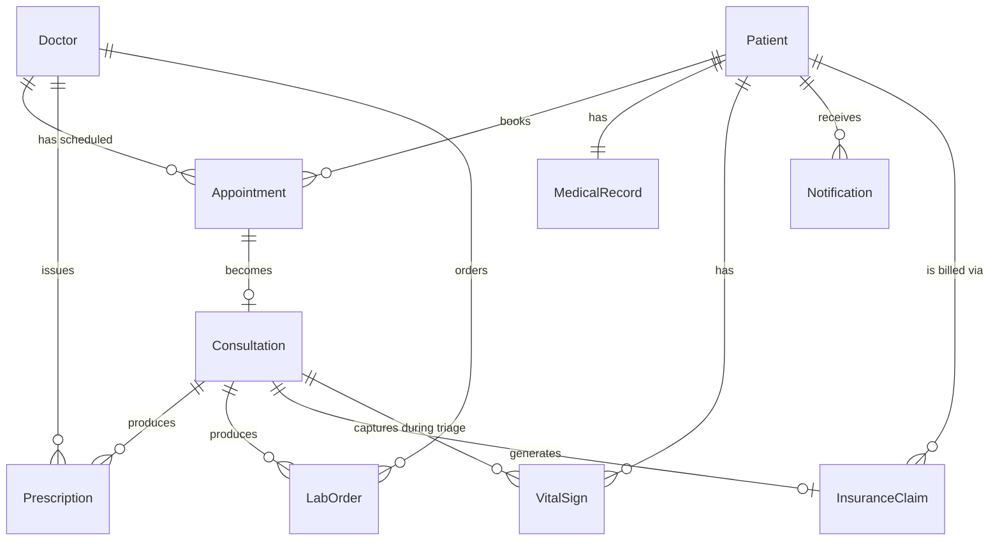

# Data Dictionary — Telemedicine Platform

## Core Entities

### Patient

Represents an individual who receives clinical services through the platform. Every Patient record is classified as Protected Health Information (PHI) and must be stored with AES-256 encryption at rest. Access is governed by RBAC with the minimum necessary standard enforced at the application layer.

| Field | Type | Constraints | Description |
|---|---|---|---|
| patient_id | UUID | PK, NOT NULL, IMMUTABLE | Surrogate primary key. Generated at registration. Never reused. |
| mrn | VARCHAR(20) | UNIQUE, NOT NULL | Medical Record Number. Zero-padded numeric string assigned at first consultation. Used for cross-system identification. |
| first_name | VARCHAR(100) | NOT NULL, ENCRYPTED | Legal first name as it appears on government ID. PHI — encrypted at rest. |
| last_name | VARCHAR(100) | NOT NULL, ENCRYPTED | Legal last name. PHI — encrypted at rest. |
| date_of_birth | DATE | NOT NULL, ENCRYPTED | ISO 8601 date. PHI. Used for identity verification, age-based clinical rules, and prescription labeling. |
| sex_at_birth | CHAR(1) | NOT NULL, CHECK(M/F/U) | Biological sex. Used for clinical reference ranges. Distinct from gender identity. |
| gender_identity | VARCHAR(50) | NULLABLE | Self-reported gender identity. Supports preferred pronoun rules in notification templates. |
| ssn_last4 | CHAR(4) | NULLABLE, ENCRYPTED | Last 4 digits of Social Security Number. Used for insurance eligibility matching. Never stored in full. |
| email | VARCHAR(255) | NOT NULL, UNIQUE, ENCRYPTED | Primary contact email. Used for appointment confirmations, result notifications, billing statements. |
| mobile_phone | VARCHAR(20) | NOT NULL, ENCRYPTED | Mobile number in E.164 format. Used for SMS notifications and 2FA. |
| address_line1 | VARCHAR(200) | NOT NULL, ENCRYPTED | Street address. PHI. Used for emergency dispatch and state licensure validation. |
| address_line2 | VARCHAR(200) | NULLABLE, ENCRYPTED | Apartment / suite / unit. |
| city | VARCHAR(100) | NOT NULL, ENCRYPTED | City of residence. |
| state_code | CHAR(2) | NOT NULL | ISO 3166-2 US state abbreviation. Used to enforce state telehealth licensure rules. Not encrypted — used in queries. |
| zip_code | VARCHAR(10) | NOT NULL | 5 or 9-digit ZIP code. Used for geo-routing and state PDMP queries. |
| preferred_language | VARCHAR(10) | DEFAULT 'en', NOT NULL | BCP-47 language tag. Drives consent language selection and notification templates. |
| mfa_enabled | BOOLEAN | NOT NULL, DEFAULT FALSE | Whether the patient has enrolled in Multi-Factor Authentication. |
| account_status | VARCHAR(20) | NOT NULL, DEFAULT 'active' | Enum: active, suspended, deactivated. Suspended patients cannot book appointments. |
| created_at | TIMESTAMPTZ | NOT NULL, DEFAULT NOW() | Account creation timestamp. UTC. |
| updated_at | TIMESTAMPTZ | NOT NULL | Last modification timestamp. Maintained by application trigger. |
| deleted_at | TIMESTAMPTZ | NULLABLE | Soft-delete timestamp. Records are never hard-deleted due to HIPAA retention obligations. |

---

### Doctor

Represents a licensed clinical provider. Includes credentialing metadata required for state licensure enforcement and DEA compliance. Provider records undergo verification against NPPES and FSMB DataLink before activation.

| Field | Type | Constraints | Description |
|---|---|---|---|
| doctor_id | UUID | PK, NOT NULL, IMMUTABLE | Surrogate primary key. |
| npi | CHAR(10) | UNIQUE, NOT NULL | National Provider Identifier. 10-digit number from NPPES. Validated at onboarding and re-verified monthly. |
| dea_number | VARCHAR(9) | NULLABLE, ENCRYPTED | DEA Registration Number (format: AA1234567). Required for controlled substance prescribing. |
| first_name | VARCHAR(100) | NOT NULL | Provider first name. |
| last_name | VARCHAR(100) | NOT NULL | Provider last name. |
| credentials | VARCHAR(50) | NOT NULL | e.g., MD, DO, NP, PA. Used in SOAP note signatures and patient-facing display. |
| specialty | VARCHAR(100) | NOT NULL | Primary clinical specialty (NUCC taxonomy). Used for patient provider search. |
| board_certifications | JSONB | NULLABLE | Array of certification objects: {board, specialty, expiration_date}. |
| active_licenses | JSONB | NOT NULL | Array of state license objects: {state_code, license_number, expiration_date, status}. Queried at appointment booking. |
| profile_photo_url | VARCHAR(500) | NULLABLE | S3 pre-signed URL reference. Not PHI. |
| bio | TEXT | NULLABLE | Provider biography displayed to patients during search. |
| accepting_new_patients | BOOLEAN | NOT NULL, DEFAULT TRUE | Flag to suppress the provider from new-patient search results. |
| telehealth_states | CHAR(2)[] | NOT NULL | Array of state codes in which the provider actively sees telehealth patients. Subset of active_licenses states. |
| account_status | VARCHAR(20) | NOT NULL, DEFAULT 'pending' | Enum: pending, active, suspended, terminated. |
| onboarded_at | TIMESTAMPTZ | NULLABLE | Timestamp when compliance officer approved activation. |
| created_at | TIMESTAMPTZ | NOT NULL, DEFAULT NOW() | Record creation timestamp. |
| updated_at | TIMESTAMPTZ | NOT NULL | Last modification timestamp. |

---

### Appointment

Represents a scheduled time slot between a Patient and a Doctor. Appointment records are the booking contracts that govern schedule management, eligibility verification, and reminder dispatch.

| Field | Type | Constraints | Description |
|---|---|---|---|
| appointment_id | UUID | PK, NOT NULL, IMMUTABLE | Surrogate primary key. |
| patient_id | UUID | FK → patients, NOT NULL | The patient for whom the appointment is booked. |
| doctor_id | UUID | FK → doctors, NOT NULL | The provider scheduled for this appointment. |
| scheduled_start | TIMESTAMPTZ | NOT NULL | Appointment start time in UTC. Must be ≥ 15 minutes from booking time. |
| scheduled_end | TIMESTAMPTZ | NOT NULL | Expected end time. Computed as start + appointment_type_duration_minutes. |
| appointment_type | VARCHAR(50) | NOT NULL | Enum: initial_visit, follow_up, urgent_care, mental_health, annual_wellness. Drives intake form selection and billing CPT code defaults. |
| visit_reason | TEXT | NOT NULL, ENCRYPTED | Chief complaint as entered by the patient at booking. PHI. |
| status | VARCHAR(30) | NOT NULL, DEFAULT 'scheduled' | Lifecycle state. See state machine in detailed-design/state-machine-diagram.md. |
| eligibility_status | VARCHAR(20) | DEFAULT 'pending' | Result of X12 270/271 check. Enum: pending, verified, failed, self_pay. |
| eligibility_checked_at | TIMESTAMPTZ | NULLABLE | Timestamp of the last eligibility verification attempt. |
| intake_form_submitted | BOOLEAN | NOT NULL, DEFAULT FALSE | Set to TRUE when the patient submits their pre-visit intake form. |
| reminder_sent_24h | BOOLEAN | NOT NULL, DEFAULT FALSE | Flag preventing duplicate 24-hour reminder dispatch. |
| reminder_sent_1h | BOOLEAN | NOT NULL, DEFAULT FALSE | Flag preventing duplicate 1-hour reminder dispatch. |
| cancellation_reason | TEXT | NULLABLE, ENCRYPTED | Free-text reason captured when a patient or provider cancels. PHI. |
| cancelled_by | UUID | NULLABLE, FK → users | Identity of the cancelling actor. |
| created_at | TIMESTAMPTZ | NOT NULL, DEFAULT NOW() | Booking creation timestamp. |
| updated_at | TIMESTAMPTZ | NOT NULL | Last modification timestamp. |

---

### Consultation

Represents an active or completed clinical encounter linked to an Appointment. Created when the doctor admits the patient to the video session and closed when the SOAP note is signed.

| Field | Type | Constraints | Description |
|---|---|---|---|
| consultation_id | UUID | PK, NOT NULL, IMMUTABLE | Surrogate primary key. |
| appointment_id | UUID | FK → appointments, UNIQUE, NOT NULL | The appointment this consultation fulfils. One-to-one relationship. |
| patient_id | UUID | FK → patients, NOT NULL | Denormalized for query performance and audit purposes. |
| doctor_id | UUID | FK → doctors, NOT NULL | The clinician who conducted the consultation. |
| video_session_id | VARCHAR(255) | NULLABLE | WebRTC / AWS Chime session identifier. Used to retrieve recording references. |
| recording_consent | BOOLEAN | NOT NULL, DEFAULT FALSE | Whether the patient consented to session recording. Consent captured before session start. |
| recording_s3_key | VARCHAR(500) | NULLABLE, ENCRYPTED | S3 object key for session recording. Null if recording not consented or not conducted. |
| actual_start | TIMESTAMPTZ | NULLABLE | Timestamp when media streams were established (doctor admitted patient). |
| actual_end | TIMESTAMPTZ | NULLABLE | Timestamp when session was terminated. |
| soap_note | TEXT | NULLABLE, ENCRYPTED | Full SOAP note text. PHI. Stored encrypted in database and separately indexed for search. |
| soap_note_status | VARCHAR(20) | NOT NULL, DEFAULT 'draft' | Enum: draft, signed. |
| signed_at | TIMESTAMPTZ | NULLABLE | Timestamp when the doctor applied their cryptographic signature. |
| signature_hash | VARCHAR(64) | NULLABLE | SHA-256 hash of the signed note content for tamper detection. |
| diagnosis_codes | CHAR(8)[] | NULLABLE | Array of ICD-10-CM codes selected during the consultation. |
| procedure_codes | VARCHAR(10)[] | NULLABLE | Array of CPT codes selected for billing. |
| emergency_escalated | BOOLEAN | NOT NULL, DEFAULT FALSE | Whether an emergency escalation was triggered during this consultation. |
| status | VARCHAR(30) | NOT NULL, DEFAULT 'in_progress' | Enum: in_progress, completed, interrupted, emergency_escalated. |
| created_at | TIMESTAMPTZ | NOT NULL, DEFAULT NOW() | Record creation timestamp. |
| updated_at | TIMESTAMPTZ | NOT NULL | Last modification timestamp. |

---

### Prescription

Represents a single medication order issued by a clinician. Controlled substance prescriptions carry additional DEA compliance metadata.

| Field | Type | Constraints | Description |
|---|---|---|---|
| prescription_id | UUID | PK, NOT NULL, IMMUTABLE | Surrogate primary key. |
| consultation_id | UUID | FK → consultations, NOT NULL | The consultation during which this prescription was issued. |
| patient_id | UUID | FK → patients, NOT NULL | Patient receiving the prescription. |
| prescriber_id | UUID | FK → doctors, NOT NULL | Prescribing clinician. |
| medication_name | VARCHAR(255) | NOT NULL, ENCRYPTED | Drug brand name and generic equivalent. PHI. |
| ndc_code | VARCHAR(11) | NOT NULL | 11-digit National Drug Code. Used for DDI checking and pharmacy routing. |
| dose | VARCHAR(100) | NOT NULL, ENCRYPTED | Dose amount and unit (e.g., 10 mg). |
| route | VARCHAR(50) | NOT NULL | Administration route: oral, topical, inhaled, IV, IM, etc. |
| frequency | VARCHAR(100) | NOT NULL | Dosing schedule (e.g., twice daily with food). |
| quantity | INTEGER | NOT NULL, CHECK > 0 | Quantity to dispense. |
| days_supply | INTEGER | NOT NULL, CHECK > 0 | Days of therapy covered by this dispense quantity. |
| refills_authorized | INTEGER | NOT NULL, DEFAULT 0, CHECK >= 0 | Number of refills the pharmacist may dispense without contacting the provider. |
| dea_schedule | CHAR(3) | NULLABLE, CHECK(CII, CIII, CIV, CV) | DEA controlled substance schedule. NULL for non-controlled medications. |
| epcs_used | BOOLEAN | NOT NULL, DEFAULT FALSE | Whether EPCS 2FA was completed for this prescription. |
| pdmp_queried | BOOLEAN | NOT NULL, DEFAULT FALSE | Whether a PDMP query was executed before prescribing. |
| pdmp_query_id | VARCHAR(100) | NULLABLE | Appriss NarxCare transaction ID for the PDMP query. |
| pharmacy_ncpdp | VARCHAR(7) | NOT NULL | NCPDP pharmacy identifier of the dispensing pharmacy. |
| status | VARCHAR(30) | NOT NULL, DEFAULT 'draft' | Enum: draft, signed, transmitted, fill_confirmed, cancelled. |
| transmitted_at | TIMESTAMPTZ | NULLABLE | When the prescription was sent to Surescripts. |
| fill_confirmed_at | TIMESTAMPTZ | NULLABLE | When pharmacy fill confirmation was received. |
| created_at | TIMESTAMPTZ | NOT NULL, DEFAULT NOW() | Record creation timestamp. |
| updated_at | TIMESTAMPTZ | NOT NULL | Last modification timestamp. |

---

### LabOrder

Represents a laboratory test order created by a clinician and transmitted to a lab partner.

| Field | Type | Constraints | Description |
|---|---|---|---|
| lab_order_id | UUID | PK, NOT NULL, IMMUTABLE | Surrogate primary key. |
| consultation_id | UUID | FK → consultations, NOT NULL | Consultation during which the order was placed. |
| patient_id | UUID | FK → patients, NOT NULL | Patient for whom tests are ordered. |
| ordering_doctor_id | UUID | FK → doctors, NOT NULL | Ordering clinician. |
| lab_partner | VARCHAR(50) | NOT NULL, CHECK(quest, labcorp) | Which lab partner received the order. |
| fhir_service_request_id | VARCHAR(255) | NULLABLE | FHIR ServiceRequest resource ID returned by the lab partner. |
| test_panels | JSONB | NOT NULL | Array of test objects: {loinc_code, display_name, stat_priority}. |
| clinical_indication | TEXT | NULLABLE, ENCRYPTED | ICD-10 diagnosis code(s) justifying the tests. Required by most payers. PHI. |
| specimen_collection_site | VARCHAR(100) | NULLABLE | Name or address of the specimen collection facility. |
| status | VARCHAR(30) | NOT NULL, DEFAULT 'ordered' | Enum: ordered, specimen_collected, in_process, results_received, clinician_reviewed, released_to_patient, cancelled. |
| result_critical | BOOLEAN | NOT NULL, DEFAULT FALSE | Set TRUE if any result value triggers a critical-value alert. |
| result_received_at | TIMESTAMPTZ | NULLABLE | When the FHIR DiagnosticReport was received from the lab. |
| clinician_reviewed_at | TIMESTAMPTZ | NULLABLE | When the ordering clinician marked results as reviewed. |
| patient_released_at | TIMESTAMPTZ | NULLABLE | When results became visible to the patient in the portal. |
| created_at | TIMESTAMPTZ | NOT NULL, DEFAULT NOW() | Record creation timestamp. |
| updated_at | TIMESTAMPTZ | NOT NULL | Last modification timestamp. |

---

### InsuranceClaim

Represents a CMS-1500 insurance claim submitted for a consultation.

| Field | Type | Constraints | Description |
|---|---|---|---|
| claim_id | UUID | PK, NOT NULL, IMMUTABLE | Surrogate primary key. |
| consultation_id | UUID | FK → consultations, NOT NULL | Consultation this claim covers. |
| patient_id | UUID | FK → patients, NOT NULL | Patient whose insurance is billed. |
| rendering_provider_id | UUID | FK → doctors, NOT NULL | The clinician who performed the service. |
| billing_provider_npi | CHAR(10) | NOT NULL | Billing entity NPI (may be the group practice NPI). |
| payer_id | VARCHAR(50) | NOT NULL | Clearinghouse payer ID. |
| date_of_service | DATE | NOT NULL | The date the consultation was conducted. |
| place_of_service | CHAR(2) | NOT NULL, DEFAULT '02' | CMS place of service code. 02 = telehealth other than home. 10 = telehealth patient home. |
| diagnosis_codes | CHAR(8)[] | NOT NULL | ICD-10-CM codes in claim order (up to 12). |
| procedure_lines | JSONB | NOT NULL | Array: {cpt_code, modifier, units, charge_amount}. |
| total_charge | NUMERIC(10,2) | NOT NULL, CHECK > 0 | Sum of all procedure line charges. |
| status | VARCHAR(30) | NOT NULL, DEFAULT 'draft' | Enum: draft, submitted, acknowledged, adjudicated, paid, denied, appealed, written_off. |
| clearinghouse_ref | VARCHAR(100) | NULLABLE | Clearinghouse transaction control number. |
| payer_claim_number | VARCHAR(100) | NULLABLE | Payer-assigned claim identifier returned in ERA. |
| paid_amount | NUMERIC(10,2) | NULLABLE | Amount paid by the payer per ERA. |
| patient_responsibility | NUMERIC(10,2) | NULLABLE | Patient copay/coinsurance/deductible amount per ERA. |
| denial_reason_code | VARCHAR(10) | NULLABLE | CARC code if claim was denied. |
| submitted_at | TIMESTAMPTZ | NULLABLE | When the claim was transmitted to the clearinghouse. |
| adjudicated_at | TIMESTAMPTZ | NULLABLE | When the ERA was received and payment posted. |
| created_at | TIMESTAMPTZ | NOT NULL, DEFAULT NOW() | Record creation timestamp. |
| updated_at | TIMESTAMPTZ | NOT NULL | Last modification timestamp. |

---

### MedicalRecord

Represents the persistent longitudinal health record for a patient, encompassing all consultations, diagnoses, medications, allergies, and immunizations.

| Field | Type | Constraints | Description |
|---|---|---|---|
| record_id | UUID | PK, NOT NULL, IMMUTABLE | Surrogate primary key. |
| patient_id | UUID | FK → patients, UNIQUE, NOT NULL | One-to-one with Patient. Each patient has exactly one longitudinal record. |
| blood_type | VARCHAR(5) | NULLABLE | ABO/Rh blood type. |
| allergies | JSONB | NULLABLE, ENCRYPTED | Array: {allergen, reaction_type, severity, recorded_at, source}. PHI. |
| current_medications | JSONB | NULLABLE, ENCRYPTED | Array: {ndc_code, medication_name, dose, frequency, prescriber_id, start_date}. PHI. |
| problem_list | JSONB | NULLABLE, ENCRYPTED | Array: {icd10_code, description, onset_date, status: active/resolved}. PHI. |
| immunization_history | JSONB | NULLABLE, ENCRYPTED | Array: {cvx_code, vaccine_name, administered_date, lot_number, site}. PHI. |
| surgical_history | JSONB | NULLABLE, ENCRYPTED | Array: {procedure_name, cpt_code, date, performing_institution}. PHI. |
| family_history | JSONB | NULLABLE, ENCRYPTED | Array: {relationship, condition, icd10_code}. PHI. |
| mental_health_partition | BOOLEAN | NOT NULL, DEFAULT FALSE | When TRUE, consultation notes for this patient are stored in the 42 CFR Part 2–compliant separate partition. |
| last_updated_by | UUID | FK → users | Identity of the clinician who last modified this record. |
| updated_at | TIMESTAMPTZ | NOT NULL | Last modification timestamp. |

---

### VitalSign

Represents a single vital sign measurement, either entered manually by clinical staff or imported from a connected wearable or device.

| Field | Type | Constraints | Description |
|---|---|---|---|
| vital_id | UUID | PK, NOT NULL, IMMUTABLE | Surrogate primary key. |
| patient_id | UUID | FK → patients, NOT NULL | Patient this measurement belongs to. |
| consultation_id | UUID | FK → consultations, NULLABLE | Associated consultation if captured during triage. NULL for wearable passive data. |
| loinc_code | VARCHAR(20) | NOT NULL | LOINC code identifying the type of measurement (e.g., 8480-6 for systolic BP). |
| value | NUMERIC(10,4) | NOT NULL | Numeric measurement value. |
| unit | VARCHAR(20) | NOT NULL | UCUM unit code (e.g., mm[Hg], /min, kg, %, mg/dL). |
| measurement_timestamp | TIMESTAMPTZ | NOT NULL | When the measurement was taken. |
| source | VARCHAR(50) | NOT NULL | Enum: manual_entry, apple_healthkit, google_fit, bluetooth_device, ehr_import. |
| device_identifier | VARCHAR(100) | NULLABLE | Bluetooth device UUID or wearable device model for device-sourced readings. |
| is_critical | BOOLEAN | NOT NULL, DEFAULT FALSE | Set TRUE if the value exceeds the patient-specific or population-reference critical threshold. |
| reviewed_by | UUID | NULLABLE, FK → doctors | Clinician who reviewed the value. NULL until reviewed. |
| created_at | TIMESTAMPTZ | NOT NULL, DEFAULT NOW() | Record creation timestamp. |

---

### Notification

Represents a single notification dispatched to a user across any channel.

| Field | Type | Constraints | Description |
|---|---|---|---|
| notification_id | UUID | PK, NOT NULL, IMMUTABLE | Surrogate primary key. |
| recipient_id | UUID | FK → users, NOT NULL | The user (patient or clinician) who is the notification target. |
| channel | VARCHAR(20) | NOT NULL | Enum: email, sms, push, in_app. |
| template_id | VARCHAR(100) | NOT NULL | Identifier of the notification template used. Templates are versioned and auditable. |
| subject | VARCHAR(255) | NULLABLE | Subject line for email notifications. |
| body_text | TEXT | NOT NULL | Plain-text notification body. PHI-containing notifications use generic text with a portal deep-link. |
| status | VARCHAR(20) | NOT NULL, DEFAULT 'queued' | Enum: queued, sent, delivered, failed, bounced. |
| external_message_id | VARCHAR(255) | NULLABLE | SES MessageId, SNS MessageId, or APNs/FCM push ID. |
| sent_at | TIMESTAMPTZ | NULLABLE | Timestamp when the message was handed off to the sending provider. |
| delivered_at | TIMESTAMPTZ | NULLABLE | Timestamp of delivery confirmation (where available). |
| failure_reason | TEXT | NULLABLE | Error message from the sending provider on failure or bounce. |
| created_at | TIMESTAMPTZ | NOT NULL, DEFAULT NOW() | Record creation timestamp. |

---

## Canonical Relationship Diagram

---

## Data Quality Controls

| Control | Mechanism | Enforcement Point |
|---|---|---|
| PHI Encryption at Rest | AES-256 via AWS RDS encryption + application-layer column encryption for sensitive fields | Database and application layer |
| PHI in Transit | TLS 1.3 for all API connections; mTLS within the service mesh | Network layer |
| Referential Integrity | PostgreSQL foreign key constraints with CASCADE / RESTRICT rules | Database DDL |
| Soft Delete Enforcement | `deleted_at` timestamp pattern; no hard DELETE on PHI records | Application layer ORM |
| Immutable Audit Log | Append-only event log in separate Aurora table; hash-chained entries | Dedicated audit service |
| ICD-10 Code Validation | Codes validated against CMS ICD-10-CM codeset at application layer before persistence | Application service |
| CPT Code Validation | Validated against AMA CPT codeset; CCI edit check run before claim generation | Billing service |
| LOINC Code Validation | Validated against LOINC 2.74+ codeset for all lab orders and vital sign records | EHR service |
| State Code Validation | ISO 3166-2 US state code list enforced via CHECK constraint | Database DDL |
| NPI Validation | Luhn algorithm check + NPPES API verification | Provider onboarding service |
