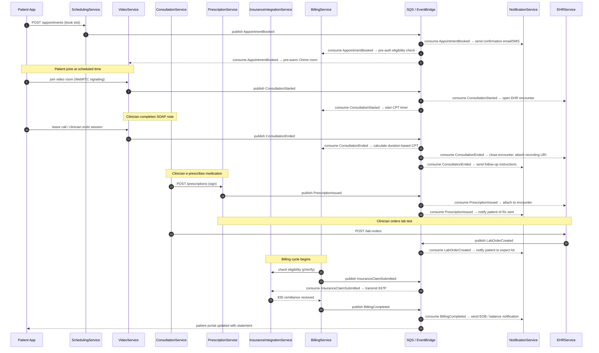

# Event Catalog — Telemedicine Platform

This catalog is the authoritative reference for every domain event produced and consumed across the Telemedicine Platform. All engineering teams must register new events here before publishing them to any message broker. Events represent facts — immutable records that something meaningful happened in the domain.

---

## Contract Conventions

### Envelope Schema

Every event, regardless of producing service, is wrapped in a standard envelope. The envelope provides routing, tracing, and versioning metadata so consumers never need to inspect the payload to determine what they received.

```json
{
  "eventId":       "<UUID v4>",
  "eventType":     "<PascalCase event name>",
  "eventVersion":  "<semver, e.g. 1.0.0>",
  "producerService": "<service identifier>",
  "tenantId":      "<organisation / clinic ID>",
  "correlationId": "<UUID — ties related events in one workflow>",
  "causationId":   "<eventId of the triggering event>",
  "occurredAt":    "<ISO-8601 UTC timestamp>",
  "schemaUri":     "<S3 or registry URI for JSON Schema>",
  "payload":       { ... }
}
```

### Versioning Policy

- **Patch (1.0.x)**: Non-breaking additions of optional fields. Consumers must be lenient and ignore unknown fields.
- **Minor (1.x.0)**: New optional top-level payload keys. Consumers must not fail on unknown keys.
- **Major (x.0.0)**: Breaking change. The old and new versions coexist in the broker simultaneously. Producers publish both; consumers migrate on their own schedule within a 90-day sunset window.

### Naming Conventions

| Rule | Example |
|---|---|
| Past-tense verb + noun | `AppointmentBooked`, `PrescriptionIssued` |
| PascalCase, no spaces | `InsuranceClaimSubmitted` |
| Domain prefix optional for clarity | `Video.SessionRecordingCompleted` |
| No internal implementation detail | ~~`KafkaRecordWritten`~~ |

### Serialisation

- **Format**: JSON (UTF-8). Binary (Avro / Protobuf) is used for high-throughput analytics pipelines via Schema Registry.
- **PHI fields**: Encrypted at rest in the broker using AWS KMS CMK (`telemedicine/events-phi`). Fields flagged `"phi": true` in the JSON Schema must never appear in logs or traces unredacted.
- **Max message size**: 256 KB. Larger payloads (e.g., base64 SOAP notes) must be stored in S3 and referenced by URI in the event payload.

### Delivery Guarantees

| Guarantee | Mechanism |
|---|---|
| At-least-once delivery | SQS standard queues with DLQ after 3 retries |
| Exactly-once processing | Idempotency key (`eventId`) checked in consumer DB before processing |
| Ordered delivery (per patient) | SQS FIFO queues keyed on `patientId` for appointment/prescription flows |
| Cross-region replication | EventBridge pipes replicate to DR region within 5 seconds |

### Dead-Letter Queue Policy

All consumer queues configure a DLQ. Messages move to DLQ after **3 delivery attempts with exponential back-off** (15 s, 60 s, 300 s). An alarm fires when DLQ depth > 0. On-call engineers have 30 minutes to triage before automatic escalation to the platform team.

### Schema Registry

All event schemas are stored in AWS Glue Schema Registry under namespace `telemedicine`. Schema ARNs are referenced in the `schemaUri` envelope field. CI pipelines enforce backward compatibility checks on every PR that modifies a schema.

---

## Domain Events

### AppointmentBooked

Fired when a patient successfully books a consultation slot with a clinician.

| Field | Type | PHI | Description |
|---|---|---|---|
| `appointmentId` | UUID | No | Globally unique appointment identifier |
| `patientId` | UUID | Yes | Reference to the patient record |
| `doctorId` | UUID | No | Reference to the clinician |
| `scheduledAt` | ISO-8601 | No | Agreed start time in UTC |
| `visitType` | enum | No | `SYNCHRONOUS_VIDEO`, `ASYNC_MESSAGE`, `PHONE` |
| `chiefComplaint` | string | Yes | Patient-reported reason for visit (max 500 chars) |
| `insuranceId` | string | Yes | Insurance member ID for eligibility pre-check |
| `clinicId` | UUID | No | Owning clinic or virtual practice |
| `timezone` | string | No | IANA timezone of the patient |
| `bookingChannel` | enum | No | `WEB`, `MOBILE`, `CALL_CENTER`, `API` |

**Producer**: SchedulingService  
**Consumers**: NotificationService, BillingService (eligibility pre-auth), VideoService (pre-warm room), AnalyticsService

---

### ConsultationStarted

Fired when the video session transitions from WaitingRoom to active InSession state — i.e., both patient and clinician have joined and media streams are established.

| Field | Type | PHI | Description |
|---|---|---|---|
| `consultationId` | UUID | No | Unique consultation identifier |
| `appointmentId` | UUID | No | FK to the appointment |
| `patientId` | UUID | Yes | Patient reference |
| `doctorId` | UUID | No | Clinician reference |
| `videoSessionId` | string | No | AWS Chime Meeting ID |
| `startedAt` | ISO-8601 | No | Timestamp when both parties joined |
| `patientDeviceInfo` | object | No | OS, browser, connection type |
| `networkQuality` | object | No | Initial RTT, packet-loss baseline |

**Producer**: VideoService  
**Consumers**: BillingService (start CPT timer), EHRService (open encounter), AnalyticsService, AuditService

---

### ConsultationEnded

Fired when the video session is explicitly terminated by either participant or by system timeout.

| Field | Type | PHI | Description |
|---|---|---|---|
| `consultationId` | UUID | No | Consultation reference |
| `appointmentId` | UUID | No | Appointment reference |
| `patientId` | UUID | Yes | Patient reference |
| `doctorId` | UUID | No | Clinician reference |
| `endedAt` | ISO-8601 | No | Session end timestamp |
| `durationSeconds` | integer | No | Wall-clock session length |
| `terminatedBy` | enum | No | `PATIENT`, `DOCTOR`, `SYSTEM_TIMEOUT`, `NETWORK_FAILURE` |
| `recordingUri` | string | No | S3 URI of encrypted recording (if consent given) |
| `soapNoteStarted` | boolean | No | Whether the clinician opened the SOAP note |

**Producer**: VideoService  
**Consumers**: BillingService, PrescriptionService (unlock), EHRService (close encounter), NotificationService, AnalyticsService

---

### PrescriptionIssued

Fired when a clinician digitally signs and transmits an e-prescription via EPCS or Surescripts.

| Field | Type | PHI | Description |
|---|---|---|---|
| `prescriptionId` | UUID | No | Unique prescription identifier |
| `consultationId` | UUID | No | Originating consultation |
| `patientId` | UUID | Yes | Patient reference |
| `doctorId` | UUID | No | Prescribing clinician (NPI) |
| `deaNumber` | string | Yes | Clinician DEA number (controlled substances) |
| `medicationName` | string | Yes | Drug name and strength |
| `deaSchedule` | enum | Yes | `II`, `III`, `IV`, `V`, `NONE` |
| `quantity` | integer | No | Dispensing quantity |
| `refills` | integer | No | Number of authorised refills |
| `pharmacyNcpdpId` | string | No | Target pharmacy NCPDP ID |
| `surescriptsMessageId` | string | No | Routing transaction ID |
| `pdmpQueryId` | string | No | PDMP query reference |

**Producer**: PrescriptionService  
**Consumers**: PharmacyGateway, EHRService, BillingService (CPT code G2012), NotificationService, AnalyticsService

---

### LabOrderCreated

Fired when a clinician orders laboratory tests during or after a consultation.

| Field | Type | PHI | Description |
|---|---|---|---|
| `labOrderId` | UUID | No | Unique lab order identifier |
| `consultationId` | UUID | No | Originating consultation |
| `patientId` | UUID | Yes | Patient reference |
| `doctorId` | UUID | No | Ordering clinician |
| `testCodes` | string[] | No | LOINC codes for ordered tests |
| `icd10DiagnosisCodes` | string[] | No | Supporting diagnosis codes |
| `labProviderId` | string | No | Health Gorilla or direct lab partner ID |
| `specimenType` | string | No | `BLOOD`, `URINE`, `SWAB`, etc. |
| `priority` | enum | No | `ROUTINE`, `STAT`, `ASAP` |
| `collectionMethod` | enum | No | `HOME_KIT`, `DRAW_CENTER`, `CLINIC` |

**Producer**: EHRService  
**Consumers**: LabIntegrationService (Health Gorilla), NotificationService, BillingService, AnalyticsService

---

### InsuranceClaimSubmitted

Fired when BillingService transmits an 837P professional claim to the payer clearinghouse.

| Field | Type | PHI | Description |
|---|---|---|---|
| `claimId` | UUID | No | Internal claim identifier |
| `appointmentId` | UUID | No | Associated appointment |
| `patientId` | UUID | Yes | Patient / member reference |
| `insuranceMemberId` | string | Yes | Payer member ID |
| `payerId` | string | No | Payer identifier (NPI / payer ID) |
| `cptCodes` | string[] | No | Procedure codes |
| `icd10Codes` | string[] | No | Diagnosis codes |
| `claimAmount` | decimal | No | Billed amount in USD |
| `clearinghouseTrackingId` | string | No | Change Healthcare / Availity tracking ID |
| `submittedAt` | ISO-8601 | No | Transmission timestamp |
| `placeOfService` | string | No | POS code (02 = telehealth) |

**Producer**: BillingService  
**Consumers**: InsuranceIntegrationService, AnalyticsService, NotificationService (patient EOB), AuditService

---

### EmergencyEscalated

Fired when a clinician or system triggers emergency escalation during a consultation.

| Field | Type | PHI | Description |
|---|---|---|---|
| `escalationId` | UUID | No | Unique escalation event |
| `consultationId` | UUID | No | Active consultation |
| `patientId` | UUID | Yes | Patient reference |
| `patientLocation` | object | Yes | `{ address, city, state, zip, lat, lng }` |
| `emergencyType` | enum | No | `CARDIAC`, `MENTAL_HEALTH`, `TRAUMA`, `RESPIRATORY`, `OTHER` |
| `triggeredBy` | enum | No | `CLINICIAN`, `PATIENT`, `AUTO_DETECT` |
| `dispatchRequestedAt` | ISO-8601 | No | 911 / dispatch request time |
| `patientPhoneNumber` | string | Yes | For dispatcher callback |
| `doctorOnCall` | UUID | No | Supervising clinician |
| `psapNotified` | boolean | No | Whether PSAP (911) was contacted |

**Producer**: ConsultationService / EmergencyService  
**Consumers**: EmergencyDispatchGateway, NotificationService (in-app alert), EHRService (flag encounter), AuditService, AnalyticsService

---

### BillingCompleted

Fired when a claim cycle is fully resolved — payment posted or adjustment applied.

| Field | Type | PHI | Description |
|---|---|---|---|
| `billingEventId` | UUID | No | Unique billing completion event |
| `claimId` | UUID | No | Associated claim |
| `patientId` | UUID | Yes | Patient reference |
| `paymentMethod` | enum | No | `INSURANCE`, `SELF_PAY`, `COPAY`, `WRITE_OFF` |
| `paidAmount` | decimal | No | Amount actually paid (USD) |
| `patientResponsibility` | decimal | No | Patient balance after insurance |
| `remittanceId` | string | No | 835 ERA transaction reference |
| `paymentPostedAt` | ISO-8601 | No | Posting timestamp |
| `adjustmentReason` | string | No | ERA adjustment reason code |

**Producer**: BillingService  
**Consumers**: PatientPortalService (show EOB), NotificationService (balance due), AnalyticsService, AuditService

---

## Publish and Consumption Sequence

The following diagram traces the primary happy-path event flow for a telemedicine encounter from booking through payment.



---

## Operational SLOs

The following table captures the full event catalog with producer, consumers, key payload fields, SLO targets, and broker retention policies.

| Event Name | Producer | Consumer(s) | Payload Fields | SLO | Retention |
|---|---|---|---|---|---|
| AppointmentBooked | SchedulingService | NotificationService, BillingService, VideoService, AnalyticsService | appointmentId, patientId, doctorId, scheduledAt, visitType, chiefComplaint, insuranceId | Published < 500 ms of API response; consumer processing < 2 s | 30 days |
| ConsultationStarted | VideoService | BillingService, EHRService, AnalyticsService, AuditService | consultationId, appointmentId, patientId, doctorId, videoSessionId, startedAt, networkQuality | Published < 1 s of session establishment; consumer < 3 s | 90 days |
| ConsultationEnded | VideoService | BillingService, EHRService, NotificationService, AnalyticsService | consultationId, endedAt, durationSeconds, terminatedBy, recordingUri | Published < 2 s of session end; billing consumer < 5 s | 90 days |
| PrescriptionIssued | PrescriptionService | PharmacyGateway, EHRService, BillingService, NotificationService | prescriptionId, patientId, medicationName, deaSchedule, pharmacyNcpdpId, surescriptsMessageId | Published < 1 s of clinician signature; Surescripts ack < 30 s | 7 years (HIPAA) |
| LabOrderCreated | EHRService | LabIntegrationService, NotificationService, BillingService | labOrderId, patientId, testCodes, labProviderId, priority | Published < 1 s; lab partner ack < 60 s | 7 years (HIPAA) |
| InsuranceClaimSubmitted | BillingService | InsuranceIntegrationService, AnalyticsService, NotificationService | claimId, patientId, cptCodes, icd10Codes, claimAmount, clearinghouseTrackingId | Published < 3 s of claim generation; clearinghouse ack < 5 min | 7 years (HIPAA) |
| EmergencyEscalated | ConsultationService | EmergencyDispatchGateway, NotificationService, EHRService, AuditService | escalationId, patientId, patientLocation, emergencyType, triggeredBy, psapNotified | Published < 500 ms (life-safety SLO); dispatch gateway < 1 s | 10 years |
| BillingCompleted | BillingService | PatientPortalService, NotificationService, AnalyticsService, AuditService | billingEventId, claimId, patientId, paidAmount, patientResponsibility, remittanceId | Published < 5 s of ERA processing; portal consumer < 10 s | 7 years (HIPAA) |

### SLO Breach Alerting

| Metric | Threshold | Alert Channel |
|---|---|---|
| Producer publish latency p99 | > 2 s | PagerDuty — P2 |
| Consumer lag (messages behind) | > 1000 messages | PagerDuty — P2 |
| DLQ depth | > 0 messages | PagerDuty — P1 for EmergencyEscalated, P2 for others |
| Schema validation failure rate | > 0.1% | Slack #platform-alerts |
| EmergencyEscalated end-to-end latency | > 1 s | PagerDuty — P0 (life-safety) |
| PHI decryption error rate | > 0% | PagerDuty — P1 (security incident) |

### Retention and Archival

- **Standard events** (30-day SQS retention): Replayed from EventBridge archive if a consumer needs replay.
- **HIPAA-regulated events** (7-year retention): Exported to S3 Glacier with server-side encryption (AES-256, KMS CMK). Lifecycle policy: SQS → S3 Standard (90 days) → S3 Glacier (7 years).
- **EmergencyEscalated** (10-year retention): Treated as a legal record. Stored in immutable S3 Object Lock (WORM) bucket.
- **Audit events**: All events are additionally forwarded to the AuditService which persists them in an append-only PostgreSQL table backed by CloudTrail for tamper evidence.

### Consumer Registration

Teams must register consumers in the service registry (`infrastructure/service-registry.yaml`) before subscribing to any PHI-tagged event. Registration requires:

1. Service name and owner team
2. AWS IAM role ARN with least-privilege SQS/KMS permissions
3. Idempotency strategy (e.g., upsert on `eventId`)
4. DLQ ARN and on-call contact
5. Data retention policy approval from Privacy Officer
