# System Context Diagram — Telemedicine Platform

## Overview

The system context diagram identifies all external actors and systems that interact with the Telemedicine Platform. It defines the trust boundaries, data exchange directions, and integration protocols at the outermost level of abstraction. This view is intended for architects, compliance officers, and integration engineers.

---

## C4 Context Diagram

```mermaid
C4Context
    title System Context — Telemedicine Platform

    Person(patient, "Patient", "Accesses care via mobile app or web browser. Completes intake, attends video consultations, views records, pays bills.")
    Person(doctor, "Licensed Physician / NP / PA", "Delivers clinical care, writes SOAP notes, issues prescriptions, orders labs, and manages their schedule.")
    Person(nurse, "Nurse / Medical Assistant", "Performs pre-consultation triage, records vitals, manages intake workflow.")
    Person(billing_admin, "Billing Administrator", "Manages insurance claims, processes denials, and tracks accounts receivable.")
    Person(platform_admin, "Platform Administrator", "Onboards providers, configures compliance rules, monitors system health.")

    System(telemedicine, "Telemedicine Platform", "HIPAA-compliant platform supporting video consultations, electronic prescribing, lab ordering, insurance billing, and health records management.")

    System_Ext(pharmacy, "Pharmacy Network (Surescripts)", "Routes electronic prescriptions to patient-selected pharmacies using NCPDP SCRIPT v2017071. Returns fill confirmations and refill requests.")
    System_Ext(insurance, "Insurance / Payer Systems", "Provides real-time eligibility verification (X12 270/271), processes claims (X12 837P), and returns remittance advice (X12 835 ERA).")
    System_Ext(lab, "Laboratory Partners (Quest / LabCorp)", "Receives lab orders via HL7 FHIR R4 ServiceRequest. Returns results as DiagnosticReport resources with LOINC coding.")
    System_Ext(ehr, "External EHR Systems (Epic / Cerner)", "Bidirectional FHIR R4 integration for patient record synchronization, care coordination, and referral management.")
    System_Ext(emergency, "Emergency Services (911 / PSAP)", "Receives emergency dispatch requests with patient location, demographics, and clinical context during consultation emergencies.")
    System_Ext(pdmp, "State PDMP Systems", "Returns controlled substance prescription history for patients during EPCS workflows. One integration per state, aggregated via RxCheck or Appriss Health.")
    System_Ext(fsmb, "FSMB DataLink / NPPES", "Provides real-time physician licensure verification and NPI validation during provider onboarding and at appointment booking.")
    System_Ext(notification, "Notification Channels (AWS SES / SNS / FCM / APNs)", "Delivers email, SMS, and push notifications to patients and clinicians for appointments, results, and alerts.")
    System_Ext(wearables, "Wearables and Health Platforms (Apple HealthKit / Google Fit)", "Provides biometric data (heart rate, SpO2, blood pressure, glucose) ingested via OAuth-authorized API connections.")
    System_Ext(clearinghouse, "Claims Clearinghouse (Availity / Change Healthcare)", "Validates, translates, and routes EDI claim transactions between the platform and payers.")
    System_Ext(turn, "TURN / STUN Infrastructure (AWS Global Accelerator / Coturn)", "Provides WebRTC ICE candidate relay for NAT traversal in video consultations.")

    Rel(patient, telemedicine, "Books appointments, attends video consultations, views records, pays bills", "HTTPS / WebRTC")
    Rel(doctor, telemedicine, "Manages schedule, consults patients, prescribes, orders labs, signs notes", "HTTPS / WebRTC")
    Rel(nurse, telemedicine, "Performs triage, records vitals, manages intake", "HTTPS")
    Rel(billing_admin, telemedicine, "Reviews claims, works denials, runs AR reports", "HTTPS")
    Rel(platform_admin, telemedicine, "Onboards providers, configures rules, monitors health", "HTTPS")

    Rel(telemedicine, pharmacy, "Transmits prescriptions, receives fill confirmations", "NCPDP SCRIPT / HTTPS")
    Rel(telemedicine, insurance, "Verifies eligibility, submits claims, receives ERAs", "X12 EDI / HTTPS")
    Rel(telemedicine, lab, "Sends lab orders, receives results", "HL7 FHIR R4 / HTTPS")
    Rel(telemedicine, ehr, "Syncs patient records bidirectionally", "HL7 FHIR R4 / HTTPS")
    Rel(telemedicine, emergency, "Dispatches emergency services with patient location", "CAD API / HTTPS")
    Rel(telemedicine, pdmp, "Queries patient controlled substance history", "PMIX/NIEM / HTTPS")
    Rel(telemedicine, fsmb, "Verifies physician licensure and NPI", "REST API / HTTPS")
    Rel(telemedicine, notification, "Sends appointment reminders, alerts, result notifications", "SMTP / SMS / Push")
    Rel(wearables, telemedicine, "Pushes biometric data (authorized by patient)", "OAuth 2.0 / HTTPS")
    Rel(telemedicine, clearinghouse, "Routes EDI claim transactions", "X12 EDI / SFTP / HTTPS")
    Rel(telemedicine, turn, "Exchanges ICE candidates for WebRTC NAT traversal", "STUN / TURN (UDP/TLS)")
```

---

## External Actor Descriptions

### Patients (Mobile and Web)
Patients access the platform through a responsive progressive web application and native iOS/Android apps. All patient-facing communication traverses a TLS-terminated API Gateway. PHI rendered in the browser is never cached to disk and is cleared from memory on session termination.

### Licensed Physicians, Nurse Practitioners, Physician Assistants
Clinical staff access a web-based clinical workstation with access to the full consultation interface, EHR editor, prescription module, and lab ordering. Clinical staff accounts require MFA on every login and are bound to their verified NPI and active state license set.

### Pharmacy Network — Surescripts
The Surescripts connection is the exclusive channel for electronic prescription routing in the United States. The integration supports new prescriptions, refill authorization, pharmacy change requests, and prescription status messages. All Surescripts transactions are signed and encrypted per Surescripts network agreements.

### Insurance and Payer Systems
Real-time eligibility and claim submission are transacted through the clearinghouse gateway. The platform does not connect directly to individual payer endpoints; all EDI routing is handled by the clearinghouse (Availity or Change Healthcare), enabling a single integration point for 2,000+ payers.

### Laboratory Partners
HL7 FHIR R4 is the canonical integration standard for lab orders and results. Quest Diagnostics and LabCorp each maintain FHIR R4 API endpoints. The platform's lab order service transforms clinician orders into FHIR ServiceRequest resources and subscribes to FHIR Subscription notifications for result delivery.

### External EHR Systems
Epic and Cerner integrations use the SMART on FHIR authorization framework combined with FHIR R4 bulk export for records portability. The integration enables care continuity when a patient's primary care physician uses an on-premises EHR system. All record synchronization is patient-authorized and logged in the audit trail.

### Emergency Services (911 / PSAP)
Integration with Public Safety Answering Points (PSAPs) uses the NENA i3 standard where available. In jurisdictions without i3-compatible PSAPs, the platform connects a clinician directly to the 911 dispatcher via the platform's VOIP bridge with pre-populated caller information.

### State PDMP Systems
Controlled substance history queries are aggregated via Appriss Health's NarxCare API, which provides a unified interface to all 50 state PDMPs. Each query is logged with the clinician's DEA number, timestamp, and the prescribing decision made after viewing the report.

### Notification Channels
AWS SES handles transactional email with HIPAA-eligible service configuration. AWS SNS handles SMS delivery through Twilio as a secondary provider. Firebase Cloud Messaging (FCM) and Apple Push Notification Service (APNs) handle mobile push notifications. All notification content is de-identified where possible; PHI-bearing notifications include only a generic prompt directing the user to log in.

---

## Trust Boundaries

| Boundary | Description |
|---|---|
| Public Internet | Patient/clinician web/mobile traffic; TLS 1.3 enforced |
| API Gateway Perimeter | All external traffic terminates here; WAF, DDoS protection, rate limiting applied |
| Service Mesh | Internal microservice communication; mTLS required |
| PHI Data Store | RDS/S3 encrypted; IAM role-based access; VPC isolated |
| TURN Infrastructure | Media relay nodes; isolated network segment; no PHI stored |
| External Integrations | Separate egress subnet; outbound connections governed by BAA |

---

## Integration Protocol Summary

| External System | Protocol | Auth | Direction |
|---|---|---|---|
| Surescripts | NCPDP SCRIPT v2017071 | PKI Certificate | Outbound Rx, Inbound refill |
| Payers via Clearinghouse | X12 EDI 270/271, 837P, 835 | API Key + mTLS | Bidirectional |
| Quest / LabCorp | HL7 FHIR R4 REST | OAuth 2.0 Client Credentials | Bidirectional |
| Epic / Cerner | SMART on FHIR R4 | OAuth 2.0 Authorization Code | Bidirectional |
| PDMP (Appriss NarxCare) | REST/JSON | API Key | Outbound query |
| FSMB DataLink | REST/JSON | API Key | Outbound query |
| Apple HealthKit | HealthKit API | OAuth 2.0 | Inbound data push |
| Google Fit | REST/JSON | OAuth 2.0 | Inbound data push |
| AWS SES / SNS | AWS SDK | IAM Role | Outbound notifications |
| TURN/STUN | WebRTC ICE | TURN credentials (HMAC) | Bidirectional media |
