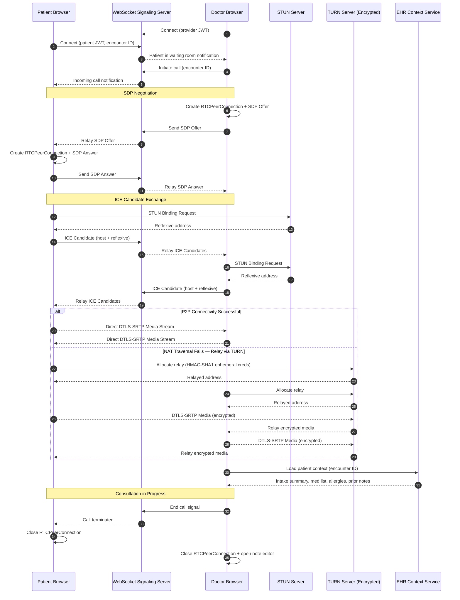
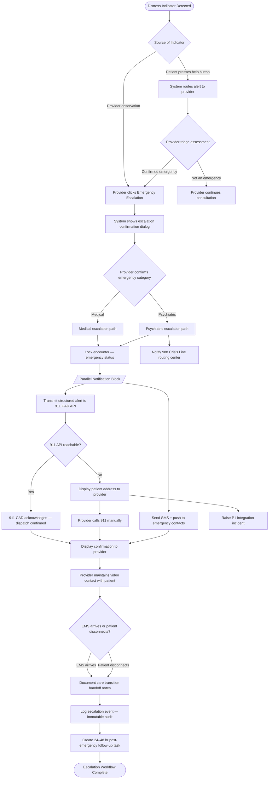

# Use Case Descriptions — Telemedicine Platform

This document provides full structured descriptions for the eight primary use cases of the HIPAA-compliant Telemedicine Platform. Each description follows a standard template aligned with IEEE 830 and OMG UML 2.5 use case specification conventions. Business rules reference the platform's compliance framework including HIPAA Security Rule §164.312, DEA 21 CFR Part 1311, and CMS telemedicine billing guidance (Medicare Benefit Policy Manual Chapter 15).

---

## UC-001: Book Appointment

**Use Case ID:** UC-001
**Use Case Name:** Book Appointment
**Version:** 1.0

**Actor(s):**
- Primary: Patient
- Secondary: Nurse/PA (triage and slot management), Insurance Provider (eligibility pre-check), System (scheduling engine)

**Preconditions:**
- Patient has a verified account with completed identity proofing (NIST IAL2).
- Patient has completed consent to telehealth services form.
- At least one provider matching the requested specialty is available in the patient's licensed state.
- Insurance eligibility data is reachable via the Availity 270/271 transaction.

**Postconditions:**
- A confirmed appointment record exists in the scheduling system with a unique encounter ID.
- A calendar invitation is sent to the patient and provider via the notification service.
- An insurance eligibility snapshot is stored with the appointment record for copay estimation.
- Pre-visit intake forms are queued and linked to the appointment.

**Main Success Scenario:**
1. Patient authenticates via MFA (TOTP or SMS OTP) and navigates to the appointment booking module.
2. Patient selects a clinical specialty, preferred language, and optionally a named provider.
3. System queries the scheduling engine for available slots matching the criteria, filtered to providers licensed in the patient's state.
4. System triggers a real-time 270 eligibility transaction to the payer on file; response includes deductible status and copay amount.
5. Patient selects a date and time slot from the displayed availability grid.
6. System presents a pre-booking summary: provider name, appointment type (video), estimated copay, and consent acknowledgment checkbox.
7. Patient confirms the booking by submitting the form.
8. System creates the appointment record, assigns an encounter ID, and locks the provider slot.
9. System dispatches confirmation notifications: in-app, SMS, and email, including a secure video join link valid from 15 minutes before the appointment.
10. System queues pre-visit intake forms (chief complaint, medication list, allergy review) and sends a completion reminder 24 hours before the appointment.
11. Appointment appears in the patient's upcoming visits dashboard with countdown timer and one-click join button.

**Alternative Flows:**

*AF-001-A: No available slots match criteria*
- At step 3, if no slots are found, system presents the next three available slots outside the requested timeframe.
- Patient may broaden criteria (any provider in specialty) or place themselves on a waitlist.
- If waitlist is chosen, system records the request and notifies patient when a matching slot opens.

*AF-001-B: Preferred provider lacks state licensure*
- At step 3, if the selected provider is not licensed to practice in the patient's state, system removes that provider from results and displays a tooltip explaining the restriction.
- System suggests the nearest available licensed alternative.

**Exception Flows:**

*EF-001-A: Insurance eligibility check fails (payer timeout)*
- At step 4, if the 270 transaction times out after 10 seconds, system proceeds with booking without a copay estimate.
- A banner is displayed: "Copay estimate unavailable — your plan details will be confirmed at check-in."
- The failed eligibility check is logged for manual resolution by billing staff.

*EF-001-B: Scheduling engine unavailable*
- At step 3, if the scheduling engine returns a 503 error, system displays a friendly error and offers the patient a callback request form.
- The error is surfaced as a P2 alert to the platform operations team via PagerDuty.

**Business Rules:**
- BR-SCHED-01: Providers must hold an active license in the patient's state of residence at the time of the appointment.
- BR-SCHED-02: Appointments may not be booked less than 30 minutes in advance.
- BR-SCHED-03: Controlled substance consultations require the patient to have had at least one prior in-person visit with the provider.
- BR-HIPAA-01: The 270 eligibility transaction must not store more PHI than is required to complete the transaction (minimum necessary standard).

**Data Requirements:**
- Patient demographics (name, date of birth, state of residence)
- Insurance member ID and group number
- Provider NPI and state license numbers
- Appointment slot metadata (start time, duration, visit type)
- Encounter ID (system-generated UUID)

**Non-functional Requirements:**
- Slot availability query must complete within 2 seconds at P95.
- Eligibility 270/271 round-trip must complete within 10 seconds.
- Booking confirmation notification must be delivered within 30 seconds of confirmation.
- Scheduling data at rest encrypted with AES-256; in transit via TLS 1.3.

---

## UC-002: Start Video Consultation (WebRTC)

**Use Case ID:** UC-002
**Use Case Name:** Start Video Consultation (WebRTC)
**Version:** 1.0

**Actor(s):**
- Primary: Doctor
- Secondary: Patient, Nurse/PA (intake handoff), System (WebRTC signaling server, media relay TURN/STUN)

**Preconditions:**
- Appointment exists in confirmed state with a valid encounter ID.
- Patient has submitted pre-visit intake form.
- Doctor has reviewed intake data and is present in the provider portal.
- Both parties have devices with camera and microphone access granted.
- Patient is in the virtual waiting room (authenticated and connected).

**Postconditions:**
- A video session log record is created with start timestamp, duration, and participants.
- The encounter is transitioned to "in-consultation" status, locking the EHR for editing by other providers.
- Session recording consent is captured (if applicable) and recording stored in HIPAA-compliant media storage (AES-256, S3 SSE-KMS).
- Post-consultation actions (prescription, lab, notes) are linked to the encounter ID.

**Main Success Scenario:**
1. Doctor logs into the provider portal and opens the appointment queue.
2. Doctor clicks "Start Consultation" for the scheduled appointment; system pre-loads patient context: intake summary, medication list, allergy flags, last encounter note, and active problem list from EHR.
3. System issues a WebRTC signaling invitation to the patient's connected session via the platform's WebSocket signaling server.
4. Patient's application receives the invitation and displays a "Provider is ready" prompt.
5. Both clients exchange Session Description Protocol (SDP) offers/answers through the signaling server to negotiate media capabilities (codec: VP9/H.264, resolution: up to 1080p, audio: Opus).
6. ICE candidate exchange occurs: clients attempt direct peer-to-peer connectivity; if NAT traversal fails, media is relayed through the TURN server (encrypted, ephemeral credentials per session).
7. Secure DTLS-SRTP encrypted media streams are established between the two endpoints.
8. Video session begins; doctor sees patient in the main video panel alongside the clinical context sidebar.
9. Doctor conducts the consultation, accessing EHR data, entering real-time notes, and communicating via video/audio.
10. At consultation end, doctor clicks "End Consultation"; system closes media streams and transitions encounter to "completed" status.
11. System prompts doctor to sign and lock the SOAP note, select diagnosis codes (ICD-10), and initiate any post-visit orders.
12. Session duration, quality metrics (packet loss, jitter, MOS score), and participant logs are persisted to the audit trail.

**Alternative Flows:**

*AF-002-A: Patient is not in the waiting room at appointment time*
- At step 3, if the patient has not joined the waiting room within 5 minutes of the appointment start time, the system sends an automated push notification and SMS reminder.
- Doctor may wait up to 15 minutes; system auto-cancels and marks encounter as "no-show" if patient does not connect.

*AF-002-B: Video degradation, switch to audio-only*
- At step 7, if video stream quality drops below a minimum acceptable threshold (packet loss > 5% for 30 seconds), the system prompts both parties to switch to audio-only mode.
- The encounter note is annotated to record that audio-only mode was used (relevant for billing modifiers).

**Exception Flows:**

*EF-002-A: WebRTC signaling server unreachable*
- At step 3, if the signaling server is unreachable, the system falls back to an SFU-based relay (Mediasoup) and alerts operations.
- If fallback also fails, both parties receive a notification and the appointment is rescheduled within 24 hours with priority booking.

*EF-002-B: TURN server authentication failure*
- At step 6, if TURN credential provisioning fails, the system logs the error and attempts to re-provision credentials once.
- On second failure, the session attempt is aborted and the encounter is flagged for manual rescheduling.

**Business Rules:**
- BR-VIDEO-01: All video session media must be encrypted end-to-end using DTLS-SRTP.
- BR-VIDEO-02: Session recordings require explicit patient consent captured digitally before the session starts; recording is disabled by default.
- BR-VIDEO-03: The minimum video quality threshold for a billable telehealth encounter is real-time, two-way audio/video (CMS telehealth billing requirement).
- BR-HIPAA-02: WebRTC TURN server credentials must be ephemeral (TTL ≤ 24 hours) and rotated per session.

**Data Requirements:**
- Encounter ID, appointment start/end timestamps
- SDP offer/answer payloads (transient, not persisted)
- ICE candidates (transient)
- Session quality metrics (packet loss %, jitter ms, MOS score)
- Participant device metadata (browser/OS for troubleshooting)

**Non-functional Requirements:**
- Video session establishment (from provider click to media active) must complete within 5 seconds at P95.
- End-to-end latency must remain below 150 ms for an acceptable consultation experience.
- Platform must support concurrent video sessions scaling to 5,000 simultaneous consultations.
- TURN server uptime SLA: 99.95%.

### Sequence Diagram — UC-002: WebRTC Video Consultation Signaling

---

## UC-003: Issue E-Prescription

**Use Case ID:** UC-003
**Use Case Name:** Issue E-Prescription
**Version:** 1.0

**Actor(s):**
- Primary: Doctor
- Secondary: Pharmacist (Surescripts network), System (EPCS token, DUR engine), Patient

**Preconditions:**
- An active encounter is in "in-consultation" or "completed" status for the prescribing physician.
- Doctor's NPI, DEA registration, and state prescriber license are verified in the provider credentialing store.
- Patient's pharmacy of choice is on file and is a Surescripts-connected participant.
- For controlled substances (Schedule II–V): two-factor authentication is active for the current prescriber session (DEA 21 CFR Part 1311 EPCS requirement).

**Postconditions:**
- A signed, transmitted prescription record exists in the platform with a unique RxReferenceNumber.
- The prescription is delivered to the target pharmacy via the Surescripts NewRx transaction.
- Prescription is added to the patient's active medication list in the EHR.
- The encounter note is automatically updated with the prescribed medication and dose.

**Main Success Scenario:**
1. Doctor opens the prescription module within the active encounter context.
2. Doctor searches the medication database by drug name or generic equivalent; system displays formulary status and tier for the patient's insurance plan.
3. Doctor selects the drug, strength, dosage form, and enters sig (instructions), quantity, days supply, and refills authorized.
4. System runs Drug Utilization Review (DUR): checks drug-drug interactions, drug-allergy interactions, and duplicate therapy flags against the patient's active medication list.
5. If DUR returns no critical alerts, system presents a prescription preview for doctor review.
6. Doctor reviews and clicks "Sign & Transmit."
7. For Schedule II–V controlled substances: system requires the doctor to complete a two-factor EPCS authentication challenge (identity proofing credential + OTP token).
8. System validates DEA registration number, checks prescribing state against patient state, and confirms the drug-schedule authorization level.
9. System composes a Surescripts NCPDP SCRIPT NewRx transaction and transmits to the selected pharmacy.
10. Surescripts returns a transaction acknowledgment (TA1) and pharmacy processing status.
11. System stores the prescription record, updates the medication list, and notifies the patient that a prescription has been sent to their pharmacy.

**Alternative Flows:**

*AF-003-A: Formulary override required*
- At step 2, if the selected drug is non-formulary for the patient's plan, system displays a warning and suggests a formulary alternative.
- Doctor may accept the alternative or proceed with the non-formulary drug, entering a clinical override reason which is transmitted in the NewRx message.

*AF-003-B: DUR critical alert — provider override*
- At step 4, if DUR identifies a high-severity drug-drug interaction, system presents a blocking alert with evidence summary.
- Doctor must actively acknowledge the alert with a documented clinical reason before proceeding.
- Override decision and reason are recorded in the audit trail.

**Exception Flows:**

*EF-003-A: Surescripts transmission failure*
- At step 9, if the Surescripts gateway returns an error or times out, system retries the transmission up to three times with exponential backoff.
- On third failure, system marks the prescription as "pending — pharmacy contact required" and notifies both the doctor and patient.
- A paper prescription PDF is made available for the doctor to download as fallback.

*EF-003-B: DEA registration validation failure*
- At step 8, if the DEA registration cannot be validated (e.g., expired or state mismatch), system blocks transmission and displays a specific compliance error.
- The prescription is saved as a draft; the provider administrator is notified to resolve the credentialing issue.

**Business Rules:**
- BR-RX-01: Schedule II controlled substances may not be refilled; quantity must be per single dispensing event.
- BR-RX-02: EPCS transactions require logical access control using two identity factors per DEA 21 CFR §1311.102.
- BR-RX-03: Prescribers must be registered with the DEA in the same state where the patient is located at the time of prescribing.
- BR-RX-04: Drug-drug interaction alerts of severity level 3 (contraindicated) may not be bypassed without a documented clinical reason.

**Data Requirements:**
- Drug name, NDC code, strength, dosage form, route of administration
- Sig (patient instructions), quantity, days supply, refills
- Prescriber NPI, DEA number, state license number
- Patient name, date of birth, address (for controlled substances)
- Pharmacy NCPDP provider ID and NPI

**Non-functional Requirements:**
- Prescription transmission to Surescripts must complete within 5 seconds at P95.
- DUR check must return results within 1 second.
- All EPCS transactions must be logged with immutable audit records per DEA §1311.

---

## UC-004: Order Lab Test

**Use Case ID:** UC-004
**Use Case Name:** Order Lab Test
**Version:** 1.0

**Actor(s):**
- Primary: Doctor
- Secondary: Lab System (Quest Diagnostics / LabCorp), Patient, Insurance Provider (prior auth)

**Preconditions:**
- An active encounter is in progress or recently completed (same-day).
- Doctor has selected a patient-linked lab system for the order.
- Patient's insurance plan lab benefits are available for formulary/coverage check.

**Postconditions:**
- A lab requisition with a unique accession number is transmitted to the lab system.
- Lab order is recorded in the patient's EHR under the active encounter.
- Patient receives instructions (fasting requirements, specimen collection site) via notification.
- Lab results, when returned, are automatically linked to the originating order in the EHR.

**Main Success Scenario:**
1. Doctor opens the lab order module within the encounter.
2. Doctor searches the test catalog by LOINC code or test name and selects one or more tests.
3. System displays insurance coverage status, prior authorization requirement, and patient out-of-pocket estimate.
4. Doctor enters clinical indication (ICD-10 diagnosis code), specimen type, and any special instructions.
5. If prior authorization is required, system initiates a PA request to the payer (parallel to order workflow).
6. Doctor reviews order summary and clicks "Submit Order."
7. System generates an HL7 ORM (Order Message) or FHIR ServiceRequest and transmits to the selected lab system.
8. Lab system acknowledges receipt and returns an accession number via HL7 ORR or FHIR Task update.
9. System stores the order record and displays a confirmation with accession number to the doctor.
10. System sends the patient an appointment-style notification with the collection site address, fasting instructions, and an estimated turnaround time.
11. When results are returned by the lab (HL7 ORU / FHIR DiagnosticReport), system automatically routes them to the ordering physician for review and to the patient record.

**Alternative Flows:**

*AF-004-A: No in-network lab available*
- At step 3, if the selected lab is out of network for the patient's insurance, system highlights the out-of-network status and estimates higher cost.
- Doctor may choose an alternative in-network lab from the system's curated list.

*AF-004-B: Stat order*
- At step 4, doctor can mark the order as STAT; system prioritizes the HL7 message with ORM priority code "S" and notifies the lab of urgency.

**Exception Flows:**

*EF-004-A: Lab system interface down*
- At step 7, if the HL7 interface to the lab is unavailable, system queues the order for retry and alerts the operations team.
- Doctor is notified; a requisition PDF can be printed or emailed to the patient as a manual fallback.

*EF-004-B: Prior authorization denied*
- From step 5, if the PA request returns a denial, system surfaces this to the doctor before the order is finalized.
- Doctor can document medical necessity appeal or select an alternative covered test.

**Business Rules:**
- BR-LAB-01: All lab orders must include a valid ICD-10 diagnosis code as clinical indication.
- BR-LAB-02: Orders for tests on the CMS prior authorization list must resolve PA status before specimen collection.
- BR-LAB-03: Critical lab results (panic values) must trigger an immediate provider alert within 15 minutes of receipt.

**Data Requirements:**
- LOINC codes for ordered tests, specimen type
- ICD-10 diagnosis codes for clinical indication
- Patient demographics (name, DOB, insurance ID)
- Ordering provider NPI
- Lab facility NPI and CLIA number

**Non-functional Requirements:**
- Order transmission must complete within 3 seconds at P95.
- Critical result alerts must be delivered to the ordering provider within 15 minutes of lab system transmission.
- Lab results must be stored with full encryption (AES-256 at rest, TLS 1.3 in transit).

---

## UC-005: Submit Insurance Claim

**Use Case ID:** UC-005
**Use Case Name:** Submit Insurance Claim
**Version:** 1.0

**Actor(s):**
- Primary: Billing Staff / System (automated post-encounter)
- Secondary: Doctor (encounter documentation), Insurance Provider (Availity clearinghouse), Patient (EOB recipient)

**Preconditions:**
- Encounter note is signed and locked by the provider.
- ICD-10 diagnosis codes and CPT procedure codes are assigned to the encounter.
- Patient's active insurance policy information is current in the system.
- Rendering provider NPI and Tax ID are configured in the billing module.

**Postconditions:**
- An 837P claim transaction has been submitted to the payer via the Availity clearinghouse.
- A claim tracking number is stored in the billing system.
- ERA (835 remittance) is received and auto-posted to the patient's account when adjudicated.
- Patient receives an EOB summary notification.

**Main Success Scenario:**
1. System detects that an encounter note has been signed; billing module is triggered automatically.
2. System assembles the claim from encounter data: provider NPI, place of service code (02 — telehealth), CPT codes, ICD-10 codes, date of service, and charge amounts.
3. System applies fee schedule and calculates expected reimbursement.
4. Claim is validated against ANSI X12 837P format rules; any validation errors are surfaced to billing staff for correction.
5. System transmits the 837P transaction to Availity clearinghouse.
6. Availity returns a 999 acknowledgment indicating whether the claim was accepted for forwarding to the payer.
7. Payer adjudicates the claim (typical 2–14 business days) and returns an 835 ERA via Availity.
8. System auto-posts the ERA: applies contractual adjustments, patient responsibility amounts, and posts the payment.
9. Patient receives a notification summarizing their responsibility amount with a link to pay online.
10. Any denial reason codes from the 835 are surfaced in the billing worklist for follow-up.

**Alternative Flows:**

*AF-005-A: Secondary payer coordination of benefits*
- After step 8, if the patient has a secondary insurance, system creates a coordination of benefits (COB) claim for the secondary payer with the primary EOB attached.

*AF-005-B: Manual claim review required*
- At step 4, high-value claims exceeding a configurable threshold require manual review by a billing supervisor before transmission.

**Exception Flows:**

*EF-005-A: Clearinghouse rejection (999 with errors)*
- At step 6, if Availity returns a 999 with rejection codes, system parses the error segments and routes specific errors to the billing worklist with human-readable descriptions.
- System does not retry automatically; a billing staff member must correct and resubmit.

*EF-005-B: ERA auto-posting failure*
- At step 8, if ERA posting logic fails (unrecognized adjustment reason code), the ERA is queued in a manual posting worklist.

**Business Rules:**
- BR-BILL-01: All telehealth claims must use place of service code 02 per CMS billing guidance.
- BR-BILL-02: Claims must be submitted within 365 days of the date of service (Medicare) or payer contract timely filing limit.
- BR-BILL-03: Audio-only visits require modifier 93 or GQ depending on the payer.

**Data Requirements:**
- CPT and ICD-10 codes, date of service
- Provider NPI (rendering and billing), Tax ID
- Patient insurance member ID, group number, date of birth
- Charge amounts, units, modifiers

**Non-functional Requirements:**
- 837P generation must complete within 30 seconds of note lock.
- Clearinghouse acknowledgment expected within 1 hour of submission.
- All claim records must be retained for a minimum of 7 years (HIPAA record retention).

---

## UC-006: Emergency Escalation

**Use Case ID:** UC-006
**Use Case Name:** Emergency Escalation
**Version:** 1.0

**Actor(s):**
- Primary: Doctor (clinical trigger)
- Secondary: Patient, Emergency Services (911 CAD), Emergency Contact(s), Nurse/PA, System

**Preconditions:**
- An active video consultation is in progress, or a provider is reviewing a patient-submitted message.
- Patient's location (address) and emergency contact information are on file.
- Emergency Services integration is active and reachable.

**Postconditions:**
- A structured emergency event record is created and immutably logged.
- Emergency contacts have been notified via SMS and push notification.
- 911 CAD has received a structured dispatch request with patient location and clinical summary.
- The encounter is transitioned to "emergency escalation" status; subsequent care documentation is preserved.
- A post-emergency follow-up task is created for the clinical team.

**Main Success Scenario:**
1. During a video consultation, the provider identifies signs of a medical emergency (e.g., chest pain, stroke symptoms, expressed suicidal intent).
2. Provider clicks the "Emergency Escalation" control in the consultation interface.
3. System displays an emergency confirmation dialog requiring provider to confirm escalation category (medical, psychiatric, other) and patient's current location (pre-populated from profile; editable if patient is not at home address).
4. Provider confirms; system immediately locks the encounter in "emergency" status and begins parallel notification workflows.
5. System sends an automated 911 CAD notification via the Emergency Services integration API: structured JSON payload with patient name, date of birth, location coordinates, chief complaint, and provider name/callback number.
6. System simultaneously sends SMS and push notifications to all designated emergency contacts.
7. System displays a confirmation to the provider: "911 notified — dispatch in progress. Emergency contacts alerted."
8. Provider continues to communicate with the patient via video until emergency services arrive or the patient disconnects.
9. System captures the exact time of escalation, 911 acknowledgment, and contact notification in the encounter audit record.
10. After the acute event, system creates a post-emergency follow-up appointment task assigned to the clinical team for 24–48 hours later.

**Alternative Flows:**

*AF-006-A: Patient-initiated distress signal*
- The patient can press a dedicated "I need help" button in the patient application, which routes to step 2 but notifies the provider first for triage before 911 dispatch is triggered.

*AF-006-B: Psychiatric emergency — additional resources*
- At step 5, for psychiatric emergency category, system additionally notifies the nearest 988 (Suicide & Crisis Lifeline) routing center in addition to 911.

**Exception Flows:**

*EF-006-A: Emergency Services API unreachable*
- At step 5, if the 911 CAD integration is unavailable, system displays the patient's address on-screen and instructs the provider to call 911 directly.
- System escalates the integration failure as a P1 incident to the operations team.

*EF-006-B: Patient location unknown*
- At step 3, if no location is on file and the patient cannot provide one, system surfaces the IP geolocation estimate (with accuracy disclaimer) and prompts the provider to confirm verbally with the patient.

**Business Rules:**
- BR-EMRG-01: Emergency escalation must be logged with sub-second timestamp precision in the immutable audit trail.
- BR-EMRG-02: Patient location data used for 911 dispatch must be the most recently confirmed address; IP geolocation is supplemental only.
- BR-EMRG-03: Emergency contact notifications must be sent within 60 seconds of provider confirmation.
- BR-EMRG-04: All emergency event records are subject to extended HIPAA retention (minimum 10 years).

**Data Requirements:**
- Patient full name, date of birth, current location (address + coordinates)
- Emergency contact names, relationship, phone numbers
- Escalation category, clinical summary (free text, 500 chars max)
- Provider name and direct callback number
- Encounter ID, timestamp of escalation

**Non-functional Requirements:**
- 911 dispatch notification must be transmitted within 10 seconds of provider confirmation.
- Emergency contact SMS delivery must complete within 60 seconds.
- Emergency escalation workflow must remain available even during partial system degradation (circuit-breaker isolated service).

### Flowchart — UC-006: Emergency Escalation

---

## UC-007: Process Pharmacy Refill

**Use Case ID:** UC-007
**Use Case Name:** Process Pharmacy Refill
**Version:** 1.0

**Actor(s):**
- Primary: Patient (refill request initiator)
- Secondary: Doctor (approval), Pharmacist (dispensing), System (Surescripts RxRenewal workflow)

**Preconditions:**
- An original prescription is on file with authorized refills remaining.
- The prescription is not expired (within 12 months of original issue date for non-controlled; per state law for controlled substances).
- Patient has an active account and is authenticated.

**Postconditions:**
- A refill authorization (Surescripts RxRenewalResponse) is transmitted to the pharmacy.
- Refill count on the original prescription is decremented.
- Patient is notified when the refill is ready for pickup or shipped.

**Main Success Scenario:**
1. Patient navigates to their active medication list and selects a medication for refill.
2. System checks: refills remaining > 0, prescription not expired, not a Schedule II drug.
3. System displays refill summary: medication name, dose, quantity, pharmacy, and estimated copay.
4. Patient confirms the refill request.
5. System checks if the refill requires physician review (e.g., greater than 90 days since last consultation for the condition).
6. If physician review is not required, system auto-routes an RxRenewalRequest to the original pharmacy via Surescripts.
7. Pharmacy receives the renewal request and processes it.
8. Pharmacist confirms dispense; system receives RxFill confirmation from pharmacy.
9. System decrements the refill counter and sends patient a "Refill ready" notification with estimated pickup time.

**Alternative Flows:**

*AF-007-A: Physician review required*
- At step 5, if a clinical review is triggered, system routes a refill approval request to the original prescribing physician.
- Physician reviews the request asynchronously and approves or denies with a reason.
- On approval, system proceeds to step 6.

*AF-007-B: Mail-order pharmacy preference*
- Patient may select a mail-order pharmacy; system routes via Surescripts to the mail-order NCPDP participant and tracks shipping notification.

**Exception Flows:**

*EF-007-A: No refills remaining*
- At step 2, system notifies the patient that no refills remain and presents a button to request a new prescription consultation appointment.

*EF-007-B: Pharmacy unable to fill (out of stock)*
- After step 7, if the pharmacy returns a denial due to stock unavailability, system suggests the nearest alternative in-network pharmacy with the medication in stock.

**Business Rules:**
- BR-RFX-01: Schedule II controlled substances cannot be refilled; a new prescription is required.
- BR-RFX-02: Prescriptions for chronic condition maintenance drugs may be auto-approved for refill if the last consultation was within 90 days.
- BR-RFX-03: Refill authorization expires if not acted upon within 72 hours of pharmacy transmission.

**Data Requirements:**
- Original prescription RxReferenceNumber
- Refill count (remaining and authorized)
- Patient pharmacy NCPDP ID
- Medication NDC, quantity, days supply

**Non-functional Requirements:**
- Refill request processing must complete within 3 seconds.
- Physician refill approval notification must be delivered within 5 minutes.
- Surescripts RxRenewal transaction must meet NCPDP SCRIPT v10.6 standard.

---

## UC-008: Patient Health Record Access (HIPAA Right of Access)

**Use Case ID:** UC-008
**Use Case Name:** Patient Health Record Access
**Version:** 1.0

**Actor(s):**
- Primary: Patient
- Secondary: System Administrator (oversight), System (audit logging)

**Preconditions:**
- Patient is authenticated with MFA.
- Patient's identity has been verified at registration (NIST IAL2).
- A valid privacy consent on file covers the requested record scope.

**Postconditions:**
- Requested health records are delivered in the format chosen by the patient (PDF, FHIR JSON, CCDA XML).
- A HIPAA Right of Access fulfillment record is logged with date, scope, format, and delivery method.
- The access event is written to the immutable audit trail.

**Main Success Scenario:**
1. Patient navigates to the "My Health Records" section of the patient portal.
2. Patient selects the scope of records requested (all records, date range, specific encounter, specific record type).
3. Patient selects the delivery format: PDF summary, C-CDA XML, or FHIR R4 Bundle (JSON).
4. Patient selects delivery method: in-app download, secure email, or third-party app via SMART on FHIR OAuth.
5. System validates that the request scope matches the patient's own records (no delegation access without an authorized representative on file).
6. System compiles the requested records from the EHR integration (FHIR $everything operation or targeted queries).
7. For PHI-containing exports, system applies minimum necessary filtering: removes other patients' data, internal staff notes marked as privileged.
8. System generates the output in the requested format, digitally signs the export package (for PDF), and encrypts for delivery.
9. Patient receives a download link (valid for 48 hours) or the records are pushed to the selected destination.
10. System logs the fulfillment event: patient ID (pseudonymized in log), record scope, format, delivery timestamp, and request ID.
11. System ensures fulfillment within 30 days of initial request (HIPAA §164.524 compliance timer tracked).

**Alternative Flows:**

*AF-008-A: Third-party app access via SMART on FHIR*
- At step 4, if patient selects a registered third-party application, system initiates an OAuth 2.0 authorization code flow with the SMART on FHIR scopes selected by the patient.
- Patient reviews and approves the specific FHIR resource scopes before access is granted.

*AF-008-B: Authorized representative access*
- A legally designated representative (parent, healthcare proxy) may access records on behalf of the patient after submitting a verified authorization form.
- System enforces scope limits per the representative's role.

**Exception Flows:**

*EF-008-A: EHR system unavailable during record compilation*
- At step 6, if the EHR FHIR endpoint is unavailable, system notifies the patient that their request is queued and will be fulfilled within the HIPAA 30-day window.
- System retries the EHR query up to three times over 24 hours before flagging for manual fulfillment.

*EF-008-B: Patient requests amendment to records*
- Patient identifies an inaccuracy in their records and submits a correction request.
- System routes the amendment request to the responsible provider per HIPAA §164.526 amendment rights.
- Provider accepts or denies the amendment with a documented reason; outcome is communicated to the patient within 60 days.

**Business Rules:**
- BR-PHR-01: Patient access requests must be fulfilled within 30 days; a single 30-day extension is allowed with written notice to the patient (HIPAA §164.524).
- BR-PHR-02: Access fees may not exceed the cost of labor for compiling and preparing records; no per-page fees for electronic access.
- BR-PHR-03: System must support patient-directed transmissions to any healthcare provider, personal health application, or third party designated by the patient (21st Century Cures Act §4004).
- BR-PHR-04: Records access logs must be retained for 6 years from the date of creation or last effective date (HIPAA §164.530(j)).

**Data Requirements:**
- Patient-selected record scope (date range, encounter IDs, record types)
- Output format (PDF / C-CDA / FHIR Bundle)
- Delivery destination (download URL, email, FHIR endpoint)
- Fulfillment request ID and HIPAA timer start date

**Non-functional Requirements:**
- Record compilation for standard requests (up to 5 years of history) must complete within 60 seconds.
- Exported records must be encrypted with AES-256 for storage and delivery.
- Access fulfillment must be auditable with a complete chain of custody per HIPAA §164.312(b).
- Third-party SMART on FHIR access must implement token expiry no longer than 1 hour without refresh.

---

*Document version 1.0 — aligned with HIPAA §164.524 (Right of Access), HIPAA Security Rule §164.312, DEA 21 CFR Part 1311 (EPCS), CMS Telehealth Billing Guidelines, and HL7 FHIR R4.*
